# OpenFusion Mission Control — Implementation Guide

**Positioning:** OpenFusion is mission control for AI coding agents. You give Claude Code, Codex, OpenCode, Qwen Code, Pi, or future agents a task. The agent runs in a real terminal you can watch, pause, resume, and jump into. OpenFusion gives live feedback, a build queue for overnight work, scheduled jobs, deterministic verification, human approval gates, and transparent decision reports. It is **not auto-merge** and **not a black box**.

**Prepared:** 2026-06-27  
**Updated:** 2026-06-27 — added detailed Pi SDK/RPC/JSON/PTY integration plan.  
**Primary stack:** Cloudflare Workers, Durable Objects, D1, R2, Queues, Workflows, Cron Triggers, AI Gateway, optional Cloudflare Sandbox, Next.js App Router, shadcn/ui, Tailwind CSS, TanStack Query, Zustand, xterm.js, React Flow, Monaco/diff viewer, Motion, local OpenFusion Bridge.

> **Core architectural decision:** Cloudflare coordinates. The local bridge executes. The browser observes and intervenes. The human approves important actions.

---

## Table of contents

1. [Executive summary](#1-executive-summary)
2. [R&D interpretation from Tau/Pi-style architecture](#2-rd-interpretation-from-taupi-style-architecture)
3. [OpenFusion layer model](#3-openfusion-layer-model)
4. [High-level design](#4-high-level-design)
5. [Low-level design](#5-low-level-design)
6. [End-to-end run lifecycle](#6-end-to-end-run-lifecycle)
7. [AI layer](#7-ai-layer)
8. [Agent Harness layer](#8-agent-harness-layer)
9. [Coding / execution layer](#9-coding--execution-layer)
10. [TUI and Mission Control UI layer](#10-tui-and-mission-control-ui-layer)
11. [Cloudflare control plane](#11-cloudflare-control-plane)
12. [Local OpenFusion Bridge](#12-local-openfusion-bridge)
13. [Agent detection and adapters](#13-agent-detection-and-adapters)
13A. [Pi SDK integration details](#13a-pi-sdk-integration-details)
14. [Real terminal streaming and jump-in control](#14-real-terminal-streaming-and-jump-in-control)
15. [Build queue, overnight work, and scheduled jobs](#15-build-queue-overnight-work-and-scheduled-jobs)
16. [Human-in-the-loop approval model](#16-human-in-the-loop-approval-model)
17. [Multi-agent routing, verification, judging, and synthesis](#17-multi-agent-routing-verification-judging-and-synthesis)
18. [Event-sourced architecture](#18-event-sourced-architecture)
19. [Session, message, and artifact model](#19-session-message-and-artifact-model)
20. [D1 schema and R2 object layout](#20-d1-schema-and-r2-object-layout)
21. [API, WebSocket, and RPC contracts](#21-api-websocket-and-rpc-contracts)
22. [Security, privacy, and policy system](#22-security-privacy-and-policy-system)
23. [Observability, analytics, and reports](#23-observability-analytics-and-reports)
24. [Premium UI system design](#24-premium-ui-system-design)
25. [Detailed AI prompt for building the premium UI](#25-detailed-ai-prompt-for-building-the-premium-ui)
26. [Design patterns](#26-design-patterns)
27. [Monorepo and package structure](#27-monorepo-and-package-structure)
28. [Implementation roadmap](#28-implementation-roadmap)
29. [Testing and quality gates](#29-testing-and-quality-gates)
30. [Evaluation framework](#30-evaluation-framework)
31. [Risks and mitigations](#31-risks-and-mitigations)
32. [Architecture decision records](#32-architecture-decision-records)
33. [Launch checklist](#33-launch-checklist)
34. [Source references](#34-source-references)
35. [Final product framing](#35-final-product-framing)

---

## 1. Executive summary

OpenFusion should be built as a **local-first AI coding-agent control plane**. The product should not be positioned as “many low-cost models always beating premium models.” The more credible and defensible product is:

> **A transparent command center that runs coding agents in real terminals, streams their work, lets humans intervene, queues long-running jobs, verifies results, and keeps a complete audit trail.**

The product has five major planes:

| Plane | Main responsibility | Recommended implementation |
|---|---|---|
| **AI layer** | Unified model/provider access, streaming deltas, cost tracking, fallback, provider policy | Provider adapters, Cloudflare AI Gateway, optional Pi AI bridge / LiteLLM-compatible abstraction |
| **Agent Harness layer** | Agent loop, sessions, tool calls, state, messages, approval gates, event normalization | OpenFusion Harness SDK, per-agent adapters, state machines |
| **Coding / execution layer** | Repo access, PTY, shell commands, worktrees, tests, builds, diffs, patches | OpenFusion Bridge, node-pty/pty layer, Git/worktree manager, verifier |
| **TUI / Mission Control UI layer** | Display streaming deltas, terminal panes, timeline, graph, approvals, reports | Next.js, shadcn/ui, xterm.js, React Flow, Zustand, TanStack Query |
| **Cloud control plane** | Auth, sessions, realtime hub, queue, schedules, metadata, artifacts, team audit | Cloudflare Workers, Durable Objects, D1, R2, Queues, Workflows, Cron, AI Gateway |

The key system split:

```text
Browser UI            = observe, approve, jump in, review, schedule, configure
Cloudflare Control    = coordinate, persist, queue, schedule, route, audit
Local Bridge          = detect agents, run real terminals, stream events, enforce policy
Coding Agents         = Claude Code, Codex, OpenCode, Qwen Code, Pi, Aider, future ACP/MCP agents
```

The MVP should focus on **one repo, one user, one paired machine, real terminal streaming, agent inventory, task launch, jump-in control, command approvals, and a decision report**. After that, add multi-agent comparisons, queues, schedules, and team features.

---

## 2. R&D interpretation from Tau/Pi-style architecture

### 2.1 What was reviewed

The two YouTube URLs were referenced for architecture inspiration:

- `https://www.youtube.com/watch?v=5duo9qHw660` — public search metadata identifies it as a sneak peek at **Tau**, a modular educational coding agent inspired by Pi, showing terminal UI and architecture such as Tau AI, Tau agent, and Tau coding.
- `https://www.youtube.com/watch?v=gTeujlv8qK0` — public search metadata identifies it as **PI Architecture EXPLAINED | Agent Loop, Tools, TUI and More**, covering core agent loop, session/context management, tool execution, and terminal UI.

Direct video transcript fetch was not available in the browsing environment because YouTube page fetches were throttled. The architecture below therefore combines:

1. Your provided breakdown.
2. Public metadata for the Tau and Pi architecture videos.
3. Official Pi docs and GitHub documentation.
4. Production architecture requirements for OpenFusion.

### 2.2 Key architectural primitives extracted

Your requested architecture terms map well to production boundaries:

```text
AI
- Unified LLM provider access
- Provider request/response normalization
- Streaming event source
- Model choice, fallback, cost, rate limits
- Consumer-facing event stream

Harness
- Agent loop, ideally stateless at loop-step level
- Stateful session manager around the loop
- Tools and tool registry
- System prompt and context assembly
- Messages and message tree
- User steering/follow-up queue
- Provider selection
- Stream events
- Final/end message

TUI
- Display streaming deltas
- Display message end
- Display tool start/update/end
- Display queue state
- Allow user input while the agent is running

Coding
- Filesystem access
- Shell execution
- Git diff/worktree management
- Tests/build/lint/typecheck
- Code patch artifacts
- Risk classification
```

### 2.3 Pi architecture signals to adopt

Pi’s public documentation gives several important design patterns that OpenFusion should adopt.

| Pi concept | Why it matters | OpenFusion adaptation |
|---|---|---|
| Minimal terminal coding harness | Keeps core small and extensible | Keep OpenFusion Bridge + Harness SDK modular, not monolithic |
| Interactive, JSON, RPC, SDK modes | Supports human TUI and programmatic integration | Provide browser UI, JSONL event stream, local RPC, and SDK APIs |
| Message queue while agent works | Enables steering/follow-up without killing the run | Add “Steer now” and “Queue follow-up” in Mission Control |
| Tree-structured sessions | Enables branching from prior messages | Store session graph/tree, not only linear chat |
| JSON event stream | Makes TUI and UI rendering deterministic | Normalize all harnesses into OpenFusion events |
| Context compaction | Long sessions need summaries | Add compaction service with full raw history retained in R2 |
| Provider abstraction | Allows switching models mid-session | Use AI Gateway/provider adapters and per-agent config |
| Tools: read/write/edit/bash | Coding agents need controlled actions | OpenFusion tool policy wraps risky tool actions |
| Trust/project settings | Prevent untrusted project resources from executing | OpenFusion workspace trust and project policy gates |

### 2.4 How OpenFusion differs from Pi/Tau

OpenFusion is **not just another coding agent**. It is the control layer above multiple agents.

```text
Pi/Tau/OpenCode/Claude Code/Codex = individual agent/harness products
OpenFusion = mission control for those agents + queue + schedule + terminal bridge + audit + policy + team UI
```

OpenFusion should not reimplement every agent immediately. It should:

1. Wrap existing agents.
2. Normalize their events.
3. Run them inside controlled terminals.
4. Provide human-in-the-loop UI.
5. Add scheduling, queues, verification, and reports.
6. Later expose its own OpenFusion-native harness.

---

## 3. OpenFusion layer model

### 3.1 The four product layers

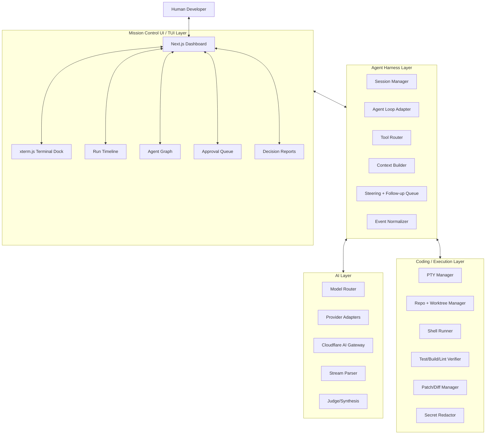

### 3.2 Control-plane vs data-plane split

| Concern | Control plane | Data plane |
|---|---|---|
| Who starts runs? | Cloudflare Worker + D1 record | Bridge receives run command |
| Who owns live session state? | Durable Object session hub | Local bridge PTY process |
| Who executes terminal commands? | Never Cloudflare for local machine | Local Bridge |
| Who stores raw terminal logs? | R2 references in D1 | Bridge streams compressed chunks |
| Who renders terminal? | Browser xterm.js | PTY stream from bridge |
| Who approves risky commands? | UI + policy record | Bridge blocks until approval event |
| Who schedules recurring jobs? | Cron/Workflows | Bridge executes when online |
| Who calls external model APIs? | AI Gateway or agent native provider | Agent/Harness can route through gateway |

### 3.3 Boundary rule

```text
Workers do not spawn local processes.
Workers coordinate state and transport.
The Bridge runs terminals and tools.
Agents run inside PTY/worktree/sandbox boundaries.
```

---

## 4. High-level design

### 4.1 System context

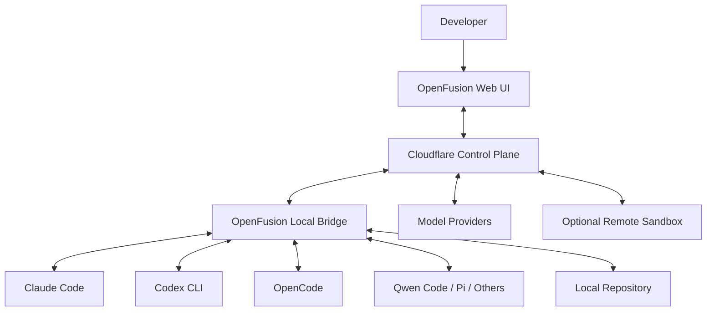

### 4.2 Cloudflare architecture

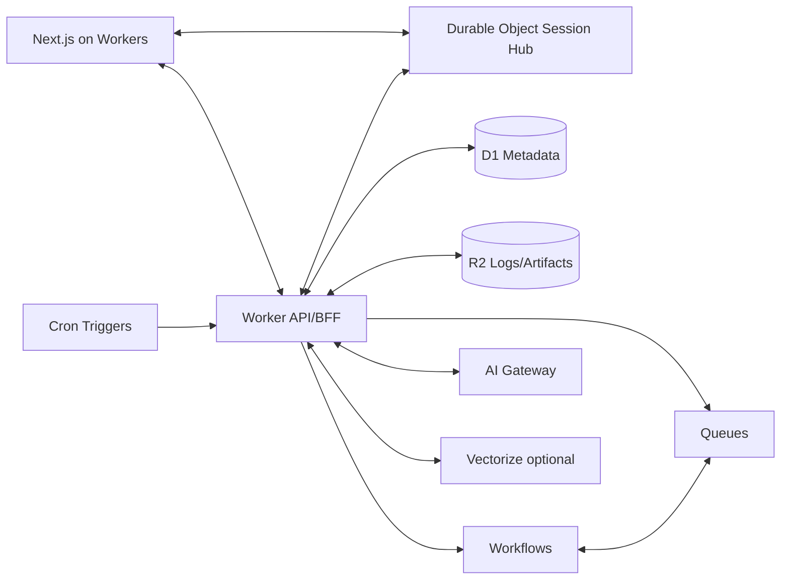

### 4.3 Local bridge architecture

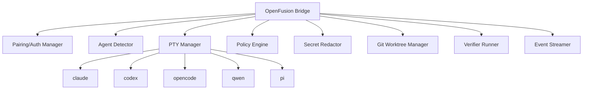

### 4.4 Deployment topology

```text
apps/web
- Next.js App Router deployed to Cloudflare Workers through OpenNext.
- Renders Mission Control UI.
- Calls Worker APIs.
- Connects to Durable Object session WebSockets.

workers/api
- BFF for sessions, queue, schedules, reports, policies.
- D1 metadata access.
- R2 signed artifact access.
- Starts Workflows and Queue messages.

workers/session-hub
- Durable Object per active session.
- WebSocket fanout between browser, bridge, and optional observers.
- Event sequence assignment and live state cache.

workers/scheduler
- Cron Trigger worker.
- Creates scheduled run instances.
- Enqueues jobs when paired machines are online or marks them waiting.

workers/workflows
- Durable multi-step orchestration for long tasks and human approval waits.

apps/bridge
- Local Node.js/Tauri app.
- Discovers agents.
- Starts PTY processes.
- Streams terminal/log/tool events.
- Applies command policies.
- Redacts secrets before cloud sync.
```

---

## 5. Low-level design

### 5.1 Core domain objects

```ts
export type Workspace = {
  id: string
  name: string
  privacyMode: "local-only" | "metadata-only" | "full-sync"
  defaultPolicyId: string
}

export type Machine = {
  id: string
  workspaceId: string
  displayName: string
  os: "macos" | "linux" | "windows"
  arch: string
  bridgeVersion: string
  status: "online" | "offline" | "revoked"
  lastSeenAt: string
}

export type AgentInstallation = {
  id: string
  machineId: string
  agentKind: "claude-code" | "codex" | "opencode" | "qwen-code" | "pi" | "aider" | "custom"
  command: string
  version?: string
  authStatus: "unknown" | "configured" | "missing" | "expired"
  capabilities: AgentCapability[]
  detectedAt: string
}

export type AgentCapability =
  | "terminal"
  | "repo-aware"
  | "code-edit"
  | "bash"
  | "mcp"
  | "acp"
  | "json-events"
  | "rpc"
  | "model-switching"
  | "session-branching"
  | "image-input"
  | "web-search"

export type Session = {
  id: string
  workspaceId: string
  repoPathFingerprint: string
  title: string
  status: "draft" | "queued" | "running" | "waiting-approval" | "paused" | "completed" | "failed" | "cancelled"
  privacyMode: Workspace["privacyMode"]
  createdBy: string
  createdAt: string
  updatedAt: string
}

export type Run = {
  id: string
  sessionId: string
  machineId: string
  agentInstallationId: string
  task: string
  worktreePath?: string
  branchName?: string
  status: Session["status"]
  startedAt?: string
  completedAt?: string
  costUsd?: number
  latencyMs?: number
  confidence?: number
}
```

### 5.2 Service boundaries

| Service/package | Responsibility | Location |
|---|---|---|
| `@openfusion/core` | Domain types, event types, state machines | Shared package |
| `@openfusion/ai` | Provider abstraction, streaming parser, router | Worker + bridge |
| `@openfusion/harness` | Harness adapters and event normalizer | Bridge + optional worker |
| `@openfusion/bridge-protocol` | WS/RPC protocol types | Shared package |
| `@openfusion/policy` | Command, provider, privacy, path policies | Bridge + Worker |
| `@openfusion/redaction` | Secret redaction | Bridge first, Worker second |
| `@openfusion/verifier` | Test/build/lint detection and execution | Bridge + sandbox |
| `@openfusion/db` | D1 repositories and migrations | Worker |
| `@openfusion/ui` | UI components and design tokens | Web app |

### 5.3 Dependency rule

```text
UI depends on core + bridge-protocol types.
Workers depend on core + db + policy + ai.
Bridge depends on core + harness + policy + redaction + verifier.
Agent adapters depend on bridge primitives, not UI.
No package may depend directly on a concrete model provider except provider adapter packages.
```

---

## 6. End-to-end run lifecycle

### 6.1 Interactive run

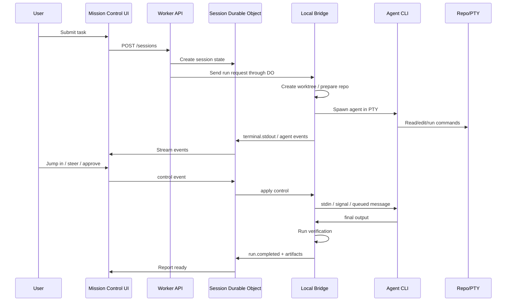

### 6.2 Queue run

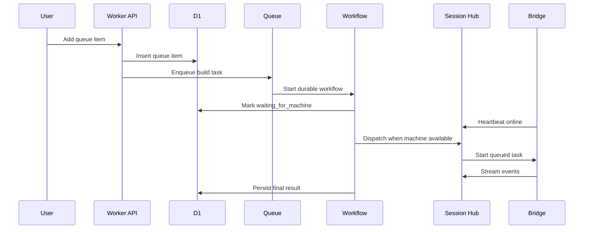

### 6.3 Scheduled job

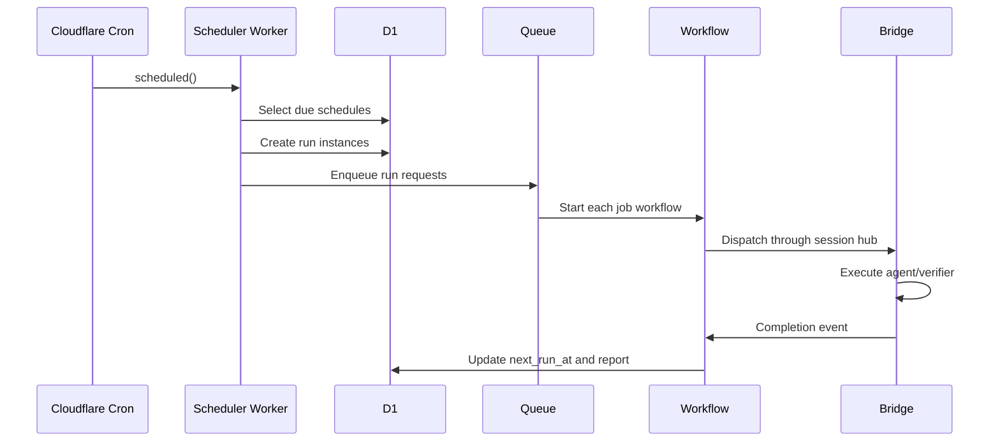

---

## 7. AI layer

The AI layer unifies provider access and converts provider-specific streams into OpenFusion events.

### 7.1 Responsibilities

```text
- Select model/provider based on task, policy, budget, and agent compatibility.
- Normalize OpenAI/Anthropic/Qwen/Kimi/MiniMax/DeepSeek/Ollama/OpenRouter/etc.
- Route through Cloudflare AI Gateway when possible.
- Parse streaming tokens/deltas/tool calls.
- Emit standard events to harness/UI consumers.
- Track prompt tokens, completion tokens, cost, latency, retries, and provider errors.
- Support fallback and circuit breakers.
- Support DLP/request-only mode for low-latency streaming when needed.
```

### 7.2 Provider adapter interface

```ts
export type LlmProviderAdapter = {
  id: string
  displayName: string
  supportedWireApis: Array<"openai-chat" | "openai-responses" | "anthropic-messages" | "google-generate" | "custom">

  listModels(ctx: ProviderContext): Promise<ModelDescriptor[]>

  streamChat(
    request: UnifiedChatRequest,
    ctx: ProviderContext
  ): AsyncIterable<UnifiedAiEvent>

  estimateCost(request: UnifiedChatRequest, model: string): Promise<CostEstimate>

  healthcheck(ctx: ProviderContext): Promise<ProviderHealth>
}
```

### 7.3 Unified AI events

```ts
export type UnifiedAiEvent =
  | { type: "ai.request.start"; requestId: string; provider: string; model: string }
  | { type: "ai.message.start"; messageId: string; role: "assistant" }
  | { type: "ai.text.delta"; messageId: string; delta: string }
  | { type: "ai.thinking.delta"; messageId: string; delta: string; visibility: "hidden" | "summary" }
  | { type: "ai.tool_call.start"; toolCallId: string; name: string; argsPartial?: unknown }
  | { type: "ai.tool_call.delta"; toolCallId: string; argsDelta: string }
  | { type: "ai.tool_call.end"; toolCallId: string; args: unknown }
  | { type: "ai.message.end"; messageId: string; outputText?: string }
  | { type: "ai.usage"; inputTokens: number; outputTokens: number; costUsd?: number }
  | { type: "ai.request.end"; requestId: string; status: "success" | "error"; error?: string }
```

### 7.4 Router strategy

```ts
export type RoutingDecision = {
  strategy: "single" | "cascade" | "parallel-candidates" | "local-only" | "frontier-fallback"
  selectedModels: ModelSelection[]
  selectedAgents: AgentSelection[]
  budgetUsd: number
  latencyBudgetMs: number
  privacyMode: "local-only" | "metadata-only" | "full-sync"
  reason: string
}
```

Recommended routing:

```text
Small explanation/refactor        → one fast local/cheap model
Medium coding bug                 → one coding agent + verifier
Hard repo change                  → two coding agents in isolated worktrees + judge
Risky dependency/migration task    → plan first + human approval + verifier
Failed deterministic checks        → ask same agent to self-correct; then fallback
Privacy-sensitive repo             → local-only model/agent, no hosted provider
```

### 7.5 Cloudflare AI Gateway use

Use AI Gateway for:

```text
- Observability of model requests.
- Token and cost tracking.
- Rate limiting.
- Provider fallback.
- Caching where safe.
- DLP scanning for requests/responses.
- Unified team-level model audit.
- Coding-agent routing where supported.
```

Do not force every local agent through AI Gateway if it breaks its native auth or streaming. Instead expose a per-agent provider configuration:

```text
Provider mode:
- Native provider config
- Cloudflare AI Gateway
- User BYOK through AI Gateway
- Local Ollama/vLLM
- Enterprise private endpoint
```

---

## 8. Agent Harness layer

The harness layer turns model reasoning into safe coding work. It owns the agent loop, tools, state, session history, prompt/context assembly, and event streaming.

### 8.1 Stateless loop + stateful harness

A clean design separates the **agent loop step** from the **session container**.

```text
Stateless loop step:
  input messages + tools + provider + system prompt
  → one model response
  → optional tool calls
  → normalized events

Stateful harness:
  session tree
  message history
  context compaction
  approvals
  tool registry
  worktree path
  user steering queue
  provider configuration
  event replay
```

### 8.2 Harness state machine

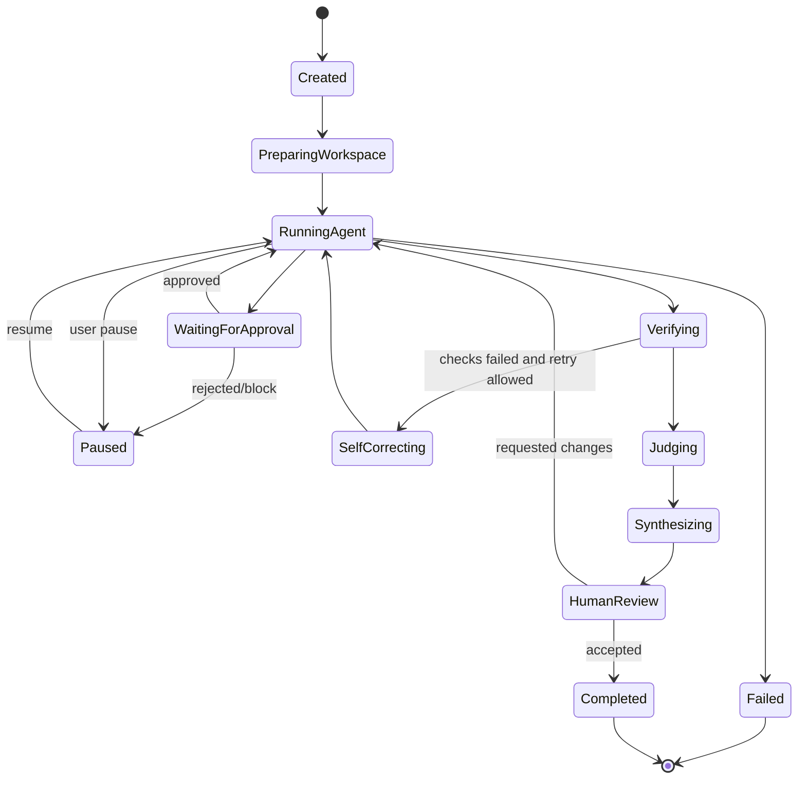

### 8.3 Harness adapter interface

```ts
export type HarnessAdapter = {
  id: string
  displayName: string
  kind: "native-cli" | "rpc" | "json-events" | "sdk" | "acp" | "custom"

  probe(ctx: ProbeContext): Promise<ProbeResult>
  createSession(ctx: HarnessSessionContext): Promise<HarnessSessionHandle>
  start(task: HarnessTask, sink: EventSink): Promise<void>
  sendUserMessage(message: UserSteeringMessage): Promise<void>
  sendTerminalInput(input: TerminalInput): Promise<void>
  approve(requestId: string, decision: ApprovalDecision): Promise<void>
  pause(): Promise<void>
  resume(): Promise<void>
  cancel(reason: string): Promise<void>
}
```

### 8.4 Tool registry

```ts
export type ToolDescriptor = {
  name: string
  description: string
  inputSchema: unknown
  risk: "low" | "medium" | "high" | "critical"
  requiresApproval: boolean
  allowedInModes: Array<"local-only" | "metadata-only" | "full-sync">
  execute(args: unknown, ctx: ToolExecutionContext): Promise<ToolResult>
}
```

Default coding tools:

```text
read_file
write_file
edit_file
list_files
search_code
run_shell
run_tests
run_typecheck
run_lint
git_diff
git_status
git_create_worktree
git_apply_patch
open_browser_preview
mcp_call_tool
```

### 8.5 Message and queue model

Support two input types while the agent is running:

```text
Steering message
- Delivered after current tool call or current safe interruption point.
- Used for “stop changing auth, inspect token refresh only.”

Follow-up message
- Delivered after the current agent run completes.
- Used for “after this, add tests for the edge case.”
```

```ts
export type UserQueuedMessage = {
  id: string
  sessionId: string
  runId: string
  kind: "steer-now" | "follow-up"
  content: string
  deliveryPolicy: "after-current-tool" | "after-current-turn" | "after-run-completes"
  status: "queued" | "delivered" | "cancelled"
  createdAt: string
}
```

---

## 9. Coding / execution layer

The coding layer is where OpenFusion becomes trustworthy. It connects the harness to real files, terminal commands, tests, builds, and diffs.

### 9.1 Responsibilities

```text
- Create isolated git worktrees for runs.
- Start PTY processes for coding agents.
- Capture terminal stdout/stderr/input.
- Run deterministic verification commands.
- Produce diffs and patch artifacts.
- Classify risky commands.
- Block commands pending approval.
- Redact secrets before cloud sync.
- Support local-only mode.
```

### 9.2 Worktree strategy

Never let overnight queue jobs mutate the developer’s active working tree by default.

```text
openfusion-worktrees/
  repo-name/
    run_<runId>/
      full checkout/worktree
```

Run flow:

```text
1. Check git status.
2. If dirty active tree, ask user whether to include changes.
3. Create worktree from target branch.
4. Run agent inside worktree.
5. Generate patch/diff.
6. Run verification.
7. Show patch to human.
8. Human applies, exports, or discards.
```

### 9.3 Verifier abstraction

```ts
export type Verifier = {
  id: string
  displayName: string
  detect(repo: RepoContext): Promise<VerifierDetection>
  run(ctx: VerifyContext, sink: EventSink): Promise<VerifierResult>
}

export type VerifierResult = {
  id: string
  kind: "test" | "typecheck" | "lint" | "build" | "security" | "custom"
  command: string
  status: "passed" | "failed" | "skipped" | "cancelled"
  exitCode?: number
  durationMs: number
  outputRef?: string
  summary: string
}
```

Built-in detectors:

```text
Node/TS: package.json → pnpm/npm/yarn test, typecheck, lint, build
Python: pyproject.toml/pytest.ini → pytest, ruff, mypy
Go: go.mod → go test ./..., go vet
Rust: Cargo.toml → cargo test, cargo clippy
Java: pom.xml/build.gradle → mvn test / gradle test
Docker: Dockerfile/compose → docker compose build/test if allowed
```

### 9.4 Patch artifact

```ts
export type PatchArtifact = {
  id: string
  runId: string
  baseCommit: string
  headCommit?: string
  diffObjectKey: string
  filesChanged: number
  additions: number
  deletions: number
  riskScore: number
  generatedAt: string
}
```

---

## 10. TUI and Mission Control UI layer

This layer consumes events and displays them as a rich command-center experience.

### 10.1 TUI primitive model

Following your requested model:

```text
TUI display receives:
- delta message
- end message
- tool start
- tool update
- tool end
- terminal stdout/stderr
- approval requested
- queue update
- run state update
```

OpenFusion browser UI is a web TUI plus dashboard.

```ts
export type UiRenderableEvent =
  | { type: "display.delta_msg"; runId: string; messageId: string; delta: string }
  | { type: "display.end_msg"; runId: string; messageId: string; content: string }
  | { type: "display.tool_start"; runId: string; toolCallId: string; name: string }
  | { type: "display.tool_delta"; runId: string; toolCallId: string; delta: string }
  | { type: "display.tool_end"; runId: string; toolCallId: string; resultSummary: string }
  | { type: "display.terminal_data"; runId: string; stream: "stdout" | "stderr"; data: string }
  | { type: "display.approval"; runId: string; approvalId: string; risk: string }
  | { type: "display.state"; runId: string; status: RunStatus }
```

### 10.2 UI state split

Use TanStack Query for server state:

```text
sessions
runs
agents
machines
queue items
schedules
reports
policies
artifacts
```

Use Zustand for local UI state:

```text
selected session
selected run
selected graph node
active terminal tab
terminal layout/panel sizes
command palette open
diff drawer open
jump-in mode
filters
hover/selection state
```

### 10.3 Main UI screens

```text
/mission-control
- Active run cockpit
- Agent graph
- Terminal dock
- Approval queue
- Verification stack

/sessions/[id]
- Full session timeline
- Message tree
- Terminal replay
- Artifacts
- Decision report

/agents
- Detected agent inventory
- Probe results
- Capabilities
- Auth state

/queue
- Overnight build queue
- Queue policy
- Worktree/concurrency settings

/schedules
- Recurring jobs
- Natural-language schedule builder
- Cron preview

/reports
- Decision reports
- Test evidence
- Diffs
- Cost/latency

/policies
- Privacy mode
- Command approval rules
- Provider allowlists
- Secret redaction

/settings/machines
- Pair/revoke bridge machines
- Machine status
```

---

## 11. Cloudflare control plane

### 11.1 Component mapping

| Cloudflare service | Use in OpenFusion | Why |
|---|---|---|
| Workers | API/BFF, auth handlers, event ingestion, Next.js deployment | Edge app logic and API endpoints |
| Durable Objects | Session hub, WebSocket fanout, live state, active terminal state | Stateful coordination for each live session |
| D1 | Metadata: users, sessions, runs, queue, schedules, policies | SQL metadata with SQLite semantics |
| R2 | Terminal logs, transcripts, patches, build artifacts | Large object storage, not row storage |
| Queues | Async event ingestion, queued jobs, DLQ, retry | Decouple API requests from background processing |
| Workflows | Long-running jobs, durable steps, human approval waits | Multi-step orchestration without manual infrastructure |
| Cron Triggers | Scheduled jobs | Recurring runs and maintenance |
| AI Gateway | Model observability, cost, DLP, fallback, rate limits | Control over model provider traffic |
| Vectorize | Optional memory/search over reports and docs | Semantic retrieval for reports/context |
| Sandbox | Optional remote execution | For cloud-hosted isolated runs, not local discovery |

### 11.2 Durable Object session hub

A Durable Object should own each live session.

```ts
export class SessionHub extends DurableObject<Env> {
  private clients = new Map<string, WebSocket>()
  private bridge?: WebSocket
  private seq = 0

  async fetch(request: Request): Promise<Response> {
    // Route browser/bridge WebSocket upgrades.
    // Validate token, workspace membership, session access.
  }

  async webSocketMessage(ws: WebSocket, raw: string | ArrayBuffer) {
    const event = JSON.parse(String(raw)) as OpenFusionEvent
    const sequenced = { ...event, seq: ++this.seq }
    await this.persistSmallEvent(sequenced)
    this.broadcast(sequenced)
  }

  async webSocketClose(ws: WebSocket) {
    // Mark client offline, keep session alive if bridge still running.
  }
}
```

### 11.3 Worker API responsibilities

```text
- Auth/session cookies.
- Workspace and team membership.
- Pairing code generation.
- Session CRUD.
- Queue item CRUD.
- Schedule CRUD.
- Policy CRUD.
- Artifact signed download URLs.
- Report search.
- AI Gateway provider configuration.
- Workflow triggers.
```

---

## 12. Local OpenFusion Bridge

### 12.1 Why the bridge is mandatory

The bridge is required because local agent discovery and real terminal execution must occur on the user’s machine. Cloudflare Workers should not be used to spawn `claude`, `codex`, `opencode`, `qwen`, or `pi` processes on a local laptop.

### 12.2 MVP bridge stack

```text
Language: TypeScript/Node.js
PTY: node-pty or equivalent
Packaging: npm global CLI first, Tauri desktop later
Transport: secure WebSocket to SessionHub
Config: ~/.openfusion/config.json
State: ~/.openfusion/state.db or JSONL files
Logs: local JSONL + optional cloud sync to R2
```

Later hardening:

```text
Rust/Tauri desktop shell
OS keychain integration
Auto-update channel
Per-workspace process sandboxing
Network egress policy
Enterprise mTLS
```

### 12.3 Bridge modules

```text
bridge/
  auth/
    pairing.ts
    token-store.ts
  agents/
    claude-code.adapter.ts
    codex.adapter.ts
    opencode.adapter.ts
    qwen-code.adapter.ts
    pi.adapter.ts
    aider.adapter.ts
    acp.adapter.ts
  pty/
    pty-manager.ts
    terminal-session.ts
  policy/
    command-risk.ts
    approval-gate.ts
    provider-policy.ts
    path-policy.ts
  repo/
    git.ts
    worktree.ts
    diff.ts
  verifier/
    detect.ts
    node.ts
    python.ts
    go.ts
    rust.ts
  stream/
    event-sink.ts
    websocket-client.ts
    replay-buffer.ts
  redaction/
    secrets.ts
  main.ts
```

---

## 13. Agent detection and adapters

### 13.1 Detection strategy

```text
1. PATH discovery
   - macOS/Linux: command -v, which
   - Windows: where.exe, PowerShell Get-Command

2. Version probing
   - claude --version
   - codex --version
   - opencode --version
   - qwen --version
   - pi --version
   - aider --version

3. Package manager scan
   - npm list -g
   - pnpm list -g
   - brew list
   - pipx list
   - cargo install --list
   - winget list

4. Config presence check
   - Detect config existence, not secrets.
   - Never read API keys without explicit user consent.

5. Capability probing
   - Supports JSON event mode?
   - Supports RPC?
   - Supports ACP?
   - Supports custom providers?
   - Supports workspace-write sandbox?
```

### 13.2 Probe result

```ts
export type ProbeResult = {
  found: boolean
  agentKind: AgentInstallation["agentKind"]
  command?: string
  version?: string
  installSource?: "path" | "npm" | "brew" | "pipx" | "cargo" | "winget" | "manual"
  authStatus: "unknown" | "configured" | "missing" | "expired"
  capabilities: AgentCapability[]
  warnings: string[]
  suggestedFix?: string
}
```

### 13.3 First-class adapters

| Agent | Command | Adapter mode | Notes |
|---|---|---|---|
| Claude Code | `claude` | PTY + optional SDK/structured mode | Strong default for complex repo work |
| Codex CLI | `codex` | PTY + config profile | Good terminal-native agent; supports profile/provider config |
| OpenCode | `opencode` | PTY + ACP where available | Open-source terminal/IDE/desktop agent |
| Qwen Code | `qwen` | PTY | Good open-source terminal coding option |
| Pi | `pi` | SDK + RPC + JSON event stream + PTY | First-class OpenFusion harness adapter; excellent reference for events, queue, session tree |
| Aider | `aider` | PTY | Useful baseline for patch-driven coding |
| ACP agents | dynamic | JSON-RPC stdio | Future standardized agent interface |

### 13.4 Adapter normalization

Each adapter must map native events to OpenFusion events:

```text
Native stdout/stderr       → terminal.stdout/stderr
Native assistant delta     → message.delta
Native assistant end       → message.end
Native tool start          → tool.start
Native tool output         → tool.output.delta
Native approval request    → approval.requested
Native final message       → run.agent_end
Process exit               → run.process_exit
```

---

## 13A. Pi SDK integration details

Pi should be a **first-class OpenFusion harness adapter**, not the whole OpenFusion platform. OpenFusion remains the mission-control plane. Pi becomes one of the best embedded harness engines inside that plane.

Recommended decision:

```text
Use Pi as:
✅ a native SDK harness for OpenFusion-managed agent runs
✅ an RPC subprocess harness when process isolation matters
✅ a JSON event-stream harness for lightweight one-shot/headless runs
✅ a PTY terminal harness when the user wants to watch and jump into the real Pi TUI
✅ an optional provider bridge through Pi's provider registry and Cloudflare AI Gateway
✅ a reference architecture for queue_update, message delta, tool execution, sessions, and TUI display

Do not use Pi as:
❌ the only OpenFusion architecture
❌ the only security boundary
❌ the replacement for Claude Code, Codex, OpenCode, Qwen Code, or future adapters
❌ the persistence/audit system for team workflows
❌ the product UI layer
```

### 13A.1 Why Pi fits OpenFusion

Pi maps strongly to the architecture you described:

| Your concept | Pi primitive | OpenFusion use |
|---|---|---|
| AI layer unifies LLM providers | `@earendil-works/pi-ai` and Pi provider config | Optional provider bridge; still route through OpenFusion policy and Cloudflare AI Gateway when needed |
| Streams events to consumers | SDK `session.subscribe(...)`, JSON event stream, RPC event output | Normalize Pi events into `OpenFusionEvent` and broadcast to browser/DO/R2 |
| Harness agent loop | `@earendil-works/pi-agent-core` and coding-agent runtime | Use for OpenFusion-native agent runs |
| Stateful harness/session | Pi `AgentSession`, `SessionManager`, session files/tree | Map Pi session to OpenFusion `runs`, `messages`, and `artifacts` |
| User interactive messages | `prompt`, `steer`, `followUp`, queue updates | Map Jump-In/Steer/Follow-up UI controls to Pi session methods or RPC commands |
| Tools | built-ins and `defineTool()` custom tools | Register OpenFusion approval, verifier, artifact, schedule, and policy tools |
| TUI display | Pi interactive mode and `@earendil-works/pi-tui` | Use Pi PTY mode for authentic terminal; optionally reuse TUI ideas for OpenFusion UI |
| Delta/end messages | `message_update`, `message_end` | Render token deltas live and persist final messages |
| Tool lifecycle | `tool_execution_start/update/end` | Render tool activity cards, command risk badges, and verification logs |

Important source facts to track in the engineering notes:

```text
- Pi SDK is intended for embedding Pi in other apps, custom UIs, automated workflows, and programmatic tests.
- Pi exposes event streaming through session subscriptions.
- Pi supports steer/followUp queueing semantics during streaming.
- Pi supports RPC over stdin/stdout JSONL for headless/subprocess integrations.
- Pi supports JSON event stream mode where events are output as JSON lines.
- Pi has built-in Cloudflare AI Gateway provider support.
- Pi does not provide a built-in filesystem/process/network/credential permission system; OpenFusion must provide policy/sandboxing.
```

Source links:

```text
https://pi.dev/docs/latest/sdk
https://pi.dev/docs/latest/rpc
https://pi.dev/docs/latest/json
https://pi.dev/docs/latest/providers
https://github.com/earendil-works/pi
https://developers.cloudflare.com/ai-gateway/integrations/coding-agents/pi/
```

### 13A.2 Pi integration HLD

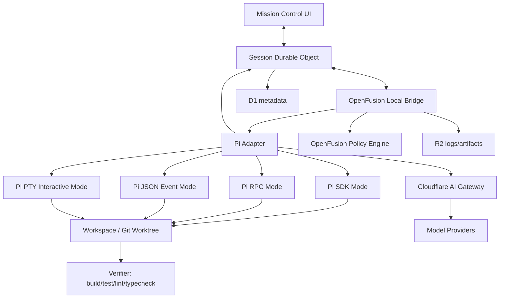

Design rule:

```text
OpenFusion owns:
- session IDs
- run IDs
- permissions
- queue/schedule state
- user approvals
- terminal leases
- artifact storage
- audit logs
- cost aggregation
- multi-agent comparison

Pi owns, within a run:
- agent loop
- model conversation
- tool-calling runtime
- local coding-agent session behavior
- Pi-native extensions/skills/prompts/themes
- Pi-native queue and session tree semantics
```

### 13A.3 Pi adapter modes

OpenFusion should implement one `PiAgentAdapter` with four execution modes.

| Mode | How it runs | Best for | Tradeoff |
|---|---|---|---|
| `sdk` | Import `@earendil-works/pi-coding-agent` inside OpenFusion Bridge Node process | Deep integration, structured events, custom tools, tests, OpenFusion-native agents | Same-process risk; requires Node bridge runtime |
| `rpc` | Spawn `pi --mode rpc --no-session` and speak JSONL over stdin/stdout | Process isolation, non-Node bridge, stable protocol boundary | Slightly more protocol code; less direct state access |
| `json` | Run `pi --mode json "prompt"` and parse JSONL events | Simple one-shot queued jobs and scripts | Less interactive control after launch |
| `pty` | Spawn `pi` in a real pseudo-terminal | Watchable terminal, authentic Pi TUI, Jump In / Jump Out | Harder to parse structured state unless combined with logs/events |

Recommended mode selection:

```ts
export type PiRunMode = "sdk" | "rpc" | "json" | "pty";

export function selectPiMode(input: {
  requiresRealTerminal: boolean;
  requiresUserJumpIn: boolean;
  requiresProcessIsolation: boolean;
  bridgeRuntime: "node" | "rust" | "tauri" | "go";
  isOneShotQueueJob: boolean;
  needsCustomOpenFusionTools: boolean;
}): PiRunMode {
  if (input.requiresRealTerminal || input.requiresUserJumpIn) return "pty";
  if (input.requiresProcessIsolation || input.bridgeRuntime !== "node") return "rpc";
  if (input.isOneShotQueueJob && !input.needsCustomOpenFusionTools) return "json";
  return "sdk";
}
```

Product behavior:

```text
Interactive visible run       → Pi PTY mode
Structured OpenFusion run     → Pi SDK mode
Bridge not written in Node    → Pi RPC mode
Overnight simple queued job   → Pi JSON or RPC mode
Enterprise process boundary   → Pi RPC inside sandbox/container
Custom OpenFusion tools       → Pi SDK mode first, RPC mode second
```

### 13A.4 Pi Adapter LLD

```ts
export type PiAdapterConfig = {
  mode: PiRunMode;
  command: string; // usually "pi"
  cwd: string;
  sessionDir?: string;
  model?: string;
  provider?: string;
  thinkingLevel?: "off" | "low" | "medium" | "high";
  tools?: string[];
  noTools?: "all" | "builtin";
  excludeTools?: string[];
  privacyMode: "local-only" | "metadata-only" | "full-sync";
  providerMode: "pi-native" | "cloudflare-ai-gateway" | "openfusion-provider" | "local-model";
};

export type PiSessionHandle = {
  openfusionRunId: string;
  piSessionId?: string;
  mode: PiRunMode;
  cwd: string;
  startedAt: string;
  sendPrompt(message: string, options?: PiPromptOptions): Promise<void>;
  steer(message: string): Promise<void>;
  followUp(message: string): Promise<void>;
  sendTerminalInput?(input: string): Promise<void>;
  pause(): Promise<void>;
  resume(): Promise<void>;
  cancel(reason: string): Promise<void>;
  dispose(): Promise<void>;
};

export type PiPromptOptions = {
  images?: Array<{ mimeType: string; base64: string }>;
  streamingBehavior?: "steer" | "followUp";
  source?: "user" | "scheduler" | "queue" | "workflow" | "system";
};
```

Adapter structure:

```text
packages/bridge/src/agents/pi/
  pi.adapter.ts              # Implements AgentAdapter / HarnessAdapter
  pi.probe.ts                # Detects command/version/config safely
  pi.sdk-runner.ts           # Same-process SDK mode
  pi.rpc-runner.ts           # JSONL subprocess mode
  pi.json-runner.ts          # one-shot event stream mode
  pi.pty-runner.ts           # terminal/TUI mode via node-pty
  pi.events.ts               # Pi event → OpenFusion event mapper
  pi.tools.ts                # OpenFusion custom tools for Pi SDK mode
  pi.provider.ts             # Pi provider/AIGateway config helpers
  pi.security.ts             # command/path/env policy wrappers
  pi.types.ts                # shared types
  __tests__/
    pi.events.test.ts
    pi.rpc-framing.test.ts
    pi.mode-selection.test.ts
    pi.security.test.ts
```

### 13A.5 Pi detection and capability probing

Detection must never expose secrets. The bridge can check command presence, version, and config presence, but it must not read raw API keys from Pi auth files without explicit user consent.

```ts
export async function probePi(ctx: ProbeContext): Promise<ProbeResult> {
  const command = await findCommand(["pi"]);
  if (!command) {
    return {
      found: false,
      agentKind: "pi",
      authStatus: "unknown",
      capabilities: [],
      warnings: ["Pi command was not found on PATH."],
      suggestedFix: "Install Pi with npm, pnpm, bun, curl, or PowerShell as documented at pi.dev.",
    };
  }

  const version = await safeExecVersion(command, ["--version"]);
  const authConfigExists = await existsSafe("~/.pi/agent/auth.json");

  return {
    found: true,
    agentKind: "pi",
    command,
    version,
    installSource: "path",
    authStatus: authConfigExists ? "configured" : "unknown",
    capabilities: [
      "terminal",
      "json-events",
      "rpc",
      "sdk",
      "repo-aware",
      "tool-calling",
      "custom-tools",
      "message-queue",
      "session-tree",
      "provider-switching",
    ],
    warnings: [],
  };
}
```

Capability matrix to store in D1:

```text
agent_installations.capabilities = [
  "pi:sdk",
  "pi:rpc",
  "pi:json-events",
  "pi:pty",
  "pi:steer",
  "pi:follow-up",
  "pi:custom-tools",
  "pi:cloudflare-ai-gateway",
  "pi:session-tree"
]
```

UI inventory card:

```text
Pi
Status: Detected
Modes: SDK, RPC, JSON Events, Real Terminal
Provider: Native / Cloudflare AI Gateway / Local
Auth: Config present, not inspected
Risk boundary: OpenFusion policy required
Recommended for: Custom OpenFusion-native coding flows, visible Pi terminal runs, provider-flexible runs
```

### 13A.6 Pi SDK mode implementation

Use SDK mode when the bridge is Node/TypeScript and we want direct state access, custom OpenFusion tools, and structured events.

```ts
import {
  AuthStorage,
  createAgentSession,
  defineTool,
  ModelRegistry,
  SessionManager,
} from "@earendil-works/pi-coding-agent";

export async function runPiSdkTask(input: {
  runId: string;
  cwd: string;
  prompt: string;
  model?: string;
  provider?: string;
  sink: EventSink;
  policy: PolicyEngine;
}) {
  const authStorage = AuthStorage.create();
  const modelRegistry = ModelRegistry.create(authStorage);

  const approvalTool = createOpenFusionApprovalTool(input.policy, input.sink);
  const verifierTool = createOpenFusionVerifierTool(input.cwd, input.sink);
  const artifactTool = createOpenFusionArtifactTool(input.runId, input.sink);

  const { session } = await createAgentSession({
    cwd: input.cwd,
    authStorage,
    modelRegistry,
    sessionManager: SessionManager.inMemory(input.cwd),
    customTools: [approvalTool, verifierTool, artifactTool],
  });

  const unsubscribe = session.subscribe((event) => {
    for (const ofEvent of mapPiEventToOpenFusion(event, input.runId)) {
      input.sink.emit(ofEvent);
    }
  });

  try {
    input.sink.emit({ type: "agent.run.started", runId: input.runId, agent: "pi", mode: "sdk" });
    await session.prompt(input.prompt);
    input.sink.emit({ type: "agent.run.ended", runId: input.runId, status: "completed" });
  } catch (error) {
    input.sink.emit({ type: "agent.run.failed", runId: input.runId, error: String(error) });
    throw error;
  } finally {
    unsubscribe();
  }
}
```

SDK mode behavior:

```text
- The bridge subscribes to Pi session events.
- Every Pi event is normalized to OpenFusion events.
- The UI never depends directly on Pi event names.
- Pi custom tools call OpenFusion policy/verifier/artifact APIs.
- OpenFusion stores metadata in D1 and full event/log streams in R2.
- Hidden thinking deltas must not be shown by default. Show only safe summaries/debug labels.
```

### 13A.7 Pi RPC mode implementation

Use RPC mode when we want subprocess isolation or a non-Node bridge. Pi RPC uses JSON objects over stdin/stdout, one per line. Do not use generic line splitting that can break JSONL framing; split only on `\n` and strip optional `\r`.

```ts
export class PiRpcRunner {
  private child?: ChildProcessWithoutNullStreams;
  private buffer = "";

  constructor(
    private readonly command: string,
    private readonly cwd: string,
    private readonly sink: EventSink,
  ) {}

  async start(args: { provider?: string; model?: string; noSession?: boolean }) {
    const cliArgs = ["--mode", "rpc"];
    if (args.noSession !== false) cliArgs.push("--no-session");
    if (args.provider) cliArgs.push("--provider", args.provider);
    if (args.model) cliArgs.push("--model", args.model);

    this.child = spawn(this.command, cliArgs, {
      cwd: this.cwd,
      stdio: ["pipe", "pipe", "pipe"],
      env: buildSafePiEnv(process.env),
    });

    this.child.stdout.on("data", (chunk) => this.onStdout(chunk.toString("utf8")));
    this.child.stderr.on("data", (chunk) => {
      this.sink.emit({ type: "terminal.stderr", data: redact(chunk.toString("utf8")) });
    });
  }

  async prompt(message: string, streamingBehavior?: "steer" | "followUp") {
    this.send({
      id: crypto.randomUUID(),
      type: "prompt",
      message,
      ...(streamingBehavior ? { streamingBehavior } : {}),
    });
  }

  async steer(message: string) {
    this.send({ id: crypto.randomUUID(), type: "steer", message });
  }

  private send(obj: unknown) {
    this.child?.stdin.write(JSON.stringify(obj) + "\n");
  }

  private onStdout(data: string) {
    this.buffer += data;
    for (;;) {
      const idx = this.buffer.indexOf("\n");
      if (idx === -1) break;
      const line = this.buffer.slice(0, idx).replace(/\r$/, "");
      this.buffer = this.buffer.slice(idx + 1);
      if (!line.trim()) continue;
      const evt = JSON.parse(line);
      for (const ofEvent of mapPiRpcOrJsonEvent(evt)) {
        this.sink.emit(ofEvent);
      }
    }
  }
}
```

RPC control mapping:

| OpenFusion control event | Pi RPC command |
|---|---|
| `agent.prompt` | `{ type: "prompt", message }` |
| `agent.steer` | `{ type: "steer", message }` |
| `agent.follow_up` | `{ type: "prompt", message, streamingBehavior: "followUp" }` |
| `agent.set_model` | RPC model command if supported, otherwise restart/fork session |
| `agent.cancel` | process signal + run state update |
| `agent.pause` | OpenFusion-side pause gate; if needed send interrupt in PTY mode |

### 13A.8 Pi JSON event stream mode

Use JSON mode for simple non-interactive jobs where we want structured events without deep bidirectional control.

```ts
export async function runPiJsonTask(input: {
  command: string;
  cwd: string;
  prompt: string;
  provider?: string;
  model?: string;
  sink: EventSink;
}) {
  const args = ["--mode", "json"];
  if (input.provider) args.push("--provider", input.provider);
  if (input.model) args.push("--model", input.model);
  args.push(input.prompt);

  const child = spawn(input.command, args, { cwd: input.cwd, env: buildSafePiEnv(process.env) });
  pipeJsonLines(child.stdout, (evt) => {
    for (const ofEvent of mapPiRpcOrJsonEvent(evt)) input.sink.emit(ofEvent);
  });
  child.stderr.on("data", (d) => input.sink.emit({ type: "terminal.stderr", data: redact(String(d)) }));
  return waitForExit(child);
}
```

Best uses:

```text
- Queue item: “Run tests, summarize failures, propose patch.”
- Scheduled job: “Every morning inspect dependency update PRs.”
- One-shot benchmark/eval case.
- CI-like task with no human jump-in.
```

Do not use JSON mode for the main “watch and jump into real terminal” promise. Use PTY mode for that.

### 13A.9 Pi PTY mode for real Mission Control terminal

Pi PTY mode is required for the authentic terminal experience.

```ts
export async function startPiPty(input: {
  runId: string;
  cwd: string;
  provider?: string;
  model?: string;
  initialPrompt?: string;
  terminal: PtyManager;
  sink: EventSink;
}) {
  const args: string[] = [];
  if (input.provider) args.push("--provider", input.provider);
  if (input.model) args.push("--model", input.model);
  if (input.initialPrompt) args.push(input.initialPrompt);

  const pty = await input.terminal.spawn("pi", args, {
    cwd: input.cwd,
    env: buildSafePiEnv(process.env),
  });

  pty.onData((data) => {
    input.sink.emit({ type: "terminal.stdout", runId: input.runId, data: redact(data) });
  });

  pty.onExit((exit) => {
    input.sink.emit({ type: "terminal.exit", runId: input.runId, exitCode: exit.exitCode });
  });

  return pty;
}
```

Jump-in behavior in Pi PTY mode:

```text
1. User clicks “Jump In”.
2. OpenFusion creates a terminal lease.
3. Bridge routes keyboard input from browser/xterm.js to Pi PTY stdin.
4. Human can type normal Pi editor input, slash commands, shell commands, model changes, etc.
5. Human clicks “Release”.
6. OpenFusion returns terminal to watch/agent-control state.
7. All human input is recorded as human-terminal-input audit events.
```

Important UI distinction:

```text
- Pi SDK/RPC/JSON mode: render structured event stream, tool cards, messages, queue states.
- Pi PTY mode: render raw terminal using xterm.js, plus optional sidecar parsing for status cards.
```

### 13A.10 Pi event normalization

Pi event names should never leak into the rest of OpenFusion. Convert them immediately.

```ts
export function mapPiEventToOpenFusion(event: any, runId: string): OpenFusionEvent[] {
  switch (event.type) {
    case "session":
      return [{ type: "agent.session.started", runId, nativeSessionId: event.id, cwd: event.cwd }];

    case "agent_start":
      return [{ type: "agent.run.started", runId, agent: "pi" }];

    case "agent_end":
      return [{ type: "agent.run.ended", runId, status: "completed", nativeMessages: summarizeNativeMessages(event.messages) }];

    case "turn_start":
      return [{ type: "agent.turn.started", runId }];

    case "turn_end":
      return [{ type: "agent.turn.ended", runId, messageRef: persistMessageSummary(event.message) }];

    case "message_start":
      return [{ type: "agent.message.started", runId, role: event.message?.role ?? "assistant" }];

    case "message_update": {
      const inner = event.assistantMessageEvent;
      if (inner?.type === "text_delta") {
        return [{ type: "agent.message.delta", runId, delta: inner.delta }];
      }
      if (inner?.type === "thinking_delta") {
        return [{ type: "agent.thinking.delta", runId, delta: inner.delta, visibility: "internal-debug" }];
      }
      return [{ type: "agent.native_event", runId, source: "pi", payload: safeNativePayload(event) }];
    }

    case "message_end":
      return [{ type: "agent.message.ended", runId, messageRef: persistMessageSummary(event.message) }];

    case "tool_execution_start":
      return [{
        type: "tool.execution.started",
        runId,
        toolCallId: event.toolCallId,
        toolName: event.toolName,
        args: redactStructured(event.args),
      }];

    case "tool_execution_update":
      return [{
        type: "tool.execution.delta",
        runId,
        toolCallId: event.toolCallId,
        toolName: event.toolName,
        partialResult: redactStructured(event.partialResult),
      }];

    case "tool_execution_end":
      return [{
        type: "tool.execution.ended",
        runId,
        toolCallId: event.toolCallId,
        toolName: event.toolName,
        isError: Boolean(event.isError),
        resultRef: persistToolResult(event.result),
      }];

    case "queue_update":
      return [{
        type: "agent.queue.updated",
        runId,
        steeringCount: event.steering?.length ?? 0,
        followUpCount: event.followUp?.length ?? 0,
      }];

    case "compaction_start":
      return [{ type: "agent.context.compaction.started", runId, reason: event.reason }];

    case "compaction_end":
      return [{ type: "agent.context.compaction.ended", runId, reason: event.reason, aborted: event.aborted }];

    case "auto_retry_start":
      return [{ type: "agent.retry.started", runId, attempt: event.attempt, maxAttempts: event.maxAttempts }];

    case "auto_retry_end":
      return [{ type: "agent.retry.ended", runId, success: event.success, attempt: event.attempt }];

    default:
      return [{ type: "agent.native_event", runId, source: "pi", payload: safeNativePayload(event) }];
  }
}
```

OpenFusion UI rendering rules:

```text
message_update/text_delta        → streaming assistant text
message_end                      → finalized assistant card
tool_execution_start             → tool activity row starts
tool_execution_update            → tool activity row streams output/progress
tool_execution_end               → tool row resolves success/error
queue_update                     → “Steering queued” / “Follow-up queued” badges
compaction_start/end             → context manager timeline event
auto_retry_start/end             → retry badge and run timeline event
agent_end                        → final report generation begins
```

### 13A.11 Pi message queue and human steering

Pi's `steer` and `followUp` semantics map directly to OpenFusion’s human-in-the-loop controls.

OpenFusion controls:

```text
Steer now
- UI label: “Steer current run”
- Meaning: user wants the next agent step to use this new instruction
- Pi SDK: session.steer(message)
- Pi RPC: { type: "steer", message }
- Pi prompt option: streamingBehavior: "steer"

Follow up after finish
- UI label: “Queue follow-up”
- Meaning: let current run finish, then process this message
- Pi SDK: session.followUp(message)
- Pi RPC: { type: "prompt", message, streamingBehavior: "followUp" }
- Pi prompt option: streamingBehavior: "followUp"

Jump into terminal
- UI label: “Jump In”
- Meaning: direct stdin to the PTY, not just a queued message
- Pi mode: pty only
```

UI copy:

```text
Steer current run
Send an instruction before the next model step. The agent finishes the current tool call first.

Queue follow-up
Add a message that runs after the current agent task stops.

Jump into terminal
Take live keyboard control of the real terminal. Your input will be audited.
```

### 13A.12 Pi custom OpenFusion tools

When using SDK mode, register custom tools that keep humans in the loop and route important actions through OpenFusion policy.

Recommended custom tools:

| Tool | Purpose | Approval required |
|---|---|---|
| `openfusion_request_approval` | Ask human to approve a risky command/action | Always |
| `openfusion_run_verifier` | Run detected build/test/lint/typecheck command | Based on command risk |
| `openfusion_create_artifact` | Store patch, report, log, or generated file in R2 | No, unless sensitive |
| `openfusion_show_diff` | Ask UI to open diff drawer for human review | No |
| `openfusion_schedule_followup` | Create scheduled/queued follow-up job | User confirmation |
| `openfusion_select_worktree` | Request isolated worktree for a candidate | No |
| `openfusion_report_status` | Emit structured progress/status | No |

Example custom tool:

```ts
import { Type } from "typebox";
import { defineTool } from "@earendil-works/pi-coding-agent";

export function createOpenFusionApprovalTool(policy: PolicyEngine, sink: EventSink) {
  return defineTool({
    name: "openfusion_request_approval",
    label: "Request human approval",
    description: "Ask the human operator to approve or reject a risky action before continuing.",
    parameters: Type.Object({
      action: Type.String(),
      reason: Type.String(),
      risk: Type.Union([
        Type.Literal("medium"),
        Type.Literal("high"),
        Type.Literal("critical"),
      ]),
    }),
    execute: async (toolCallId, params) => {
      const request = await policy.createApprovalRequest({
        toolCallId,
        action: params.action,
        reason: params.reason,
        risk: params.risk,
      });

      sink.emit({
        type: "approval.requested",
        approvalId: request.id,
        toolCallId,
        action: params.action,
        reason: params.reason,
        risk: params.risk,
      });

      const decision = await policy.waitForDecision(request.id);

      return {
        content: [{ type: "text", text: `Human decision: ${decision.status}. Notes: ${decision.notes ?? "none"}` }],
        details: { approvalId: request.id, status: decision.status },
      };
    },
  });
}
```

Critical safety rule:

```text
The Pi custom approval tool is useful, but it is not the only protection.
The bridge must still intercept risky shell/process/file operations at the OpenFusion policy layer.
```

### 13A.13 Pi provider integration and Cloudflare AI Gateway

OpenFusion should expose three Pi provider modes.

```text
1. Pi-native provider mode
   Pi uses its own provider/auth configuration.
   Good for local power users.

2. Pi through Cloudflare AI Gateway
   Pi provider is `cloudflare-ai-gateway`.
   Good for observability, DLP, cost tracking, rate limits, caching, retries, and governance.

3. OpenFusion-managed provider mode
   OpenFusion calls providers directly and uses Pi SDK/harness only where appropriate.
   Good for enterprise policy, centralized secrets, and custom routing.
```

Cloudflare AI Gateway config for Pi:

```bash
export CLOUDFLARE_API_KEY="<gateway-token-with-run-permission>"
export CLOUDFLARE_ACCOUNT_ID="<account-id>"
export CLOUDFLARE_GATEWAY_ID="default"

pi --provider cloudflare-ai-gateway --model "<model-id>"
```

OpenFusion provider policy object:

```ts
export type PiProviderPolicy = {
  mode: "pi-native" | "cloudflare-ai-gateway" | "openfusion-managed" | "local-only";
  allowedProviders: string[];
  allowedModels: string[];
  requireGatewayForHostedModels: boolean;
  allowSubscriptionAuth: boolean;
  allowApiKeyAuthFile: boolean;
  allowEnvApiKeys: boolean;
  maxCostUsdPerRun: number;
  dlpMode: "off" | "request-only" | "request-and-response";
};
```

Important DLP/latency note:

```text
When response-body DLP is enabled at AI Gateway, streaming may be buffered before returning to the agent. For latency-sensitive terminal runs, use request-only DLP or a separate low-latency gateway profile.
```

### 13A.14 Pi security and sandboxing

Pi itself should not be treated as the security boundary. OpenFusion must enforce permissions around it.

Required OpenFusion guardrails around Pi:

```text
- Pair machine explicitly before any run.
- Restrict all Pi runs to approved workspace roots.
- Prefer isolated git worktrees for candidate changes.
- Redact secrets before cloud sync.
- Use command risk classification for PTY and tool outputs.
- Require approval for destructive commands, deploys, credential access, package publishing, git push, database migrations, and network installers.
- Never read Pi auth.json keys directly without consent.
- Allow metadata-only mode for sensitive repos.
- For enterprise, run Pi in Docker, a microVM, OpenShell-style sandbox, or Cloudflare Sandbox for remote execution.
- Keep a complete audit log of human terminal input, approvals, model/provider selections, and final patches.
```

Risk matrix:

| Risk | Example | Required mitigation |
|---|---|---|
| Local filesystem overreach | Pi reads outside workspace | path policy, sandbox/container, worktree root |
| Destructive shell command | `rm -rf`, migration, publish, deploy | approval gate + command classifier |
| Secret leakage | `.env`, tokens, SSH keys in logs | redaction + DLP + metadata-only mode |
| Provider leakage | source code sent to hosted model | policy: local-only/gateway-only/approved providers |
| Hidden auto-merge | agent pushes or merges | block by default; require explicit human approval |
| PTY ambiguity | user vs agent input unclear | terminal lease and audit events |
| Same-process SDK risk | Pi SDK shares bridge process | use RPC/sandbox mode for enterprise/high-risk runs |

### 13A.15 Pi session tree and OpenFusion candidates

Pi’s session-tree idea should become an OpenFusion candidate/branch model.

```text
OpenFusion Session
  ├── Run A: Claude Code candidate
  ├── Run B: Codex candidate
  ├── Run C: Pi candidate
  │    ├── Pi session branch 1: initial attempt
  │    ├── Pi session branch 2: user steered after tests failed
  │    └── Pi session branch 3: follow-up cleanup
  └── Final Synthesis / Human Review
```

D1 extension:

```sql
ALTER TABLE runs ADD COLUMN native_session_id TEXT;
ALTER TABLE runs ADD COLUMN native_session_branch_id TEXT;
ALTER TABLE runs ADD COLUMN harness_mode TEXT;
ALTER TABLE runs ADD COLUMN parent_run_id TEXT;
ALTER TABLE runs ADD COLUMN branch_reason TEXT;
```

New table:

```sql
CREATE TABLE agent_native_sessions (
  id TEXT PRIMARY KEY,
  run_id TEXT NOT NULL,
  agent_kind TEXT NOT NULL,
  native_session_id TEXT,
  native_branch_id TEXT,
  native_session_path TEXT,
  mode TEXT NOT NULL,
  cwd TEXT NOT NULL,
  created_at TEXT NOT NULL,
  updated_at TEXT NOT NULL
);
```

R2 layout:

```text
sessions/{sessionId}/runs/{runId}/pi/events.jsonl.zst
sessions/{sessionId}/runs/{runId}/pi/terminal.cast.zst
sessions/{sessionId}/runs/{runId}/pi/native-session-summary.json
sessions/{sessionId}/runs/{runId}/pi/tool-results.jsonl.zst
```

### 13A.16 Pi + build queue / scheduled jobs

Queue mode recommendations:

| Job type | Pi mode | Reason |
|---|---|---|
| Overnight refactor | RPC or SDK | Structured events, durable control, can pause for approval |
| Simple scheduled audit | JSON | Easy one-shot prompt + event parsing |
| Human-observed queue item | PTY | Real terminal opens when user watches |
| Enterprise sandbox job | RPC in sandbox/container | Process boundary |
| Custom OpenFusion-native workflow | SDK | Custom tools and tight integration |

Build queue run lifecycle with Pi:

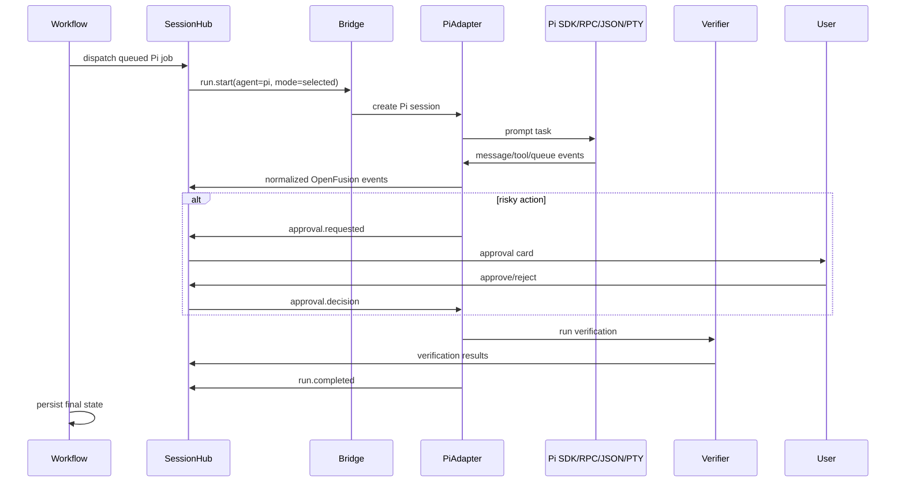

### 13A.17 Pi UI integration

Add a dedicated Pi panel inside Agent Inventory and Run Detail.

Pi Agent Card:

```text
Header
- Pi logo/name
- Detected version
- Status: Ready / Auth needed / Gateway configured / Sandbox required

Capabilities
- SDK
- RPC
- JSON Events
- Real Terminal
- Message Queue
- Custom Tools
- Session Tree
- Provider Switching

Provider
- Native Pi auth
- Cloudflare AI Gateway
- Local models
- OpenFusion-managed

Actions
- Open Pi terminal
- Run test prompt
- Configure gateway
- Choose default mode
- View Pi session logs
```

Pi Run Detail layout:

```text
Left: Pi terminal or structured stream
Center: live event timeline
Right: Pi state card
  - mode
  - provider/model
  - current tool
  - steering queue count
  - follow-up queue count
  - cost/tokens
  - approvals waiting
  - session branch
Bottom: diff/verifier/report tabs
```

Visual behavior:

```text
- Pi PTY mode uses xterm.js in the terminal dock.
- Pi SDK/RPC/JSON mode uses premium structured event cards.
- `message_update` renders as smooth streaming text.
- `tool_execution_*` renders as expandable tool cards.
- `queue_update` animates small queue chips near the composer.
- `compaction_*` appears as a subtle context-management timeline event.
- `auto_retry_*` appears as amber retry status, not an error unless final failure.
```

### 13A.18 Pi implementation roadmap

Phase 1 — Pi inventory:

```text
[ ] Detect `pi` on PATH.
[ ] Capture version safely.
[ ] Detect auth config presence without reading secrets.
[ ] Show Pi capabilities in Agent Inventory.
[ ] Add Pi provider mode selection UI.
```

Phase 2 — Pi JSON/RPC structured events:

```text
[ ] Implement JSONL parser.
[ ] Implement Pi event mapper.
[ ] Run `pi --mode json` one-shot tasks.
[ ] Spawn `pi --mode rpc --no-session`.
[ ] Support prompt, steer, follow-up in RPC.
[ ] Store events in R2 as JSONL.
[ ] Replay events in run timeline.
```

Phase 3 — Pi SDK harness:

```text
[ ] Add `@earendil-works/pi-coding-agent` dependency to bridge package.
[ ] Create SDK runner.
[ ] Subscribe to events.
[ ] Register OpenFusion custom tools.
[ ] Map session state into D1.
[ ] Add verifier integration after agent end.
```

Phase 4 — Pi real terminal:

```text
[ ] Spawn Pi with node-pty.
[ ] Render in xterm.js terminal dock.
[ ] Implement Jump In terminal lease.
[ ] Audit human terminal input.
[ ] Support terminal resize.
[ ] Attach raw terminal recording to R2.
```

Phase 5 — Cloudflare AI Gateway:

```text
[ ] Add Pi gateway configuration screen.
[ ] Generate env profile for local bridge.
[ ] Route Pi through `cloudflare-ai-gateway` provider.
[ ] Verify AI Gateway logs include model/token/latency.
[ ] Add DLP mode selection.
[ ] Add low-latency request-only DLP profile.
```

Phase 6 — Enterprise hardening:

```text
[ ] Run Pi RPC inside Docker/microVM/sandbox.
[ ] Add strict workspace path policy.
[ ] Block sensitive commands at bridge policy layer.
[ ] Add per-team Pi mode restrictions.
[ ] Add provider allowlist and model allowlist.
[ ] Add audit export.
```

### 13A.19 Pi acceptance criteria

```text
[ ] User can see Pi in Agent Inventory with correct detection status.
[ ] User can run a Pi task from OpenFusion.
[ ] Pi emits deltas that appear live in Mission Control.
[ ] Pi tool calls appear as tool cards.
[ ] Pi final message appears as an end message/report entry.
[ ] User can steer a Pi run while it is active.
[ ] User can queue a Pi follow-up after the run finishes.
[ ] User can run Pi in a real terminal and jump into it.
[ ] Risky Pi actions require OpenFusion approval.
[ ] Pi logs and events are redacted before cloud sync.
[ ] Pi can route through Cloudflare AI Gateway.
[ ] A Pi run can be queued overnight.
[ ] A Pi run can be scheduled.
[ ] Pi output can be verified with tests/build/lint/typecheck.
[ ] Pi candidate output can be compared with Claude Code/Codex/OpenCode candidates.
```

### 13A.20 Final Pi recommendation

OpenFusion should position Pi like this:

> Pi is the most embeddable/customizable harness inside OpenFusion. Claude Code, Codex, and OpenCode are strong external agents; Pi is also a toolkit we can deeply integrate. OpenFusion remains the command center that coordinates every agent, keeps the human in the loop, stores audit trails, enforces policy, and presents the premium Mission Control UI.

This gives you speed and flexibility without locking the product to one agent runtime.

---


## 14. Real terminal streaming and jump-in control

### 14.1 Terminal control modes

```text
Agent control
- Agent receives stdin/control.
- User watches output.
- User can queue steering/follow-up messages.

Human lease
- User clicks Jump In.
- Bridge pauses agent input or sends interrupt depending on adapter.
- User gets direct terminal stdin.
- All human keystrokes are logged as human input events.
- User can release control back to agent.

Read-only observer
- Team member watches but cannot type.

Approval-only observer
- Reviewer can approve/reject risk gates but cannot type.
```

### 14.2 Lease model

```ts
export type TerminalLease = {
  id: string
  runId: string
  holderUserId: string
  mode: "human-control" | "agent-control"
  acquiredAt: string
  expiresAt?: string
  reason?: string
}
```

### 14.3 Jump-in sequence

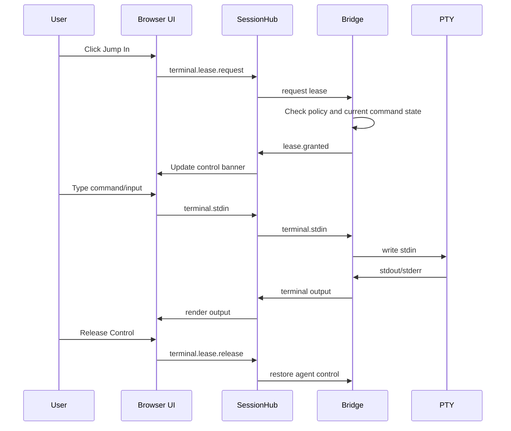

### 14.4 Terminal stream encoding

```ts
export type TerminalEvent =
  | { type: "terminal.open"; runId: string; cols: number; rows: number }
  | { type: "terminal.stdout"; runId: string; data: string; seq: number }
  | { type: "terminal.stderr"; runId: string; data: string; seq: number }
  | { type: "terminal.stdin"; runId: string; data: string; userId: string }
  | { type: "terminal.resize"; runId: string; cols: number; rows: number }
  | { type: "terminal.lease.granted"; runId: string; lease: TerminalLease }
  | { type: "terminal.lease.released"; runId: string; leaseId: string }
  | { type: "terminal.closed"; runId: string; exitCode?: number; signal?: string }
```

---

## 15. Build queue, overnight work, and scheduled jobs

### 15.1 Build queue principles

```text
- Queue items run in isolated worktrees by default.
- Never auto-merge by default.
- Respect machine availability.
- Respect allowed execution windows.
- Respect concurrency limits.
- Require approval for risky commands.
- Produce morning decision reports.
```

### 15.2 Queue item model

```ts
export type QueueItem = {
  id: string
  workspaceId: string
  createdBy: string
  repoId: string
  machineSelector: MachineSelector
  task: string
  targetBranch: string
  preferredAgents: string[]
  priority: "low" | "normal" | "high" | "urgent"
  scheduleWindow?: { start: string; end: string; timezone: string }
  maxCostUsd?: number
  maxRuntimeMinutes?: number
  status: "queued" | "waiting-machine" | "running" | "waiting-approval" | "completed" | "failed" | "cancelled"
  createdAt: string
  runAfter?: string
}
```

### 15.3 Queue policy

```ts
export type QueuePolicy = {
  workspaceId: string
  maxConcurrentRunsPerMachine: number
  allowedHours: Array<{ days: string[]; start: string; end: string; timezone: string }>
  requireCleanWorktree: boolean
  useGitWorktrees: boolean
  requireApprovalBeforeInstall: boolean
  requireApprovalBeforeNetwork: boolean
  requireApprovalBeforeDatabaseMigration: boolean
  requireApprovalBeforeGitPush: true
  autoCreateReport: boolean
}
```

### 15.4 Scheduled jobs

Examples:

```text
Nightly regression run
- Every weekday at 01:00
- Run tests/build/lint on main
- If failed, ask agent to diagnose only
- No code changes unless explicitly configured

Weekly dependency review
- Every Monday 09:00
- Inspect outdated packages
- Prepare report and suggested PR plan
- Require human approval before package install/update

Morning engineering summary
- Every weekday 08:30
- Summarize overnight queue results
- Include failed commands, diffs, and pending approvals
```

```ts
export type ScheduledJob = {
  id: string
  workspaceId: string
  name: string
  naturalLanguage: string
  cron: string
  timezone: string
  enabled: boolean
  taskTemplate: string
  machineSelector: MachineSelector
  agentSelector: AgentSelector
  nextRunAt: string
  lastRunAt?: string
  lastStatus?: "success" | "failed" | "cancelled"
}
```

### 15.5 Workflow states for scheduled/queued work

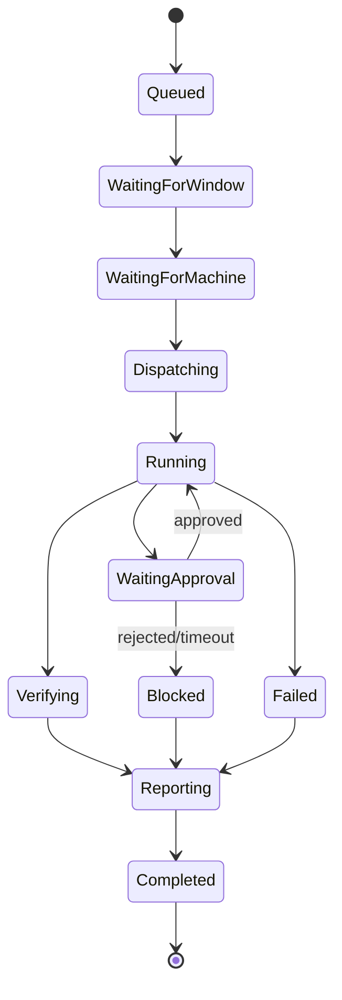

---

## 16. Human-in-the-loop approval model

### 16.1 Approval categories

```text
Command approval
- shell command risk detected
- destructive command
- install/deploy/migration/git push

Provider approval
- send source code to hosted model
- use expensive frontier model
- leave local-only mode

File approval
- edit protected paths
- touch secrets/config files
- modify CI/CD or infra files

Queue approval
- run overnight
- run on battery/untrusted network
- run long task above budget

Patch approval
- apply patch to active branch
- open PR
- merge/deploy always manual by default
```

### 16.2 Approval request model

```ts
export type ApprovalRequest = {
  id: string
  workspaceId: string
  sessionId: string
  runId: string
  kind: "command" | "provider" | "file" | "queue" | "patch"
  title: string
  description: string
  risk: "low" | "medium" | "high" | "critical"
  requestedAction: unknown
  defaultAction: "deny" | "allow-once" | "allow-session"
  expiresAt?: string
  status: "pending" | "approved" | "rejected" | "expired" | "cancelled"
  createdAt: string
}
```

### 16.3 UX copy examples

```text
Agent has control. You can jump in at any time.
Waiting for approval: dependency install.
No auto-merge. Human review required.
Running in isolated worktree.
Source sync: metadata only.
This command can delete files. Review before continuing.
This run wants to send source code to Anthropic through AI Gateway.
This queue item exceeded its cost budget and is paused.
```

---

## 17. Multi-agent routing, verification, judging, and synthesis

### 17.1 Recommended pipeline

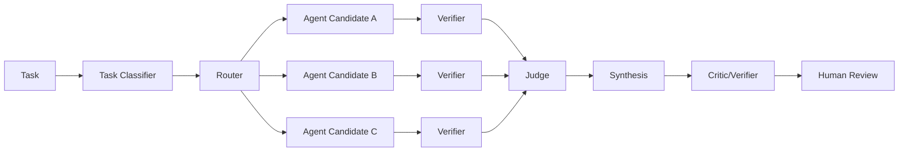

### 17.2 Do not run all models by default

```text
Simple task      → one model/agent
Medium task      → one agent + verifier
Hard task        → two or three candidates
Critical task    → plan, approval, candidates, verification, human review
```

### 17.3 Scoring model

```text
Final score =
  0.35 deterministic verification
+ 0.20 correctness against task
+ 0.15 minimality/maintainability
+ 0.10 safety/risk
+ 0.10 human preference or policy fit
+ 0.10 cost/latency efficiency
```

For coding tasks, deterministic verification should dominate LLM judge preference.

### 17.4 Candidate isolation

For multi-agent tasks:

```text
Candidate A → worktree/run_A
Candidate B → worktree/run_B
Candidate C → worktree/run_C
Judge compares diffs, test results, and run reports.
Synthesis creates final patch or recommends one candidate.
Human reviews final patch.
```

### 17.5 Decision report

```ts
export type DecisionReport = {
  id: string
  sessionId: string
  runIds: string[]
  task: string
  agentsUsed: string[]
  winningCandidateId?: string
  summary: string
  verification: VerifierResult[]
  risks: RiskFinding[]
  filesChanged: FileChangeSummary[]
  humanInterventions: HumanIntervention[]
  costUsd: number
  latencyMs: number
  confidence: number
  recommendation: "accept" | "review-carefully" | "reject" | "rerun"
}
```

---

## 18. Event-sourced architecture

### 18.1 Why event-sourcing

OpenFusion needs event-sourcing because it must support:

```text
- Live terminal streaming.
- Browser reconnect and replay.
- Team observers.
- Debugging of failed agent runs.
- Decision reports.
- Audit trails.
- Queue/schedule history.
- Reconstructing what happened overnight.
```

### 18.2 OpenFusion event envelope

```ts
export type EventEnvelope<T = unknown> = {
  id: string
  seq: number
  workspaceId: string
  sessionId: string
  runId?: string
  source: "browser" | "worker" | "durable-object" | "bridge" | "agent" | "verifier" | "ai-gateway"
  type: string
  payload: T
  visibility: "local-only" | "metadata" | "full"
  createdAt: string
  hash?: string
}
```

### 18.3 Event catalog

```text
session.created
session.started
session.paused
session.resumed
session.completed
session.failed

machine.online
machine.offline
machine.revoked

agent.detected
agent.auth_missing
agent.started
agent.ended

run.created
run.dispatched
run.started
run.waiting_approval
run.completed
run.failed
run.cancelled

message.user
message.assistant_start
message.assistant_delta
message.assistant_end
message.queued
message.delivered

terminal.open
terminal.stdout
terminal.stderr
terminal.stdin
terminal.resize
terminal.lease_requested
terminal.lease_granted
terminal.lease_released
terminal.closed

tool.start
tool.delta
tool.end
tool.error

approval.requested
approval.approved
approval.rejected
approval.expired

verifier.started
verifier.output
verifier.completed

artifact.created
artifact.uploaded
artifact.redacted

queue.item_created
queue.item_started
queue.item_completed
queue.item_failed

schedule.triggered
schedule.skipped
schedule.completed

judge.started
judge.scored
synthesis.started
synthesis.completed
report.created
```

### 18.4 Privacy-aware event storage

| Privacy mode | D1 | R2 | Browser live stream | Provider calls |
|---|---|---|---|---|
| Local only | Metadata only | No raw logs in cloud | Yes through encrypted live channel if enabled | Local only or user-approved |
| Metadata only | Status, costs, hashes | Redacted summaries only | Live terminal can be local relay only | User-approved snippets |
| Full sync | Metadata | Logs, transcripts, patches | Full live stream | Policy-controlled |

---

## 19. Session, message, and artifact model

### 19.1 Tree session model

A session should support branching. Do not assume a linear chat history.

```ts
export type MessageNode = {
  id: string
  sessionId: string
  parentId?: string
  role: "user" | "assistant" | "tool" | "system" | "verifier" | "human"
  contentRef?: string
  contentInline?: string
  status: "streaming" | "complete" | "redacted" | "error"
  label?: string
  createdAt: string
}
```

### 19.2 Artifact types

```text
terminal-log
transcript
patch-diff
verifier-output
screenshot
browser-preview
coverage-report
cost-report
decision-report
queue-summary
```

### 19.3 Artifact metadata

```ts
export type Artifact = {
  id: string
  workspaceId: string
  sessionId: string
  runId?: string
  kind: ArtifactKind
  objectKey: string
  mimeType: string
  sizeBytes: number
  sha256: string
  redactionStatus: "not-needed" | "redacted" | "blocked"
  createdAt: string
}
```

---

## 20. D1 schema and R2 object layout

### 20.1 D1 tables

```sql
CREATE TABLE workspaces (
  id TEXT PRIMARY KEY,
  name TEXT NOT NULL,
  privacy_mode TEXT NOT NULL DEFAULT 'metadata-only',
  created_at TEXT NOT NULL,
  updated_at TEXT NOT NULL
);

CREATE TABLE machines (
  id TEXT PRIMARY KEY,
  workspace_id TEXT NOT NULL,
  display_name TEXT NOT NULL,
  os TEXT NOT NULL,
  arch TEXT NOT NULL,
  bridge_version TEXT NOT NULL,
  status TEXT NOT NULL,
  last_seen_at TEXT,
  created_at TEXT NOT NULL,
  FOREIGN KEY (workspace_id) REFERENCES workspaces(id)
);

CREATE TABLE agent_installations (
  id TEXT PRIMARY KEY,
  machine_id TEXT NOT NULL,
  agent_kind TEXT NOT NULL,
  command TEXT NOT NULL,
  version TEXT,
  auth_status TEXT NOT NULL,
  capabilities_json TEXT NOT NULL,
  detected_at TEXT NOT NULL,
  FOREIGN KEY (machine_id) REFERENCES machines(id)
);

CREATE TABLE sessions (
  id TEXT PRIMARY KEY,
  workspace_id TEXT NOT NULL,
  title TEXT NOT NULL,
  status TEXT NOT NULL,
  privacy_mode TEXT NOT NULL,
  created_by TEXT NOT NULL,
  created_at TEXT NOT NULL,
  updated_at TEXT NOT NULL,
  FOREIGN KEY (workspace_id) REFERENCES workspaces(id)
);

CREATE TABLE runs (
  id TEXT PRIMARY KEY,
  session_id TEXT NOT NULL,
  machine_id TEXT,
  agent_installation_id TEXT,
  task TEXT NOT NULL,
  worktree_path_hash TEXT,
  branch_name TEXT,
  status TEXT NOT NULL,
  cost_usd REAL,
  latency_ms INTEGER,
  confidence REAL,
  started_at TEXT,
  completed_at TEXT,
  created_at TEXT NOT NULL,
  FOREIGN KEY (session_id) REFERENCES sessions(id)
);

CREATE TABLE event_index (
  id TEXT PRIMARY KEY,
  workspace_id TEXT NOT NULL,
  session_id TEXT NOT NULL,
  run_id TEXT,
  seq INTEGER NOT NULL,
  type TEXT NOT NULL,
  source TEXT NOT NULL,
  visibility TEXT NOT NULL,
  object_key TEXT,
  created_at TEXT NOT NULL
);

CREATE TABLE approvals (
  id TEXT PRIMARY KEY,
  workspace_id TEXT NOT NULL,
  session_id TEXT NOT NULL,
  run_id TEXT NOT NULL,
  kind TEXT NOT NULL,
  title TEXT NOT NULL,
  risk TEXT NOT NULL,
  status TEXT NOT NULL,
  requested_action_json TEXT NOT NULL,
  decision_json TEXT,
  decided_by TEXT,
  created_at TEXT NOT NULL,
  decided_at TEXT
);

CREATE TABLE queue_items (
  id TEXT PRIMARY KEY,
  workspace_id TEXT NOT NULL,
  created_by TEXT NOT NULL,
  task TEXT NOT NULL,
  priority TEXT NOT NULL,
  status TEXT NOT NULL,
  run_after TEXT,
  schedule_window_json TEXT,
  agent_selector_json TEXT,
  machine_selector_json TEXT,
  max_cost_usd REAL,
  max_runtime_minutes INTEGER,
  created_at TEXT NOT NULL,
  updated_at TEXT NOT NULL
);

CREATE TABLE scheduled_jobs (
  id TEXT PRIMARY KEY,
  workspace_id TEXT NOT NULL,
  name TEXT NOT NULL,
  natural_language TEXT NOT NULL,
  cron TEXT NOT NULL,
  timezone TEXT NOT NULL,
  enabled INTEGER NOT NULL,
  task_template TEXT NOT NULL,
  agent_selector_json TEXT NOT NULL,
  machine_selector_json TEXT NOT NULL,
  next_run_at TEXT,
  last_run_at TEXT,
  last_status TEXT,
  created_at TEXT NOT NULL,
  updated_at TEXT NOT NULL
);

CREATE TABLE artifacts (
  id TEXT PRIMARY KEY,
  workspace_id TEXT NOT NULL,
  session_id TEXT NOT NULL,
  run_id TEXT,
  kind TEXT NOT NULL,
  object_key TEXT NOT NULL,
  mime_type TEXT NOT NULL,
  size_bytes INTEGER NOT NULL,
  sha256 TEXT NOT NULL,
  redaction_status TEXT NOT NULL,
  created_at TEXT NOT NULL
);

CREATE TABLE decision_reports (
  id TEXT PRIMARY KEY,
  workspace_id TEXT NOT NULL,
  session_id TEXT NOT NULL,
  summary TEXT NOT NULL,
  recommendation TEXT NOT NULL,
  confidence REAL NOT NULL,
  cost_usd REAL,
  latency_ms INTEGER,
  report_json TEXT NOT NULL,
  created_at TEXT NOT NULL
);
```

### 20.2 Indexes

```sql
CREATE INDEX idx_sessions_workspace_status ON sessions(workspace_id, status);
CREATE INDEX idx_runs_session ON runs(session_id);
CREATE INDEX idx_events_session_seq ON event_index(session_id, seq);
CREATE INDEX idx_approvals_workspace_status ON approvals(workspace_id, status);
CREATE INDEX idx_queue_workspace_status ON queue_items(workspace_id, status);
CREATE INDEX idx_schedules_next_run ON scheduled_jobs(enabled, next_run_at);
CREATE INDEX idx_artifacts_session ON artifacts(session_id, run_id);
```

### 20.3 R2 object layout

```text
workspaces/{workspaceId}/sessions/{sessionId}/events/{runId}.jsonl.zst
workspaces/{workspaceId}/sessions/{sessionId}/terminal/{runId}.ansi.zst
workspaces/{workspaceId}/sessions/{sessionId}/transcripts/{runId}.jsonl.zst
workspaces/{workspaceId}/sessions/{sessionId}/artifacts/{artifactId}/patch.diff
workspaces/{workspaceId}/sessions/{sessionId}/artifacts/{artifactId}/verifier-output.txt
workspaces/{workspaceId}/reports/{reportId}.json
workspaces/{workspaceId}/queue/{date}/morning-summary.md
```

---

## 21. API, WebSocket, and RPC contracts

### 21.1 REST API

```text
POST   /api/workspaces
GET    /api/workspaces/:id

POST   /api/machines/pairing-code
POST   /api/machines/complete-pairing
GET    /api/machines
POST   /api/machines/:id/revoke
POST   /api/machines/:id/probe-agents

POST   /api/sessions
GET    /api/sessions
GET    /api/sessions/:id
POST   /api/sessions/:id/start
POST   /api/sessions/:id/pause
POST   /api/sessions/:id/resume
POST   /api/sessions/:id/cancel

GET    /api/sessions/:id/events?afterSeq=123
GET    /api/sessions/:id/artifacts
GET    /api/artifacts/:id/download

GET    /api/approvals
POST   /api/approvals/:id/approve
POST   /api/approvals/:id/reject

GET    /api/queue
POST   /api/queue
PATCH  /api/queue/:id
POST   /api/queue/:id/cancel

GET    /api/schedules
POST   /api/schedules
PATCH  /api/schedules/:id
POST   /api/schedules/:id/run-now

GET    /api/reports
GET    /api/reports/:id

GET    /api/policies
PATCH  /api/policies/:id
```

### 21.2 WebSocket topics

```text
/session/:sessionId/ws?role=browser
/session/:sessionId/ws?role=bridge
```

Browser → Durable Object:

```text
control.pause
control.resume
control.cancel
terminal.stdin
terminal.resize
terminal.lease.request
terminal.lease.release
message.steer
message.follow_up
approval.decide
```

Bridge → Durable Object:

```text
machine.heartbeat
agent.detected
run.status
terminal.stdout
terminal.stderr
message.delta
message.end
tool.start
tool.delta
tool.end
approval.requested
verifier.completed
artifact.created
report.created
```

### 21.3 Local Bridge RPC

For future desktop/local clients:

```text
POST http://127.0.0.1:{port}/rpc
- probeAgents
- startRun
- pauseRun
- resumeRun
- cancelRun
- getLocalLogs
- setPolicy
- pairCloud
```

Keep this bound to localhost only, with CSRF/origin protection and an auth token.

---

## 22. Security, privacy, and policy system

### 22.1 Security principles

```text
- Local code is private by default.
- A user explicitly chooses workspace folders.
- A user explicitly pairs each machine.
- The bridge never silently reads secrets.
- Risky commands require approval.
- No auto-merge by default.
- No deploy/publish/git-push by default.
- Every important action is auditable.
```

### 22.2 Command risk classifier

High/critical examples:

```text
rm -rf
sudo
chmod/chown recursive
curl ... | bash
wget ... | sh
npm publish
pnpm publish
git push
gh pr merge
terraform apply
kubectl apply/delete
docker rm/prune
psql/mysql migrations
.env read/cat/print
gcloud/aws/az credential access
```

### 22.3 Policy matrix

| Action | Default | Reason |
|---|---|---|
| Read project file | allow in approved workspace | Required for coding |
| Edit project file | allow in run worktree | Required for coding |
| Edit protected file | approval | CI/secrets/infra risk |
| Run tests | allow | Verification |
| Install dependencies | approval | Supply-chain risk |
| Network command | approval or policy-based | Exfiltration risk |
| Git push | deny by default | No auto-merge/push |
| Deploy | deny by default | Production risk |
| Send code to hosted model | policy-controlled | Privacy |
| Store raw terminal logs in cloud | privacy-mode controlled | Privacy |

### 22.4 Secret redaction

Redact before cloud sync:

```text
API keys
JWTs
OAuth tokens
SSH private keys
AWS/GCP/Azure credentials
GitHub tokens
.env values
Authorization headers
Database URLs
Private package tokens
```

### 22.5 Local-only mode

In local-only mode:

```text
- Raw terminal logs remain on device.
- Cloud stores only status metadata and hashes.
- Hosted model calls are blocked unless explicitly approved.
- Reports can be generated locally and manually exported.
- UI should show a clear “Local Only” banner.
```

---

## 23. Observability, analytics, and reports

### 23.1 Metrics

```text
run_count
success_rate
failure_rate
approval_count
approval_rejection_rate
agent_usage_by_kind
provider_usage_by_model
cost_usd_by_workspace
latency_p50/p95
queue_wait_time
queue_completion_rate
scheduled_job_success_rate
verifier_pass_rate
secret_redaction_count
policy_block_count
jump_in_count
human_intervention_count
```

### 23.2 OpenTelemetry/event correlation

Every run should have:

```text
trace_id
session_id
run_id
machine_id
agent_id
workflow_id
queue_item_id
schedule_id
```

### 23.3 Report sections

```text
Task
Agents used
Timeline
Commands run
Files changed
Verification evidence
Approvals requested
Human interventions
Risks
Cost/latency
Final recommendation
Patch links
Replay link
```

---

## 24. Premium UI system design

### 24.1 Product design thesis

OpenFusion should feel like a mix of:

```text
- Mission control / security operations center
- Warp-like premium terminal
- Linear/Vercel-level product polish
- GitHub Actions evidence and logs
- React Flow-like live orchestration graph
```

It should not look like a simple chatbot.

### 24.2 Visual identity

```text
Theme: dark-first, obsidian, graphite, deep blue-black
Accent: electric cyan/blue for active routing, violet for AI synthesis, amber for approvals, green for verified, red for blocked
Texture: subtle noise, radial glows, thin borders, glass panels
Typography: clean sans for UI, monospace for terminal/code
Motion: small, purposeful, state-driven
Density: information-rich but not cluttered
```

### 24.3 Layout

```text
┌────────────────────────────────────────────────────────────────────────────┐
│ Top Command Bar: workspace, repo, ask box, machines, cost, approvals       │
├───────────────┬──────────────────────────────────────────┬─────────────────┤
│ Left Nav      │ Center Mission Canvas                    │ Right Panel     │
│ Mission       │ Active Run Hero                          │ Decision Report │
│ Sessions      │ Agent Graph                              │ Confidence      │
│ Agents        │ Run Timeline                             │ Verifier Stack  │
│ Queue         │ Candidate Comparison                     │ Approval Queue  │
│ Schedules     │                                          │ Risk Flags      │
│ Reports       │                                          │ Cost/Latency    │
│ Policies      │                                          │                 │
├───────────────┴──────────────────────────────────────────┴─────────────────┤
│ Terminal Dock: Claude Code | Codex | OpenCode | Qwen | Tests | System      │
└────────────────────────────────────────────────────────────────────────────┘
```

### 24.4 Key interactions

```text
- Cmd/Ctrl+K opens command palette.
- Clicking graph nodes changes inspector panel.
- Terminal tabs show live status.
- Jump In requests terminal lease.
- Pause/Resume changes run state.
- Approval cards update in place.
- Diff drawer opens from report/patch.
- Queue cards can be reordered.
- Scheduled jobs can be toggled and run now.
- Session timeline can replay past events.
- Report can be exported to Markdown.
```

### 24.5 Components

```text
AppShell
TopCommandBar
LeftNavigation
MissionCanvas
AgentGraph
AgentNode
RunTimeline
TerminalDock
TerminalTab
TerminalPane
JumpInControl
ApprovalQueue
ApprovalCard
VerificationStack
VerifierResultCard
DecisionReportPanel
CandidateComparisonTable
BuildQueueBoard
QueueItemCard
ScheduleCalendar
ScheduleEditor
AgentInventoryGrid
AgentCard
PolicyMatrix
PrivacyModeSelector
DiffDrawer
CommandPalette
CostMeter
ConfidenceMeter
RiskBadge
StatusPill
EmptyMachinePairingState
```

---

## 25. Detailed AI prompt for building the premium UI

Use this prompt in Cursor, v0, Lovable, Bolt, Claude Code, Codex, OpenCode, or another frontend builder.

```text
You are a principal product designer, senior frontend architect, and senior full-stack engineer.
Build a premium, production-grade UI for a product called OpenFusion.

Product definition:
OpenFusion is mission control for AI coding agents. A developer gives Claude Code, Codex CLI, OpenCode, Qwen Code, Pi, or future agents a task. The agent runs in a real terminal the developer can watch, pause, resume, and jump into. OpenFusion supports live feedback, build queues for overnight work, scheduled jobs, human approvals, deterministic verification, decision reports, and multi-agent comparison. It is not auto-merge and not a black box. A human stays in the loop the whole way.

Tech stack:
- Next.js App Router
- TypeScript
- Tailwind CSS
- shadcn/ui
- Zustand for local UI state
- TanStack Query for server-state-shaped mock hooks
- xterm.js or an xterm-like terminal placeholder component
- React Flow for the agent orchestration graph
- Monaco or high-quality diff viewer placeholder
- Motion for React animations
- Lucide React icons

Design direction:
Create a dark, premium, interactive command center. It should feel like Linear + Vercel + Warp terminal + GitHub Actions + a security operations center. Avoid generic SaaS cards. Avoid childish neon. Use obsidian/graphite surfaces, subtle radial gradients, 1px borders, glass panels, tasteful glows, strong hierarchy, crisp typography, and authentic terminal details.

Brand:
- Name: OpenFusion
- Tagline: Mission control for AI coding agents
- Tone: technical, elegant, trustworthy, human-controlled
- Core promise: Watch agents work. Jump in anytime. Review before merge.

Information architecture:
1. /mission-control
2. /sessions/[id]
3. /agents
4. /queue
5. /schedules
6. /reports
7. /policies
8. /settings/machines

Global layout:
- Top command bar with workspace selector, repository selector, global task input, online machines, cost today, pending approvals, user avatar.
- Left nav rail with Mission Control, Sessions, Agents, Queue, Schedules, Reports, Policies, Settings.
- Center area for active run graph/timeline.
- Right inspector for decision report, verification, approvals, risk, cost.
- Bottom terminal dock with tabs.

Mission Control screen:
- Hero active run: “Fix flaky auth refresh test”.
- Status: Running in isolated worktree.
- Human-control badge: “Agent has control. You can jump in at any time.”
- Primary actions: Jump In, Pause Agent, Queue Follow-up, View Patch.
- Agent graph using React Flow:
  Task → Router → Claude Code → Codex → OpenCode → Verification → Judge → Human Review.
- Active graph node should pulse subtly.
- Edges should have animated data pulses.
- Each node should show status, latency, and small icon.

Right inspector:
- Decision report preview.
- Confidence meter.
- Cost/latency meter.
- Verification stack:
  Typecheck passed, Unit tests 42/44 passed, Lint warning, Build pending.
- Approval queue:
  “Allow pnpm install?” risk medium.
  “Allow edit to .github/workflows/ci.yml?” risk high.
- Buttons: Approve once, Reject, View details.

Terminal dock:
- Tabs: Claude Code, Codex, OpenCode, Qwen, Pi, Tests, System.
- Each tab has a status pill: running, waiting, passed, idle, failed.
- Terminal pane should look authentic with monospace text, ANSI-like colors, command prompts, timestamps, and streaming lines.
- Controls: Jump In, Pause, Resume, Kill Run, Copy Logs, Pop Out.
- Show lease banner states:
  Agent has control.
  You are controlling this terminal.
  Read-only observer.

Agent inventory screen:
- Cards for Claude Code, Codex CLI, OpenCode, Qwen Code, Pi, Aider, ACP Agents.
- Show detected/not detected/auth missing/version.
- Show capabilities chips: terminal, repo-aware, code-edit, bash, MCP, ACP, JSON events, RPC, model switching, session branching.
- Add Re-probe Machine button.
- Add “Install guide” link state for missing agents.

Build queue screen:
- Kanban/list hybrid for Queued, Waiting machine, Running, Waiting approval, Completed, Failed.
- Queue item cards: task, repo, branch, worktree, agent, priority, schedule window, risk, estimate.
- Queue policy side panel: max concurrency, allowed hours, use worktrees, require approval before install, no git push.
- Add “Plan overnight batch” CTA.

Scheduled jobs screen:
- Calendar/cron inspired layout.
- Jobs: Nightly regression run, Weekly dependency review, Monday status report.
- Natural-language schedule input: “Run every weekday at 1 AM IST”.
- Show cron preview, timezone, next run, last status, enabled toggle.

Reports screen:
- List of decision reports with filters.
- Report detail preview includes task, agents used, commands, files changed, tests, approvals, human interventions, cost, latency, confidence, recommendation.
- Add export Markdown button.
- Add replay session button.

Policies screen:
- Privacy mode cards: Local only, Metadata only, Full sync.
- Command approval matrix.
- Provider allowlist.
- Secret redaction settings.
- Protected paths.
- Retention rules.
- Clear warning copy: “No auto-merge. Git push and deploy are blocked by default.”

Machine pairing empty state:
- Premium centered card.
- Explain that a local bridge is required to detect and run terminal agents.
- Show one command mock: npx openfusion bridge pair <code>.
- Show privacy promise.

Required components:
AppShell, TopCommandBar, LeftNav, MissionCanvas, AgentGraph, AgentNode, RunTimeline, TerminalDock, TerminalTab, TerminalPane, JumpInControl, ApprovalQueue, ApprovalCard, VerificationStack, DecisionReportPanel, CandidateComparisonTable, BuildQueueBoard, QueueItemCard, ScheduleCalendar, ScheduleEditor, AgentInventoryGrid, AgentCard, PolicyMatrix, PrivacyModeSelector, DiffDrawer, CommandPalette, CostMeter, ConfidenceMeter, RiskBadge, StatusPill, EmptyMachinePairingState.

State and data:
- Use local mock data.
- Use TanStack Query-shaped hooks: useSessions, useAgents, useQueue, useSchedules, useReports, useApprovals.
- Use Zustand for UI state: selectedSessionId, selectedRunId, selectedGraphNodeId, terminalTab, commandPaletteOpen, diffDrawerOpen, terminalLeaseMode.
- Include realistic event stream mock that updates terminal text and graph states.

Mock data:
Active task: Fix flaky auth refresh test.
Agents:
- Claude Code: running, version detected, auth configured.
- Codex CLI: waiting, version detected, auth configured.
- OpenCode: passed, version detected.
- Qwen Code: idle, auth missing.
- Pi: detected, JSON events available.
Terminal commands:
- pnpm test auth-refresh.spec.ts
- pnpm typecheck
- git diff -- src/auth/session.ts
- pnpm lint
Verification:
- Typecheck passed.
- Unit tests 42/44 passed.
- Lint warning.
- Build pending.
Approvals:
- Allow pnpm install? medium.
- Allow edit to CI workflow? high.
Queue:
- Refactor billing service.
- Generate missing API tests.
- Upgrade TanStack Query usage.
Schedules:
- Nightly regression run.
- Weekly dependency review.
- Monday engineering summary.

Visual requirements:
- Dark-first.
- Responsive desktop-first with graceful tablet layout.
- Beautiful empty states.
- Smooth but subtle animations.
- Use color as secondary signal, never only signal.
- Terminal readability is critical.
- Graph should feel live but not noisy.
- Use compact, information-rich cards.
- No lorem ipsum.
- All copy must sound like a real technical product.

Accessibility:
- Keyboard-accessible command palette.
- Clear focus rings.
- ARIA labels for important controls.
- Reduced motion support.
- High-contrast text.

Implementation constraints:
- Do not build real backend.
- Do not call real providers.
- Do not require auth.
- Keep all components modular.
- Use TypeScript types for all domain objects.
- Put components under /components/openfusion.
- Put mock data under /lib/mock-openfusion.ts.
- Put types under /types/openfusion.ts.

Deliver a polished UI that could be shown to investors, early beta users, and senior engineers.
```

---

## 26. Design patterns

### 26.1 Adapter pattern

Use for:

```text
- Agent adapters: Claude Code, Codex, OpenCode, Qwen, Pi
- Provider adapters: OpenAI, Anthropic, DeepSeek, Kimi, MiniMax, Qwen, Ollama
- Verifier adapters: Node, Python, Go, Rust
```

### 26.2 Strategy pattern

Use for:

```text
- RoutingStrategy
- JudgeStrategy
- SynthesisStrategy
- RetryStrategy
- RedactionStrategy
- QueueDispatchStrategy
```

### 26.3 State machine

Use for:

```text
- Session lifecycle
- Run lifecycle
- Approval lifecycle
- Terminal lease lifecycle
- Queue item lifecycle
```

### 26.4 Event sourcing

Use for:

```text
- Terminal replay
- Run timeline
- Audit logs
- Report generation
- Browser reconnect
```

### 26.5 Saga / workflow pattern

Use Cloudflare Workflows for:

```text
- Long queued jobs
- Scheduled jobs
- Multi-step agent runs
- Human approval waits
- Retry and timeout behavior
```

### 26.6 Circuit breaker

Use for:

```text
- Failing model providers
- Broken agents
- Repeated verifier failures
- Offline machines
```

### 26.7 Policy engine

Use for:

```text
- Command approval
- Provider routing
- Privacy mode
- Protected paths
- Queue execution windows
```

### 26.8 Observer/pub-sub

Use Durable Objects as live fanout:

```text
Bridge publishes events.
Browsers subscribe.
Reports consume event history.
Queue/Workflow monitors consume state updates.
```

---

## 27. Monorepo and package structure

```text
openfusion/
├── apps/
│   ├── web/                         # Next.js Mission Control UI
│   ├── bridge/                      # Local bridge CLI/desktop app
│   └── docs/                        # Future docs site
├── packages/
│   ├── core/                        # Domain types, event types, state machines
│   ├── ai/                          # Provider adapters and router
│   ├── harness/                     # Harness adapter SDK
│   ├── bridge-protocol/             # WS/RPC schemas
│   ├── policy/                      # Command/provider/privacy/path policies
│   ├── redaction/                   # Secret redaction
│   ├── verifier/                    # Test/build/lint detectors
│   ├── db/                          # D1 migrations/repositories
│   ├── ui/                          # Shared UI components/tokens
│   └── config/                      # tsconfig/eslint/tailwind
├── workers/
│   ├── api/                         # Worker API/BFF
│   ├── session-hub/                 # Durable Object
│   ├── queue-consumer/              # Queue consumers
│   ├── scheduler/                   # Cron trigger worker
│   └── workflows/                   # Cloudflare Workflows
├── infra/
│   ├── wrangler.web.toml
│   ├── wrangler.api.toml
│   ├── migrations/
│   └── r2-lifecycle.md
├── evals/
│   ├── datasets/
│   ├── harness/
│   └── reports/
└── README.md
```

Recommended frontend dependencies:

```text
next
react
react-dom
@tanstack/react-query
zustand
@xyflow/react
@xterm/xterm
lucide-react
motion
class-variance-authority
clsx
tailwind-merge
zod
```

Recommended bridge dependencies:

```text
node-pty
execa
ws
zod
chokidar
simple-git
ignore
keytar optional
```

---

## 28. Implementation roadmap

### Phase 0 — Architecture validation

```text
[ ] Confirm target users and top 5 workflows.
[ ] Decide MVP agents: Claude Code, Codex, OpenCode, Pi.
[ ] Define event schema v0.
[ ] Define security policy v0.
[ ] Create UI prototype with mock events.
```

### Phase 1 — Local Bridge MVP

```text
[ ] Pair bridge with cloud.
[ ] Detect installed agents.
[ ] Spawn one agent in PTY.
[ ] Stream stdout/stderr to browser.
[ ] Implement terminal resize.
[ ] Implement pause/cancel.
[ ] Implement basic jump-in lease.
```

### Phase 2 — Mission Control UI

```text
[ ] Build shell layout.
[ ] Build terminal dock.
[ ] Build agent inventory.
[ ] Build active run timeline.
[ ] Build approval queue.
[ ] Build decision report mock.
[ ] Add polished empty states.
```

### Phase 3 — Cloud control plane

```text
[ ] D1 schema.
[ ] R2 artifact storage.
[ ] Durable Object session hub.
[ ] Queue and Workflow integration.
[ ] Cron schedule integration.
[ ] Event replay API.
```

### Phase 4 — Policy and verification

```text
[ ] Command risk classifier.
[ ] Approval gates.
[ ] Secret redaction.
[ ] Worktree creation.
[ ] Test/typecheck/lint/build detectors.
[ ] Patch artifact generation.
```

### Phase 5 — Multi-agent orchestration

```text
[ ] Run two agents in isolated worktrees.
[ ] Compare diffs and verifier results.
[ ] Add judge report.
[ ] Add synthesis/recommendation.
[ ] Add cost and latency tracking.
```

### Phase 6 — Queue and schedules

```text
[ ] Queue UI.
[ ] Queue worker.
[ ] Scheduled jobs.
[ ] Morning report.
[ ] Offline-machine handling.
[ ] DLQ and retry policies.
```

### Phase 7 — Team beta

```text
[ ] Workspace members.
[ ] Roles and permissions.
[ ] Team audit logs.
[ ] Machine revocation.
[ ] Retention policies.
[ ] Enterprise privacy mode.
```

---

## 29. Testing and quality gates

### 29.1 Unit tests

```text
- Event schema validation.
- Agent probe parsing.
- Command risk classifier.
- Secret redaction.
- Routing decisions.
- Queue policy.
- State machines.
```

### 29.2 Integration tests

```text
- Browser ↔ Durable Object WebSocket.
- Bridge ↔ SessionHub reconnect.
- PTY streaming under high output.
- Approval gate blocking command.
- Worktree creation and cleanup.
- R2 upload/download.
- Queue → Workflow → Bridge dispatch.
- Cron → queued run.
```

### 29.3 E2E tests

```text
- Pair machine.
- Detect agents.
- Start agent task.
- Watch terminal logs.
- Jump in and type.
- Approve command.
- Generate patch.
- Run verifier.
- Create report.
- Queue overnight job.
- Run scheduled job.
```

### 29.4 Performance targets

```text
Terminal stream p95 event latency: < 300ms
UI graph update latency: < 500ms
Bridge reconnect recovery: < 5s
Event replay for 10k events: < 3s initial view
Run creation API: < 500ms p95
```

---

## 30. Evaluation framework

### 30.1 Metrics

```text
Task success rate
Verifier pass rate
Human accepted patch rate
Human intervention count
Agent retry count
Cost per accepted run
Latency per accepted run
Approval rejection rate
Secret redaction incidents
Unsafe command block rate
```

### 30.2 Benchmark sets

```text
50 small bug fixes
50 test generation tasks
50 refactor tasks
50 dependency update tasks
30 long-context repo questions
30 prompt-injection/security tasks
20 overnight queue workflows
20 scheduled maintenance workflows
```

### 30.3 Compare against

```text
Single agent baseline
Single premium frontier model
OpenFusion one-agent + verification
OpenFusion multi-agent + verification
OpenFusion multi-agent + judge + synthesis
```

### 30.4 Honest product claim

Preferred claim:

```text
OpenFusion reduces cost and increases trust by routing coding work through local/low-cost agents first, verifying results, and escalating only when needed.
```

Avoid unproven claim:

```text
OpenFusion always beats premium frontier models.
```

---

## 31. Risks and mitigations

| Risk | Impact | Mitigation |
|---|---|---|
| Agent output is unsafe | High | Command policy, worktrees, approvals, no auto-merge |
| Secret leakage | High | Local redaction, DLP, privacy modes, provider policy |
| Terminal stream overload | Medium | Chunking, backpressure, R2 log offload |
| Offline machine breaks queue | Medium | Waiting-machine state, notifications, retry windows |
| Vendor CLI changes | Medium | Adapter pattern, probe tests, version compatibility matrix |
| LLM judge wrong | Medium | Deterministic verification first |
| Cloud cost grows | Medium | R2 lifecycle, AI Gateway cost tracking, budget caps |
| UX too complex | High | Mission Control hierarchy, progressive disclosure |
| Security trust barrier | High | Local-first mode, transparent audit, no auto-merge |

---

## 32. Architecture decision records

### ADR-001: Local bridge is required

**Decision:** Build OpenFusion Bridge for local detection and execution.

**Reason:** Cloudflare can coordinate but cannot discover or run tools installed on a user’s machine.

### ADR-002: Durable Object per live session

**Decision:** Use Durable Objects as live session hubs.

**Reason:** Session-local state, WebSocket fanout, and ordered event streaming fit this model.

### ADR-003: D1 for metadata, R2 for logs/artifacts

**Decision:** Store relational metadata in D1 and large data in R2.

**Reason:** Terminal logs and transcripts are large append-heavy objects, not relational rows.

### ADR-004: Event-sourced run model

**Decision:** Represent all meaningful actions as events.

**Reason:** Enables replay, debugging, reports, audit, reconnect, and team observers.

### ADR-005: No auto-merge by default

**Decision:** Git push, merge, and deploy are blocked by default.

**Reason:** Mission Control means human-controlled automation, not blind autonomy.

### ADR-006: Support MCP/ACP but do not depend on them exclusively

**Decision:** Build internal adapters and support MCP/ACP as integration paths.

**Reason:** Standards are valuable, but existing CLIs and PTY workflows still matter.

---

## 33. Launch checklist

### Product

```text
[ ] Product tagline is visible.
[ ] No auto-merge policy is visible.
[ ] Human can watch real terminal output.
[ ] Human can jump in and release control.
[ ] Human can approve/reject risky actions.
[ ] Build queue is useful.
[ ] Scheduled jobs are understandable.
[ ] Decision reports are clear.
```

### Engineering

```text
[ ] Bridge pairs securely.
[ ] Agent detection works on macOS/Linux/Windows.
[ ] PTY streaming handles high output.
[ ] WebSocket reconnect works.
[ ] Event seq ordering is reliable.
[ ] R2 artifact upload works.
[ ] D1 migrations are versioned.
[ ] Queues have DLQ.
[ ] Workflows resume after waits.
[ ] Cron does not duplicate jobs.
```

### Security

```text
[ ] Workspace scope enforced.
[ ] Protected paths enforced.
[ ] Secret redaction tested.
[ ] Risky commands require approval.
[ ] Git push/merge/deploy blocked by default.
[ ] Pairing tokens expire.
[ ] Machine revocation works.
[ ] Audit log captures approvals and human terminal input.
```

### UI

```text
[ ] Premium Mission Control dashboard complete.
[ ] Terminal dock is readable and authentic.
[ ] Agent graph updates live.
[ ] Approval queue is obvious.
[ ] Queue and schedules screens complete.
[ ] Agent inventory screen complete.
[ ] Reports screen complete.
[ ] Empty machine-pairing state complete.
[ ] Keyboard shortcuts and command palette work.
[ ] Reduced motion support.
```

### Beta

```text
[ ] 10 real repos tested.
[ ] 100+ agent runs completed.
[ ] No secret leaks in synced logs.
[ ] No accidental destructive commands.
[ ] Queue completes overnight reliably.
[ ] Reports are useful for human review.
```

---

## 34. Source references

### Video/topic references

- Tau architecture video URL supplied by user: https://www.youtube.com/watch?v=5duo9qHw660
- Pi architecture video URL supplied by user: https://www.youtube.com/watch?v=gTeujlv8qK0
- Pi official site: https://pi.dev/
- Pi docs: https://pi.dev/docs/latest
- Pi GitHub package docs: https://github.com/earendil-works/pi/tree/main/packages/coding-agent
- Pi RPC / JSON event stream docs: https://github.com/earendil-works/pi/blob/main/packages/coding-agent/docs/rpc.md
- Pi SDK docs: https://pi.dev/docs/latest/sdk
- Pi RPC docs: https://pi.dev/docs/latest/rpc
- Pi JSON event stream docs: https://pi.dev/docs/latest/json
- Pi provider docs: https://pi.dev/docs/latest/providers
- Pi GitHub repository: https://github.com/earendil-works/pi

### Cloudflare

- Next.js on Cloudflare Workers: https://developers.cloudflare.com/workers/framework-guides/web-apps/nextjs/
- OpenNext Cloudflare adapter: https://opennext.js.org/cloudflare
- Durable Objects WebSockets: https://developers.cloudflare.com/durable-objects/best-practices/websockets/
- D1 overview: https://developers.cloudflare.com/d1/
- D1 limits: https://developers.cloudflare.com/d1/platform/limits/
- R2: https://developers.cloudflare.com/r2/
- Queues: https://developers.cloudflare.com/queues/
- Workflows: https://developers.cloudflare.com/workflows/
- Cron Triggers: https://developers.cloudflare.com/workers/configuration/cron-triggers/
- AI Gateway: https://developers.cloudflare.com/ai-gateway/
- AI Gateway coding agents: https://developers.cloudflare.com/ai-gateway/integrations/coding-agents/
- AI Gateway Claude Code integration: https://developers.cloudflare.com/ai-gateway/integrations/coding-agents/claude-code/
- AI Gateway Codex integration: https://developers.cloudflare.com/ai-gateway/integrations/coding-agents/openai-codex/
- AI Gateway Pi integration: https://developers.cloudflare.com/ai-gateway/integrations/coding-agents/pi/

### Coding agents and protocols

- Claude Code CLI reference: https://code.claude.com/docs/en/cli-reference
- Claude Code product page: https://claude.com/product/claude-code
- Claude Code Agent SDK overview: https://code.claude.com/docs/en/agent-sdk/overview
- OpenAI Codex CLI: https://developers.openai.com/codex/cli
- Codex CLI features: https://developers.openai.com/codex/cli/features
- Codex CLI reference: https://developers.openai.com/codex/cli/reference
- OpenCode: https://opencode.ai/
- OpenCode ACP support: https://opencode.ai/docs/acp/
- Qwen Code: https://qwen.ai/qwencode
- Qwen Code GitHub: https://github.com/QwenLM/qwen-code
- Agent Client Protocol GitHub: https://github.com/agentclientprotocol/agent-client-protocol
- Agent Client Protocol site: https://zed.dev/acp
- Model Context Protocol transports: https://modelcontextprotocol.io/specification/2025-06-18/basic/transports
- MCP overview: https://openai.github.io/openai-agents-js/guides/mcp/

### Frontend/UI tooling

- shadcn/ui docs: https://ui.shadcn.com/docs
- TanStack Query: https://tanstack.com/query/latest
- TanStack Query server vs client state: https://tanstack.com/query/v5/docs/framework/react/guides/does-this-replace-client-state
- Zustand docs: https://zustand.docs.pmnd.rs/
- xterm.js: https://xtermjs.org/
- xterm.js GitHub: https://github.com/xtermjs/xterm.js/
- React Flow: https://reactflow.dev/
- React Flow concepts: https://reactflow.dev/learn/concepts/terms-and-definitions
- Motion: https://motion.dev/
- Monaco Editor: https://microsoft.github.io/monaco-editor/

### Research/evaluation

- FrugalGPT: https://arxiv.org/abs/2305.05176
- RouteLLM: https://arxiv.org/html/2406.18665v4
- SWE-bench Verified: https://www.swebench.com/verified.html
- Chatbot Arena paper: https://arxiv.org/html/2403.04132v1
- Harness engineering for coding agent users: https://martinfowler.com/articles/harness-engineering.html

---

## 35. Final product framing

Use this as the public product message:

> **OpenFusion is mission control for AI coding agents. Give Claude Code, Codex, OpenCode, Qwen Code, Pi, and future agents a task, watch them work in real terminals, jump in whenever needed, queue overnight builds, schedule recurring jobs, verify results, and approve every important action. No auto-merge. No black box. Human-controlled agentic development.**

Use this as the engineering thesis:

> **Models think. Harnesses act. Terminals reveal. Humans decide. OpenFusion coordinates the whole system.**
