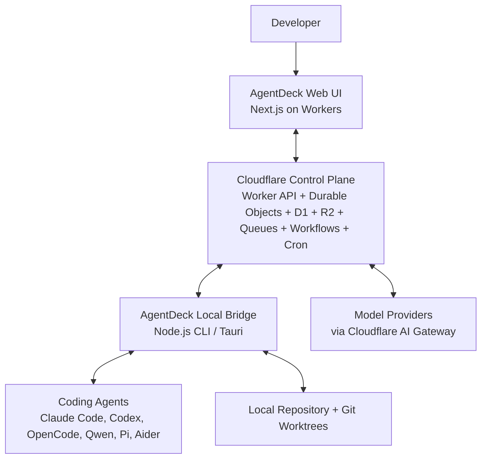
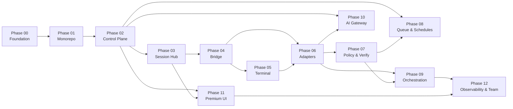

# AgentDeck — Phased Architecture & Implementation Guide

**Prepared:** 2026-06-27
**Source of intent:** `Docs/IMPLEMENTATION_GUIDE_WITH_PI.md` (4172 lines)
**Source of truth for current state:** the codebase itself + `AGENTS.md`

This document is the master index for a 13-phase buildout plan (Phase 00 through Phase 12). Each phase has its own detailed MD file in this directory. Every phase file contains HLD, LLD, design patterns, SOLID/DRY analysis, implementation steps, testing strategy, and acceptance criteria.

---

## 1. Gap Analysis — What Is Implemented vs What Is Missing

### 1.1 Implemented (production-quality contracts)

| Artifact | Location | Lines | Status |
|---|---|---|---|
| pnpm monorepo | `pnpm-workspace.yaml`, `apps/`, `packages/`, `workers/` | — | Complete — web app + shared package boundaries |
| Domain types (UI-facing) | `packages/core/src/types/agentdeck.ts` | — | Complete — agents, sessions, reports, observability, evals, team, retention |
| D1 row types + input contracts | `packages/db/src/types/agentdeck-db.ts` | — | Complete — core control-plane + observability/team row and input contracts |
| Event-sourced protocol | `packages/core/src/types/agentdeck-events.ts` | 152 | Complete — 13 event categories, browser/bridge control messages |
| State machines | `packages/core/src/state/agentdeck-state.ts` | 118 | Complete — run/approval/lease transitions |
| Policy classifier + privacy matrix | `packages/policy/src/classify-command-risk.ts` | 138 | Complete — 4 risk tiers, 3 privacy modes |
| D1 schema | `packages/db/migrations/0001_agentdeck_core.sql` | 224 | Complete — 12 tables, 16 indexes, FKs, CHECKs |
| Typed D1 repositories | `packages/db/src/repositories.ts` | 693 | Complete — 12 repos, prepared statements, R2 object_key support |
| Runtime validators | `packages/db/src/validators.ts` | 390+ | Complete — zod schemas for all D1 input contracts + event envelope validation |
| Quality gates | `package.json`, package `vitest.config.ts`, `apps/web/playwright.config.ts` | — | Complete — typecheck, eslint, vitest coverage, Playwright skeleton |
| Mission Control dashboard (legacy mock) | `apps/web/src/components/agentdeck/mission-control-dashboard.tsx` | 698 | Retained for reference — superseded by Phase 11 multi-route shell |
| Premium multi-screen UI | `apps/web/src/app/{mission-control,agents,queue,schedules,reports,policies,settings}`, `apps/web/src/components/agentdeck/` | — | Complete — App Router shell, React Flow graph, route screens, command palette, terminal dock, Zustand, TanStack Query warmup, Motion, Lucide, Cache Components |
| Design system CSS | `apps/web/src/app/globals.css` | — | Complete — custom `of-*` classes, CSS variables, React Flow/xterm imports, responsive |
| Mock data | `apps/web/src/lib/mock-agentdeck.ts` | 410 | Complete — 5 agents, active run, queue, schedules, reports |
| Cloudflare control-plane bindings | `apps/web/wrangler.jsonc`, `apps/web/cloudflare-env.d.ts` | — | Complete — D1 + R2 bindings for Phase 02 |
| Worker API / BFF routes | `apps/web/src/app/api/` | — | Complete — REST endpoints for workspaces, machines, sessions, approvals, queue, schedules, reports, policies, and artifacts |
| Durable Object session hub | `apps/web/src/do/session-hub.ts`, `apps/web/src/app/api/sessions/[id]/ws/route.ts` | — | Complete — WebSocket auth gate, DO sequencing, fanout, replay cache, D1 metadata, R2 large payload path |
| Bridge protocol facade | `packages/bridge-protocol/src/index.ts` | — | Complete — shared SessionHub roles, server messages, and replay/payload constants |
| Local AgentDeck Bridge | `apps/bridge/src/` | — | Complete — pairing, agent detection, PTY/session primitives, policy gate, redaction, reconnecting SessionHub WebSocket, JSONL replay state, worktree helpers |
| Real terminal and jump-in control | `apps/web/src/components/agentdeck/terminal-*.tsx`, `apps/bridge/src/pty/terminal-control.ts` | — | Complete — xterm.js terminal dock, resize/stdin/lease controls, authenticated audit identity, bridge terminal dispatcher, R2 terminal payload offload |
| Agent adapter harness | `packages/harness/src/`, `apps/bridge/src/agents/adapters/` | — | Complete — HarnessAdapter contract, registry, Claude/Codex/OpenCode/Qwen/Pi/Aider/ACP adapters, Pi mode strategy, normalized event mapper, structured event UI |
| Policy, verification, worktrees, artifacts | `packages/verifier/src/`, `apps/bridge/src/policy/`, `apps/bridge/src/repo/`, `apps/bridge/src/stream/r2-writer.ts`, `apps/web/src/do/session-hub.ts` | — | Complete — approval wait gate, approval D1 rows, isolated worktree helpers, verifier strategies, patch artifacts, privacy-aware artifact upload path, R2/D1 artifact metadata |
| Queue, Workflows, Schedules | `apps/web/src/workers/`, `apps/web/worker.ts`, `apps/web/wrangler.jsonc`, `apps/bridge/src/stream/run-dispatcher.ts` | — | Complete — Cloudflare Queue producer/consumer, RunWorkflow saga, Cron scheduler, SessionHub dispatch, bridge worktree dispatch, morning reports |
| Multi-agent orchestration & reports | `packages/core/src/types/orchestration.ts`, `packages/harness/src/{classifier,router,judge,synthesis,report-generator}.ts`, `apps/web/src/workers/run-workflow.ts`, dashboard report panel | — | Complete — deterministic task classification, strategy routing, multi-candidate queue dispatch, verifier-aware candidate scoring, synthesis, R2/D1 report persistence, candidate comparison UI |
| AI Gateway + provider abstraction | `packages/ai/src/`, `apps/web/src/app/api/ai/providers/route.ts`, `.dev.vars.example` | — | Complete — adapters for OpenAI, Anthropic, Google, Qwen, DeepSeek, Ollama, OpenRouter; Cloudflare AI Gateway REST/native helpers; unified AI events; model router fallback; circuit breaker; cost tracker; provider status API |
| Observability primitives | `packages/core/src/{metrics,tracing,logger}.ts`, `apps/web/src/workers/run-workflow.ts` | — | Complete — metric collector, OpenTelemetry-compatible trace/span ids, structured JSON logger, workflow metric snapshots |
| Team, audit, and retention persistence | `packages/db/migrations/0002_observability_team.sql`, `packages/db/src/{repositories,validators,audit}.ts` | — | Complete — users, workspace members, audit log, metric snapshots, eval runs, retention policies |
| Role permissions | `packages/policy/src/permissions.ts`, `apps/web/src/lib/api/permissions.ts` | — | Complete — owner/member/observer roles enforced across Worker API routes |
| Eval framework | `packages/harness/src/eval-runner.ts`, `evals/` | — | Complete — deterministic benchmark runner, seed dataset, D1 eval run storage and API |
| Observability + team UI | `apps/web/src/app/{observability,team}`, `apps/web/src/components/agentdeck/route-screens.tsx` | — | Complete — static App Router screens with TanStack Query warmup and mock fallback |
| Architecture docs | `Docs/` (6 files) | ~6000+ | Complete — Blueprint, Core Contracts, DB Schema, Impl Guide |

### 1.2 Missing (blocks the full vision)

No phase-scoped blockers remain in the Phase 00–12 plan. Future beta hardening should be tracked as new work, such as production auth/SCIM, external observability exporters, scheduled provider-backed eval campaigns, and organization billing.

### 1.3 Dependency gap (installed vs needed)

| Package | Installed | Needed by |
|---|---|---|
| `next`, `react`, `react-dom` | Yes | — |
| `@opennextjs/cloudflare`, `wrangler` | Yes | Deploy |
| `zod` | Yes | Validation (all phases) |
| `vitest`, `@vitest/coverage-v8`, `@vitest/ui` | Yes | Testing (Phase 00+) |
| `@playwright/test` | Yes | E2E skeleton (Phase 00+) |
| `@tanstack/react-query` | Yes | Server state warmup with mock fallback (Phase 11) |
| `zustand` | Yes | UI state (Phase 11) |
| `@xyflow/react` | Yes | Agent graph (Phase 11) |
| `@xterm/xterm`, `@xterm/addon-fit`, `@xterm/addon-web-links` | Yes | Terminal (Phase 05) |
| `lucide-react` | Yes | Icons (Phase 11) |
| `motion` | Yes | Animation (Phase 11) |
| `class-variance-authority`, `clsx`, `tailwind-merge` | Yes | UI utility compatibility (Phase 11) |
| `node-pty` | Yes | PTY (Phase 04) |
| `ws` | Yes | Bridge WebSocket (Phase 04) |
| `simple-git` | Yes | Worktree management (Phase 04/07) |
| `execa` | Yes | Process execution / agent probing (Phase 04) |
| `commander` | Yes | Bridge CLI (Phase 04) |

---

## 2. Target Architecture

### 2.1 System context



### 2.2 Boundary rule (non-negotiable)

```text
Workers coordinate. The bridge executes. Agents run in terminals/worktrees.
Humans approve important actions.
```

- Workers never spawn local processes.
- The bridge never makes coordination decisions (routing, scheduling, queueing).
- Agents never bypass the bridge's policy layer.
- No run pushes, merges, publishes, or deploys without explicit human approval.

### 2.3 Monorepo target structure

```text
agentdeck/
├── apps/
│   ├── web/                         # Next.js Mission Control UI
│   ├── bridge/                      # Local bridge CLI / Tauri desktop
│   └── docs/                        # Future docs site
├── packages/
│   ├── core/                        # Domain types, event types, state machines
│   ├── ai/                          # Provider adapters and router
│   ├── harness/                     # Harness adapter SDK + event normalizer
│   ├── bridge-protocol/             # WS/RPC schemas
│   ├── policy/                      # Command/provider/privacy/path policies
│   ├── redaction/                   # Secret redaction
│   ├── verifier/                    # Test/build/lint/typecheck detectors
│   ├── db/                          # D1 migrations + repositories
│   ├── ui/                          # Shared UI components + design tokens
│   └── config/                      # tsconfig/eslint/tailwind presets
├── workers/
│   ├── api/                         # Worker API/BFF
│   ├── session-hub/                 # Durable Object
│   ├── queue-consumer/              # Queue consumers
│   ├── scheduler/                   # Cron trigger worker
│   └── workflows/                   # Cloudflare Workflows
├── infra/
│   ├── migrations/
│   └── wrangler.*.toml
├── evals/
│   ├── datasets/
│   ├── harness/
│   └── reports/
└── Docs/
    ├── PHASES/                      # This guide
    └── ...
```

### 2.4 Dependency rule

```text
UI depends on core + bridge-protocol types.
Workers depend on core + db + policy + ai.
Bridge depends on core + harness + policy + redaction + verifier.
Agent adapters depend on bridge primitives, not UI.
No package may depend directly on a concrete model provider except provider adapter packages.
```

---

## 3. Phase Index

| Phase | Title | Key Deliverable | Depends On |
|---|---|---|---|
| 00 | Foundation & Quality Gates | vitest, zod, fixed lint, typecheck, unit tests | — |
| 01 | Monorepo & Shared Packages | `apps/`, `packages/`, `workers/` structure | 00 |
| 02 | Cloudflare Control Plane — D1/R2/Worker API | Bindings, migrations applied, REST BFF | 01 |
| 03 | Durable Object Session Hub | Realtime WebSocket, event sequencing, replay | 02 |
| 04 | Local AgentDeck Bridge | Pairing, agent detection, PTY, event streaming | 03 |
| 05 | Real Terminal & Jump-In Control | xterm.js, live PTY stream, terminal leases | 04 |
| 06 | Agent Adapters & Event Normalization | Claude/Codex/OpenCode/Qwen/Pi adapters | 04, 05 |
| 07 | Policy, Verification, Worktrees & Artifacts | Approval gates, verifiers, patches, R2 writes | 06 |
| 08 | Queue, Workflows & Schedules | Overnight jobs, cron, morning reports | 02, 07 |
| 09 | Multi-Agent Orchestration & Decision Reports | Router, judge, synthesis, candidate comparison | 06, 07 |
| 10 | AI Gateway & Provider Abstraction | Provider adapters, AI Gateway, cost tracking | 02, 06 |
| 11 | Premium UI System Redesign | Multi-screen App Router shell, React Flow, Radix primitives, Zustand, TanStack Query | 02, 03 |
| 12 | Observability, Evals & Team Beta | Metrics, OTel, evals, team features, roles | 09, 11 |

### 3.1 Phase dependency graph



### 3.2 Parallelization opportunities

- **Phase 10 (AI Gateway)** can run in parallel with Phases 04–07.
- **Phase 11 (Premium UI)** can start in parallel with Phases 04–07 once Phase 03 is done (UI can develop against mock events first, then swap to real).
- **Phase 08 (Queue/Schedules)** can start once Phase 02 is done, in parallel with Phases 04–07.

---

## 4. Architecture Principles

### 4.1 SOLID

| Principle | Application |
|---|---|
| **Single Responsibility** | Each package has one concern: `core` = types, `policy` = decisions, `db` = persistence, `harness` = agent loop, `verifier` = checks. No package does two things. |
| **Open/Closed** | Agent adapters are open for extension (new adapter implements `HarnessAdapter`), closed for modification (existing adapters unchanged). Provider adapters implement `LlmProviderAdapter`. Verifiers implement `Verifier`. |
| **Liskov Substitution** | Any `HarnessAdapter` can replace any other. Any `LlmProviderAdapter` can replace any other. Any `Verifier` can replace any other. The router/bridge does not depend on concrete types. |
| **Interface Segregation** | `HarnessAdapter` is split into `probe()`, `createSession()`, `start()`, `sendUserMessage()`, `sendTerminalInput()`, `approve()`, `pause()`, `resume()`, `cancel()`. Consumers depend only on the methods they call. |
| **Dependency Inversion** | UI depends on `core` types (abstraction), not on Worker/bridge (concretion). Workers depend on `db` repository interface, not on D1 directly. Bridge depends on `HarnessAdapter` interface, not on concrete agent CLIs. |

### 4.2 DRY

| Concern | Single source of truth |
|---|---|
| Domain types | `packages/core/src/types/` |
| State transitions | `packages/core/src/state-machine.ts` |
| Risk classification | `packages/policy/src/classify-command-risk.ts` |
| Privacy decisions | `packages/policy/src/privacy-storage.ts` |
| Event catalog | `packages/core/src/events/` |
| D1 schema | `packages/db/migrations/` |
| Design tokens | `packages/ui/src/tokens.css` |
| API contracts | `packages/bridge-protocol/src/` |

No risk logic, state transition, or event type is duplicated across packages.

### 4.3 Design patterns used

| Pattern | Where | Why |
|---|---|---|
| Adapter | Agent adapters, provider adapters, verifier adapters | Normalize heterogeneous external systems into one interface |
| Strategy | Routing strategy, judge strategy, synthesis strategy, retry strategy, redaction strategy | Swap algorithms without changing callers |
| State machine | Run lifecycle, approval lifecycle, terminal lease, queue item | Enforce legal transitions, reject illegal states |
| Event sourcing | Event log, terminal replay, run timeline, audit trail | Replay, reconnect, debug, report |
| Saga / Workflow | Cloudflare Workflows for queued jobs, scheduled jobs, approval waits | Durable multi-step orchestration |
| Circuit breaker | Model providers, agents, verifiers, machines | Stop cascading failures |
| Policy engine | Command approval, provider routing, privacy mode, protected paths | Centralize decisions, audit every outcome |
| Observer / pub-sub | Durable Object WebSocket fanout | Decouple event producers from consumers |
| Repository | D1 repositories | Decouple persistence from business logic |
| Factory | `createAgentDeckRepositories()`, `createAgentSession()` | Encapsulate construction |
| Command | Browser control messages, bridge RPC commands | Encapsulate requests as objects |

---

## 5. Technology Stack Decisions

| Layer | Technology | Rationale |
|---|---|---|
| Web framework | Next.js 16 App Router | Already installed, SSR on Workers via OpenNext |
| UI components | Radix primitives + custom AgentDeck components | Accessible command/dropdown surfaces while preserving the established design system |
| Styling | Custom `of-*` classes + CSS variables + Tailwind v4 theme bridge | AGENTS.md requires the dashboard to keep `of-*` classes; Tailwind utilities are not the primary styling surface |
| Server state | TanStack Query v5 | Client-side first-party API warmup with mock fallback; future real data screens can reuse the hooks |
| Client state | Zustand | Minimal, no provider boilerplate, good for UI-only state |
| Agent graph | React Flow (@xyflow/react) | Interactive DAG, custom nodes, animated edges |
| Terminal | xterm.js (@xterm/xterm) | Industry standard terminal emulator, ANSI support |
| Animation | Motion (motion.dev) | Spring physics, layout animations, reduced-motion support |
| Icons | Lucide React | Consistent, tree-shakeable icon set for the command-center UI |
| Validation | Zod | Runtime schema validation, type inference |
| Testing | Vitest + Playwright | Fast unit/integration (Vitest), E2E (Playwright) |
| Monorepo | pnpm workspaces | Fast, disk-efficient, mature workspace protocol |
| Cloud platform | Cloudflare Workers + D1 + R2 + Queues + Workflows + Cron + DO + AI Gateway | Edge, serverless, durable, integrated |
| Bridge runtime | Node.js (npm CLI first, Tauri later) | PTY support, npm distribution, TypeScript native |
| PTY | node-pty | Cross-platform pseudo-terminal |
| Git operations | simple-git | Worktree management, diff generation |

---

## 6. Architecture Decision Records (summary)

| ADR | Decision | Rationale |
|---|---|---|
| ADR-001 | Local bridge is required | Cloudflare cannot discover or run tools on a user's machine |
| ADR-002 | Durable Object per live session | Session-local state, WebSocket fanout, ordered event streaming |
| ADR-003 | D1 for metadata, R2 for logs/artifacts | Terminal logs are large append-heavy objects, not relational rows |
| ADR-004 | Event-sourced run model | Enables replay, debugging, reports, audit, reconnect, team observers |
| ADR-005 | No auto-merge by default | Mission Control means human-controlled automation, not blind autonomy |
| ADR-006 | Support MCP/ACP but do not depend on them exclusively | Standards are valuable, but existing CLIs and PTY workflows still matter |
| ADR-007 | Monorepo with pnpm workspaces | Package isolation, shared contracts, independent deployment |
| ADR-008 | Preserve `of-*` dashboard styling while adopting Radix primitives | AGENTS.md makes `of-*` the active UI contract; Radix supplies accessible surfaces without a Tailwind utility migration |
| ADR-009 | Pi as first-class adapter, not the platform | Pi is embeddable; AgentDeck remains the control plane |
| ADR-010 | Vitest for unit/integration, Playwright for E2E | Fast, Vite-native, good Cloudflare Workers compatibility |

---

## 7. How to Read These Documents

Each phase file follows this structure:

1. **Objective** — what this phase delivers and why
2. **Prerequisites** — which phases must be complete
3. **Current state** — what exists today
4. **Target state** — what this phase produces
5. **High-Level Design (HLD)** — architecture diagrams, component boundaries
6. **Low-Level Design (LLD)** — file structure, interfaces, types, code examples
7. **Design patterns** — which patterns are applied and why
8. **SOLID / DRY compliance** — how the design follows these principles
9. **Implementation steps** — ordered, actionable tasks with file paths
10. **Data model / schema changes** — D1/R2/types
11. **API / event contracts** — endpoints, events, messages
12. **Testing strategy** — unit, integration, E2E
13. **Acceptance criteria** — definition of done
14. **Risks & mitigations**

Start with Phase 00. Do not skip phases unless the dependency graph explicitly allows parallelization.
