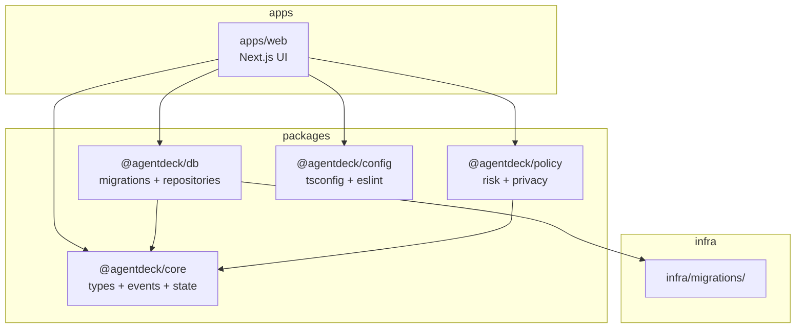

# Phase 01 — Monorepo & Shared Packages

**Objective:** Restructure the flat Next.js app into a pnpm monorepo with isolated packages. Extract the existing contracts (types, state machines, policy, db) into shareable packages so that `apps/web`, `apps/bridge`, and `workers/*` can all depend on them without duplicating code.

**Status:** Implemented in the current repository. The app now lives in `apps/web`, shared contracts live under `packages/*`, and root scripts delegate through pnpm workspaces.

**Prerequisites:** Phase 00 (quality gates must work before restructuring).

---

## Current State Before Phase 01

The repo is a flat Next.js app:

```text
src/
  app/                    # Next.js App Router
  components/agentdeck/  # UI
  lib/                    # state, policy, db, mock
  types/                  # domain types, db types, event types
infra/migrations/         # D1 schema
```

No `apps/`, `packages/`, or `workers/` directories exist. All contracts live inline under `src/types/` and `src/lib/`. The `@/*` path alias maps to `./src/*`.

---

## Target State

```text
agentdeck/
├── apps/
│   └── web/                         # Next.js Mission Control UI (moved from root)
├── packages/
│   ├── core/                        # Domain types, events, state machines
│   ├── db/                          # D1 migrations + repositories
│   ├── policy/                      # Command risk + privacy decisions
│   ├── bridge-protocol/             # WS/RPC schemas (Phase 03+)
│   ├── config/                      # Shared tsconfig, eslint, tailwind presets
│   └── ui/                          # Design tokens + shared UI primitives (Phase 11)
├── workers/                         # (Phase 02+)
├── infra/
│   └── migrations/
├── Docs/
└── pnpm-workspace.yaml
```

Each package is independently buildable, testable, and versionable. The `@/*` alias is replaced by package imports (`@agentdeck/core`, `@agentdeck/db`, etc.).

---

## High-Level Design



### Dependency rule (enforced)

```text
@agentdeck/core      depends on nothing (pure types + pure functions)
@agentdeck/policy    depends on @agentdeck/core
@agentdeck/db        depends on @agentdeck/core
@agentdeck/config    depends on nothing (build tooling)
apps/web              depends on @agentdeck/core, @agentdeck/db, @agentdeck/policy, @agentdeck/config
```

No circular dependencies. No package depends on `apps/web`. `@agentdeck/core` is the leaf — it must not import from any other package.

---

## Low-Level Design

### 1. pnpm workspace setup

**`pnpm-workspace.yaml`:**

```yaml
packages:
  - "apps/*"
  - "packages/*"
  - "workers/*"
```

**Root `package.json`:**

```jsonc
{
  "name": "agentdeck",
  "private": true,
  "scripts": {
    "dev": "pnpm --filter @agentdeck/web dev",
    "build": "pnpm --filter @agentdeck/web build",
    "typecheck": "pnpm -r typecheck",
    "lint": "pnpm -r lint",
    "test": "pnpm -r test",
    "build:packages": "pnpm -r --filter \"./packages/*\" build"
  },
  "devDependencies": {
    "typescript": "^5.7.4"
  }
}
```

### 2. `@agentdeck/config` — shared build presets

**`packages/config/package.json`:**

```jsonc
{
  "name": "@agentdeck/config",
  "private": true,
  "files": ["tsconfig", "eslint"]
}
```

**`packages/config/tsconfig/base.json`:**

```jsonc
{
  "compilerOptions": {
    "target": "ES2022",
    "lib": ["ES2022"],
    "module": "ESNext",
    "moduleResolution": "bundler",
    "strict": true,
    "esModuleInterop": true,
    "skipLibCheck": true,
    "forceConsistentCasingInFileNames": true,
    "declaration": true,
    "declarationMap": true,
    "sourceMap": true
  }
}
```

**`packages/config/tsconfig/react.json`:** extends base, adds `jsx: "react-jsx"`, `lib: ["ES2022", "DOM", "DOM.Iterable"]`.

### 3. `@agentdeck/core` — domain types, events, state machines

**`packages/core/package.json`:**

```jsonc
{
  "name": "@agentdeck/core",
  "version": "0.1.0",
  "private": true,
  "type": "module",
  "main": "./src/index.ts",
  "types": "./src/index.ts",
  "scripts": {
    "typecheck": "tsc --noEmit",
    "lint": "eslint .",
    "test": "vitest run",
    "build": "tsc"
  }
}
```

**`packages/core/src/index.ts`:**

```ts
export * from "./types/agentdeck";
export * from "./types/agentdeck-events";
export * from "./state/agentdeck-state";
```

**File mapping (move from flat repo):**

```text
src/types/agentdeck.ts          -> packages/core/src/types/agentdeck.ts
src/types/agentdeck-events.ts   -> packages/core/src/types/agentdeck-events.ts
src/lib/agentdeck-state.ts      -> packages/core/src/state/agentdeck-state.ts
src/lib/agentdeck-state.test.ts -> packages/core/src/state/agentdeck-state.test.ts
src/types/agentdeck-events.test.ts -> packages/core/src/types/agentdeck-events.test.ts
```

### 4. `@agentdeck/policy` — command risk + privacy

**`packages/policy/package.json`:**

```jsonc
{
  "name": "@agentdeck/policy",
  "version": "0.1.0",
  "private": true,
  "type": "module",
  "main": "./src/index.ts",
  "types": "./src/index.ts",
  "scripts": {
    "typecheck": "tsc --noEmit",
    "lint": "eslint .",
    "test": "vitest run"
  },
  "dependencies": {
    "@agentdeck/core": "workspace:*"
  }
}
```

**File mapping:**

```text
src/lib/agentdeck-policy.ts          -> packages/policy/src/classify-command-risk.ts
src/lib/agentdeck-policy.test.ts     -> packages/policy/src/classify-command-risk.test.ts
```

**`packages/policy/src/index.ts`:**

```ts
export { classifyCommandRisk, getPrivacyStorageDecision, requiresHumanApproval } from "./classify-command-risk";
export type { PolicyDecision, PrivacyStorageDecision } from "./classify-command-risk";
```

### 5. `@agentdeck/db` — D1 migrations + repositories

**`packages/db/package.json`:**

```jsonc
{
  "name": "@agentdeck/db",
  "version": "0.1.0",
  "private": true,
  "type": "module",
  "main": "./src/index.ts",
  "types": "./src/index.ts",
  "scripts": {
    "typecheck": "tsc --noEmit",
    "lint": "eslint .",
    "test": "vitest run"
  },
  "dependencies": {
    "@agentdeck/core": "workspace:*",
    "zod": "^3.x"
  }
}
```

**File mapping:**

```text
src/types/agentdeck-db.ts        -> packages/db/src/types/agentdeck-db.ts
src/lib/agentdeck-db.ts          -> packages/db/src/repositories.ts
src/lib/agentdeck-db.test.ts     -> packages/db/src/repositories.test.ts
src/lib/validators.ts             -> packages/db/src/validators.ts
infra/migrations/0001_agentdeck_core.sql -> packages/db/migrations/0001_agentdeck_core.sql
```

**`packages/db/src/index.ts`:**

```ts
export { createAgentDeckRepositories } from "./repositories";
export type { AgentDeckRepositories } from "./repositories";
export * from "./types/agentdeck-db";
export * from "./validators";
```

### 6. `apps/web` — Next.js app

**`apps/web/package.json`:**

```jsonc
{
  "name": "@agentdeck/web",
  "version": "0.1.0",
  "private": true,
  "scripts": {
    "dev": "next dev",
    "build": "next build",
    "start": "next start",
    "typecheck": "tsc --noEmit",
    "lint": "eslint .",
    "deploy": "opennextjs-cloudflare build && opennextjs-cloudflare deploy",
    "cf-typegen": "wrangler types --env-interface CloudflareEnv ./cloudflare-env.d.ts"
  },
  "dependencies": {
    "@agentdeck/core": "workspace:*",
    "@agentdeck/db": "workspace:*",
    "@agentdeck/policy": "workspace:*",
    "@opennextjs/cloudflare": "^1.19.9",
    "next": "16.2.6",
    "react": "^19.1.7",
    "react-dom": "^19.1.7"
  }
}
```

**File mapping (move entire Next.js app):**

```text
src/app/                    -> apps/web/src/app/
src/components/agentdeck/  -> apps/web/src/components/agentdeck/
src/lib/mock-agentdeck.ts  -> apps/web/src/lib/mock-agentdeck.ts
next.config.ts              -> apps/web/next.config.ts
open-next.config.ts         -> apps/web/open-next.config.ts
wrangler.jsonc              -> apps/web/wrangler.jsonc
cloudflare-env.d.ts         -> apps/web/cloudflare-env.d.ts
postcss.config.mjs          -> apps/web/postcss.config.mjs
tsconfig.json               -> apps/web/tsconfig.json (updated to extend @agentdeck/config)
eslint.config.mjs           -> apps/web/eslint.config.mjs
```

**`apps/web/tsconfig.json`:**

```jsonc
{
  "extends": "@agentdeck/config/tsconfig/react.json",
  "compilerOptions": {
    "paths": {
      "@/*": ["./src/*"]
    }
  },
  "include": ["src", "next-env.d.ts", "cloudflare-env.d.ts"]
}
```

### 7. Update imports across the codebase

After moving files, update all imports:

```text
# Before (flat repo)
import { classifyCommandRisk } from "@/lib/agentdeck-policy";
import { transitionRunStatus } from "@/lib/agentdeck-state";
import type { ActiveRun } from "@/types/agentdeck";
import { createAgentDeckRepositories } from "@/lib/agentdeck-db";

# After (monorepo)
import { classifyCommandRisk } from "@agentdeck/policy";
import { transitionRunStatus } from "@agentdeck/core";
import type { ActiveRun } from "@agentdeck/core";
import { createAgentDeckRepositories } from "@agentdeck/db";
```

The `@/*` alias remains for app-local imports (`@/lib/mock-agentdeck`, `@/components/agentdeck/*`).

### 8. Keep `infra/migrations/` at root for wrangler

The `migrations_dir` in `wrangler.jsonc` should point to the package:

```jsonc
{
  "d1_databases": [{
    "binding": "AGENTDECK_DB",
    "database_name": "agentdeck-control",
    "database_id": "<id>",
    "migrations_dir": "../../packages/db/migrations"
  }]
}
```

Or keep a symlink at `infra/migrations` -> `packages/db/migrations` for CLI compatibility.

---

## Design Patterns

| Pattern | Application |
|---|---|
| **Package by feature** | Each package groups related code by domain concern (core, policy, db), not by technical layer. |
| **Facade** | Each package exports a single `index.ts` barrel that hides internal file structure. Consumers import from `@agentdeck/core`, not `@agentdeck/core/src/state/agentdeck-state`. |
| **Dependency inversion** | Packages depend on abstractions (interfaces in `core`), not on concrete implementations. `db` depends on `core` types, not on `core` implementation. |

## SOLID / DRY Compliance

- **SRP:** Each package has exactly one responsibility. `core` = contracts. `policy` = decisions. `db` = persistence. No package mixes concerns.
- **OCP:** New packages can be added without modifying existing ones. New adapters (Phase 06) will add `@agentdeck/harness` without touching `core` or `db`.
- **DIP:** `apps/web` depends on `@agentdeck/core` (abstraction), not on `@agentdeck/db` implementation details. The db package's internal SQL is hidden behind the repository interface.
- **DRY:** Domain types exist once in `@agentdeck/core`. State machines exist once in `@agentdeck/core`. Risk classification exists once in `@agentdeck/policy`. No duplication across apps/workers.

---

## Implementation Steps

1. `npm install -g pnpm` (if not already installed)
2. Create `pnpm-workspace.yaml` at root
3. Create root `package.json` with workspace scripts
4. Create `packages/config/` with tsconfig presets
5. Create `packages/core/` — move types + state machine + tests
6. Create `packages/policy/` — move policy classifier + tests
7. Create `packages/db/` — move db types + repositories + validators + migration + tests
8. Create `apps/web/` — move Next.js app, config files, mock data, components
9. Update all imports from `@/lib/*` and `@/types/*` to `@agentdeck/*` package imports
10. Update `apps/web/tsconfig.json` to extend `@agentdeck/config`
11. Update `apps/web/wrangler.jsonc` paths (migrations_dir, assets directory)
12. Run `pnpm install` to link workspace packages
13. Run `pnpm typecheck && pnpm lint && pnpm test && pnpm build` — all must pass
14. Update `AGENTS.md` to reflect monorepo structure
15. Update `Docs/DATABASE_SCHEMA.md` migration paths
16. Commit with `refactor: restructure into pnpm monorepo with shared packages`

---

## Testing Strategy

| Level | What | Command |
|---|---|---|
| Unit | All existing tests pass in new package locations | `pnpm -r test` |
| Typecheck | All packages typecheck independently | `pnpm -r typecheck` |
| Lint | All packages lint independently | `pnpm -r lint` |
| Build | Next.js app builds with workspace dependencies | `pnpm build` |
| Import | No import crosses package boundaries incorrectly | `pnpm typecheck` catches this |

---

## Acceptance Criteria

```text
[x] pnpm-workspace.yaml exists at root
[x] packages/core, packages/policy, packages/db, packages/config exist
[x] apps/web exists with the full Next.js app
[x] pnpm install links all workspace packages
[x] pnpm -r typecheck passes (all packages)
[x] pnpm -r lint passes (all packages)
[x] pnpm -r test passes (all packages, same coverage as Phase 00)
[x] pnpm build passes (Next.js app builds)
[x] No import in apps/web references @/lib/agentdeck-state or @/lib/agentdeck-policy
[x] All imports use @agentdeck/core, @agentdeck/policy, @agentdeck/db
[x] @agentdeck/core has zero dependencies on other @agentdeck/* packages
[x] AGENTS.md updated with monorepo structure
```

---

## Risks & Mitigations

| Risk | Mitigation |
|---|---|
| Breaking all imports during migration | Do the move in one commit; use codemod (jscodeshift) or sed to update imports; run typecheck after each package move |
| `wrangler.jsonc` paths break after move | Test `pnpm cf-typegen` and `pnpm build` after moving wrangler.jsonc to `apps/web/` |
| pnpm hoisting differences from npm | Pin exact versions; use `pnpm.overrides` if needed; test build |
| OpenNext config expects root-level files | Keep `open-next.config.ts` in `apps/web/`; update deploy script to run from `apps/web/` |
| D1 migrations_dir path changes | Use relative path from `apps/web/wrangler.jsonc` to `packages/db/migrations/` |
