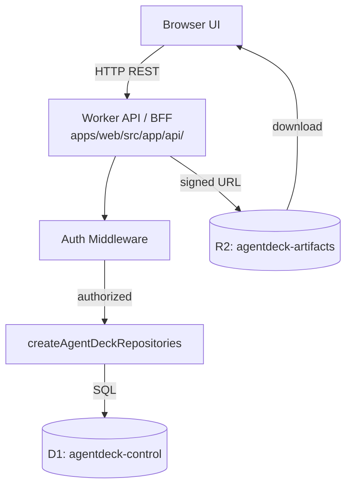

# Phase 02 — Cloudflare Control Plane: D1, R2 & Worker API

**Objective:** Wire real Cloudflare D1 and R2 bindings, apply migrations, and build the Worker API/BFF with REST endpoints for sessions, approvals, agents, queue, schedules, reports, and policies. This phase makes the typed D1 repositories actually talk to a real database.

**Prerequisites:** Phase 01 (monorepo with `@agentdeck/db` package).

---

## Current State

- D1 schema exists (`packages/db/migrations/0001_agentdeck_core.sql`) — 12 tables, 17 indexes.
- Typed D1 repositories exist (`@agentdeck/db`) — repository facades for workspaces, machines, agent installations, sessions, runs, events, approvals, queue items, schedules, artifacts, reports, and policies.
- D1 database `agentdeck-control` exists and is bound as `AGENTDECK_DB` (`d5243135-2e7c-48d7-8e45-82470791e1eb`).
- R2 bucket `agentdeck-artifacts` exists and is bound as `AGENTDECK_ARTIFACTS`.
- Next.js Worker API/BFF routes exist in `apps/web/src/app/api/`.
- Cookie-based signed session auth and signed bridge pairing codes exist.

---

## Target State

```text
- D1 database "agentdeck-control" created and bound as AGENTDECK_DB
- R2 bucket "agentdeck-artifacts" created and bound as AGENTDECK_ARTIFACTS
- Migrations applied (local + remote)
- Worker API/BFF with REST endpoints for all CRUD operations
- Auth middleware (cookie-based session)
- R2 signed download URLs for artifacts
- Integration tests against real D1 (local miniflare)
```

---

## High-Level Design



### Architecture decisions

1. **API routes live in the Next.js app** (`apps/web/src/app/api/`) — they deploy as Worker code via OpenNext. No separate Worker process needed for the BFF.
2. **Durable Object session hub** (Phase 03) handles WebSocket/realtime. This phase handles REST only.
3. **Auth is cookie-based** with a pairing code flow. No OAuth in this phase — that comes with team features (Phase 12).
4. **R2 access is always through signed URLs** — the API never proxies file content.

---

## Low-Level Design

### 1. Cloudflare resource creation

```bash
# Create D1 database
wrangler d1 create agentdeck-control
# Note the database_id from output

# Create R2 bucket
wrangler r2 bucket create agentdeck-artifacts

# Apply migrations locally
wrangler d1 migrations apply agentdeck-control --local

# Apply migrations to remote
wrangler d1 migrations apply agentdeck-control --remote
```

### 2. Update `wrangler.jsonc` with bindings

```jsonc
{
  "d1_databases": [
    {
      "binding": "AGENTDECK_DB",
      "database_name": "agentdeck-control",
      "database_id": "<cloudflare-d1-database-id>",
      "migrations_dir": "../../packages/db/migrations"
    }
  ],
  "r2_buckets": [
    {
      "binding": "AGENTDECK_ARTIFACTS",
      "bucket_name": "agentdeck-artifacts"
    }
  ]
}
```

After updating, regenerate types:

```bash
cd apps/web && npm run cf-typegen
```

This adds `AGENTDECK_DB: D1Database` and `AGENTDECK_ARTIFACTS: R2Bucket` to `CloudflareEnv`.

### 3. Cloudflare context helper

**`apps/web/src/lib/cloudflare-context.ts`:**

```ts
import { getCloudflareContext } from "@opennextjs/cloudflare";
import { createAgentDeckRepositories, type AgentDeckRepositories } from "@agentdeck/db";

export type ApiEnv = {
  AGENTDECK_DB: D1Database;
  AGENTDECK_ARTIFACTS: R2Bucket;
};

export async function getRepositories(): Promise<AgentDeckRepositories> {
  const { env } = await getCloudflareContext();
  return createAgentDeckRepositories(env.AGENTDECK_DB);
}

export async function getR2(): Promise<R2Bucket> {
  const { env } = await getCloudflareContext();
  return env.AGENTDECK_ARTIFACTS;
}
```

### 4. Auth middleware

**`apps/web/src/lib/auth.ts`:**

```ts
import { cookies } from "next/headers";
import { createHmac, randomBytes } from "crypto";

const SESSION_COOKIE = "of_session";
const SESSION_SECRET = process.env.AGENTDECK_SESSION_SECRET ?? "dev-secret-change-me";

export type SessionUser = {
  workspaceId: string;
  userId: string;
  role: "owner" | "member" | "observer";
};

export async function getSession(): Promise<SessionUser | null> {
  const store = await cookies();
  const cookie = store.get(SESSION_COOKIE);
  if (!cookie) return null;
  try {
    const payload = JSON.parse(atob(cookie.value));
    if (payload.expiresAt && Date.now() > payload.expiresAt) return null;
    return payload as SessionUser;
  } catch {
    return null;
  }
}

export async function requireSession(): Promise<SessionUser> {
  const session = await getSession();
  if (!session) {
    throw new Response("Unauthorized", { status: 401 });
  }
  return session;
}

export async function createSession(user: SessionUser): Promise<void> {
  const store = await cookies();
  const expiresAt = Date.now() + 1000 * 60 * 60 * 24 * 7; // 7 days
  store.set(SESSION_COOKIE, btoa(JSON.stringify({ ...user, expiresAt })), {
    httpOnly: true,
    secure: true,
    sameSite: "strict",
    path: "/",
    maxAge: 60 * 60 * 24 * 7,
  });
}

export function generatePairingCode(): string {
  return randomBytes(6).toString("hex").toUpperCase().slice(0, 12);
}
```

### 5. API route structure

```text
apps/web/src/app/api/
  workspaces/
    route.ts                    POST   /api/workspaces
    [id]/route.ts               GET    /api/workspaces/:id
  machines/
    pairing-code/route.ts       POST   /api/machines/pairing-code
    complete-pairing/route.ts   POST   /api/machines/complete-pairing
    route.ts                    GET    /api/machines
    [id]/
      revoke/route.ts           POST   /api/machines/:id/revoke
      probe-agents/route.ts     POST   /api/machines/:id/probe-agents
  sessions/
    route.ts                    POST   /api/sessions, GET /api/sessions
    [id]/
      route.ts                  GET    /api/sessions/:id
      start/route.ts            POST   /api/sessions/:id/start
      pause/route.ts            POST   /api/sessions/:id/pause
      resume/route.ts           POST   /api/sessions/:id/resume
      cancel/route.ts           POST   /api/sessions/:id/cancel
      events/route.ts           GET    /api/sessions/:id/events?afterSeq=123
      artifacts/route.ts        GET    /api/sessions/:id/artifacts
  artifacts/
    [id]/
      download/route.ts         GET    /api/artifacts/:id/download
  approvals/
    route.ts                    GET    /api/approvals
    [id]/
      approve/route.ts          POST   /api/approvals/:id/approve
      reject/route.ts           POST   /api/approvals/:id/reject
  queue/
    route.ts                    GET    /api/queue, POST /api/queue
    [id]/
      route.ts                  PATCH  /api/queue/:id
      cancel/route.ts           POST   /api/queue/:id/cancel
  schedules/
    route.ts                    GET    /api/schedules, POST /api/schedules
    [id]/
      route.ts                  PATCH  /api/schedules/:id
      run-now/route.ts          POST   /api/schedules/:id/run-now
  reports/
    route.ts                    GET    /api/reports
    [id]/route.ts               GET    /api/reports/:id
  policies/
    route.ts                    GET    /api/policies
    [id]/route.ts               PATCH  /api/policies/:id
```

### 6. Example route handler — `POST /api/sessions`

**`apps/web/src/app/api/sessions/route.ts`:**

```ts
import { NextRequest, NextResponse } from "next/server";
import { getRepositories } from "@/lib/cloudflare-context";
import { requireSession } from "@/lib/auth";
import { createSessionInputSchema } from "@agentdeck/db";
import { transitionRunStatus } from "@agentdeck/core";

export async function POST(request: NextRequest) {
  const user = await requireSession();
  const body = await request.json();

  const input = createSessionInputSchema.parse({
    ...body,
    id: crypto.randomUUID(),
    workspaceId: user.workspaceId,
    createdBy: user.userId,
  });

  const repos = await getRepositories();
  await repos.sessions.create(input);

  // Emit session.created event
  await repos.events.append({
    id: crypto.randomUUID(),
    workspaceId: input.workspaceId,
    sessionId: input.id,
    seq: 1,
    type: "session.created",
    source: "worker",
    visibility: input.privacyMode === "local-only" ? "local-only" : "metadata",
    payload: { title: input.title, createdBy: input.createdBy },
  });

  return NextResponse.json({ id: input.id }, { status: 201 });
}

export async function GET() {
  const user = await requireSession();
  const repos = await getRepositories();
  const sessions = await repos.sessions.listByWorkspace(user.workspaceId, { limit: 50 });
  return NextResponse.json({ sessions });
}
```

### 7. Example route handler — `POST /api/approvals/:id/approve`

**`apps/web/src/app/api/approvals/[id]/approve/route.ts`:**

```ts
import { NextRequest, NextResponse } from "next/server";
import { getRepositories } from "@/lib/cloudflare-context";
import { requireSession } from "@/lib/auth";
import { transitionApprovalStatus } from "@agentdeck/core";

export async function POST(
  request: NextRequest,
  { params }: { params: Promise<{ id: string }> }
) {
  const user = await requireSession();
  const { id } = await params;
  const body = await request.json().catch(() => ({}));

  const repos = await getRepositories();
  const approval = await repos.approvals.findById(id);
  if (!approval) {
    return NextResponse.json({ error: "Not found" }, { status: 404 });
  }

  const result = transitionApprovalStatus(approval.status, "approved");
  if (!result.ok) {
    return NextResponse.json({ error: result.reason }, { status: 409 });
  }

  await repos.approvals.decide(id, {
    status: "approved",
    decidedBy: user.userId,
    decision: body.notes ?? null,
  });

  // Emit approval.approved event
  await repos.events.append({
    id: crypto.randomUUID(),
    workspaceId: approval.workspaceId,
    sessionId: approval.sessionId,
    runId: approval.runId,
    seq: 0, // Phase 03: DO assigns real seq
    type: "approval.approved",
    source: "worker",
    visibility: "metadata",
    payload: { approvalId: id, decidedBy: user.userId },
  });

  return NextResponse.json({ id, status: "approved" });
}
```

### 8. R2 artifact download

**`apps/web/src/app/api/artifacts/[id]/download/route.ts`:**

```ts
import { NextRequest, NextResponse } from "next/server";
import { getRepositories, getR2 } from "@/lib/cloudflare-context";
import { requireSession } from "@/lib/auth";

export async function GET(
  _request: NextRequest,
  { params }: { params: Promise<{ id: string }> }
) {
  const user = await requireSession();
  const { id } = await params;

  const repos = await getRepositories();
  const artifact = await repos.artifacts.findById(id);
  if (!artifact || artifact.workspaceId !== user.workspaceId) {
    return NextResponse.json({ error: "Not found" }, { status: 404 });
  }

  const r2 = await getR2();
  const object = await r2.get(artifact.objectKey);
  if (!object) {
    return NextResponse.json({ error: "Object missing" }, { status: 404 });
  }

  const headers = new Headers();
  headers.set("Content-Type", artifact.mimeType);
  headers.set("Content-Length", String(artifact.sizeBytes));

  return new NextResponse(object.body, { headers });
}
```

### 9. Event replay endpoint

**`apps/web/src/app/api/sessions/[id]/events/route.ts`:**

```ts
import { NextRequest, NextResponse } from "next/server";
import { getRepositories } from "@/lib/cloudflare-context";
import { requireSession } from "@/lib/auth";

export async function GET(
  request: NextRequest,
  { params }: { params: Promise<{ id: string }> }
) {
  const user = await requireSession();
  const { id } = await params;
  const afterSeq = Number(request.nextUrl.searchParams.get("afterSeq") ?? "0");

  const repos = await getRepositories();
  const events = await repos.events.listBySession(id, { afterSeq, limit: 200 });

  return NextResponse.json({ events });
}
```

### 10. Seed data script

**`packages/db/src/seed.ts`:**

```ts
import { createAgentDeckRepositories } from "./repositories";

export async function seedWorkspace(db: D1Database) {
  const repos = createAgentDeckRepositories(db);
  await repos.workspaces.create({
    id: "ws_01",
    name: "Default Workspace",
    privacyMode: "metadata-only",
  });
  // Add a default machine, policy rules, etc.
}
```

Run locally: `wrangler d1 execute agentdeck-control --local --command="$(node seed.js)"`

---

## Design Patterns

| Pattern | Application |
|---|---|
| **Repository** | `createAgentDeckRepositories()` is the single database boundary. Route handlers never write raw SQL. |
| **Facade** | `getRepositories()` and `getR2()` hide the Cloudflare context retrieval. Route handlers call one function. |
| **Middleware / Chain of Responsibility** | `requireSession()` runs before every protected handler. Returns 401 or passes through. |
| **DTO** | Route handlers accept HTTP JSON, validate with zod, map to repository input contracts. The wire shape never leaks into the repository layer. |

## SOLID / DRY Compliance

- **SRP:** Each route handler does one thing: parse request, validate, call repository, format response. No business logic in routes.
- **OCP:** New endpoints are added as new route files. Existing routes are not modified to add new resources.
- **DIP:** Route handlers depend on `AgentDeckRepositories` interface, not on `D1Database` directly. The Cloudflare context is injected.
- **DRY:** `getRepositories()`, `getR2()`, `requireSession()` are written once and reused by every route. No `getCloudflareContext()` call in route handlers.

---

## API Contracts

### REST endpoint summary

| Method | Path | Description |
|---|---|---|
| POST | `/api/workspaces` | Create workspace |
| GET | `/api/workspaces/:id` | Get workspace |
| POST | `/api/machines/pairing-code` | Generate pairing code |
| POST | `/api/machines/complete-pairing` | Complete bridge pairing |
| GET | `/api/machines` | List machines |
| POST | `/api/machines/:id/revoke` | Revoke machine |
| POST | `/api/machines/:id/probe-agents` | Trigger agent probe |
| POST | `/api/sessions` | Create session |
| GET | `/api/sessions` | List sessions |
| GET | `/api/sessions/:id` | Get session |
| POST | `/api/sessions/:id/start` | Start session run |
| POST | `/api/sessions/:id/pause` | Pause session |
| POST | `/api/sessions/:id/resume` | Resume session |
| POST | `/api/sessions/:id/cancel` | Cancel session |
| GET | `/api/sessions/:id/events?afterSeq=N` | Replay events |
| GET | `/api/sessions/:id/artifacts` | List artifacts |
| GET | `/api/artifacts/:id/download` | Download artifact from R2 |
| GET | `/api/approvals` | List approvals |
| POST | `/api/approvals/:id/approve` | Approve request |
| POST | `/api/approvals/:id/reject` | Reject request |
| GET | `/api/queue` | List queue items |
| POST | `/api/queue` | Create queue item |
| PATCH | `/api/queue/:id` | Update queue item |
| POST | `/api/queue/:id/cancel` | Cancel queue item |
| GET | `/api/schedules` | List scheduled jobs |
| POST | `/api/schedules` | Create scheduled job |
| PATCH | `/api/schedules/:id` | Update scheduled job |
| POST | `/api/schedules/:id/run-now` | Trigger schedule now |
| GET | `/api/reports` | List decision reports |
| GET | `/api/reports/:id` | Get report detail |
| GET | `/api/policies` | List policy rules |
| PATCH | `/api/policies/:id` | Update policy rule |

### Error response format

```json
{
  "error": "Human-readable error message",
  "code": "VALIDATION_ERROR | NOT_FOUND | UNAUTHORIZED | CONFLICT | FORBIDDEN"
}
```

---

## Data Model / Schema Changes

No schema changes in this phase. The existing 12-table schema in `0001_agentdeck_core.sql` is sufficient. R2 object keys follow the layout documented in `Docs/DATABASE_SCHEMA.md`:

```text
workspaces/{workspaceId}/sessions/{sessionId}/events/{runId}.jsonl.zst
workspaces/{workspaceId}/sessions/{sessionId}/terminal/{runId}.ansi.zst
workspaces/{workspaceId}/sessions/{sessionId}/artifacts/{artifactId}/patch.diff
workspaces/{workspaceId}/reports/{reportId}.json
```

---

## Testing Strategy

| Level | What | Tool |
|---|---|---|
| Integration | Repository CRUD against real D1 (miniflare local) | vitest + miniflare |
| Integration | API route handlers with D1 + R2 bindings | vitest + miniflare |
| Unit | Auth middleware (session create/verify/expire) | vitest |
| Unit | zod validation (valid + invalid inputs for each endpoint) | vitest |
| E2E | Full request -> response cycle for each endpoint | vitest + fetch |

**`apps/web/src/app/api/sessions/route.test.ts`:**

```ts
import { describe, it, expect, beforeAll } from "vitest";
import { GET, POST } from "./route";
import { createD1Stub } from "@agentdeck/db";

describe("POST /api/sessions", () => {
  it("creates a session and returns 201", async () => {
    const request = new Request("http://localhost/api/sessions", {
      method: "POST",
      body: JSON.stringify({ title: "Test session", privacyMode: "metadata-only" }),
    });
    const response = await POST(request);
    expect(response.status).toBe(201);
    const body = await response.json();
    expect(body.id).toBeDefined();
  });
});
```

---

## Implementation Steps

1. Create D1 database: `wrangler d1 create agentdeck-control`
2. Create R2 bucket: `wrangler r2 bucket create agentdeck-artifacts`
3. Update `apps/web/wrangler.jsonc` with D1 + R2 bindings
4. Run `npm run cf-typegen` to regenerate `CloudflareEnv` types
5. Apply migrations: `wrangler d1 migrations apply agentdeck-control --local`
6. Create `apps/web/src/lib/cloudflare-context.ts`
7. Create `apps/web/src/lib/auth.ts`
8. Create all API route files (sessions, approvals, queue, schedules, reports, policies, machines, workspaces, artifacts)
9. Create seed data script
10. Write integration tests against miniflare D1
11. Run `pnpm typecheck && pnpm lint && pnpm test && pnpm build`
12. Test endpoints manually with `curl` in dev mode
13. Update `Docs/DATABASE_SCHEMA.md` with real database_id

---

## Acceptance Criteria

```text
[x] D1 database "agentdeck-control" created and bound as AGENTDECK_DB
[x] R2 bucket "agentdeck-artifacts" created and bound as AGENTDECK_ARTIFACTS
[x] Migrations applied locally (wrangler d1 migrations apply --local)
[x] Migrations applied remotely (wrangler d1 migrations apply --remote)
[x] cloudflare-env.d.ts includes AGENTDECK_DB and AGENTDECK_ARTIFACTS
[x] All 30+ REST endpoints are implemented
[x] Auth middleware blocks unauthenticated requests with 401
[x] zod validation rejects malformed input with 400
[x] R2 artifact download returns correct content-type
[x] Event replay endpoint returns events after given seq
[x] Integration tests pass against miniflare D1
[x] pnpm build passes
```

---

## Risks & Mitigations

| Risk | Mitigation |
|---|---|
| D1 prepared statement limits | Use bound parameters; batch inserts; keep queries simple |
| R2 signed URL expiry | Set reasonable TTL (15 min); refresh on download |
| OpenNext + getCloudflareContext in API routes | Test in `next dev` with `initOpenNextCloudflareForDev()` |
| Event seq collision without DO | Use `MAX(seq) + 1` in this phase; Phase 03 replaces with DO-assigned seq |
| Auth cookie in dev (HTTP) | Set `secure: false` in dev mode; use env check |
