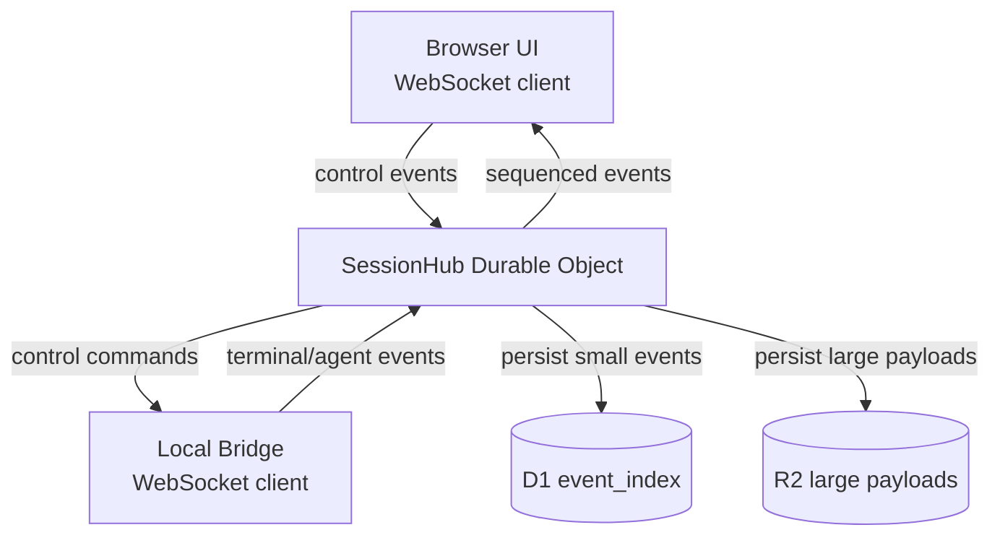
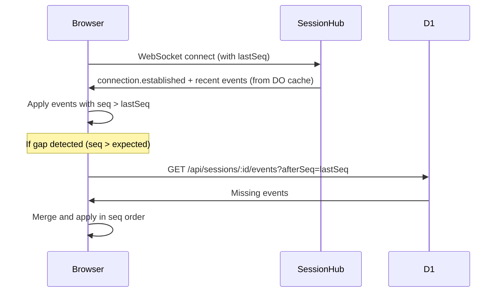

# Phase 03 — Durable Object Session Hub

**Objective:** Build the Durable Object (DO) that owns each live session. The DO assigns event sequence numbers, fans out events to all connected WebSocket clients (browser + bridge), caches live state, and supports reconnect/replay.

**Prerequisites:** Phase 02 (D1/R2 bindings + Worker API).

---

## Current State

- Event types exist in `@openfusion/core` (`OpenFusionEvent`, `BrowserControlMessage`, `BridgeMessage`).
- D1 `event_index` table exists for persistence.
- No Durable Object code exists. No WebSocket code exists. No `durable_objects` binding in `wrangler.jsonc`.
- The `seq` field on events is currently set to 0 or `MAX(seq)+1` — no authoritative ordering.

---

## Target State

```text
- SessionHub Durable Object class owns each live session
- WebSocket endpoint: /api/sessions/:id/ws?role=browser|bridge
- DO assigns monotonically increasing seq numbers to every event
- DO fans out events to all connected clients in real time
- DO persists small events to D1; large payloads go to R2
- Browser reconnect fetches missed events via /api/sessions/:id/events?afterSeq=N
- Bridge connects as a special WebSocket client with elevated permissions
```

---

## High-Level Design



### DO responsibilities

```text
1. Accept WebSocket connections from browser and bridge
2. Authenticate and authorize each connection (role-based)
3. Assign monotonically increasing seq to every event
4. Broadcast sequenced events to all connected clients
5. Persist event metadata to D1 (type, seq, source, visibility)
6. Route large payloads to R2 (terminal logs, transcripts)
7. Cache recent events in DO storage for fast replay
8. Handle browser control messages (pause, resume, cancel, steer, approve)
9. Forward control messages to the bridge
10. Track connected clients and their roles
```

### What the DO does NOT do

```text
- Does not execute terminal commands (bridge does that)
- Does not call model providers (bridge/agent does that)
- Does not make policy decisions (policy package does that)
- Does not store full event payloads (D1 stores metadata, R2 stores payloads)
```

---

## Low-Level Design

### 1. Durable Object binding in `wrangler.jsonc`

```jsonc
{
  "durable_objects": {
    "bindings": [
      {
        "name": "SESSION_HUB",
        "class_name": "SessionHub"
      }
    ]
  },
  "migrations": [
    {
      "tag": "v1",
      "new_sqlite_classes": ["SessionHub"]
    }
  ]
}
```

### 2. SessionHub class

**`apps/web/src/do/session-hub.ts`:**

```ts
import { DurableObject } from "cloudflare:workers";
import type { OpenFusionEvent, BrowserControlMessage, BridgeMessage, EventEnvelope } from "@openfusion/core";

type ClientRole = "browser" | "bridge" | "observer";

type ConnectedClient = {
  id: string;
  ws: WebSocket;
  role: ClientRole;
  userId?: string;
  connectedAt: number;
};

export class SessionHub extends DurableObject<Env> {
  private clients = new Map<string, ConnectedClient>();
  private bridge: ConnectedClient | null = null;
  private seq = 0;
  private recentEvents: EventEnvelope[] = [];
  private readonly RECENT_EVENT_LIMIT = 500;

  async fetch(request: Request): Promise<Response> {
    const url = new URL(request.url);
    const role = url.searchParams.get("role") as ClientRole | null;
    const token = url.searchParams.get("token");

    if (!role || !token) {
      return new Response("Missing role or token", { status: 400 });
    }

    // Validate token against D1 or KV
    const valid = await this.validateToken(token, role);
    if (!valid) {
      return new Response("Unauthorized", { status: 401 });
    }

    if (request.headers.get("Upgrade") !== "websocket") {
      return new Response("Expected WebSocket", { status: 426 });
    }

    const { 0: client, 1: server } = new WebSocketPair();
    const clientId = crypto.randomUUID();

    const connectedClient: ConnectedClient = {
      id: clientId,
      ws: server,
      role,
      userId: url.searchParams.get("userId") ?? undefined,
      connectedAt: Date.now(),
    };

    this.clients.set(clientId, connectedClient);
    if (role === "bridge") {
      this.bridge = connectedClient;
    }

    server.accept();
    this.sendToClient(server, {
      type: "connection.established",
      clientId,
      role,
      lastSeq: this.seq,
    });

    // Send recent events for catch-up
    for (const event of this.recentEvents) {
      this.sendToClient(server, event);
    }

    server.addEventListener("message", (event) => {
      this.handleMessage(clientId, event.data as string).catch((err) => {
        console.error("SessionHub message error:", err);
      });
    });

    server.addEventListener("close", () => {
      this.handleDisconnect(clientId);
    });

    server.addEventListener("error", (err) => {
      console.error("SessionHub WebSocket error:", err);
      this.handleDisconnect(clientId);
    });

    return new Response(null, { status: 101, webSocket: client });
  }

  private async handleMessage(clientId: string, raw: string): Promise<void> {
    const client = this.clients.get(clientId);
    if (!client) return;

    let message: BrowserControlMessage | BridgeMessage;
    try {
      message = JSON.parse(raw);
    } catch {
      this.sendError(client.ws, "Invalid JSON");
      return;
    }

    if (client.role === "bridge") {
      await this.handleBridgeMessage(message as BridgeMessage);
    } else if (client.role === "browser") {
      await this.handleBrowserControl(message as BrowserControlMessage, client);
    }
  }

  // --- Bridge -> DO ---

  private async handleBridgeMessage(message: BridgeMessage): Promise<void> {
    switch (message.type) {
      case "machine.heartbeat":
        await this.persistAndBroadcast(message, "bridge");
        break;
      case "agent.detected":
        await this.persistAndBroadcast(message, "bridge");
        break;
      case "run.status":
        await this.persistAndBroadcast(message, "bridge");
        break;
      case "event.batch":
        for (const event of message.events) {
          await this.persistAndBroadcast(event, "bridge");
        }
        break;
      default:
        // Terminal, tool, message, approval, verifier, artifact events
        await this.persistAndBroadcast(message as unknown as OpenFusionEvent, "bridge");
    }
  }

  // --- Browser -> DO ---

  private async handleBrowserControl(
    message: BrowserControlMessage,
    client: ConnectedClient
  ): Promise<void> {
    // Forward control messages to the bridge
    if (this.bridge) {
      this.sendToClient(this.bridge.ws, message);
    }

    // Some control messages also produce events
    switch (message.type) {
      case "control.pause":
        await this.persistAndBroadcast(
          { type: "run.paused", payload: message.payload } as OpenFusionEvent,
          "browser"
        );
        break;
      case "control.resume":
        await this.persistAndBroadcast(
          { type: "run.resumed", payload: message.payload } as OpenFusionEvent,
          "browser"
        );
        break;
      case "control.cancel":
        await this.persistAndBroadcast(
          { type: "run.cancelled", payload: message.payload } as OpenFusionEvent,
          "browser"
        );
        break;
      case "approval.decide":
        // Approval decision is also persisted as an event
        await this.persistAndBroadcast(
          { type: message.payload.decision === "approved" ? "approval.approved" : "approval.rejected",
            payload: message.payload } as OpenFusionEvent,
          "browser"
        );
        break;
      // terminal.stdin, terminal.resize, terminal.lease.*, message.steer, message.follow_up
      // are forwarded to bridge but not persisted as events
      default:
        break;
    }
  }

  // --- Core: sequence, persist, broadcast ---

  private async persistAndBroadcast(
    event: OpenFusionEvent,
    source: "browser" | "bridge"
  ): Promise<void> {
    this.seq++;
    const envelope: EventEnvelope = {
      id: crypto.randomUUID(),
      seq: this.seq,
      workspaceId: this.getWorkspaceId(),
      sessionId: this.getSessionId(),
      runId: this.getRunId(event),
      source,
      type: event.type,
      payload: event.payload ?? event,
      visibility: this.getVisibility(event),
      createdAt: new Date().toISOString(),
    };

    // Cache for replay
    this.recentEvents.push(envelope);
    if (this.recentEvents.length > this.RECENT_EVENT_LIMIT) {
      this.recentEvents.shift();
    }

    // Persist to D1 (fire-and-forget for latency; DO ensures ordering)
    this.persistToD1(envelope).catch((err) => {
      console.error("D1 persist error:", err);
    });

    // Broadcast to all connected clients
    this.broadcast(envelope);
  }

  private async persistToD1(envelope: EventEnvelope): Promise<void> {
    const repos = createOpenFusionRepositories(this.env.OPENFUSION_DB);
    await repos.events.append({
      id: envelope.id,
      workspaceId: envelope.workspaceId,
      sessionId: envelope.sessionId,
      runId: envelope.runId,
      seq: envelope.seq,
      type: envelope.type,
      source: envelope.source,
      visibility: envelope.visibility,
      payload: envelope.payload,
    });
  }

  private broadcast(envelope: EventEnvelope): void {
    for (const client of this.clients.values()) {
      this.sendToClient(client.ws, envelope);
    }
  }

  private sendToClient(ws: WebSocket, data: unknown): void {
    try {
      ws.send(JSON.stringify(data));
    } catch {
      // Client may have disconnected
    }
  }

  private sendError(ws: WebSocket, message: string): void {
    this.sendToClient(ws, { type: "error", message });
  }

  private handleDisconnect(clientId: string): void {
    const client = this.clients.get(clientId);
    if (!client) return;
    this.clients.delete(clientId);
    if (client.role === "bridge") {
      this.bridge = null;
      // Notify browsers that bridge disconnected
      this.broadcast({ type: "machine.offline", payload: { reason: "bridge disconnected" } } as unknown as EventEnvelope);
    }
  }

  // --- Helpers (use DO storage for session metadata) ---

  private getWorkspaceId(): string {
    return this.ctx.storage.sql.exec("SELECT workspace_id FROM session_meta").one().workspace_id;
  }

  private getSessionId(): string {
    return this.ctx.storage.sql.exec("SELECT session_id FROM session_meta").one().session_id;
  }

  private getRunId(event: OpenFusionEvent): string | undefined {
    return (event as any).runId;
  }

  private getVisibility(event: OpenFusionEvent): "local-only" | "metadata" | "full" {
    const type = event.type;
    if (type.startsWith("terminal.")) return "local-only";
    if (type.startsWith("message.")) return "metadata";
    return "metadata";
  }

  private async validateToken(token: string, role: ClientRole): Promise<boolean> {
    // Phase 02: check against D1 session tokens
    // Phase 04: bridge uses pairing token
    return true; // TODO: implement real validation
  }
}
```

### 3. WebSocket route handler

**`apps/web/src/app/api/sessions/[id]/ws/route.ts`:**

```ts
import { NextRequest } from "next/server";
import { getCloudflareContext } from "@opennextjs/cloudflare";

export async function GET(
  request: NextRequest,
  { params }: { params: Promise<{ id: string }> }
) {
  const { id } = await params;
  const { env } = await getCloudflareContext();

  // Get the DO stub for this session
  const doId = env.SESSION_HUB.idFromName(id);
  const stub = env.SESSION_HUB.get(doId);

  // Forward the request to the DO
  return stub.fetch(request.url);
}
```

### 4. DO initialization — set session metadata

When a DO is first activated for a session, it needs to know its `workspaceId` and `sessionId`. Use DO storage:

```ts
// In SessionHub, add an init method called on first connection
private async ensureInitialized(sessionId: string): Promise<void> {
  const initialized = await this.ctx.storage.get("initialized");
  if (initialized) return;

  const repos = createOpenFusionRepositories(this.env.OPENFUSION_DB);
  const session = await repos.sessions.findById(sessionId);
  if (!session) throw new Error("Session not found");

  await this.ctx.storage.put({
    initialized: true,
    workspaceId: session.workspaceId,
    sessionId: session.id,
    privacyMode: session.privacyMode,
  });
}
```

### 5. Client-side WebSocket hook

**`apps/web/src/lib/use-session-websocket.ts`:**

```ts
import { useEffect, useRef, useCallback, useState } from "react";
import type { EventEnvelope, BrowserControlMessage } from "@openfusion/core";

export function useSessionWebSocket(sessionId: string | null) {
  const [events, setEvents] = useState<EventEnvelope[]>([]);
  const [connected, setConnected] = useState(false);
  const [lastSeq, setLastSeq] = useState(0);
  const wsRef = useRef<WebSocket | null>(null);
  const reconnectTimer = useRef<ReturnType<typeof setTimeout>>();

  const connect = useCallback(() => {
    if (!sessionId) return;
    const ws = new WebSocket(
      `/api/sessions/${sessionId}/ws?role=browser&token=${getToken()}`
    );
    wsRef.current = ws;

    ws.onopen = () => setConnected(true);
    ws.onclose = () => {
      setConnected(false);
      // Reconnect with backoff
      reconnectTimer.current = setTimeout(connect, 2000);
    };
    ws.onmessage = (event) => {
      const envelope: EventEnvelope = JSON.parse(event.data);
      if (envelope.seq) setLastSeq(envelope.seq);
      setEvents((prev) => [...prev.slice(-500), envelope]);
    };
  }, [sessionId]);

  useEffect(() => {
    connect();
    return () => {
      wsRef.current?.close();
      clearTimeout(reconnectTimer.current);
    };
  }, [connect]);

  const send = useCallback((message: BrowserControlMessage) => {
    wsRef.current?.send(JSON.stringify(message));
  }, []);

  return { events, connected, lastSeq, send };
}
```

### 6. Reconnect / replay flow



---

## Design Patterns

| Pattern | Application |
|---|---|
| **Observer / Pub-Sub** | DO is the event broker. Bridge publishes events; browsers subscribe. DO decouples producers from consumers. |
| **Single Writer** | DO is the single authority for `seq` assignment. No two clients can create conflicting sequence numbers. |
| **Memento** | DO caches recent events in storage. On reconnect, replays the memento. D1 is the durable backup. |
| **Mediator** | DO mediates between browser and bridge. Browser never talks to bridge directly. |
| **State Cache** | DO caches live session state (current run status, connected clients) in memory. D1 is the source of truth for history. |

## SOLID / DRY Compliance

- **SRP:** DO does one thing: coordinate event flow for one session. It does not execute commands, call providers, or make policy decisions.
- **OCP:** New event types are handled by the default case in `handleBridgeMessage`. No modification needed for new event categories.
- **LSP:** Any `BrowserControlMessage` or `BridgeMessage` can be processed. The DO does not depend on specific event subtypes.
- **DIP:** DO depends on `OpenFusionEvent` and `EventEnvelope` abstractions (from `@openfusion/core`), not on concrete agent or bridge implementations.
- **DRY:** Event sequencing, persistence, and broadcast happen in one place (`persistAndBroadcast`). No duplication across event types.

---

## API / Event Contracts

### WebSocket message flow

```text
Browser -> DO (BrowserControlMessage):
  control.pause          -> forwarded to bridge + run.paused event
  control.resume         -> forwarded to bridge + run.resumed event
  control.cancel         -> forwarded to bridge + run.cancelled event
  terminal.stdin         -> forwarded to bridge only
  terminal.resize        -> forwarded to bridge only
  terminal.lease.request -> forwarded to bridge + lease event
  terminal.lease.release -> forwarded to bridge + lease event
  message.steer          -> forwarded to bridge only
  message.follow_up      -> forwarded to bridge only
  approval.decide        -> forwarded to bridge + approval event

Bridge -> DO (BridgeMessage or OpenFusionEvent):
  machine.heartbeat      -> persisted + broadcast
  agent.detected         -> persisted + broadcast
  run.status             -> persisted + broadcast
  terminal.stdout        -> persisted + broadcast (visibility: local-only)
  terminal.stderr        -> persisted + broadcast (visibility: local-only)
  message.assistant_delta -> persisted + broadcast
  tool.start             -> persisted + broadcast
  approval.requested     -> persisted + broadcast
  verifier.completed     -> persisted + broadcast
  event.batch            -> each event persisted + broadcast

DO -> All clients (EventEnvelope):
  { id, seq, type, payload, source, visibility, createdAt }
```

---

## Testing Strategy

| Level | What | Tool |
|---|---|---|
| Unit | DO seq assignment (monotonic, no gaps) | vitest + miniflare DO |
| Unit | DO broadcast (all clients receive) | vitest + miniflare |
| Unit | DO recent event cache (eviction at limit) | vitest |
| Unit | DO bridge disconnect notification | vitest |
| Integration | Browser connect -> receive recent events | vitest + WebSocket client |
| Integration | Bridge sends event -> browser receives | vitest + 2 WS clients |
| Integration | Reconnect after disconnect -> replay | vitest |
| Integration | D1 persistence after event | vitest + miniflare D1 |

---

## Implementation Steps

1. Add `durable_objects` binding + migration to `wrangler.jsonc`
2. Run `npm run cf-typegen`
3. Create `apps/web/src/do/session-hub.ts`
4. Create `apps/web/src/app/api/sessions/[id]/ws/route.ts`
5. Implement DO: WebSocket handling, seq assignment, broadcast, D1 persist
6. Implement DO storage initialization (workspace/session metadata)
7. Create `apps/web/src/lib/use-session-websocket.ts` client hook
8. Implement reconnect/replay logic (client-side)
9. Write unit tests with miniflare DO
10. Write integration tests with WebSocket clients
11. Run `pnpm typecheck && pnpm lint && pnpm test && pnpm build`
12. Test manually: open 2 browser tabs, connect both, verify events broadcast to both

---

## Acceptance Criteria

```text
[ ] SessionHub DO class exists and is bound in wrangler.jsonc
[ ] WebSocket endpoint /api/sessions/:id/ws accepts browser and bridge connections
[ ] DO assigns monotonically increasing seq to every event (no gaps, no duplicates)
[ ] Events are broadcast to all connected clients in real time
[ ] Events are persisted to D1 event_index table
[ ] Recent events (500) are cached in DO storage for fast replay
[ ] Browser reconnect receives missed events
[ ] Bridge disconnect notifies all browsers
[ ] Browser control messages are forwarded to bridge
[ ] Large payloads (terminal logs) are routed to R2, not stored in D1
[ ] Unit and integration tests pass
[ ] pnpm build passes
```

---

## Risks & Mitigations

| Risk | Mitigation |
|---|---|
| DO storage limits (128MB) | Keep only recent events in DO; D1 + R2 for full history |
| WebSocket connection limits | DO handles up to ~32K concurrent connections; monitor and alert |
| Event ordering under high throughput | DO is single-threaded; seq is atomic within the DO |
| D1 write latency blocking broadcast | Fire-and-forget D1 persist; broadcast first, persist second |
| DO cold start delays first event | Pre-warm DO on session creation via API route |
| Token validation on every WS message | Validate once on connect; cache role in DO memory |