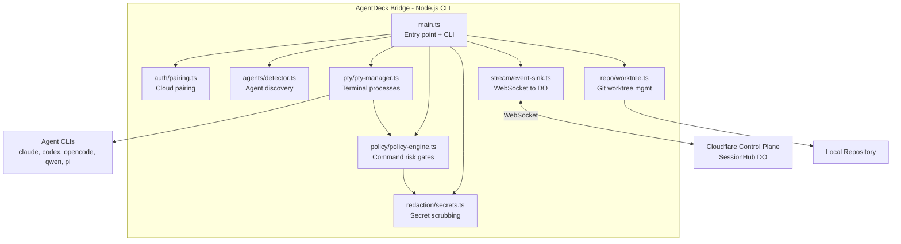

# Phase 04 — Local AgentDeck Bridge

**Objective:** Build the local Node.js bridge CLI that pairs with the cloud control plane, detects installed coding agents, spawns PTY processes, enforces command policy, redacts secrets, and streams events to the SessionHub Durable Object over WebSocket.

**Prerequisites:** Phase 03 (SessionHub DO must accept bridge WebSocket connections).

---

## Current State

- `apps/bridge/` exists as the local Node.js CLI app and workspace package.
- The CLI supports `agentdeck-bridge pair`, `agentdeck-bridge probe`, and session-scoped `agentdeck-bridge start <session-id>`.
- Agent detection probes Claude Code, Codex, OpenCode, Qwen Code, Pi, Aider, and ACP on `PATH` without reading credential contents.
- `node-pty`, `ws`, `simple-git`, `execa`, `commander`, and bridge-side `zod` validation are installed for the bridge package.
- The bridge wraps `@agentdeck/policy`, manages PTY sessions, redacts outbound payloads, batches events, and reconnects to the Phase 03 SessionHub WebSocket.
- Config persists to `~/.agentdeck/config.json`; unsent event batches persist to `~/.agentdeck/state.jsonl`.
- The bridge connects through the existing Phase 03 route: `/api/sessions/:id/ws?role=bridge&machineId=...&token=...`.

---

## Target State

```text
- apps/bridge/ is a Node.js CLI app (npm global install)
- Bridge pairs with cloud via pairing code
- Bridge detects Claude Code, Codex, OpenCode, Qwen, Pi, Aider on PATH
- Bridge spawns agents in PTY processes (node-pty)
- Bridge enforces command policy before executing risky commands
- Bridge redacts secrets before sending events to cloud
- Bridge streams events to SessionHub DO over WebSocket
- Bridge handles reconnection with backoff
- Config: ~/.agentdeck/config.json
- State: ~/.agentdeck/state.db (SQLite or JSONL)
```

---

## High-Level Design



### Boundary rule (enforced in code)

```text
The bridge:
  - detects agents on the local machine
  - spawns PTY processes for agents
  - enforces command policy (blocks deny, gates approval)
  - redacts secrets before cloud sync
  - streams events to the SessionHub DO
  - creates git worktrees for isolated runs
  - runs verifiers (test/build/lint/typecheck)

The bridge does NOT:
  - make routing decisions (cloud does that)
  - manage queues or schedules (cloud does that)
  - store team/audit data (cloud does that)
  - call model providers directly (agents do that, or AI Gateway does)
```

---

## Low-Level Design

### 1. Package structure

```text
apps/bridge/
  package.json
  tsconfig.json
  src/
    main.ts                        # CLI entry point (commander)
    auth/
      pairing.ts                   # Pairing code flow
      token-store.ts               # Token persistence (~/.agentdeck/config.json)
    agents/
      detector.ts                  # PATH discovery + version probing
      types.ts                     # ProbeResult, AgentAdapter interface
      claude-code.adapter.ts       # (Phase 06)
      codex.adapter.ts             # (Phase 06)
      opencode.adapter.ts          # (Phase 06)
      qwen-code.adapter.ts         # (Phase 06)
      pi.adapter.ts                # (Phase 06)
      aider.adapter.ts             # (Phase 06)
    pty/
      pty-manager.ts               # node-pty wrapper
      terminal-session.ts          # One PTY session per run
    policy/
      policy-engine.ts             # Wraps @agentdeck/policy
      approval-gate.ts             # Blocks until approval event from DO
    repo/
      git.ts                       # simple-git wrapper
      worktree.ts                  # Worktree creation/cleanup
      diff.ts                      # Patch generation
    stream/
      event-sink.ts                # EventSink interface + DO WebSocket client
      websocket-client.ts          # Reconnecting WS to SessionHub
      replay-buffer.ts             # Local event buffer for reconnect
    redaction/
      secrets.ts                   # Secret pattern matching + redaction
    state/
      jsonl-replay-buffer.ts       # Local JSONL replay queue (~/.agentdeck/state.jsonl)
    config.ts                      # Config/state path load/save helpers
    types.ts                       # Bridge-local types
    *.test.ts                      # Unit tests colocated with modules
```

### 2. `package.json`

```jsonc
{
  "name": "@agentdeck/bridge",
  "version": "0.1.0",
  "private": true,
  "type": "module",
  "bin": {
    "agentdeck-bridge": "./dist/main.js"
  },
  "scripts": {
    "dev": "tsx src/main.ts",
    "build": "tsc",
    "typecheck": "tsc --noEmit",
    "lint": "eslint .",
    "test": "vitest run"
  },
  "dependencies": {
    "@agentdeck/core": "workspace:*",
    "@agentdeck/policy": "workspace:*",
    "node-pty": "^1.0.0",
    "ws": "^8.18.0",
    "simple-git": "^3.27.0",
    "execa": "^9.5.0",
    "commander": "^12.1.0",
    "zod": "^3.x"
  }
}
```

### 3. CLI entry point

**`src/main.ts`:**

```ts
import { Command } from "commander";
import { pairWithCloud } from "./auth/pairing.js";
import { detectAgents } from "./agents/detector.js";
import { startBridge } from "./stream/websocket-client.js";
import { loadConfig, saveConfig } from "./config.js";

const program = new Command();

program
  .name("agentdeck-bridge")
  .description("AgentDeck local bridge — detects agents, runs terminals, streams events")
  .version("0.1.0");

program
  .command("pair <code>")
  .description("Pair this machine with the AgentDeck cloud")
  .action(async (code: string) => {
    const config = await pairWithCloud(code);
    await saveConfig(config);
    console.log("Paired successfully. Machine ID:", config.machineId);
  });

program
  .command("probe")
  .description("Detect installed coding agents")
  .action(async () => {
    const results = await detectAgents();
    for (const result of results) {
      console.log(`${result.agentKind}: ${result.found ? "found" : "not found"}`);
      if (result.found) {
        console.log(`  command: ${result.command}`);
        console.log(`  version: ${result.version ?? "unknown"}`);
        console.log(`  auth: ${result.authStatus}`);
        console.log(`  capabilities: ${result.capabilities.join(", ")}`);
      }
    }
  });

program
  .command("start")
  .description("Start the bridge — connect to cloud and wait for run commands")
  .action(async () => {
    const config = await loadConfig();
    if (!config.machineId) {
      console.error("Not paired. Run: agentdeck-bridge pair <code>");
      process.exit(1);
    }
    await startBridge(config);
  });

program.parse();
```

### 4. Pairing flow

**`src/auth/pairing.ts`:**

```ts
import { randomUUID } from "crypto";
import { platform, arch } from "os";

export type BridgeConfig = {
  machineId: string;
  workspaceId: string;
  cloudUrl: string;
  token: string;
  displayName: string;
  pairedAt: string;
};

export async function pairWithCloud(code: string): Promise<BridgeConfig> {
  const cloudUrl = process.env.AGENTDECK_CLOUD_URL ?? "http://localhost:3000";

  const response = await fetch(`${cloudUrl}/api/machines/complete-pairing`, {
    method: "POST",
    headers: { "Content-Type": "application/json" },
    body: JSON.stringify({
      code,
      machineInfo: {
        displayName: platform() === "darwin" ? "MacBook" : "Machine",
        os: platform(),
        arch: arch(),
        bridgeVersion: "0.1.0",
      },
    }),
  });

  if (!response.ok) {
    throw new Error(`Pairing failed: ${response.statusText}`);
  }

  const result = await response.json() as {
    machineId: string;
    workspaceId: string;
    token: string;
  };

  return {
    machineId: result.machineId,
    workspaceId: result.workspaceId,
    cloudUrl,
    token: result.token,
    displayName: platform() === "darwin" ? "MacBook" : "Machine",
    pairedAt: new Date().toISOString(),
  };
}
```

### 5. Agent detection

**`src/agents/detector.ts`:**

```ts
import { execa } from "execa";
import { access, constants } from "fs/promises";
import { homedir } from "os";
import { join } from "path";
import type { ProbeResult } from "./types.js";

const AGENT_COMMANDS = [
  { kind: "claude-code", command: "claude", versionArgs: ["--version"] },
  { kind: "codex", command: "codex", versionArgs: ["--version"] },
  { kind: "opencode", command: "opencode", versionArgs: ["--version"] },
  { kind: "qwen-code", command: "qwen", versionArgs: ["--version"] },
  { kind: "pi", command: "pi", versionArgs: ["--version"] },
  { kind: "aider", command: "aider", versionArgs: ["--version"] },
] as const;

export async function detectAgents(): Promise<ProbeResult[]> {
  const results: ProbeResult[] = [];

  for (const agent of AGENT_COMMANDS) {
    const result = await probeAgent(agent.kind, agent.command, agent.versionArgs);
    results.push(result);
  }

  return results;
}

async function probeAgent(
  kind: string,
  command: string,
  versionArgs: string[]
): Promise<ProbeResult> {
  try {
    // Check if command exists on PATH
    const { stdout } = await execa(command, versionArgs, { reject: false });
    const version = stdout.trim() || undefined;

    // Check auth config presence (without reading secrets)
    const authStatus = await checkAuthStatus(kind);

    return {
      found: true,
      agentKind: kind as ProbeResult["agentKind"],
      command,
      version,
      installSource: "path",
      authStatus,
      capabilities: getCapabilities(kind),
      warnings: [],
    };
  } catch {
    return {
      found: false,
      agentKind: kind as ProbeResult["agentKind"],
      authStatus: "unknown",
      capabilities: [],
      warnings: [`${command} not found on PATH`],
      suggestedFix: `Install ${kind} or add it to your PATH`,
    };
  }
}

async function checkAuthStatus(kind: string): Promise<"unknown" | "configured" | "missing"> {
  const configPaths: Record<string, string[]> = {
    "claude-code": [join(homedir(), ".claude", "config.json")],
    "codex": [join(homedir(), ".codex", "config.json")],
    "opencode": [join(homedir(), ".opencode", "config.json")],
    "qwen-code": [join(homedir(), ".qwen", "config.json")],
    "pi": [join(homedir(), ".pi", "agent", "auth.json")],
    "aider": [join(homedir(), ".aider.conf.yml")],
  };

  const paths = configPaths[kind];
  if (!paths) return "unknown";

  for (const p of paths) {
    try {
      await access(p, constants.F_OK);
      return "configured";
    } catch {
      // continue checking
    }
  }
  return "missing";
}

function getCapabilities(kind: string): string[] {
  const base = ["terminal", "repo-aware", "code-edit", "bash"];
  switch (kind) {
    case "claude-code":
      return [...base, "mcp", "json-events", "model-switching"];
    case "codex":
      return [...base, "json-events", "model-switching"];
    case "opencode":
      return [...base, "mcp", "acp", "json-events"];
    case "qwen-code":
      return [...base];
    case "pi":
      return [...base, "json-events", "rpc", "sdk", "model-switching", "session-branching"];
    case "aider":
      return [...base];
    default:
      return base;
  }
}
```

### 6. PTY manager

**`src/pty/pty-manager.ts`:**

```ts
import * as pty from "node-pty";

export type PtySession = {
  pid: number;
  write(data: string): void;
  resize(cols: number, rows: number): void;
  kill(signal?: string): void;
  onData(handler: (data: string) => void): void;
  onExit(handler: (exit: { exitCode: number; signal?: number }) => void): void;
};

export class PtyManager {
  spawn(
    command: string,
    args: string[],
    options: { cwd: string; env?: Record<string, string>; cols?: number; rows?: number }
  ): PtySession {
    const shell = pty.spawn(command, args, {
      name: "xterm-256color",
      cols: options.cols ?? 80,
      rows: options.rows ?? 24,
      cwd: options.cwd,
      env: options.env as Record<string, string>,
    });

    return {
      pid: shell.pid,
      write: (data: string) => shell.write(data),
      resize: (cols: number, rows: number) => shell.resize(cols, rows),
      kill: (signal?: string) => shell.kill(signal),
      onData: (handler) => shell.onData(handler),
      onExit: (handler) => shell.onExit(handler),
    };
  }
}
```

### 7. Policy engine (bridge-side)

**`src/policy/policy-engine.ts`:**

```ts
import { classifyCommandRisk, getPrivacyStorageDecision, type PolicyDecision } from "@agentdeck/policy";

export type PolicyGateResult = {
  allowed: boolean;
  requiresApproval: boolean;
  decision: PolicyDecision;
  privacyDecision: ReturnType<typeof getPrivacyStorageDecision>;
};

export class PolicyEngine {
  evaluateCommand(command: string): PolicyGateResult {
    const decision = classifyCommandRisk(command);
    const privacyDecision = getPrivacyStorageDecision("metadata-only"); // from workspace config

    return {
      allowed: decision.decision === "allow",
      requiresApproval: decision.decision === "approval",
      decision,
      privacyDecision,
    };
  }

  shouldSyncToCloud(privacyMode: "local-only" | "metadata-only" | "full-sync"): boolean {
    const decision = getPrivacyStorageDecision(privacyMode);
    return decision.r2 !== "blocked";
  }

  shouldRedactBeforeSync(privacyMode: "local-only" | "metadata-only" | "full-sync"): boolean {
    const decision = getPrivacyStorageDecision(privacyMode);
    return decision.r2 === "redacted";
  }
}
```

### 8. Secret redaction

**`src/redaction/secrets.ts`:**

```ts
const SECRET_PATTERNS: Array<{ name: string; pattern: RegExp; replacement: string }> = [
  // API keys (common formats)
  { name: "openai-key", pattern: /sk-[a-zA-Z0-9]{20,}/g, replacement: "sk-[REDACTED]" },
  { name: "anthropic-key", pattern: /sk-ant-[a-zA-Z0-9]{20,}/g, replacement: "sk-ant-[REDACTED]" },
  { name: "github-token", pattern: /gh[pousr]_[A-Za-z0-9]{36,}/g, replacement: "ghp_[REDACTED]" },
  { name: "aws-access-key", pattern: /AKIA[0-9A-Z]{16}/g, replacement: "AKIA[REDACTED]" },
  { name: "jwt", pattern: /eyJ[a-zA-Z0-9_-]+\.eyJ[a-zA-Z0-9_-]+\.[a-zA-Z0-9_-]+/g, replacement: "[JWT_REDACTED]" },
  { name: "private-key", pattern: /-----BEGIN (RSA |EC |OPENSSH |)PRIVATE KEY-----[\s\S]*?-----END \1PRIVATE KEY-----/g, replacement: "[PRIVATE_KEY_REDACTED]" },
  { name: "authorization-header", pattern: /[Aa]uthorization:\s*Bearer\s+[a-zA-Z0-9_.-]+/g, replacement: "Authorization: Bearer [REDACTED]" },
  { name: "database-url", pattern: /(postgres|mongodb|redis|mysql):\/\/[^\s]+:[^\s]+@/g, replacement: "$1://[REDACTED]:@" },
  { name: "env-assignment", pattern: /([A-Z_]*(?:KEY|TOKEN|SECRET|PASSWORD|CREDENTIAL)[A-Z_]*)\s*=\s*[^\s]+/g, replacement: "$1=[REDACTED]" },
];

export function redact(input: string): string {
  let result = input;
  for (const { pattern, replacement } of SECRET_PATTERNS) {
    result = result.replace(pattern, replacement);
  }
  return result;
}

export function redactStructured(obj: unknown): unknown {
  if (typeof obj === "string") return redact(obj);
  if (Array.isArray(obj)) return obj.map(redactStructured);
  if (obj && typeof obj === "object") {
    const result: Record<string, unknown> = {};
    for (const [key, value] of Object.entries(obj)) {
      if (/(key|token|secret|password|credential|auth)/i.test(key)) {
        result[key] = "[REDACTED]";
      } else {
        result[key] = redactStructured(value);
      }
    }
    return result;
  }
  return obj;
}

export function countRedactions(original: string, redacted: string): number {
  const matches = redacted.match(/\[REDACTED\]/g);
  return matches ? matches.length : 0;
}
```

### 9. Event sink (WebSocket to DO)

**`src/stream/event-sink.ts`:**

```ts
import type { AgentDeckEvent } from "@agentdeck/core";
import { redact } from "../redaction/secrets.js";

export interface EventSink {
  emit(event: AgentDeckEvent): void;
  flush(): Promise<void>;
}

export class CloudEventSink implements EventSink {
  private buffer: AgentDeckEvent[] = [];
  private readonly maxBufferSize = 50;
  private flushTimer: ReturnType<typeof setTimeout> | null = null;

  constructor(
    private readonly send: (data: string) => void,
    private readonly privacyMode: "local-only" | "metadata-only" | "full-sync"
  ) {}

  emit(event: AgentDeckEvent): void {
    // Apply privacy mode
    if (this.privacyMode === "local-only" && this.isSensitive(event)) {
      return; // Don't sync to cloud
    }

    // Redact secrets before sync
    const redactedEvent = this.redactEvent(event);

    this.buffer.push(redactedEvent);

    if (this.buffer.length >= this.maxBufferSize) {
      this.flush().catch(console.error);
    } else if (!this.flushTimer) {
      this.flushTimer = setTimeout(() => {
        this.flush().catch(console.error);
      }, 100);
    }
  }

  async flush(): Promise<void> {
    if (this.flushTimer) {
      clearTimeout(this.flushTimer);
      this.flushTimer = null;
    }
    if (this.buffer.length === 0) return;

    const batch = this.buffer.splice(0);
    this.send(JSON.stringify({ type: "event.batch", events: batch }));
  }

  private isSensitive(event: AgentDeckEvent): boolean {
    return event.type.startsWith("terminal.") && this.privacyMode === "local-only";
  }

  private redactEvent(event: AgentDeckEvent): AgentDeckEvent {
    if (this.privacyMode === "full-sync") return event;
    // Redact terminal output and message content
    const payload = event.payload as any;
    if (typeof payload?.data === "string") {
      return { ...event, payload: { ...payload, data: redact(payload.data) } };
    }
    return event;
  }
}
```

### 10. WebSocket client (reconnecting)

**`src/stream/websocket-client.ts`:**

```ts
import WebSocket from "ws";
import type { BridgeConfig } from "../auth/pairing.js";
import { CloudEventSink } from "./event-sink.js";
import { detectAgents } from "../agents/detector.js";

export async function startBridge(config: BridgeConfig): Promise<void> {
  const ws = new ReconnectingWebSocket(config);
  await ws.connect();

  // Send initial heartbeat + agent detection
  const sink = new CloudEventSink(
    (data) => ws.send(data),
    "metadata-only"
  );

  // Detect agents on startup
  const probeResults = await detectAgents();
  for (const result of probeResults) {
    sink.emit({
      type: "agent.detected",
      payload: result,
    } as any);
  }

  // Heartbeat every 30 seconds
  setInterval(() => {
    ws.send(JSON.stringify({
      type: "machine.heartbeat",
      payload: { machineId: config.machineId, timestamp: new Date().toISOString() },
    }));
  }, 30_000);

  // Keep process alive
  process.on("SIGINT", () => {
    ws.close();
    process.exit(0);
  });
}

class ReconnectingWebSocket {
  private ws: WebSocket | null = null;
  private reconnectDelay = 1000;
  private readonly maxDelay = 30_000;

  constructor(private readonly config: BridgeConfig) {}

  async connect(): Promise<void> {
    const url = `${this.config.cloudUrl.replace("http", "ws")}/api/bridge/ws?token=${this.config.token}&role=bridge`;
    this.ws = new WebSocket(url);

    this.ws.on("open", () => {
      console.log("Bridge connected to cloud");
      this.reconnectDelay = 1000;
    });

    this.ws.on("message", (data) => {
      this.handleMessage(data.toString());
    });

    this.ws.on("close", () => {
      console.log("Bridge disconnected, reconnecting...");
      setTimeout(() => this.connect(), this.reconnectDelay);
      this.reconnectDelay = Math.min(this.reconnectDelay * 2, this.maxDelay);
    });

    this.ws.on("error", (err) => {
      console.error("WebSocket error:", err.message);
    });
  }

  send(data: string): void {
    if (this.ws?.readyState === WebSocket.OPEN) {
      this.ws.send(data);
    }
  }

  close(): void {
    this.ws?.close();
  }

  private handleMessage(raw: string): void {
    const message = JSON.parse(raw);
    // Handle run.start, control.pause, control.resume, etc.
    console.log("Received from cloud:", message.type);
  }
}
```

### 11. Git worktree manager

**`src/repo/worktree.ts`:**

```ts
import simpleGit from "simple-git";
import { join, basename } from "path";
import { mkdir } from "fs/promises";

export async function createWorktree(
  repoPath: string,
  runId: string,
  branchName: string
): Promise<string> {
  const git = simpleGit(repoPath);
  const worktreeBase = join(repoPath, "..", "agentdeck-worktrees", basename(repoPath));
  const worktreePath = join(worktreeBase, `run_${runId}`);

  await mkdir(worktreePath, { recursive: true });
  await git.raw(["worktree", "add", worktreePath, "-b", branchName]);

  return worktreePath;
}

export async function removeWorktree(repoPath: string, worktreePath: string): Promise<void> {
  const git = simpleGit(repoPath);
  await git.raw(["worktree", "remove", worktreePath, "--force"]);
}

export async function generateDiff(worktreePath: string): Promise<string> {
  const git = simpleGit(worktreePath);
  return git.diff();
}
```

---

## Design Patterns

| Pattern | Application |
|---|---|
| **Adapter** | `PtyManager` adapts `node-pty` to a platform-independent `PtySession` interface. Agent adapters (Phase 06) adapt each CLI to `HarnessAdapter`. |
| **Strategy** | `PolicyEngine` uses `classifyCommandRisk` as the strategy for command evaluation. Redaction strategy can be swapped (regex-based now, ML-based later). |
| **Observer** | `EventSink` is the observer — PTY and agent events are observed, redacted, and forwarded to the cloud. |
| **Decorator** | `CloudEventSink` decorates the raw event stream with redaction and privacy-mode filtering. |
| **Reconnection** | `ReconnectingWebSocket` implements exponential backoff reconnection. |
| **Repository** | `token-store.ts` and `config.ts` are local file-based repositories for bridge state. |

## SOLID / DRY Compliance

- **SRP:** Each module has one job: `detector.ts` finds agents, `pty-manager.ts` manages processes, `policy-engine.ts` evaluates commands, `secrets.ts` redacts, `event-sink.ts` streams.
- **OCP:** New agent adapters are added as new files implementing the adapter interface. No existing file is modified.
- **LSP:** Any `PtySession` can be used interchangeably. Any `EventSink` implementation (cloud, local file, test mock) can replace another.
- **ISP:** `EventSink` interface is minimal: `emit()` + `flush()`. Consumers don't depend on WebSocket internals.
- **DIP:** `PolicyEngine` depends on `@agentdeck/policy` abstractions, not on bridge-specific logic. `CloudEventSink` depends on a `send` function, not on `WebSocket` directly.
- **DRY:** Risk classification is in `@agentdeck/policy` (one place). Secret patterns are in `secrets.ts` (one place). Agent detection logic is in `detector.ts` (one place).

---

## Testing Strategy

| Level | What | Tool |
|---|---|---|
| Unit | Agent detection (mock `execa`) | vitest |
| Unit | Policy engine (all risk tiers) | vitest |
| Unit | Secret redaction (all patterns) | vitest |
| Unit | Event sink buffering + flush | vitest |
| Unit | Worktree creation/cleanup (mock `simple-git`) | vitest |
| Integration | PTY spawn + data capture | vitest (requires node-pty native) |
| Integration | WebSocket connect/disconnect/reconnect | vitest + ws server |
| E2E | `agentdeck-bridge pair <code>` -> config saved | vitest + mock server |
| E2E | `agentdeck-bridge probe` -> agents detected | vitest (on machine with agents) |

---

## Implementation Steps

1. Create `apps/bridge/` with `package.json`, `tsconfig.json` — done.
2. Install dependencies: `node-pty`, `ws`, `simple-git`, `execa`, `commander` — done.
3. Create `src/config.ts` — load/save `~/.agentdeck/config.json` and state path helpers — done.
4. Create `src/auth/pairing.ts` — pairing code flow — done against the current Worker API contract.
5. Create `src/auth/token-store.ts` — token persistence — done.
6. Create `src/agents/detector.ts` — PATH discovery + version probing — done.
7. Create `src/agents/types.ts` — `ProbeResult`, `AgentAdapter` interface — done.
8. Create `src/pty/pty-manager.ts` — node-pty wrapper — done.
9. Create `src/pty/terminal-session.ts` — bridge-side terminal lifecycle and lease gate — done for Phase 05 handoff.
10. Create `src/policy/policy-engine.ts` — wraps `@agentdeck/policy` — done.
11. Create `src/policy/approval-gate.ts` — async approval wait primitive — done.
12. Create `src/redaction/secrets.ts` — secret pattern matching — done.
13. Create `src/stream/event-sink.ts` — buffered event stream with redaction — done.
14. Create `src/stream/replay-buffer.ts` and `src/state/jsonl-replay-buffer.ts` — local reconnect replay buffers — done.
15. Create `src/stream/websocket-client.ts` — reconnecting WS to SessionHub — done.
16. Create `src/repo/worktree.ts` — git worktree management — done.
17. Create `src/main.ts` — CLI entry point — done.
18. Write unit tests for all modules — done.
19. Run `pnpm typecheck`, `pnpm lint`, `pnpm test`, `pnpm test:e2e`, `pnpm build:packages`, and `pnpm build` — done.

---

## Acceptance Criteria

```text
[x] apps/bridge/ exists as a Node.js CLI app
[x] agentdeck-bridge pair <code> pairs with cloud and saves config
[x] agentdeck-bridge probe detects installed agents (claude, codex, etc.)
[x] agentdeck-bridge start connects to SessionHub DO via WebSocket
[x] Bridge sends machine.heartbeat every 30 seconds
[x] Bridge sends agent.detected events on startup
[x] Policy engine evaluates commands using @agentdeck/policy
[x] Secret redaction scrubs API keys, tokens, JWTs, private keys before cloud sync
[x] Event sink buffers and batches events for efficiency
[x] WebSocket reconnects with exponential backoff on disconnect
[x] Git worktree creation and cleanup works
[x] Config persists to ~/.agentdeck/config.json
[x] Unsent cloud event batches persist to ~/.agentdeck/state.jsonl
[x] Unit tests pass with >80% coverage
[x] pnpm build passes for all packages
```

---

## Risks & Mitigations

| Risk | Mitigation |
|---|---|
| `node-pty` native compilation fails on some platforms | Provide prebuilt binaries; document prerequisites; offer fallback to `child_process` |
| Agent CLIs not on PATH | Clear error messages with install instructions; `suggestedFix` in probe results |
| Secret patterns miss new formats | Maintain extensible pattern list; log redaction count for monitoring |
| WebSocket disconnects during long runs | Local event buffer (`replay-buffer.ts`) stores events; flush on reconnect |
| Bridge process crashes | Run as a service (launchd/systemd) or Tauri tray app; auto-restart |
| Pairing token theft | Tokens expire; bound to machine ID; revocable from cloud |
