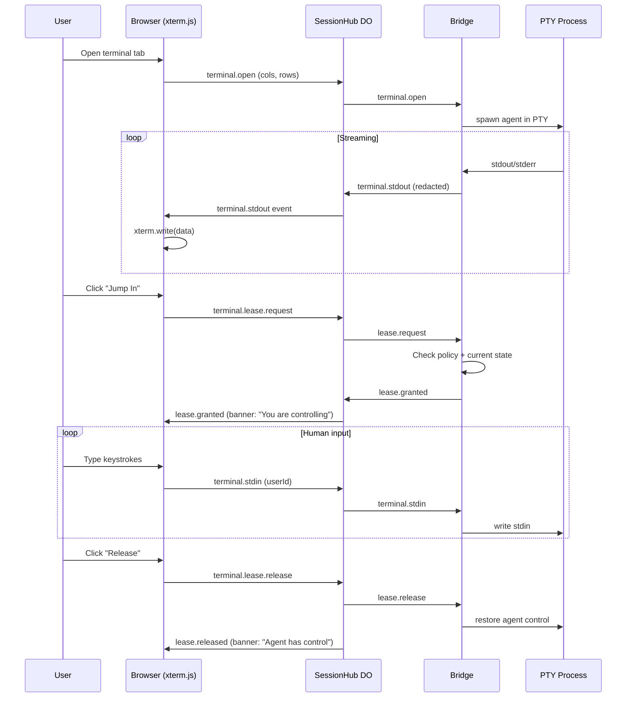

# Phase 05 — Real Terminal & Jump-In Control

**Objective:** Integrate xterm.js in the browser to render a real terminal, stream PTY output from the bridge through the SessionHub DO, and implement the jump-in control flow that lets a human take live keyboard control of the terminal.

**Prerequisites:** Phase 04 (bridge with PTY manager + WebSocket streaming).

---

## Current State

- The dashboard terminal dock is split into focused Phase 05 components:
  - `terminal-dock.tsx` owns tabs, policy summary, lease controls, and mock/offline preview state.
  - `terminal-pane.tsx` adapts xterm.js to the AgentDeck event stream.
  - `jump-in-control.tsx` and `lease-banner.tsx` render the human lease workflow.
  - `terminal-lease.ts` derives current lease state from event-sourced SessionHub events.
- `@xterm/xterm`, `@xterm/addon-fit`, and `@xterm/addon-web-links` are installed in `apps/web`.
- Browser terminal resize/stdin/lease controls use the shared `BrowserControlMessage` contract and flow through `useSessionWebSocket`.
- The SessionHub injects the authenticated browser user id into terminal stdin and lease-request controls before forwarding them to the bridge, so audit identity does not rely on browser-provided data.
- The bridge has a `TerminalSessionRegistry` and terminal-control dispatcher. `startBridge()` routes `terminal.stdin`, `terminal.resize`, `terminal.lease.request`, and `terminal.lease.release` to registered PTY sessions.
- Terminal stdout/stderr payloads are offloaded through the existing R2 object-key path whenever workspace privacy policy allows R2 storage.
- Phase 06 still owns real agent adapter startup. The Phase 05 bridge path is ready for adapters to register `TerminalSession` instances when they launch agent PTYs.

---

## Target State

```text
- xterm.js renders an authentic terminal in the browser
- PTY output streams from bridge -> DO -> browser in real time
- Terminal resize (cols/rows) syncs browser -> DO -> bridge -> PTY
- Jump In: human acquires terminal lease, gets direct stdin control
- Release: human releases lease, agent regains control
- All human keystrokes are audited as human-terminal-input events
- Terminal output is recorded to R2 for replay
- Lease banner shows: "Agent has control" / "You are controlling" / "Read-only observer"
```

---

## High-Level Design



---

## Low-Level Design

### 1. Install xterm.js

```bash
cd apps/web && pnpm add @xterm/xterm @xterm/addon-fit @xterm/addon-web-links
```

### 2. Terminal component

**`apps/web/src/components/agentdeck/terminal-pane.tsx`:**

```tsx
"use client";

import { useEffect, useRef, useCallback } from "react";
import { Terminal } from "@xterm/xterm";
import { FitAddon } from "@xterm/addon-fit";
import { WebLinksAddon } from "@xterm/addon-web-links";
import type { EventEnvelope, BrowserControlMessage } from "@agentdeck/core";
import { transitionTerminalLease } from "@agentdeck/core";
import "@xterm/xterm/css/xterm.css";

type TerminalPaneProps = {
  runId: string;
  sessionId: string;
  events: EventEnvelope[];
  leaseMode: "agent-control" | "human-control" | "read-only";
  onControl: (message: BrowserControlMessage) => void;
  className?: string;
};

export function TerminalPane({
  runId,
  sessionId,
  events,
  leaseMode,
  onControl,
  className,
}: TerminalPaneProps) {
  const containerRef = useRef<HTMLDivElement>(null);
  const termRef = useRef<Terminal | null>(null);
  const fitRef = useRef<FitAddon | null>(null);
  const lastSeqRef = useRef(0);

  // Initialize terminal
  useEffect(() => {
    if (!containerRef.current) return;

    const term = new Terminal({
      cursorBlink: true,
      fontSize: 13,
      fontFamily: "'Geist Mono', 'JetBrains Mono', monospace",
      theme: {
        background: "#0a0e14",
        foreground: "#c9d1d9",
        cursor: "#58a6ff",
        selectionBackground: "#264f78aa",
      },
      allowProposedApi: true,
    });

    const fit = new FitAddon();
    term.loadAddon(fit);
    term.loadAddon(new WebLinksAddon());
    term.open(containerRef.current);
    fit.fit();

    termRef.current = term;
    fitRef.current = fit;

    // Send initial size
    onControl({
      type: "terminal.resize",
      payload: { runId, cols: term.cols, rows: term.rows },
    });

    // Handle resize
    const onResize = () => {
      fit.fit();
      onControl({
        type: "terminal.resize",
        payload: { runId, cols: term.cols, rows: term.rows },
      });
    };
    window.addEventListener("resize", onResize);

    // Handle user input (only when human has control)
    const onData = (data: string) => {
      if (leaseMode === "human-control") {
        onControl({
          type: "terminal.stdin",
          payload: { runId, data, userId: "current-user" },
        });
      }
    };
    term.onData(onData);

    return () => {
      window.removeEventListener("resize", onResize);
      term.dispose();
      termRef.current = null;
    };
  }, [runId, onControl]);

  // Update lease mode -> enable/disable input
  useEffect(() => {
    const term = termRef.current;
    if (!term) return;
    // In human-control mode, xterm accepts input via onData
    // In other modes, input is ignored
  }, [leaseMode]);

  // Write incoming events to terminal
  useEffect(() => {
    const term = termRef.current;
    if (!term) return;

    for (const event of events) {
      if (event.seq <= lastSeqRef.current) continue;
      if (event.runId !== runId) continue;

      lastSeqRef.current = event.seq;

      if (event.type === "terminal.stdout" || event.type === "terminal.stderr") {
        const payload = event.payload as { data: string };
        term.write(payload.data);
      } else if (event.type === "terminal.open") {
        const payload = event.payload as { cols: number; rows: number };
        term.resize(payload.cols, payload.rows);
      } else if (event.type === "terminal.closed") {
        const payload = event.payload as { exitCode?: number };
        term.writeln(`\r\n[Process exited with code ${payload.exitCode ?? 0}]`);
      }
    }
  }, [events, runId]);

  return (
    <div
      ref={containerRef}
      className={className}
      data-lease-mode={leaseMode}
      style={{ height: "100%", overflow: "hidden" }}
    />
  );
}
```

### 3. Jump-in control component

**`apps/web/src/components/agentdeck/jump-in-control.tsx`:**

```tsx
"use client";

import { useCallback } from "react";
import { transitionTerminalLease, type TerminalLeaseMode } from "@agentdeck/core";
import type { BrowserControlMessage } from "@agentdeck/core";

type JumpInControlProps = {
  runId: string;
  leaseMode: TerminalLeaseMode;
  onControl: (message: BrowserControlMessage) => void;
};

export function JumpInControl({ runId, leaseMode, onControl }: JumpInControlProps) {
  const handleJumpIn = useCallback(() => {
    const result = transitionTerminalLease(leaseMode, "human-control");
    if (!result.ok) {
      console.warn("Cannot jump in:", result.reason);
      return;
    }
    onControl({
      type: "terminal.lease.request",
      payload: { runId, mode: "human-control" },
    });
  }, [runId, leaseMode, onControl]);

  const handleRelease = useCallback(() => {
    const result = transitionTerminalLease(leaseMode, "agent-control");
    if (!result.ok) return;
    onControl({
      type: "terminal.lease.release",
      payload: { runId },
    });
  }, [runId, leaseMode, onControl]);

  if (leaseMode === "human-control") {
    return (
      <button onClick={handleRelease} className="of-jump-in of-jump-in--active">
        Release Control
      </button>
    );
  }

  if (leaseMode === "read-only") {
    return null; // Read-only observers cannot jump in
  }

  return (
    <button onClick={handleJumpIn} className="of-jump-in">
      Jump In
    </button>
  );
}
```

### 4. Lease banner

**`apps/web/src/components/agentdeck/lease-banner.tsx`:**

```tsx
"use client";

import type { TerminalLeaseMode } from "@agentdeck/core";

const BANNER_CONFIG: Record<TerminalLeaseMode, { text: string; className: string }> = {
  "agent-control": {
    text: "Agent has control. You can jump in at any time.",
    className: "of-lease-banner of-lease-banner--agent",
  },
  "human-control": {
    text: "You are controlling this terminal. Your input is being audited.",
    className: "of-lease-banner of-lease-banner--human",
  },
  "read-only": {
    text: "Read-only observer. You cannot type.",
    className: "of-lease-banner of-lease-banner--readonly",
  },
};

export function LeaseBanner({ mode }: { mode: TerminalLeaseMode }) {
  const config = BANNER_CONFIG[mode];
  return <div className={config.className}>{config.text}</div>;
}
```

### 5. Terminal dock (multi-tab)

**`apps/web/src/components/agentdeck/terminal-dock.tsx`:**

```tsx
"use client";

import { useState, useCallback } from "react";
import { TerminalPane } from "./terminal-pane";
import { JumpInControl } from "./jump-in-control";
import { LeaseBanner } from "./lease-banner";
import type { EventEnvelope, BrowserControlMessage, TerminalLeaseMode } from "@agentdeck/core";

type TerminalTab = {
  id: string;
  runId: string;
  label: string;
  status: "running" | "waiting" | "passed" | "idle" | "failed";
};

type TerminalDockProps = {
  sessionId: string;
  tabs: TerminalTab[];
  events: EventEnvelope[];
  onControl: (message: BrowserControlMessage) => void;
};

export function TerminalDock({ sessionId, tabs, events, onControl }: TerminalDockProps) {
  const [activeTabId, setActiveTabId] = useState(tabs[0]?.id ?? "");
  const [leaseModes, setLeaseModes] = useState<Record<string, TerminalLeaseMode>>({});

  const activeTab = tabs.find((t) => t.id === activeTabId);
  const activeLeaseMode = activeTab ? (leaseModes[activeTab.runId] ?? "agent-control") : "agent-control";

  const handleControl = useCallback(
    (message: BrowserControlMessage) => {
      onControl(message);
      // Update local lease mode optimistically
      if (message.type === "terminal.lease.request") {
        setLeaseModes((prev) => ({ ...prev, [message.payload.runId]: "human-control" }));
      } else if (message.type === "terminal.lease.release") {
        setLeaseModes((prev) => ({ ...prev, [message.payload.runId]: "agent-control" }));
      }
    },
    [onControl]
  );

  // Listen for lease events from DO
  const leaseEvents = events.filter(
    (e) => e.type === "terminal.lease.granted" || e.type === "terminal.lease.released"
  );

  return (
    <div className="of-terminal-dock">
      <div className="of-terminal-tabs">
        {tabs.map((tab) => (
          <button
            key={tab.id}
            className={`of-terminal-tab ${tab.id === activeTabId ? "of-terminal-tab--active" : ""}`}
            onClick={() => setActiveTabId(tab.id)}
          >
            <span className={`of-terminal-status of-terminal-status--${tab.status}`} />
            {tab.label}
          </button>
        ))}
      </div>

      {activeTab && (
        <>
          <LeaseBanner mode={activeLeaseMode} />
          <div className="of-terminal-toolbar">
            <JumpInControl
              runId={activeTab.runId}
              leaseMode={activeLeaseMode}
              onControl={handleControl}
            />
          </div>
          <TerminalPane
            runId={activeTab.runId}
            sessionId={sessionId}
            events={events}
            leaseMode={activeLeaseMode}
            onControl={handleControl}
            className="of-terminal-pane"
          />
        </>
      )}
    </div>
  );
}
```

### 6. Bridge-side terminal session handler

**`apps/bridge/src/pty/terminal-session.ts`:**

```ts
import type { PtySession, PtyManager } from "./pty-manager.js";
import type { EventSink } from "../stream/event-sink.js";
import { redact } from "../redaction/secrets.js";

export class TerminalSession {
  private pty: PtySession | null = null;
  private leaseMode: "agent-control" | "human-control" = "agent-control";
  private humanInputLog: Array<{ timestamp: string; data: string }> = [];

  constructor(
    private readonly ptyManager: PtyManager,
    private readonly runId: string,
    private readonly sink: EventSink
  ) {}

  start(command: string, args: string[], options: { cwd: string; env?: Record<string, string> }) {
    this.pty = this.ptyManager.spawn(command, args, options);

    this.pty.onData((data) => {
      this.sink.emit({
        type: "terminal.stdout",
        runId: this.runId,
        payload: { data: redact(data) },
      } as any);
    });

    this.pty.onExit((exit) => {
      this.sink.emit({
        type: "terminal.closed",
        runId: this.runId,
        payload: { exitCode: exit.exitCode, signal: exit.signal },
      } as any);
    });
  }

  writeStdin(data: string, userId: string) {
    if (this.leaseMode !== "human-control") return;
    this.pty?.write(data);
    // Audit human input
    this.humanInputLog.push({ timestamp: new Date().toISOString(), data });
    this.sink.emit({
      type: "terminal.stdin",
      runId: this.runId,
      payload: { data: redact(data), userId },
    } as any);
  }

  resize(cols: number, rows: number) {
    this.pty?.resize(cols, rows);
  }

  requestLease(): boolean {
    this.leaseMode = "human-control";
    return true;
  }

  releaseLease() {
    this.leaseMode = "agent-control";
  }

  kill(signal?: string) {
    this.pty?.kill(signal);
  }

  getHumanInputLog() {
    return [...this.humanInputLog];
  }
}
```

### 7. R2 terminal recording

The bridge should record raw terminal output to R2 for replay. The DO stores the R2 object key in the event_index.

**Bridge-side recording:**

```ts
// In TerminalSession, accumulate output and periodically flush to R2 via DO
private outputBuffer = "";
private readonly FLUSH_INTERVAL = 5000; // 5 seconds

constructor(ptyManager, runId, sink) {
  // ...
  setInterval(() => this.flushRecording(), this.FLUSH_INTERVAL);
}

private async flushRecording() {
  if (!this.outputBuffer) return;
  // Send to DO which writes to R2
  this.sink.emit({
    type: "terminal.recording",
    runId: this.runId,
    payload: { chunk: this.outputBuffer },
  } as any);
  this.outputBuffer = "";
}
```

---

## Design Patterns

| Pattern | Application |
|---|---|
| **Adapter** | `TerminalPane` adapts xterm.js to the AgentDeck event model. `TerminalSession` adapts `node-pty` to the event sink. |
| **State machine** | Terminal lease transitions are gated by `transitionTerminalLease()`. No illegal transitions possible. |
| **Observer** | xterm.js observes event stream; PTY output is observed by the event sink. |
| **Command** | `BrowserControlMessage` is the command pattern — each control action (resize, stdin, lease) is an object. |
| **Decorator** | `TerminalSession` decorates raw PTY output with redaction before emitting to the sink. |
| **Audit log** | Human input is logged separately for audit trail. |

## SOLID / DRY Compliance

- **SRP:** `TerminalPane` only renders. `JumpInControl` only manages lease transitions. `LeaseBanner` only displays state. `TerminalSession` only manages the PTY lifecycle.
- **OCP:** New terminal addons (search, web-links, serialize) are loaded without modifying `TerminalPane`.
- **LSP:** Any `TerminalLeaseMode` value works with `LeaseBanner` and `JumpInControl`.
- **ISP:** `TerminalPane` depends only on `EventEnvelope[]` and `onControl` callback. It does not depend on the WebSocket implementation.
- **DIP:** UI components depend on `BrowserControlMessage` abstraction, not on WebSocket internals.
- **DRY:** Lease state machine is in `@agentdeck/core` (one place). Redaction is in `@agentdeck/redaction` (one place). Terminal rendering is in `TerminalPane` (one place).

---

## Testing Strategy

| Level | What | Tool |
|---|---|---|
| Unit | Lease state transitions (all modes) | vitest |
| Unit | Jump-in control button rendering per lease mode | vitest + @testing-library/react |
| Unit | Lease banner text per mode | vitest |
| Unit | Terminal session write/resize/kill | vitest + pty mock |
| Unit | Human input audit log | vitest |
| Integration | Event stream -> xterm write | vitest + jsdom |
| Integration | Resize event flow (browser -> DO -> bridge -> PTY) | vitest + mocks |
| E2E | Jump In -> type -> Release | Playwright |

---

## Implementation Steps

1. Install `@xterm/xterm`, `@xterm/addon-fit`, `@xterm/addon-web-links` in `apps/web`
2. Create `apps/web/src/components/agentdeck/terminal-pane.tsx`
3. Create `apps/web/src/components/agentdeck/jump-in-control.tsx`
4. Create `apps/web/src/components/agentdeck/lease-banner.tsx`
5. Create `apps/web/src/components/agentdeck/terminal-dock.tsx` (replace mock terminal dock)
6. Wire `TerminalDock` to `useSessionWebSocket` events
7. Create `apps/bridge/src/pty/terminal-session.ts`
8. Implement terminal.open, terminal.stdin, terminal.resize handling in bridge
9. Implement lease request/release in bridge
10. Implement human input audit logging
11. Implement R2 terminal recording (bridge -> DO -> R2)
12. Add xterm.js CSS import to `globals.css` or layout
13. Write unit tests
14. Run `pnpm typecheck && pnpm lint && pnpm test && pnpm build`
15. Test manually: start a run, watch terminal output, jump in, type, release

---

## Acceptance Criteria

```text
[x] xterm.js renders an authentic terminal in the browser
[x] PTY output streams from bridge -> DO -> browser through the shared event path; live adapter startup lands in Phase 06
[x] Terminal resize syncs browser -> DO -> bridge -> PTY for registered terminal sessions
[x] Jump In button requests a terminal lease
[x] Human keystrokes are sent to PTY via DO -> bridge when the human lease is active
[x] Human keystrokes are audited as terminal.stdin events with server-authenticated userId
[x] Release button returns control to agent when a lease id is present
[x] Lease banner shows correct state (agent/human/read-only)
[x] Terminal output is recorded to R2 for replay when privacy policy allows R2 storage
[x] Read-only observers cannot type
[x] Terminal close event shows exit code
[x] Unit and integration tests pass
[x] pnpm build passes
```

---

## Risks & Mitigations

| Risk | Mitigation |
|---|---|
| High terminal output overwhelms WebSocket | Chunk output; apply backpressure; batch events in EventSink |
| xterm.js performance with large scrollback | Limit scrollback to 10k lines; use `write()` not `writeln()` for chunks |
| Lease race conditions (two users jump in) | DO serializes lease requests; first-come-first-served; broadcast lease state |
| Human input not audited | TerminalSession logs every keystroke; test verifies audit log |
| Terminal recording grows unbounded in R2 | Use R2 lifecycle rules; compress with zstd; chunk every 5s |
| PTY process orphans on bridge crash | Bridge sends SIGTERM on shutdown; DO detects bridge disconnect and kills PTY |
