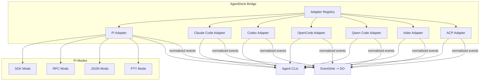

# Phase 06 — Agent Adapters & Event Normalization

**Objective:** Build adapter implementations for each coding agent (Claude Code, Codex, OpenCode, Qwen Code, Pi, Aider, ACP) that normalize native agent events into the AgentDeck event model. Each adapter implements the `HarnessAdapter` interface and maps agent-specific output to `AgentDeckEvent` types.

**Prerequisites:** Phase 04 (bridge with PTY + event sink), Phase 05 (terminal streaming).

---

## Current State

- `@agentdeck/harness` exists with the `HarnessAdapter` and `HarnessSessionHandle` contracts, adapter registry, and normalized event-draft helpers.
- Bridge adapters exist for Claude Code, Codex, OpenCode, Qwen Code, Pi, Aider, and ACP.
- Pi uses a mode-selection strategy for `sdk`, `rpc`, `json`, and `pty` runner paths. SDK mode is process-backed until a stable Pi SDK dependency is pinned.
- Pi structured events are normalized into AgentDeck core event types. Unknown native event names are dropped rather than persisted or rendered.
- PTY-backed adapters reuse the Phase 05 `TerminalSession`, so live terminal output, resize, stdin, and jump-in leases remain on the same path.
- Bridge startup and CLI probing use the registered adapter interface.
- The web terminal dock renders normalized agent/message/tool/approval events as structured cards instead of raw terminal text.

---

## Target State

```text
- HarnessAdapter interface defined in @agentdeck/harness package
- 7 adapter implementations: Claude Code, Codex, OpenCode, Qwen, Pi (4 modes), Aider, ACP
- Each adapter normalizes native events to AgentDeckEvent
- Pi adapter supports 4 modes: SDK, RPC, JSON, PTY
- Steering and follow-up messages work for all interactive adapters
- Agent events render as structured cards in the UI (not raw terminal text)
- Native event names never leak outside the adapter package
```

---

## High-Level Design



### Adapter normalization rule

```text
Native stdout/stderr       → terminal.stdout / terminal.stderr
Native assistant delta     → message.assistant_delta
Native assistant end       → message.assistant_end
Native tool start          → tool.start
Native tool output         → tool.delta
Native tool end            → tool.end
Native approval request    → approval.requested
Native final message       → run.agent_end
Process exit               → terminal.closed
```

---

## Low-Level Design

### 1. `@agentdeck/harness` package

**`packages/harness/package.json`:**

```jsonc
{
  "name": "@agentdeck/harness",
  "version": "0.1.0",
  "private": true,
  "type": "module",
  "main": "./src/index.ts",
  "types": "./src/index.ts",
  "dependencies": {
    "@agentdeck/core": "workspace:*"
  }
}
```

### 2. HarnessAdapter interface

**`packages/harness/src/types.ts`:**

```ts
import type { AgentDeckEvent } from "@agentdeck/core";

export type AgentKind = "claude-code" | "codex" | "opencode" | "qwen-code" | "pi" | "aider" | "acp" | "custom";

export type ProbeResult = {
  found: boolean;
  agentKind: AgentKind;
  command?: string;
  version?: string;
  installSource?: "path" | "npm" | "brew" | "pipx" | "cargo" | "winget" | "manual";
  authStatus: "unknown" | "configured" | "missing" | "expired";
  capabilities: string[];
  warnings: string[];
  suggestedFix?: string;
};

export type HarnessSessionContext = {
  runId: string;
  sessionId: string;
  workspaceId: string;
  cwd: string;
  worktreePath?: string;
  privacyMode: "local-only" | "metadata-only" | "full-sync";
};

export type HarnessTask = {
  prompt: string;
  model?: string;
  provider?: string;
  images?: Array<{ mimeType: string; base64: string }>;
};

export type UserSteeringMessage = {
  kind: "steer-now" | "follow-up";
  content: string;
  deliveryPolicy: "after-current-tool" | "after-current-turn" | "after-run-completes";
};

export type TerminalInput = {
  data: string;
  userId: string;
};

export type ApprovalDecision = {
  status: "approved" | "rejected";
  notes?: string;
};

export type EventSink = {
  emit(event: AgentDeckEvent): void;
  flush(): Promise<void>;
};

export interface HarnessAdapter {
  readonly id: string;
  readonly displayName: string;
  readonly kind: AgentKind;

  probe(): Promise<ProbeResult>;
  createSession(ctx: HarnessSessionContext): Promise<HarnessSessionHandle>;
}

export interface HarnessSessionHandle {
  readonly runId: string;
  readonly agentKind: AgentKind;

  start(task: HarnessTask, sink: EventSink): Promise<void>;
  sendUserMessage(message: UserSteeringMessage): Promise<void>;
  sendTerminalInput(input: TerminalInput): Promise<void>;
  approve(requestId: string, decision: ApprovalDecision): Promise<void>;
  pause(): Promise<void>;
  resume(): Promise<void>;
  cancel(reason: string): Promise<void>;
  dispose(): Promise<void>;
}
```

### 3. Adapter registry

**`packages/harness/src/registry.ts`:**

```ts
import type { HarnessAdapter, AgentKind } from "./types.js";

export class AdapterRegistry {
  private adapters = new Map<AgentKind, HarnessAdapter>();

  register(adapter: HarnessAdapter): void {
    this.adapters.set(adapter.kind, adapter);
  }

  get(kind: AgentKind): HarnessAdapter | undefined {
    return this.adapters.get(kind);
  }

  require(kind: AgentKind): HarnessAdapter {
    const adapter = this.adapters.get(kind);
    if (!adapter) throw new Error(`No adapter registered for ${kind}`);
    return adapter;
  }

  list(): HarnessAdapter[] {
    return [...this.adapters.values()];
  }
}
```

### 4. Claude Code adapter (PTY-based)

**`apps/bridge/src/agents/claude-code.adapter.ts`:**

```ts
import { execa } from "execa";
import { homedir } from "os";
import { join } from "path";
import { access, constants } from "fs/promises";
import type {
  HarnessAdapter, HarnessSessionHandle, HarnessSessionContext,
  ProbeResult, HarnessTask, EventSink, UserSteeringMessage,
  TerminalInput, ApprovalDecision,
} from "@agentdeck/harness";
import type { PtyManager } from "../pty/pty-manager.js";
import { redact } from "../redaction/secrets.js";

export class ClaudeCodeAdapter implements HarnessAdapter {
  readonly id = "claude-code";
  readonly displayName = "Claude Code";
  readonly kind = "claude-code" as const;

  constructor(private readonly ptyManager: PtyManager) {}

  async probe(): Promise<ProbeResult> {
    try {
      const { stdout } = await execa("claude", ["--version"], { reject: false });
      const configExists = await pathExists(join(homedir(), ".claude", "config.json"));
      return {
        found: true,
        agentKind: "claude-code",
        command: "claude",
        version: stdout.trim() || undefined,
        installSource: "path",
        authStatus: configExists ? "configured" : "unknown",
        capabilities: ["terminal", "repo-aware", "code-edit", "bash", "mcp", "json-events", "model-switching"],
        warnings: [],
      };
    } catch {
      return {
        found: false,
        agentKind: "claude-code",
        authStatus: "unknown",
        capabilities: [],
        warnings: ["claude not found on PATH"],
        suggestedFix: "Install Claude Code: npm install -g @anthropic-ai/claude-code",
      };
    }
  }

  async createSession(ctx: HarnessSessionContext): Promise<HarnessSessionHandle> {
    return new ClaudeCodeSession(this.ptyManager, ctx);
  }
}

class ClaudeCodeSession implements HarnessSessionHandle {
  readonly runId: string;
  readonly agentKind = "claude-code" as const;
  private pty: any = null;
  private sink?: EventSink;

  constructor(
    private readonly ptyManager: PtyManager,
    private readonly ctx: HarnessSessionContext
  ) {
    this.runId = ctx.runId;
  }

  async start(task: HarnessTask, sink: EventSink): Promise<void> {
    this.sink = sink;
    const args = ["--print", task.prompt];
    if (task.model) args.push("--model", task.model);

    this.pty = this.ptyManager.spawn("claude", args, {
      cwd: this.ctx.worktreePath ?? this.ctx.cwd,
      env: { ...process.env, CLAUDE_CODE_ENTRYPOINT: "agentdeck" },
    });

    this.pty.onData((data: string) => {
      sink.emit({
        type: "terminal.stdout",
        runId: this.runId,
        payload: { data: redact(data) },
      } as any);
    });

    this.pty.onExit((exit: { exitCode: number }) => {
      sink.emit({
        type: "terminal.closed",
        runId: this.runId,
        payload: { exitCode: exit.exitCode },
      } as any);
    });

    sink.emit({
      type: "agent.started",
      runId: this.runId,
      payload: { agent: "claude-code", task: task.prompt },
    } as any);
  }

  async sendUserMessage(message: UserSteeringMessage): Promise<void> {
    if (message.kind === "steer-now") {
      this.pty?.write(message.content + "\n");
    }
    // Follow-up: queue for after current run
  }

  async sendTerminalInput(input: TerminalInput): Promise<void> {
    this.pty?.write(input.data);
  }

  async approve(_requestId: string, _decision: ApprovalDecision): Promise<void> {
    // Claude Code approval via stdin
  }

  async pause(): Promise<void> {
    this.pty?.write("\x03"); // SIGINT
  }

  async resume(): Promise<void> {
    // No-op for PTY mode
  }

  async cancel(reason: string): Promise<void> {
    this.pty?.kill("SIGTERM");
  }

  async dispose(): Promise<void> {
    this.pty?.kill();
  }
}

async function pathExists(p: string): Promise<boolean> {
  try {
    await access(p, constants.F_OK);
    return true;
  } catch {
    return false;
  }
}
```

### 5. Pi adapter (4 modes)

**`apps/bridge/src/agents/pi/pi.adapter.ts`:**

```ts
import { execa } from "execa";
import { homedir } from "os";
import { join } from "path";
import { access, constants } from "fs/promises";
import type {
  HarnessAdapter, HarnessSessionHandle, HarnessSessionContext, ProbeResult,
} from "@agentdeck/harness";
import type { PtyManager } from "../../pty/pty-manager.js";
import { PiSdkRunner } from "./pi.sdk-runner.js";
import { PiRpcRunner } from "./pi.rpc-runner.js";
import { PiJsonRunner } from "./pi.json-runner.js";
import { PiPtyRunner } from "./pi.pty-runner.js";
import { selectPiMode, type PiRunMode } from "./pi.mode-selection.js";

export class PiAdapter implements HarnessAdapter {
  readonly id = "pi";
  readonly displayName = "Pi";
  readonly kind = "pi" as const;

  constructor(private readonly ptyManager: PtyManager) {}

  async probe(): Promise<ProbeResult> {
    try {
      const { stdout } = await execa("pi", ["--version"], { reject: false });
      const authExists = await pathExists(join(homedir(), ".pi", "agent", "auth.json"));
      return {
        found: true,
        agentKind: "pi",
        command: "pi",
        version: stdout.trim() || undefined,
        installSource: "path",
        authStatus: authExists ? "configured" : "unknown",
        capabilities: [
          "terminal", "json-events", "rpc", "sdk", "repo-aware",
          "code-edit", "bash", "model-switching", "session-branching",
          "message-queue", "custom-tools",
        ],
        warnings: [],
      };
    } catch {
      return {
        found: false,
        agentKind: "pi",
        authStatus: "unknown",
        capabilities: [],
        warnings: ["pi not found on PATH"],
        suggestedFix: "Install Pi: see https://pi.dev/docs/latest",
      };
    }
  }

  async createSession(ctx: HarnessSessionContext): Promise<HarnessSessionHandle> {
    const mode = selectPiMode({
      requiresRealTerminal: ctx.privacyMode === "local-only",
      requiresUserJumpIn: false,
      requiresProcessIsolation: false,
      bridgeRuntime: "node",
      isOneShotQueueJob: false,
      needsCustomAgentDeckTools: true,
    });

    return new PiSession(this.ptyManager, ctx, mode);
  }
}

class PiSession implements HarnessSessionHandle {
  readonly runId: string;
  readonly agentKind = "pi" as const;
  private runner: PiSdkRunner | PiRpcRunner | PiJsonRunner | PiPtyRunner | null = null;

  constructor(
    private readonly ptyManager: PtyManager,
    private readonly ctx: HarnessSessionContext,
    private readonly mode: PiRunMode
  ) {
    this.runId = ctx.runId;
  }

  async start(task: any, sink: any): Promise<void> {
    switch (this.mode) {
      case "sdk":
        this.runner = new PiSdkRunner(this.ctx, sink);
        break;
      case "rpc":
        this.runner = new PiRpcRunner(this.ctx, sink);
        break;
      case "json":
        this.runner = new PiJsonRunner(this.ctx, sink);
        break;
      case "pty":
        this.runner = new PiPtyRunner(this.ptyManager, this.ctx, sink);
        break;
    }
    await this.runner.start(task);
  }

  async sendUserMessage(message: any): Promise<void> {
    if (message.kind === "steer-now") await this.runner?.steer(message.content);
    else await this.runner?.followUp(message.content);
  }

  async sendTerminalInput(input: any): Promise<void> {
    await this.runner?.sendTerminalInput?.(input.data);
  }

  async approve(requestId: string, decision: any): Promise<void> {
    await this.runner?.approve?.(requestId, decision);
  }

  async pause(): Promise<void> { await this.runner?.pause?.(); }
  async resume(): Promise<void> { await this.runner?.resume?.(); }
  async cancel(reason: string): Promise<void> { await this.runner?.cancel?.(reason); }
  async dispose(): Promise<void> { await this.runner?.dispose?.(); }
}

async function pathExists(p: string): Promise<boolean> {
  try { await access(p, constants.F_OK); return true; } catch { return false; }
}
```

### 6. Pi mode selection

**`apps/bridge/src/agents/pi/pi.mode-selection.ts`:**

```ts
export type PiRunMode = "sdk" | "rpc" | "json" | "pty";

export function selectPiMode(input: {
  requiresRealTerminal: boolean;
  requiresUserJumpIn: boolean;
  requiresProcessIsolation: boolean;
  bridgeRuntime: "node" | "rust" | "tauri" | "go";
  isOneShotQueueJob: boolean;
  needsCustomAgentDeckTools: boolean;
}): PiRunMode {
  if (input.requiresRealTerminal || input.requiresUserJumpIn) return "pty";
  if (input.requiresProcessIsolation || input.bridgeRuntime !== "node") return "rpc";
  if (input.isOneShotQueueJob && !input.needsCustomAgentDeckTools) return "json";
  return "sdk";
}
```

### 7. Pi event normalization

**`apps/bridge/src/agents/pi/pi.events.ts`:**

```ts
import type { AgentDeckEvent } from "@agentdeck/core";
import { redact, redactStructured } from "../../redaction/secrets.js";

export function mapPiEventToAgentDeck(event: any, runId: string): AgentDeckEvent[] {
  switch (event.type) {
    case "session":
      return [{ type: "agent.session.started", runId, payload: { nativeSessionId: event.id, cwd: event.cwd } } as any];

    case "agent_start":
      return [{ type: "agent.started", runId, payload: { agent: "pi" } } as any];

    case "agent_end":
      return [{ type: "agent.ended", runId, payload: { status: "completed" } } as any];

    case "message_start":
      return [{ type: "message.assistant_start", runId, payload: { role: "assistant" } } as any];

    case "message_update": {
      const inner = event.assistantMessageEvent;
      if (inner?.type === "text_delta") {
        return [{ type: "message.assistant_delta", runId, payload: { delta: inner.delta } } as any];
      }
      if (inner?.type === "thinking_delta") {
        return [{ type: "message.assistant_delta", runId, payload: { delta: inner.delta, visibility: "internal" } } as any];
      }
      return [];
    }

    case "message_end":
      return [{ type: "message.assistant_end", runId, payload: {} } as any];

    case "tool_execution_start":
      return [{
        type: "tool.start",
        runId,
        payload: {
          toolCallId: event.toolCallId,
          toolName: event.toolName,
          args: redactStructured(event.args),
        },
      } as any];

    case "tool_execution_update":
      return [{
        type: "tool.delta",
        runId,
        payload: {
          toolCallId: event.toolCallId,
          partialResult: redactStructured(event.partialResult),
        },
      } as any];

    case "tool_execution_end":
      return [{
        type: "tool.end",
        runId,
        payload: {
          toolCallId: event.toolCallId,
          isError: Boolean(event.isError),
        },
      } as any];

    case "queue_update":
      return [{
        type: "message.queued",
        runId,
        payload: {
          steeringCount: event.steering?.length ?? 0,
          followUpCount: event.followUp?.length ?? 0,
        },
      } as any];

    case "compaction_start":
      return [{ type: "agent.context.compaction.started", runId, payload: { reason: event.reason } } as any];

    case "compaction_end":
      return [{ type: "agent.context.compaction.ended", runId, payload: { reason: event.reason } } as any];

    case "auto_retry_start":
      return [{ type: "agent.retry.started", runId, payload: { attempt: event.attempt } } as any];

    case "auto_retry_end":
      return [{ type: "agent.retry.ended", runId, payload: { success: event.success } } as any];

    default:
      return [{ type: "agent.native_event", runId, payload: { source: "pi", rawType: event.type } } as any];
  }
}
```

### 8. Pi RPC runner

**`apps/bridge/src/agents/pi/pi.rpc-runner.ts`:**

```ts
import { spawn } from "child_process";
import type { HarnessSessionContext, EventSink, HarnessTask } from "@agentdeck/harness";
import { mapPiEventToAgentDeck } from "./pi.events.js";
import { redact } from "../../redaction/secrets.js";

export class PiRpcRunner {
  private child: ReturnType<typeof spawn> | null = null;
  private buffer = "";

  constructor(
    private readonly ctx: HarnessSessionContext,
    private readonly sink: EventSink
  ) {}

  async start(task: HarnessTask): Promise<void> {
    const args = ["--mode", "rpc", "--no-session"];
    if (task.provider) args.push("--provider", task.provider);
    if (task.model) args.push("--model", task.model);

    this.child = spawn("pi", args, {
      cwd: this.ctx.worktreePath ?? this.ctx.cwd,
      stdio: ["pipe", "pipe", "pipe"],
    });

    this.child.stdout?.on("data", (chunk: Buffer) => this.onStdout(chunk.toString("utf8")));
    this.child.stderr?.on("data", (chunk: Buffer) => {
      this.sink.emit({
        type: "terminal.stderr",
        runId: this.ctx.runId,
        payload: { data: redact(chunk.toString("utf8")) },
      } as any);
    });

    // Send initial prompt
    this.send({ id: crypto.randomUUID(), type: "prompt", message: task.prompt });
  }

  async steer(message: string): Promise<void> {
    this.send({ id: crypto.randomUUID(), type: "steer", message });
  }

  async followUp(message: string): Promise<void> {
    this.send({ id: crypto.randomUUID(), type: "prompt", message, streamingBehavior: "followUp" });
  }

  async cancel(_reason: string): Promise<void> {
    this.child?.kill("SIGTERM");
  }

  async dispose(): Promise<void> {
    this.child?.kill();
  }

  private send(obj: unknown): void {
    this.child?.stdin?.write(JSON.stringify(obj) + "\n");
  }

  private onStdout(data: string): void {
    this.buffer += data;
    for (;;) {
      const idx = this.buffer.indexOf("\n");
      if (idx === -1) break;
      const line = this.buffer.slice(0, idx).replace(/\r$/, "");
      this.buffer = this.buffer.slice(idx + 1);
      if (!line.trim()) continue;
      try {
        const evt = JSON.parse(line);
        for (const ofEvent of mapPiEventToAgentDeck(evt, this.ctx.runId)) {
          this.sink.emit(ofEvent);
        }
      } catch {
        // Non-JSON line, treat as terminal output
        this.sink.emit({
          type: "terminal.stdout",
          runId: this.ctx.runId,
          payload: { data: redact(line + "\n") },
        } as any);
      }
    }
  }
}
```

### 9. Codex, OpenCode, Qwen, Aider adapters

These follow the same pattern as Claude Code (PTY-based with event normalization). Key differences:

| Agent | Command | Special handling |
|---|---|---|
| Codex | `codex` | Config profile support; `--config` flag |
| OpenCode | `opencode` | ACP support; JSON event mode when available |
| Qwen Code | `qwen` | Basic PTY; no structured events |
| Aider | `aider` | Patch-driven; `--yes` flag for non-interactive |

Each adapter is ~100-150 lines following the `ClaudeCodeAdapter` template.

### 10. ACP adapter (JSON-RPC stdio)

**`apps/bridge/src/agents/acp.adapter.ts`:**

```ts
import { spawn } from "child_process";
import type { HarnessAdapter, HarnessSessionHandle, HarnessSessionContext, ProbeResult } from "@agentdeck/harness";

export class AcpAdapter implements HarnessAdapter {
  readonly id = "acp";
  readonly displayName = "ACP Agent";
  readonly kind = "acp" as const;

  async probe(): Promise<ProbeResult> {
    // ACP agents are discovered via config, not PATH
    return {
      found: false,
      agentKind: "acp",
      authStatus: "unknown",
      capabilities: ["acp", "json-events", "rpc"],
      warnings: ["ACP agents require explicit configuration"],
    };
  }

  async createSession(ctx: HarnessSessionContext): Promise<HarnessSessionHandle> {
    return new AcpSession(ctx);
  }
}

class AcpSession implements HarnessSessionHandle {
  readonly runId: string;
  readonly agentKind = "acp" as const;

  constructor(private readonly ctx: HarnessSessionContext) {
    this.runId = ctx.runId;
  }

  async start(task: any, sink: any): Promise<void> {
    // ACP uses JSON-RPC over stdio
    // Implement ACP protocol: initialize, task, events
  }

  async sendUserMessage(message: any): Promise<void> {}
  async sendTerminalInput(input: any): Promise<void> {}
  async approve(requestId: string, decision: any): Promise<void> {}
  async pause(): Promise<void> {}
  async resume(): Promise<void> {}
  async cancel(reason: string): Promise<void> {}
  async dispose(): Promise<void> {}
}
```

---

## Design Patterns

| Pattern | Application |
|---|---|
| **Adapter** | Each adapter wraps a different agent CLI and exposes a uniform `HarnessAdapter` + `HarnessSessionHandle` interface. |
| **Strategy** | Pi adapter selects between 4 execution modes (SDK/RPC/JSON/PTY) using `selectPiMode()`. |
| **Registry** | `AdapterRegistry` maps `AgentKind` to `HarnessAdapter`. New adapters are registered without modifying existing code. |
| **Mapper / Translator** | `mapPiEventToAgentDeck()` translates Pi event names to AgentDeck event types. Native names never leak. |
| **Factory** | `createSession()` on each adapter is a factory method that produces a `HarnessSessionHandle`. |

## SOLID / DRY Compliance

- **SRP:** Each adapter handles one agent. Event mappers handle one translation. The registry only maps kinds to adapters.
- **OCP:** New adapters are added as new files + registry registration. No existing adapter is modified.
- **LSP:** Any `HarnessSessionHandle` can replace any other. The bridge calls `start()`, `sendUserMessage()`, `cancel()` without knowing which agent is running.
- **ISP:** `HarnessSessionHandle` is split into `start`, `sendUserMessage`, `sendTerminalInput`, `approve`, `pause`, `resume`, `cancel`, `dispose`. Adapters that don't support a method (e.g., Aider has no `approve`) implement it as a no-op.
- **DIP:** Bridge depends on `HarnessAdapter` interface, not on `ClaudeCodeAdapter` or `PiAdapter` concretely.
- **DRY:** Event normalization is per-adapter (one mapper per agent). The `HarnessAdapter` interface is defined once in `@agentdeck/harness`. Redaction is in `@agentdeck/redaction` (one place).

---

## Testing Strategy

| Level | What | Tool |
|---|---|---|
| Unit | Pi event mapper (all event types) | vitest |
| Unit | Pi mode selection (all input combinations) | vitest |
| Unit | Pi RPC runner JSONL framing (split on \n, handle partial) | vitest |
| Unit | Claude Code probe (found/not found) | vitest + execa mock |
| Unit | Adapter registry (register/get/require/list) | vitest |
| Integration | Pi RPC runner with mock pi process | vitest + spawn mock |
| Integration | Claude Code adapter with mock PTY | vitest + pty mock |
| E2E | Run `pi --mode json "hello"` through adapter | vitest (requires pi installed) |

---

## Implementation Steps

1. Create `packages/harness/` with `HarnessAdapter` interface, `AdapterRegistry`, types
2. Create `apps/bridge/src/agents/claude-code.adapter.ts`
3. Create `apps/bridge/src/agents/codex.adapter.ts`
4. Create `apps/bridge/src/agents/opencode.adapter.ts`
5. Create `apps/bridge/src/agents/qwen-code.adapter.ts`
6. Create `apps/bridge/src/agents/aider.adapter.ts`
7. Create `apps/bridge/src/agents/acp.adapter.ts`
8. Create `apps/bridge/src/agents/pi/` directory with:
   - `pi.adapter.ts`, `pi.mode-selection.ts`, `pi.events.ts`
   - `pi.sdk-runner.ts`, `pi.rpc-runner.ts`, `pi.json-runner.ts`, `pi.pty-runner.ts`
9. Register all adapters in bridge startup
10. Write unit tests for event mappers and mode selection
11. Write integration tests with mock processes
12. Run `pnpm typecheck && pnpm lint && pnpm test && pnpm build`
13. Test manually: run a task with each installed agent

---

## Acceptance Criteria

```text
[x] @agentdeck/harness package exists with HarnessAdapter interface
[x] AdapterRegistry can register and retrieve adapters by kind
[x] Claude Code adapter probes and runs in PTY mode
[x] Codex adapter probes and runs in PTY mode
[x] OpenCode adapter probes and runs in PTY mode
[x] Qwen Code adapter probes and runs in PTY mode
[x] Aider adapter probes and runs in PTY mode
[x] Pi adapter supports 4 modes (SDK, RPC, JSON, PTY)
[x] Pi event mapper converts supported Pi event types to AgentDeck events
[x] Native agent event names never appear in UI or D1
[x] Steering messages work for interactive adapters
[x] Follow-up messages work for interactive adapters
[x] All adapters implement dispose() for cleanup
[x] Unit tests pass for event mappers, mode selection, registry, probe helpers, JSONL framing, and PTY adapter behavior
[x] pnpm build passes
```

---

## Risks & Mitigations

| Risk | Mitigation |
|---|---|
| Agent CLI output format changes | Version probing; adapter tests pin to known versions; graceful fallback for unknown output |
| Pi SDK API changes | Pin `@earendil-works/pi-coding-agent` version; SDK mode is optional (RPC/JSON/PTY are stable) |
| PTY output parsing is fragile | Use structured event modes (JSON/RPC) where available; fall back to raw PTY only for jump-in |
| Agent crashes mid-run | `onExit` handler emits `terminal.closed`; bridge marks run as failed; DO notifies browser |
| Steering not supported by some agents | Check capabilities; hide steer/follow-up UI for agents that don't support it |
