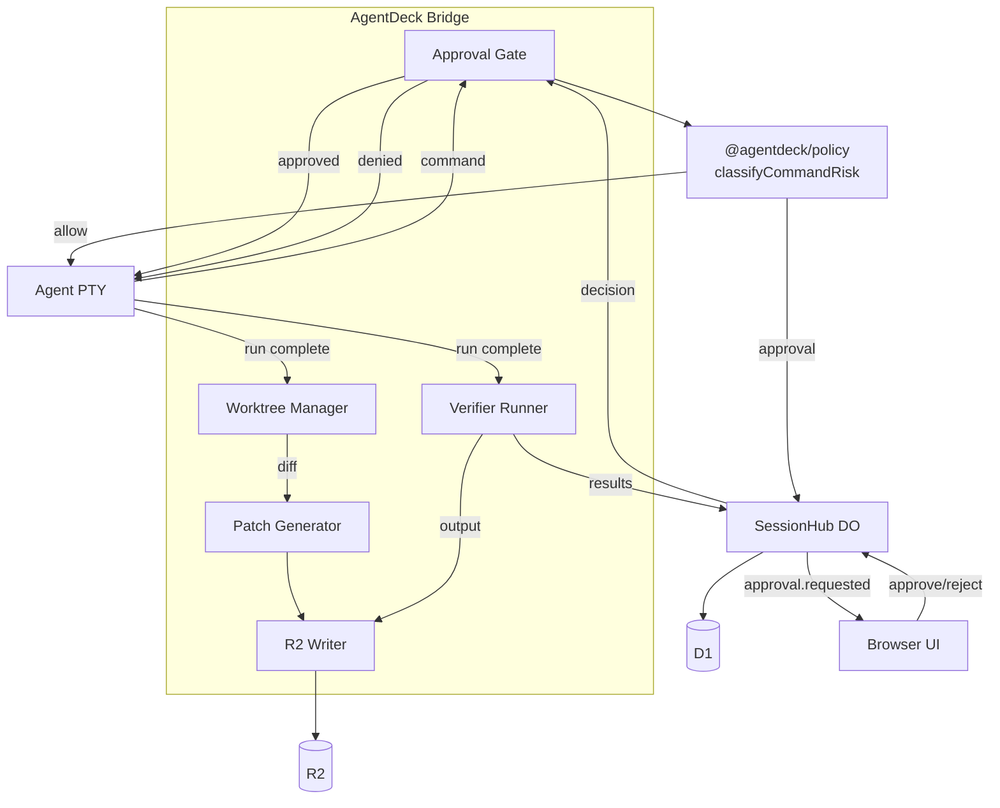
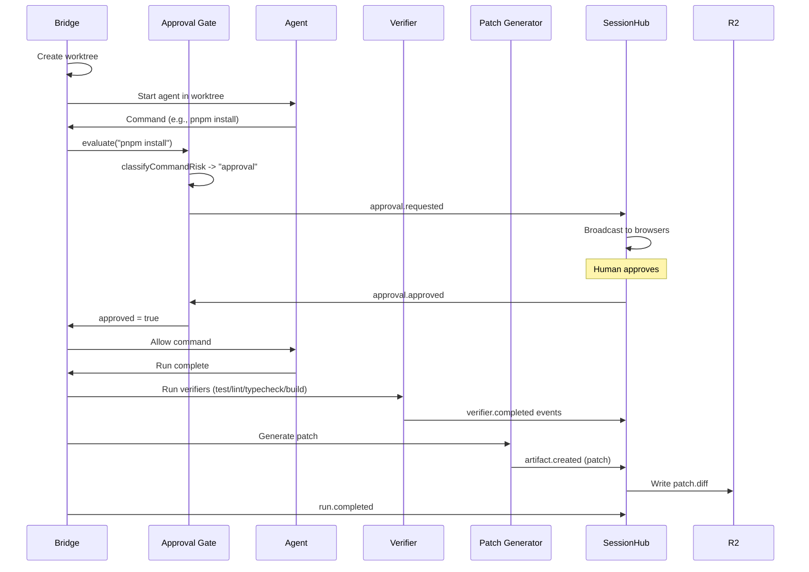

# Phase 07 — Policy, Verification, Worktrees & Artifacts

**Objective:** Implement the full safety and verification pipeline: command approval gates that block risky commands until a human decides, git worktree isolation for every run, deterministic verifier runners (test/build/lint/typecheck), patch artifact generation, and the R2 write path for terminal logs, transcripts, and patches.

**Prerequisites:** Phase 06 (agent adapters producing events).

---

## Current State

- `classifyCommandRisk()` exists in `@agentdeck/policy` — classifies commands into allow/approval/deny.
- `getPrivacyStorageDecision()` exists — determines D1/R2/live-stream behavior per privacy mode.
- State machines exist for approval and run transitions.
- No approval gate is wired at runtime. No worktree creation. No verifier execution. No R2 writes. No patch generation.
- The D1 `approvals` table and `artifacts` table exist but are unused.

---

## Target State

```text
- Approval gate: bridge blocks risky commands, emits approval.requested, waits for human decision
- Worktree manager: every run gets an isolated git worktree by default
- Verifier runners: auto-detect and run test/build/lint/typecheck per language
- Patch artifacts: generate diff, store in R2, metadata in D1
- R2 write path: terminal logs, transcripts, verifier output, patches
- Privacy mode enforced: local-only blocks R2, metadata-only redacts, full-sync allows
```

---

## High-Level Design



---

## Low-Level Design

### 1. Approval gate

**`apps/bridge/src/policy/approval-gate.ts`:**

```ts
import { classifyCommandRisk, type PolicyDecision } from "@agentdeck/policy";
import type { EventSink } from "@agentdeck/harness";

export type ApprovalRequest = {
  id: string;
  command: string;
  decision: PolicyDecision;
  status: "pending" | "approved" | "rejected" | "expired";
};

export class ApprovalGate {
  private pending = new Map<string, { resolve: (approved: boolean) => void; timer: ReturnType<typeof setTimeout> }>();
  private readonly timeoutMs = 5 * 60 * 1000; // 5 minutes

  constructor(private readonly sink: EventSink) {}

  /**
   * Evaluate a command. If allowed, returns immediately.
   * If approval required, emits approval.requested and blocks until decision.
   * If denied, returns false immediately.
   */
  async evaluate(command: string, runId: string): Promise<boolean> {
    const decision = classifyCommandRisk(command);

    if (decision.decision === "allow") {
      return true;
    }

    if (decision.decision === "deny") {
      this.sink.emit({
        type: "approval.rejected",
        runId,
        payload: { command, reason: decision.reason, risk: decision.risk },
      } as any);
      return false;
    }

    // approval required — block and wait
    const approvalId = crypto.randomUUID();
    this.sink.emit({
      type: "approval.requested",
      runId,
      payload: {
        approvalId,
        command,
        reason: decision.reason,
        risk: decision.risk,
        kind: "command",
      },
    } as any);

    return this.waitForDecision(approvalId);
  }

  private waitForDecision(approvalId: string): Promise<boolean> {
    return new Promise((resolve) => {
      const timer = setTimeout(() => {
        this.pending.delete(approvalId);
        resolve(false); // expired
      }, this.timeoutMs);

      this.pending.set(approvalId, { resolve, timer });
    });
  }

  /** Called when DO sends approval.decide event */
  resolveApproval(approvalId: string, approved: boolean): void {
    const entry = this.pending.get(approvalId);
    if (!entry) return;
    clearTimeout(entry.timer);
    this.pending.delete(approvalId);
    entry.resolve(approved);
  }
}
```

### 2. Worktree manager (enhanced)

**`apps/bridge/src/repo/worktree.ts`:**

```ts
import simpleGit from "simple-git";
import { join, basename } from "path";
import { mkdir, rm } from "fs/promises";

export type WorktreeInfo = {
  path: string;
  branchName: string;
  baseCommit: string;
};

export class WorktreeManager {
  private readonly worktreeBase: string;

  constructor(repoPath: string) {
    this.worktreeBase = join(repoPath, "..", "agentdeck-worktrees", basename(repoPath));
  }

  async create(runId: string, targetBranch: string): Promise<WorktreeInfo> {
    const git = simpleGit();
    const branchName = `agentdeck/run-${runId.slice(0, 8)}`;
    const worktreePath = join(this.worktreeBase, `run_${runId}`);

    await mkdir(worktreePath, { recursive: true });

    // Create worktree from target branch
    await git.raw(["worktree", "add", worktreePath, "-b", branchName, targetBranch]);

    // Get base commit
    const worktreeGit = simpleGit(worktreePath);
    const baseCommit = (await worktreeGit.revparse(["HEAD"])).trim();

    return { path: worktreePath, branchName, baseCommit };
  }

  async remove(worktreePath: string): Promise<void> {
    const git = simpleGit();
    await git.raw(["worktree", "remove", worktreePath, "--force"]).catch(() => {});
    await rm(worktreePath, { recursive: true, force: true }).catch(() => {});
  }

  async generateDiff(worktreePath: string): Promise<{ diff: string; filesChanged: number; additions: number; deletions: number }> {
    const git = simpleGit(worktreePath);
    const diff = await git.diff();
    const status = await git.status();
    return {
      diff,
      filesChanged: status.files.length,
      additions: status.staged.length + status.not_added.length,
      deletions: status.deleted.length,
    };
  }

  async getChangedFiles(worktreePath: string): Promise<string[]> {
    const git = simpleGit(worktreePath);
    const status = await git.status();
    return [...status.staged, ...status.not_added, ...status.deleted, ...status.modified];
  }
}
```

### 3. Verifier runner

**`packages/verifier/src/index.ts`:**

```ts
export interface Verifier {
  readonly id: string;
  readonly displayName: string;
  detect(repoPath: string): Promise<boolean>;
  run(ctx: VerifyContext): Promise<VerifierResult>;
}

export type VerifyContext = {
  repoPath: string;
  sink: { emit(event: unknown): void };
};

export type VerifierResult = {
  id: string;
  kind: "test" | "typecheck" | "lint" | "build";
  command: string;
  status: "passed" | "failed" | "skipped" | "cancelled";
  exitCode?: number;
  durationMs: number;
  output: string;
  summary: string;
};
```

**`packages/verifier/src/detect.ts`:**

```ts
import { access } from "fs/promises";
import { join } from "path";

export async function detectVerifiers(repoPath: string): Promise<string[]> {
  const detected: string[] = [];

  // Node/TypeScript
  if (await exists(join(repoPath, "package.json"))) {
    detected.push("node");
  }
  // Python
  if (await exists(join(repoPath, "pyproject.toml")) || await exists(join(repoPath, "pytest.ini"))) {
    detected.push("python");
  }
  // Go
  if (await exists(join(repoPath, "go.mod"))) {
    detected.push("go");
  }
  // Rust
  if (await exists(join(repoPath, "Cargo.toml"))) {
    detected.push("rust");
  }

  return detected;
}

async function exists(p: string): Promise<boolean> {
  try { await access(p); return true; } catch { return false; }
}
```

**`packages/verifier/src/node.ts`:**

```ts
import { execa } from "execa";
import { readFile } from "fs/promises";
import { join } from "path";
import type { Verifier, VerifyContext, VerifierResult } from "./index.js";

export class NodeVerifier implements Verifier {
  readonly id = "node";
  readonly displayName = "Node.js / TypeScript";

  async detect(repoPath: string): Promise<boolean> {
    try { await readFile(join(repoPath, "package.json")); return true; } catch { return false; }
  }

  async run(ctx: VerifyContext): Promise<VerifierResult[]> {
    const pkg = JSON.parse(await readFile(join(ctx.repoPath, "package.json"), "utf-8"));
    const scripts = pkg.scripts ?? {};
    const results: VerifierResult[] = [];

    const commands: Array<{ kind: VerifierResult["kind"]; script: string; command: string }> = [
      { kind: "typecheck", script: "typecheck", command: "npm run typecheck" },
      { kind: "lint", script: "lint", command: "npm run lint" },
      { kind: "test", script: "test", command: "npm test" },
      { kind: "build", script: "build", command: "npm run build" },
    ];

    for (const { kind, script, command } of commands) {
      if (!scripts[script]) {
        results.push({
          id: crypto.randomUUID(), kind, command, status: "skipped",
          durationMs: 0, output: "", summary: `No "${script}" script in package.json`,
        });
        continue;
      }

      const start = Date.now();
      try {
        const { stdout } = await execa(command, [], { shell: true, cwd: ctx.repoPath, reject: false });
        results.push({
          id: crypto.randomUUID(), kind, command, status: "passed",
          exitCode: 0, durationMs: Date.now() - start, output: stdout,
          summary: `${kind} passed in ${Date.now() - start}ms`,
        });
      } catch (err: any) {
        results.push({
          id: crypto.randomUUID(), kind, command, status: "failed",
          exitCode: err.exitCode, durationMs: Date.now() - start, output: err.stdout + err.stderr,
          summary: `${kind} failed with exit code ${err.exitCode}`,
        });
      }
    }

    return results;
  }
}
```

### 4. Patch artifact generator

**`apps/bridge/src/repo/patch-generator.ts`:**

```ts
import type { WorktreeManager } from "./worktree.js";
import type { EventSink } from "@agentdeck/harness";
import { redact } from "../redaction/secrets.js";

export type PatchArtifact = {
  id: string;
  runId: string;
  baseCommit: string;
  diff: string;
  filesChanged: number;
  additions: number;
  deletions: number;
  riskScore: number;
};

export class PatchGenerator {
  constructor(
    private readonly worktree: WorktreeManager,
    private readonly sink: EventSink
  ) {}

  async generate(runId: string, worktreePath: string, baseCommit: string): Promise<PatchArtifact> {
    const { diff, filesChanged, additions, deletions } = await this.worktree.generateDiff(worktreePath);

    const artifact: PatchArtifact = {
      id: crypto.randomUUID(),
      runId,
      baseCommit,
      diff: redact(diff),
      filesChanged,
      additions,
      deletions,
      riskScore: this.calculateRiskScore(filesChanged, additions, deletions),
    };

    this.sink.emit({
      type: "artifact.created",
      runId,
      payload: {
        artifactId: artifact.id,
        kind: "patch-diff",
        filesChanged,
        additions,
        deletions,
        riskScore: artifact.riskScore,
      },
    } as any);

    return artifact;
  }

  private calculateRiskScore(filesChanged: number, additions: number, deletions: number): number {
    // Simple heuristic: more changes = higher risk
    const changeVolume = additions + deletions;
    if (changeVolume > 500 || filesChanged > 20) return 4; // critical
    if (changeVolume > 200 || filesChanged > 10) return 3; // high
    if (changeVolume > 50 || filesChanged > 3) return 2;  // medium
    return 1; // low
  }
}
```

### 5. R2 writer (bridge -> DO -> R2)

The bridge sends large payloads to the DO, which writes them to R2 and stores the object key in D1.

**`apps/bridge/src/stream/r2-writer.ts`:**

```ts
import type { EventSink } from "@agentdeck/harness";
import { redact } from "../redaction/secrets.js";
import { getPrivacyStorageDecision } from "@agentdeck/policy";

export class R2Writer {
  constructor(
    private readonly sink: EventSink,
    private readonly privacyMode: "local-only" | "metadata-only" | "full-sync"
  ) {}

  async writeTerminalLog(runId: string, sessionId: string, workspaceId: string, data: string): Promise<void> {
    const decision = getPrivacyStorageDecision(this.privacyMode);
    if (decision.r2 === "blocked") return; // local-only: don't sync

    const payload = decision.r2 === "redacted" ? redact(data) : data;
    const objectKey = `workspaces/${workspaceId}/sessions/${sessionId}/terminal/${runId}.ansi.zst`;

    this.sink.emit({
      type: "artifact.upload",
      runId,
      payload: {
        objectKey,
        kind: "terminal-log",
        data: payload,
        mimeType: "application/octet-stream",
      },
    } as any);
  }

  async writeTranscript(runId: string, sessionId: string, workspaceId: string, events: unknown[]): Promise<void> {
    const decision = getPrivacyStorageDecision(this.privacyMode);
    if (decision.r2 === "blocked") return;

    const data = JSON.stringify(events);
    const payload = decision.r2 === "redacted" ? redact(data) : data;
    const objectKey = `workspaces/${workspaceId}/sessions/${sessionId}/transcripts/${runId}.jsonl.zst`;

    this.sink.emit({
      type: "artifact.upload",
      runId,
      payload: { objectKey, kind: "transcript", data: payload, mimeType: "application/json" },
    } as any);
  }

  async writePatch(runId: string, sessionId: string, workspaceId: string, diff: string): Promise<void> {
    const objectKey = `workspaces/${workspaceId}/sessions/${sessionId}/artifacts/${crypto.randomUUID()}/patch.diff`;
    this.sink.emit({
      type: "artifact.upload",
      runId,
      payload: { objectKey, kind: "patch-diff", data: diff, mimeType: "text/plain" },
    } as any);
  }

  async writeVerifierOutput(runId: string, sessionId: string, workspaceId: string, output: string): Promise<void> {
    const objectKey = `workspaces/${workspaceId}/sessions/${sessionId}/artifacts/${crypto.randomUUID()}/verifier-output.txt`;
    this.sink.emit({
      type: "artifact.upload",
      runId,
      payload: { objectKey, kind: "verifier-output", data: output, mimeType: "text/plain" },
    } as any);
  }
}
```

### 6. DO-side R2 write handler

In the SessionHub DO (Phase 03), add handling for `artifact.upload` events:

```ts
// In SessionHub.handleBridgeMessage()
case "artifact.upload": {
  const { objectKey, data, kind, mimeType } = message.payload;
  // Write to R2
  await this.env.AGENTDECK_ARTIFACTS.put(objectKey, data);

  // Store metadata in D1
  const repos = createAgentDeckRepositories(this.env.AGENTDECK_DB);
  await repos.artifacts.create({
    id: crypto.randomUUID(),
    workspaceId: this.getWorkspaceId(),
    sessionId: this.getSessionId(),
    runId: message.runId,
    kind,
    objectKey,
    mimeType,
    sizeBytes: new TextEncoder().encode(data).length,
    sha256: await this.sha256(data),
    redactionStatus: "redacted",
  });

  // Broadcast artifact.created event
  this.broadcast({ ...message, type: "artifact.created" });
  break;
}
```

### 7. Full run lifecycle with policy + verification



---

## Design Patterns

| Pattern | Application |
|---|---|
| **Policy engine** | `ApprovalGate` uses `classifyCommandRisk` as the decision strategy. Gate blocks until decision. |
| **Strategy** | Verifiers implement a common `Verifier` interface. Node/Python/Go/Rust verifiers are interchangeable. |
| **Template method** | Verifier run follows: detect -> run commands -> collect results -> emit events. Each language overrides the command list. |
| **Repository** | D1 `artifacts` repository stores R2 object metadata. R2 stores the actual content. |
| **Decorator** | `R2Writer` decorates data with redaction and privacy-mode filtering before writing. |
| **Factory** | `detectVerifiers()` factory returns the appropriate verifier list for the repo. |

## SOLID / DRY Compliance

- **SRP:** `ApprovalGate` only gates commands. `WorktreeManager` only manages worktrees. `NodeVerifier` only runs Node commands. `PatchGenerator` only generates patches. `R2Writer` only writes to R2.
- **OCP:** New verifiers (Java, Docker) are added as new classes implementing `Verifier`. No existing verifier is modified.
- **LSP:** Any `Verifier` can replace any other. The bridge calls `verifier.run()` without knowing the language.
- **ISP:** `Verifier` interface has only `detect()` and `run()`. No verifier depends on bridge internals.
- **DIP:** `ApprovalGate` depends on `classifyCommandRisk` (abstraction in `@agentdeck/policy`), not on bridge-specific logic.
- **DRY:** Risk classification is in `@agentdeck/policy` (one place). Privacy decisions are in `@agentdeck/policy` (one place). Redaction is in `@agentdeck/redaction` (one place). Worktree logic is in `WorktreeManager` (one place).

---

## Testing Strategy

| Level | What | Tool |
|---|---|---|
| Unit | Approval gate (allow/approval/deny paths) | vitest |
| Unit | Approval gate timeout (5 min expiry) | vitest (fake timers) |
| Unit | Worktree create/remove/diff | vitest + simple-git mock |
| Unit | Node verifier (all 4 commands, pass/fail/skip) | vitest + execa mock |
| Unit | Patch generator (diff, risk score) | vitest |
| Unit | R2 writer (privacy mode filtering) | vitest |
| Unit | Redaction in patch output | vitest |
| Integration | Full run: worktree -> agent -> verify -> patch | vitest + mocks |

---

## Implementation Steps

1. Create `packages/verifier/` with `Verifier` interface, `detectVerifiers()`, `NodeVerifier`
2. Add `PythonVerifier`, `GoVerifier`, `RustVerifier` (same pattern as Node)
3. Create `apps/bridge/src/policy/approval-gate.ts`
4. Enhance `apps/bridge/src/repo/worktree.ts` with full WorktreeManager
5. Create `apps/bridge/src/repo/patch-generator.ts`
6. Create `apps/bridge/src/stream/r2-writer.ts`
7. Add `artifact.upload` handler in SessionHub DO (writes to R2 + D1)
8. Wire approval gate into bridge run lifecycle
9. Wire verifier runner after agent completion
10. Wire patch generator after verifier
11. Wire R2 writer for terminal logs, transcripts, patches, verifier output
12. Write unit tests for all modules
13. Run `pnpm typecheck && pnpm lint && pnpm test && pnpm build`
14. Test manually: run a task, verify approval gate blocks `pnpm install`, verify worktree is created, verify patch is generated

---

## Acceptance Criteria

```text
[ ] Approval gate blocks "approval" commands until human decides
[ ] Approval gate blocks "deny" commands immediately
[ ] Approval gate allows "allow" commands immediately
[ ] Approval gate times out after 5 minutes
[ ] Worktree is created for every run (isolated branch)
[ ] Worktree is cleaned up after run completes
[ ] Node verifier runs typecheck/lint/test/build when scripts exist
[ ] Verifier skips commands that don't exist in package.json
[ ] Patch artifact is generated with diff, files changed, risk score
[ ] Terminal logs are written to R2 (when privacy mode allows)
[ ] Patches are written to R2
[ ] Verifier output is written to R2
[ ] Local-only mode blocks all R2 writes
[ ] Metadata-only mode redacts before R2 write
[ ] Full-sync mode writes without redaction
[ ] D1 artifacts table has metadata for every R2 object
[ ] Unit tests pass with >80% coverage
[ ] pnpm build passes
```

---

## Risks & Mitigations

| Risk | Mitigation |
|---|---|
| Worktree creation fails (dirty tree, branch conflict) | Check git status first; ask user; fallback to running in main worktree with warning |
| Verifier command hangs | Set timeout (5 min); kill process; emit `verifier.failed` |
| R2 write fails | Retry with backoff; store locally in bridge; flush on reconnect |
| Approval gate blocks forever | 5-minute timeout; emit `approval.expired`; cancel run |
| Large diffs overwhelm R2 | Compress with zstd; chunk large files; set size limits |
| Secret in diff | Redact diff before R2 write; scan with redaction patterns |