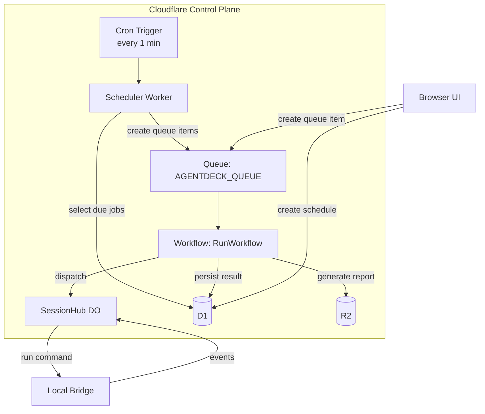
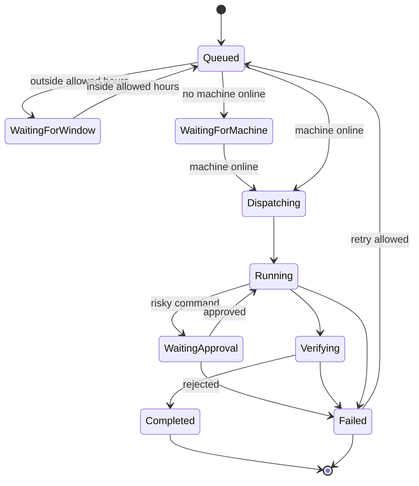

# Phase 08 — Queue, Workflows & Schedules

**Objective:** Build the overnight build queue, scheduled recurring jobs, and durable multi-step orchestration using Cloudflare Queues, Workflows, and Cron Triggers. Enable developers to queue tasks for overnight execution, schedule recurring jobs, and receive morning decision reports.

**Prerequisites:** Phase 02 (D1/R2/Worker API), Phase 07 (policy + verification + worktrees).

---

## Current State

- D1 `queue_items` and `scheduled_jobs` tables exist with full schema.
- Worker API endpoints for queue and schedule CRUD exist (Phase 02).
- No Cloudflare Queues binding. No Workflows. No Cron Triggers in `wrangler.jsonc`.
- No queue consumer worker. No scheduler worker. No workflow code.
- Queue and schedule data is mock only — nothing actually executes.

---

## Target State

```text
- Cloudflare Queue bound as AGENTDECK_QUEUE
- Queue consumer worker processes queue items
- Cloudflare Workflow orchestrates multi-step runs (dispatch -> execute -> verify -> report)
- Cron Trigger fires scheduler worker on schedule
- Queue items dispatch to available machines via SessionHub DO
- Scheduled jobs create queue items on cron schedule
- Morning decision reports generated automatically
- Offline machines: queue items wait in "waiting-machine" state
- DLQ (dead-letter queue) for failed items
```

---

## High-Level Design



### Queue item lifecycle



---

## Low-Level Design

### 1. Cloudflare bindings in `wrangler.jsonc`

```jsonc
{
  "queues": {
    "producers": [
      {
        "binding": "AGENTDECK_QUEUE",
        "queue": "agentdeck-runs"
      }
    ],
    "consumers": [
      {
        "queue": "agentdeck-runs",
        "max_batch_size": 1,
        "max_concurrency: 5
      }
    ]
  },
  "workflows": [
    {
      "name": "RUN_WORKFLOW",
      "binding": "RUN_WORKFLOW",
      "class_name": "RunWorkflow"
    }
  ],
  "triggers": {
    "crons": ["* * * * *"]
  }
}
```

### 2. Scheduler worker (Cron Trigger)

**`apps/web/src/workers/scheduler.ts`:**

```ts
import { getRepositories } from "@/lib/cloudflare-context";

export async function scheduled(_event: ScheduledEvent, env: Env): Promise<void> {
  const repos = await getRepositories(env);

  // 1. Find scheduled jobs that are due
  const dueJobs = await repos.scheduledJobs.findDue(new Date().toISOString());

  for (const job of dueJobs) {
    // Create a queue item from the schedule template
    const queueItemId = crypto.randomUUID();
    await repos.queue.create({
      id: queueItemId,
      workspaceId: job.workspaceId,
      createdBy: "scheduler",
      task: job.taskTemplate,
      priority: "normal",
      status: "queued",
      agentSelectorJson: job.agentSelectorJson,
      machineSelectorJson: job.machineSelectorJson,
    });

    // Enqueue to Cloudflare Queue
    await env.AGENTDECK_QUEUE.send({
      type: "queue.item",
      queueItemId,
      scheduledJobId: job.id,
    });

    // Update schedule's next_run_at
    await repos.scheduledJobs.updateNextRun(job.id, calculateNextRun(job.cron, job.timezone));
  }
}

function calculateNextRun(cron: string, timezone: string): string {
  // Use a cron parser (e.g., cron-parser) to compute next run
  // ...
  return new Date(Date.now() + 86400000).toISOString();
}
```

### 3. RunWorkflow (Cloudflare Workflow)

**`apps/web/src/workers/run-workflow.ts`:**

```ts
import { WorkflowEntrypoint } from "cloudflare:workers";
import { WorkflowStep } from "cloudflare:workers";

export class RunWorkflow extends WorkflowEntrypoint<Env, Params> {
  async run(step: WorkflowStep, params: Params): Promise<WorkflowResult> {
    const { queueItemId, workspaceId, sessionId } = params;

    // Step 1: Check machine availability
    const machine = await step.do("check-machine", async () => {
      const repos = createAgentDeckRepositories(this.env.AGENTDECK_DB);
      const machines = await repos.machines.listOnline(workspaceId);
      if (machines.length === 0) {
        // Wait and retry
        await step.sleep("wait-for-machine", "1 minute");
        return null;
      }
      return machines[0];
    });

    if (!machine) {
      // Mark as waiting-for-machine
      await step.do("mark-waiting", async () => {
        const repos = createAgentDeckRepositories(this.env.AGENTDECK_DB);
        await repos.queue.updateStatus(queueItemId, "waiting-machine");
      });
      // Retry up to 3 times with 5-minute backoff
      return { status: "waiting-machine" };
    }

    // Step 2: Dispatch to bridge via SessionHub DO
    const runId = await step.do("dispatch-run", async () => {
      const doId = this.env.SESSION_HUB.idFromName(sessionId);
      const stub = this.env.SESSION_HUB.get(doId);

      const response = await stub.fetch(`http://internal/dispatch`, {
        method: "POST",
        body: JSON.stringify({
          queueItemId,
          machineId: machine.id,
          task: params.task,
        }),
      });
      const result = await response.json();
      return result.runId;
    });

    // Step 3: Wait for run to complete (with timeout)
    const result = await step.do("wait-for-completion", async () => {
      // Poll DO for run status, with 30-minute timeout
      const deadline = Date.now() + 30 * 60 * 1000;
      while (Date.now() < deadline) {
        const repos = createAgentDeckRepositories(this.env.AGENTDECK_DB);
        const run = await repos.runs.findById(runId);
        if (run?.status === "completed" || run?.status === "failed") {
          return run;
        }
        await new Promise((r) => setTimeout(r, 5000)); // poll every 5s
      }
      return { status: "timeout" };
    });

    // Step 4: Generate decision report
    if (result.status === "completed") {
      await step.do("generate-report", async () => {
        const repos = createAgentDeckRepositories(this.env.AGENTDECK_DB);
        const events = await repos.events.listBySession(sessionId, { limit: 1000 });
        const artifacts = await repos.artifacts.listBySession(sessionId);
        const approvals = await repos.approvals.listByRun(runId);

        const report = {
          id: crypto.randomUUID(),
          workspaceId,
          sessionId,
          summary: `Run completed: ${params.task}`,
          recommendation: "accept",
          confidence: 0.85,
          costUsd: 0.05,
          latencyMs: Date.now() - params.startedAt,
          reportJson: JSON.stringify({ events: events.length, artifacts: artifacts.length, approvals: approvals.length }),
        };

        await repos.decisionReports.create(report);

        // Write full report to R2
        const objectKey = `workspaces/${workspaceId}/reports/${report.id}.json`;
        await this.env.AGENTDECK_ARTIFACTS.put(objectKey, JSON.stringify(report));

        return report;
      });
    }

    // Step 5: Update queue item status
    await step.do("update-queue-status", async () => {
      const repos = createAgentDeckRepositories(this.env.AGENTDECK_DB);
      await repos.queue.updateStatus(queueItemId, result.status === "completed" ? "completed" : "failed");
    });

    return { status: result.status, runId };
  }
}
```

### 4. Queue consumer worker

**`apps/web/src/workers/queue-consumer.ts`:**

```ts
import { RunWorkflow } from "./run-workflow";

export async function queue(
  batch: Message<QueueMessage>[],
  env: Env
): Promise<void> {
  for (const message of batch) {
    const { type, queueItemId, scheduledJobId } = message.body;

    if (type === "queue.item") {
      // Start a workflow for this queue item
      const instance = await env.RUN_WORKFLOW.create({
        params: {
          queueItemId,
          workspaceId: message.body.workspaceId,
          sessionId: message.body.sessionId ?? crypto.randomUUID(),
          task: message.body.task,
          startedAt: Date.now(),
        },
      });

      // Store workflow ID for tracking
      const repos = createAgentDeckRepositories(env.AGENTDECK_DB);
      await repos.queue.update(queueItemId, {
        status: "running",
        workflowId: instance.id,
      });

      message.ack();
    }
  }
}
```

### 5. Queue policy enforcement

**`apps/web/src/lib/queue-policy.ts`:**

```ts
export type QueuePolicy = {
  maxConcurrentRunsPerMachine: number;
  allowedHours: Array<{ days: string[]; start: string; end: string; timezone: string }>;
  requireCleanWorktree: boolean;
  useGitWorktrees: boolean;
  requireApprovalBeforeInstall: boolean;
  requireApprovalBeforeNetwork: boolean;
  requireApprovalBeforeGitPush: true;
  autoCreateReport: boolean;
};

export function isWithinAllowedHours(
  policy: QueuePolicy,
  now: Date,
  timezone: string
): boolean {
  if (policy.allowedHours.length === 0) return true; // no restriction

  const dayName = now.toLocaleDateString("en-US", { weekday: "long", timeZone: timezone });
  const timeStr = now.toLocaleTimeString("en-US", { hour12: false, timeZone: timezone, hour: "2-digit", minute: "2-digit" });

  for (const window of policy.allowedHours) {
    if (!window.days.includes(dayName)) continue;
    if (timeStr >= window.start && timeStr <= window.end) return true;
  }
  return false;
}

export function shouldDispatch(
  policy: QueuePolicy,
  machineOnline: boolean,
  concurrentRuns: number,
  now: Date,
  timezone: string
): { dispatch: boolean; reason: string } {
  if (!machineOnline) return { dispatch: false, reason: "No machine online" };
  if (concurrentRuns >= policy.maxConcurrentRunsPerMachine) {
    return { dispatch: false, reason: "Max concurrent runs reached" };
  }
  if (!isWithinAllowedHours(policy, now, timezone)) {
    return { dispatch: false, reason: "Outside allowed hours" };
  }
  return { dispatch: true, reason: "OK" };
}
```

### 6. Morning report generator

**`apps/web/src/workers/morning-report.ts`:**

```ts
export async function generateMorningReport(env: Env, workspaceId: string): Promise<string> {
  const repos = createAgentDeckRepositories(env.AGENTDECK_DB);

  // Get all queue items from the last 24 hours
  const since = new Date(Date.now() - 24 * 60 * 60 * 1000).toISOString();
  const queueItems = await repos.queue.listByWorkspaceSince(workspaceId, since);

  const completed = queueItems.filter((q) => q.status === "completed");
  const failed = queueItems.filter((q) => q.status === "failed");
  const pending = queueItems.filter((q) => q.status === "queued" || q.status === "waiting-machine");

  const report = `# AgentDeck Morning Report — ${new Date().toLocaleDateString()}

## Summary
- Completed: ${completed.length}
- Failed: ${failed.length}
- Pending: ${pending.length}

## Completed Runs
${completed.map((q) => `- ✅ ${q.task}`).join("\n")}

## Failed Runs
${failed.map((q) => `- ❌ ${q.task}`).join("\n")}

## Pending
${pending.map((q) => `- ⏳ ${q.task} (${q.status})`).join("\n")}

## Pending Approvals
Check the Mission Control dashboard for any approvals waiting on your decision.
`;

  // Write to R2
  const objectKey = `workspaces/${workspaceId}/queue/${new Date().toISOString().slice(0, 10)}/morning-summary.md`;
  await env.AGENTDECK_ARTIFACTS.put(objectKey, report);

  return report;
}
```

### 7. Natural-language schedule builder

**`apps/web/src/lib/schedule-parser.ts`:**

```ts
export function parseNaturalLanguageSchedule(input: string): { cron: string; timezone: string } | null {
  const lower = input.toLowerCase();

  // "every weekday at 1 AM IST"
  const weekdayMatch = lower.match(/every weekday at (\d{1,2})\s*(am|pm)?\s*(\w+)?/);
  if (weekdayMatch) {
    let hour = parseInt(weekdayMatch[1]);
    if (weekdayMatch[2] === "pm" && hour !== 12) hour += 12;
    if (weekdayMatch[2] === "am" && hour === 12) hour = 0;
    return { cron: `0 ${hour} * * 1-5`, timezone: weekdayMatch[3] ?? "UTC" };
  }

  // "every monday at 9 AM"
  const dayMatch = lower.match(/every (monday|tuesday|wednesday|thursday|friday|saturday|sunday) at (\d{1,2})\s*(am|pm)?/);
  if (dayMatch) {
    const dayMap: Record<string, number> = {
      sunday: 0, monday: 1, tuesday: 2, wednesday: 3, thursday: 4, friday: 5, saturday: 6,
    };
    const day = dayMap[dayMatch[1]];
    let hour = parseInt(dayMatch[2]);
    if (dayMatch[3] === "pm" && hour !== 12) hour += 12;
    return { cron: `0 ${hour} * * ${day}`, timezone: "UTC" };
  }

  // "every day at 8:30 AM"
  const dailyMatch = lower.match(/every day at (\d{1,2}):(\d{2})\s*(am|pm)?/);
  if (dailyMatch) {
    let hour = parseInt(dailyMatch[1]);
    const minute = parseInt(dailyMatch[2]);
    if (dailyMatch[3] === "pm" && hour !== 12) hour += 12;
    return { cron: `${minute} ${hour} * * *`, timezone: "UTC" };
  }

  return null;
}
```

---

## Design Patterns

| Pattern | Application |
|---|---|
| **Saga / Workflow** | `RunWorkflow` is a saga: check-machine -> dispatch -> wait -> verify -> report -> update. Each step is durable and resumable. |
| **Command** | Queue messages are commands: `{ type: "queue.item", queueItemId, ... }`. |
| **Strategy** | `shouldDispatch()` is a strategy for dispatch decisions based on queue policy. |
| **Scheduler** | Cron Trigger is the scheduler. It creates queue items from schedule templates. |
| **Observer** | Workflow observes run status by polling DO. DO broadcasts events to browsers. |
| **Dead Letter Queue** | Failed messages go to DLQ after max retries. |

## SOLID / DRY Compliance

- **SRP:** Scheduler creates queue items. Queue consumer starts workflows. Workflow orchestrates one run. Morning report generator creates reports. Each has one job.
- **OCP:** New workflow steps are added without modifying existing steps. New schedule patterns are added to the parser without modifying existing patterns.
- **LSP:** Any `QueueMessage` can be processed by the consumer. Any `Params` can be processed by the workflow.
- **DIP:** Workflow depends on repository interface, not on D1 directly. Queue consumer depends on workflow interface.
- **DRY:** Queue policy is in one place (`queue-policy.ts`). Schedule parsing is in one place (`schedule-parser.ts`). Report generation is in one place (`morning-report.ts`).

---

## Testing Strategy

| Level | What | Tool |
|---|---|---|
| Unit | Queue policy (allowed hours, concurrency, machine check) | vitest |
| Unit | Schedule parser (all natural language patterns) | vitest |
| Unit | Morning report generation | vitest + D1 stub |
| Unit | Cron next-run calculation | vitest |
| Integration | Queue -> workflow -> DO dispatch | vitest + miniflare |
| Integration | Cron trigger -> scheduler -> queue | vitest + miniflare |
| Integration | Workflow retry on machine offline | vitest + miniflare |

---

## Implementation Steps

1. Add Queues, Workflows, and Cron Triggers bindings to `wrangler.jsonc`
2. Run `npm run cf-typegen`
3. Create `apps/web/src/workers/scheduler.ts` (Cron handler)
4. Create `apps/web/src/workers/run-workflow.ts` (RunWorkflow class)
5. Create `apps/web/src/workers/queue-consumer.ts` (Queue consumer)
6. Create `apps/web/src/lib/queue-policy.ts`
7. Create `apps/web/src/lib/schedule-parser.ts`
8. Create `apps/web/src/workers/morning-report.ts`
9. Wire scheduler export in Next.js config or separate worker entry
10. Write unit tests for policy, parser, report
11. Write integration tests with miniflare
12. Run `pnpm typecheck && pnpm lint && pnpm test && pnpm build`
13. Test: create a queue item, verify workflow dispatches to bridge

---

## Acceptance Criteria

```text
[ ] Cloudflare Queue AGENTDECK_QUEUE is bound and consuming
[ ] RunWorkflow class is bound and can be started
[ ] Cron Trigger fires every minute and checks for due schedules
[ ] Scheduler creates queue items from due scheduled jobs
[ ] Queue consumer starts a RunWorkflow for each queue item
[ ] RunWorkflow dispatches to bridge via SessionHub DO
[ ] RunWorkflow waits for completion with 30-minute timeout
[ ] RunWorkflow generates decision report on completion
[ ] RunWorkflow updates queue item status on completion/failure
[ ] Queue policy enforces allowed hours and concurrency limits
[ ] Offline machines: queue items stay in "waiting-machine" state
[ ] Morning report is generated and stored in R2
[ ] Natural-language schedule parser handles common patterns
[ ] DLQ catches failed messages after max retries
[ ] Unit and integration tests pass
[ ] pnpm build passes
```

---

## Risks & Mitigations

| Risk | Mitigation |
|---|---|
| Workflow step fails mid-run | Workflows are durable; step retries automatically; idempotent steps |
| Machine goes offline during run | Workflow detects via DO; marks run as failed; queue item can retry |
| Cron fires duplicate jobs | Use `next_run_at` check; atomic update with `WHERE next_run_at <= now` |
| Queue backlog grows | Monitor queue depth; alert; scale consumers; prioritize urgent items |
| Workflow timeout (30 min) | Configurable per queue item; long tasks use `step.sleep()` for waiting |
| R2 report write fails | Retry in workflow step; fallback to D1-only report |