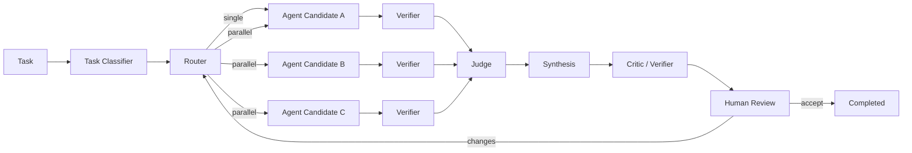

# Phase 09 — Multi-Agent Orchestration & Decision Reports

**Objective:** Build the multi-agent orchestration pipeline that routes tasks to one or more agents, runs them in isolated worktrees, compares candidate outputs, judges results, synthesizes a final patch, and generates a comprehensive decision report.

**Prerequisites:** Phase 06 (agent adapters), Phase 07 (verification + worktrees).

---

## Current State

- Single-agent runs work (one agent per session).
- No task classifier. No router. No candidate comparison. No judge. No synthesis.
- Decision report type exists in `@agentdeck/core` but is mock only.
- No multi-agent orchestration logic exists.

---

## Target State

```text
- Task classifier categorizes task complexity (simple/medium/hard/critical)
- Router selects strategy: single, cascade, parallel-candidates, local-only, frontier-fallback
- Multiple agents run in parallel in isolated worktrees
- Judge scores candidates using deterministic verification + LLM evaluation
- Synthesis creates final patch or recommends one candidate
- Decision report includes: task, agents, timeline, commands, files, tests, approvals, cost, recommendation
- Candidate comparison table in UI
```

---

## High-Level Design



### Scoring model

```text
Final score =
  0.35 deterministic verification
  + 0.20 correctness against task
  + 0.15 minimality/maintainability
  + 0.10 safety/risk
  + 0.10 human preference or policy fit
  + 0.10 cost/latency efficiency
```

For coding tasks, deterministic verification dominates LLM judge preference.

---

## Low-Level Design

### 1. Task classifier

**`packages/harness/src/classifier.ts`:**

```ts
export type TaskComplexity = "simple" | "medium" | "hard" | "critical";

export type TaskClassification = {
  complexity: TaskComplexity;
  category: "bugfix" | "feature" | "refactor" | "test-generation" | "dependency-update" | "docs" | "migration";
  suggestedStrategy: RoutingStrategy;
  reason: string;
};

export type RoutingStrategy = "single" | "cascade" | "parallel-candidates" | "local-only" | "frontier-fallback";

export function classifyTask(task: string): TaskClassification {
  const lower = task.toLowerCase();

  // Critical: migrations, deploys, security
  if (/(migrat|deploy|security|credential|production|database)/.test(lower)) {
    return {
      complexity: "critical",
      category: "migration",
      suggestedStrategy: "frontier-fallback",
      reason: "Critical task requires planning, approval, and verification",
    };
  }

  // Hard: multi-file refactors, architecture changes
  if (/(refactor|architect|rewrite|redesign|overhaul)/.test(lower)) {
    return {
      complexity: "hard",
      category: "refactor",
      suggestedStrategy: "parallel-candidates",
      reason: "Hard task benefits from multiple candidate approaches",
    };
  }

  // Medium: bug fixes with context
  if (/(fix|bug|error|fail|broken|issue)/.test(lower)) {
    return {
      complexity: "medium",
      category: "bugfix",
      suggestedStrategy: "single",
      reason: "Medium task: one agent + verifier",
    };
  }

  // Simple: tests, docs, small changes
  if (/(test|doc|comment|rename|format)/.test(lower)) {
    return {
      complexity: "simple",
      category: lower.includes("test") ? "test-generation" : "docs",
      suggestedStrategy: "single",
      reason: "Simple task: one fast agent",
    };
  }

  // Default: medium
  return {
    complexity: "medium",
    category: "feature",
    suggestedStrategy: "single",
    reason: "Default: one agent + verifier",
  };
}
```

### 2. Router

**`packages/harness/src/router.ts`:**

```ts
import type { TaskClassification, RoutingStrategy } from "./classifier.js";
import type { AgentKind } from "./types.js";

export type RoutingDecision = {
  strategy: RoutingStrategy;
  candidates: AgentCandidate[];
  budgetUsd: number;
  latencyBudgetMs: number;
  privacyMode: "local-only" | "metadata-only" | "full-sync";
  reason: string;
};

export type AgentCandidate = {
  agentKind: AgentKind;
  model?: string;
  provider?: string;
  worktreeBranch: string;
};

export function route(
  classification: TaskClassification,
  availableAgents: AgentKind[],
  privacyMode: "local-only" | "metadata-only" | "full-sync"
): RoutingDecision {
  // Filter agents by privacy mode
  const eligibleAgents = privacyMode === "local-only"
    ? availableAgents.filter((a) => a === "pi" || a === "opencode") // local-first agents
    : availableAgents;

  switch (classification.suggestedStrategy) {
    case "single":
      return {
        strategy: "single",
        candidates: [{ agentKind: eligibleAgents[0] ?? "claude-code", worktreeBranch: "candidate-a" }],
        budgetUsd: 0.50,
        latencyBudgetMs: 5 * 60 * 1000,
        privacyMode,
        reason: `Single agent for ${classification.complexity} task`,
      };

    case "parallel-candidates": {
      const candidates: AgentCandidate[] = eligibleAgents.slice(0, 3).map((agent, i) => ({
        agentKind: agent,
        worktreeBranch: `candidate-${String.fromCharCode(97 + i)}`,
      }));
      return {
        strategy: "parallel-candidates",
        candidates,
        budgetUsd: 2.00,
        latencyBudgetMs: 15 * 60 * 1000,
        privacyMode,
        reason: `Parallel candidates for ${classification.complexity} task`,
      };
    }

    case "frontier-fallback":
      return {
        strategy: "frontier-fallback",
        candidates: [
          { agentKind: "claude-code", worktreeBranch: "candidate-a" },
          { agentKind: "codex", worktreeBranch: "candidate-b" },
        ],
        budgetUsd: 5.00,
        latencyBudgetMs: 30 * 60 * 1000,
        privacyMode,
        reason: "Critical task: plan first, approval, candidates, verification",
      };

    case "cascade":
      return {
        strategy: "cascade",
        candidates: eligibleAgents.map((agent, i) => ({
          agentKind: agent,
          worktreeBranch: `candidate-${String.fromCharCode(97 + i)}`,
        })),
        budgetUsd: 1.50,
        latencyBudgetMs: 10 * 60 * 1000,
        privacyMode,
        reason: "Cascade: try cheaper first, escalate on failure",
      };

    default:
      return {
        strategy: "single",
        candidates: [{ agentKind: "claude-code", worktreeBranch: "candidate-a" }],
        budgetUsd: 0.50,
        latencyBudgetMs: 5 * 60 * 1000,
        privacyMode,
        reason: "Default single agent",
      };
  }
}
```

### 3. Candidate runner

**`apps/bridge/src/orchestration/candidate-runner.ts`:**

```ts
import type { HarnessAdapter, HarnessSessionHandle, EventSink, HarnessTask } from "@agentdeck/harness";
import type { WorktreeManager } from "../repo/worktree.js";
import type { AgentCandidate } from "@agentdeck/harness";

export type CandidateResult = {
  candidateId: string;
  agentKind: string;
  runId: string;
  worktreePath: string;
  status: "completed" | "failed" | "cancelled";
  diff?: string;
  verifierResults?: any[];
  costUsd?: number;
  latencyMs: number;
  score?: number;
};

export class CandidateRunner {
  constructor(
    private readonly adapters: Map<string, HarnessAdapter>,
    private readonly worktree: WorktreeManager,
    private readonly repoPath: string
  ) {}

  async runCandidate(
    candidate: AgentCandidate,
    task: HarnessTask,
    sink: EventSink,
    targetBranch: string
  ): Promise<CandidateResult> {
    const candidateId = crypto.randomUUID();
    const runId = crypto.randomUUID();

    // Create isolated worktree
    const worktreeInfo = await this.worktree.create(runId, targetBranch);

    // Get adapter
    const adapter = this.adapters.get(candidate.agentKind);
    if (!adapter) throw new Error(`No adapter for ${candidate.agentKind}`);

    // Create session
    const session = await adapter.createSession({
      runId,
      sessionId: sink["sessionId"] ?? "",
      workspaceId: "",
      cwd: this.repoPath,
      worktreePath: worktreeInfo.path,
      privacyMode: "metadata-only",
    });

    // Start agent
    const start = Date.now();
    await session.start(task, sink);

    // Wait for completion (in real impl, this is event-driven)
    // ...

    // Generate diff
    const { diff } = await this.worktree.generateDiff(worktreeInfo.path);

    return {
      candidateId,
      agentKind: candidate.agentKind,
      runId,
      worktreePath: worktreeInfo.path,
      status: "completed",
      diff,
      latencyMs: Date.now() - start,
    };
  }

  async runParallel(
    candidates: AgentCandidate[],
    task: HarnessTask,
    sink: EventSink,
    targetBranch: string
  ): Promise<CandidateResult[]> {
    const results = await Promise.allSettled(
      candidates.map((c) => this.runCandidate(c, task, sink, targetBranch))
    );

    return results.map((r, i) => {
      if (r.status === "fulfilled") return r.value;
      return {
        candidateId: crypto.randomUUID(),
        agentKind: candidates[i].agentKind,
        runId: "",
        worktreePath: "",
        status: "failed" as const,
        latencyMs: 0,
      };
    });
  }
}
```

### 4. Judge

**`packages/harness/src/judge.ts`:**

```ts
import type { CandidateResult } from "./candidate-runner.js";

export type JudgeScore = {
  candidateId: string;
  totalScore: number;
  breakdown: {
    verification: number;     // 0.35 weight
    correctness: number;      // 0.20 weight
    minimality: number;       // 0.15 weight
    safety: number;           // 0.10 weight
    humanPreference: number;  // 0.10 weight
    costLatency: number;      // 0.10 weight
  };
  recommendation: "accept" | "review-carefully" | "reject" | "rerun";
};

export function judgeCandidates(results: CandidateResult[]): JudgeScore[] {
  const scores: JudgeScore[] = [];

  for (const result of results) {
    if (result.status !== "completed") {
      scores.push({
        candidateId: result.candidateId,
        totalScore: 0,
        breakdown: { verification: 0, correctness: 0, minimality: 0, safety: 0, humanPreference: 0, costLatency: 0 },
        recommendation: "reject",
      });
      continue;
    }

    // Verification score (deterministic)
    const verifierPassed = result.verifierResults?.every((v) => v.status === "passed") ?? false;
    const verificationScore = verifierPassed ? 1.0 : 0.3;

    // Minimality (fewer changes = better)
    const diffLines = result.diff?.split("\n").length ?? 0;
    const minimalityScore = diffLines < 50 ? 1.0 : diffLines < 200 ? 0.7 : 0.4;

    // Safety (no risky files changed)
    const safetyScore = 0.9; // TODO: check if diff touches protected paths

    // Cost/latency efficiency
    const costScore = result.costUsd && result.costUsd < 0.10 ? 1.0 : 0.6;
    const latencyScore = result.latencyMs < 60000 ? 1.0 : result.latencyMs < 300000 ? 0.7 : 0.4;
    const costLatencyScore = (costScore + latencyScore) / 2;

    // Correctness (placeholder — would use LLM judge in production)
    const correctnessScore = verifierPassed ? 0.85 : 0.3;

    // Human preference (neutral default)
    const humanPreferenceScore = 0.7;

    const totalScore =
      0.35 * verificationScore +
      0.20 * correctnessScore +
      0.15 * minimalityScore +
      0.10 * safetyScore +
      0.10 * humanPreferenceScore +
      0.10 * costLatencyScore;

    const recommendation: JudgeScore["recommendation"] =
      totalScore > 0.8 ? "accept" :
      totalScore > 0.5 ? "review-carefully" :
      "reject";

    scores.push({
      candidateId: result.candidateId,
      totalScore,
      breakdown: {
        verification: verificationScore,
        correctness: correctnessScore,
        minimality: minimalityScore,
        safety: safetyScore,
        humanPreference: humanPreferenceScore,
        costLatency: costLatencyScore,
      },
      recommendation,
    });
  }

  // Sort by score descending
  scores.sort((a, b) => b.totalScore - a.totalScore);
  return scores;
}
```

### 5. Synthesis

**`packages/harness/src/synthesis.ts`:**

```ts
import type { CandidateResult } from "./candidate-runner.js";
import type { JudgeScore } from "./judge.js";

export type SynthesisResult = {
  strategy: "select-best" | "merge" | "rerun";
  winningCandidateId?: string;
  finalDiff?: string;
  reason: string;
};

export function synthesize(
  candidates: CandidateResult[],
  scores: JudgeScore[]
): SynthesisResult {
  if (scores.length === 0) {
    return { strategy: "rerun", reason: "No candidates produced output" };
  }

  const best = scores[0];

  if (best.recommendation === "reject") {
    return {
      strategy: "rerun",
      reason: "All candidates scored below acceptance threshold",
    };
  }

  if (best.totalScore > 0.85) {
    const winner = candidates.find((c) => c.candidateId === best.candidateId);
    return {
      strategy: "select-best",
      winningCandidateId: best.candidateId,
      finalDiff: winner?.diff,
      reason: `Candidate ${best.candidateId} scored ${best.totalScore.toFixed(2)} — high confidence`,
    };
  }

  // For medium scores, recommend human review
  return {
    strategy: "select-best",
    winningCandidateId: best.candidateId,
    reason: `Candidate ${best.candidateId} scored ${best.totalScore.toFixed(2)} — review carefully`,
  };
}
```

### 6. Decision report generator

**`packages/harness/src/report-generator.ts`:**

```ts
import type { CandidateResult } from "./candidate-runner.js";
import type { JudgeScore } from "./judge.js";
import type { SynthesisResult } from "./synthesis.js";

export type DecisionReport = {
  id: string;
  sessionId: string;
  runIds: string[];
  task: string;
  agentsUsed: string[];
  winningCandidateId?: string;
  summary: string;
  verification: any[];
  risks: RiskFinding[];
  filesChanged: FileChangeSummary[];
  humanInterventions: HumanIntervention[];
  costUsd: number;
  latencyMs: number;
  confidence: number;
  recommendation: "accept" | "review-carefully" | "reject" | "rerun";
  candidateScores: JudgeScore[];
};

export type RiskFinding = { severity: string; description: string };
export type FileChangeSummary = { path: string; additions: number; deletions: number };
export type HumanIntervention = { type: string; description: string; timestamp: string };

export function generateDecisionReport(
  task: string,
  candidates: CandidateResult[],
  scores: JudgeScore[],
  synthesis: SynthesisResult,
  sessionId: string
): DecisionReport {
  const totalCost = candidates.reduce((sum, c) => sum + (c.costUsd ?? 0), 0);
  const maxLatency = Math.max(...candidates.map((c) => c.latencyMs));
  const winner = synthesis.winningCandidateId
    ? scores.find((s) => s.candidateId === synthesis.winningCandidateId)
    : undefined;

  return {
    id: crypto.randomUUID(),
    sessionId,
    runIds: candidates.map((c) => c.runId),
    task,
    agentsUsed: [...new Set(candidates.map((c) => c.agentKind))],
    winningCandidateId: synthesis.winningCandidateId,
    summary: synthesis.reason,
    verification: candidates.flatMap((c) => c.verifierResults ?? []),
    risks: [],
    filesChanged: [],
    humanInterventions: [],
    costUsd: totalCost,
    latencyMs: maxLatency,
    confidence: winner?.totalScore ?? 0,
    recommendation: winner?.recommendation ?? "rerun",
    candidateScores: scores,
  };
}
```

---

## Design Patterns

| Pattern | Application |
|---|---|
| **Strategy** | `RoutingStrategy` selects between single/cascade/parallel/frontier-fallback. Judge uses scoring strategy. Synthesis uses selection strategy. |
| **Pipeline** | Task -> Classify -> Route -> Run Candidates -> Verify -> Judge -> Synthesize -> Report. Each stage feeds the next. |
| **Mapper** | `generateDecisionReport()` maps candidate results + scores + synthesis into a report object. |
| **Composite** | Multiple candidates run as a composite operation. `runParallel()` manages all candidates as one unit. |
| **Observer** | Each candidate emits events to the EventSink. The DO broadcasts to browsers. |

## SOLID / DRY Compliance

- **SRP:** Classifier classifies. Router routes. CandidateRunner runs. Judge scores. Synthesis picks. ReportGenerator reports. Each has one job.
- **OCP:** New routing strategies are added to the router without modifying existing strategies. New scoring criteria are added to the judge without modifying existing criteria.
- **LSP:** Any `CandidateResult` can be judged. Any `JudgeScore` can be synthesized. No candidate-type-specific logic in judge or synthesis.
- **DIP:** Judge depends on `CandidateResult` abstraction, not on specific agent types. Router depends on `TaskClassification`, not on task text.
- **DRY:** Scoring weights are in one place (judge). Routing logic is in one place (router). Classification is in one place (classifier). No duplication.

---

## Testing Strategy

| Level | What | Tool |
|---|---|---|
| Unit | Task classifier (all complexity levels) | vitest |
| Unit | Router (all strategies) | vitest |
| Unit | Judge scoring (all weights, all recommendations) | vitest |
| Unit | Synthesis (select-best, rerun, merge) | vitest |
| Unit | Report generator (all fields populated) | vitest |
| Integration | Parallel candidates with mock adapters | vitest |
| Integration | Full pipeline: classify -> route -> run -> judge -> synthesize -> report | vitest |

---

## Implementation Steps

1. Create `packages/harness/src/classifier.ts`
2. Create `packages/harness/src/router.ts`
3. Create `apps/bridge/src/orchestration/candidate-runner.ts`
4. Create `packages/harness/src/judge.ts`
5. Create `packages/harness/src/synthesis.ts`
6. Create `packages/harness/src/report-generator.ts`
7. Wire orchestration pipeline into bridge run lifecycle
8. Add `judge.started`, `judge.scored`, `synthesis.started`, `synthesis.completed`, `report.created` events
9. Store decision report in D1 + R2
10. Write unit tests for all modules
11. Run `pnpm typecheck && pnpm lint && pnpm test && pnpm build`
12. Test: run a task with 2 agents, verify judge scores and synthesis picks winner

---

## Acceptance Criteria

```text
[ ] Task classifier categorizes tasks into simple/medium/hard/critical
[ ] Router selects strategy based on classification
[ ] Single-agent runs work (one candidate)
[ ] Parallel-candidate runs work (2-3 agents in isolated worktrees)
[ ] Judge scores candidates using the 6-factor scoring model
[ ] Synthesis selects best candidate or recommends rerun
[ ] Decision report includes: task, agents, timeline, verification, scores, recommendation
[ ] Decision report is stored in D1 (metadata) and R2 (full JSON)
[ ] report.created event is emitted
[ ] Candidate comparison data is available via API
[ ] Unit tests pass for classifier, router, judge, synthesis, report
[ ] pnpm build passes
```

---

## Risks & Mitigations

| Risk | Mitigation |
|---|---|
| Parallel candidates conflict (same worktree) | Each candidate gets its own worktree branch |
| Judge scores are inaccurate | Deterministic verification dominates (0.35 weight); LLM judge is secondary |
| Synthesis picks wrong candidate | Human review for medium scores; "review-carefully" recommendation |
| Cost exceeds budget | Router sets budget; bridge tracks cost; workflow pauses on budget exceeded |
| One candidate hangs | Per-candidate timeout; cancelled candidate scores 0 |