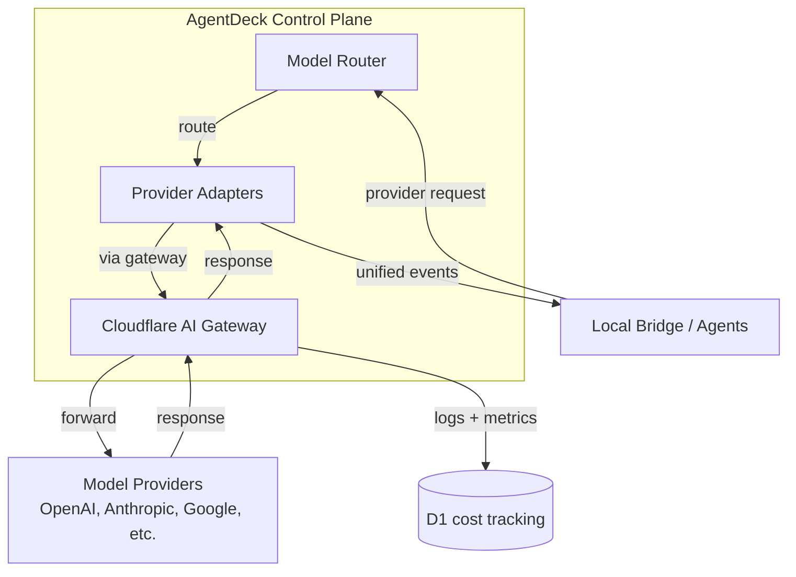

# Phase 10 — AI Gateway & Provider Abstraction

**Objective:** Build a unified provider abstraction layer that normalizes OpenAI, Anthropic, Google, Qwen, DeepSeek, Ollama, and other model providers into a common interface. Route requests through Cloudflare AI Gateway for observability, cost tracking, rate limiting, DLP scanning, and fallback.

**Prerequisites:** Phase 02 (D1/R2/Worker API), Phase 06 (agent adapters).

---

## Current State

- No provider abstraction exists. No AI Gateway integration.
- Agents call their own providers natively (Claude Code calls Anthropic, Codex calls OpenAI, etc.).
- No cost tracking, no rate limiting, no DLP scanning, no provider fallback.
- The `ai-gateway` event source is typed in `@agentdeck/core` but unused.

---

## Target State

```text
- @agentdeck/ai package with LlmProviderAdapter interface
- Provider adapters: OpenAI, Anthropic, Google, Qwen, DeepSeek, Ollama, OpenRouter
- Cloudflare AI Gateway integration for observability, cost, rate limits, DLP
- Unified AI events (ai.request.start, ai.text.delta, ai.tool_call.start, etc.)
- Provider mode selection: native, AI Gateway, BYOK, local
- Cost tracking per request, per run, per workspace
- Circuit breaker for failing providers
- DLP mode: off, request-only, request-and-response
```

---

## High-Level Design



### Provider modes

```text
1. Native provider mode
   Agent uses its own provider/auth. Good for local power users.

2. Cloudflare AI Gateway mode
   Requests route through AI Gateway. Good for observability, DLP, cost tracking, rate limits.

3. AgentDeck-managed mode
   AgentDeck calls providers directly. Good for enterprise policy, centralized secrets.

4. Local-only mode
   Only local models (Ollama, vLLM). Good for privacy-sensitive repos.
```

---

## Low-Level Design

### 1. `@agentdeck/ai` package

**`packages/ai/package.json`:**

```jsonc
{
  "name": "@agentdeck/ai",
  "version": "0.1.0",
  "private": true,
  "type": "module",
  "main": "./src/index.ts",
  "types": "./src/index.ts",
  "dependencies": {
    "@agentdeck/core": "workspace:*"
  }
}
```

### 2. Provider adapter interface

**`packages/ai/src/types.ts`:**

```ts
export type WireApi = "openai-chat" | "openai-responses" | "anthropic-messages" | "google-generate" | "custom";

export type ModelDescriptor = {
  id: string;
  displayName: string;
  contextWindow: number;
  maxOutputTokens: number;
  supportsStreaming: boolean;
  supportsToolCalls: boolean;
  supportsVision: boolean;
  costPerMtokInput?: number;
  costPerMtokOutput?: number;
};

export type ProviderContext = {
  apiKey?: string;
  gatewayUrl?: string;
  accountId?: string;
  gatewayId?: string;
};

export type UnifiedChatRequest = {
  model: string;
  messages: Array<{ role: "system" | "user" | "assistant" | "tool"; content: string }>;
  tools?: Array<{ name: string; description: string; inputSchema: unknown }>;
  temperature?: number;
  maxTokens?: number;
  stream: boolean;
};

export type CostEstimate = {
  inputTokens: number;
  outputTokens: number;
  costUsd: number;
};

export type ProviderHealth = {
  status: "healthy" | "degraded" | "down";
  latencyMs: number;
  errorRate: number;
  lastCheckedAt: string;
};

export type UnifiedAiEvent =
  | { type: "ai.request.start"; requestId: string; provider: string; model: string }
  | { type: "ai.message.start"; messageId: string; role: "assistant" }
  | { type: "ai.text.delta"; messageId: string; delta: string }
  | { type: "ai.thinking.delta"; messageId: string; delta: string; visibility: "hidden" | "summary" }
  | { type: "ai.tool_call.start"; toolCallId: string; name: string; argsPartial?: unknown }
  | { type: "ai.tool_call.delta"; toolCallId: string; argsDelta: string }
  | { type: "ai.tool_call.end"; toolCallId: string; args: unknown }
  | { type: "ai.message.end"; messageId: string; outputText?: string }
  | { type: "ai.usage"; inputTokens: number; outputTokens: number; costUsd?: number }
  | { type: "ai.request.end"; requestId: string; status: "success" | "error"; error?: string };

export interface LlmProviderAdapter {
  readonly id: string;
  readonly displayName: string;
  readonly supportedWireApis: WireApi[];

  listModels(ctx: ProviderContext): Promise<ModelDescriptor[]>;
  streamChat(request: UnifiedChatRequest, ctx: ProviderContext): AsyncIterable<UnifiedAiEvent>;
  estimateCost(request: UnifiedChatRequest, model: string): Promise<CostEstimate>;
  healthcheck(ctx: ProviderContext): Promise<ProviderHealth>;
}
```

### 3. OpenAI adapter

**`packages/ai/src/providers/openai.ts`:**

```ts
import type { LlmProviderAdapter, UnifiedChatRequest, UnifiedAiEvent, ProviderContext, ModelDescriptor, CostEstimate, ProviderHealth } from "./types.js";

export class OpenAIAdapter implements LlmProviderAdapter {
  readonly id = "openai";
  readonly displayName = "OpenAI";
  readonly supportedWireApis = ["openai-chat", "openai-responses"] as const;

  async listModels(ctx: ProviderContext): Promise<ModelDescriptor[]> {
    const url = ctx.gatewayUrl
      ? `${ctx.gatewayUrl}/openai/v1/models`
      : "https://api.openai.com/v1/models";

    const response = await fetch(url, {
      headers: { Authorization: `Bearer ${ctx.apiKey}` },
    });
    const data = await response.json();
    return data.data.map((m: any) => ({
      id: m.id,
      displayName: m.id,
      contextWindow: 128000,
      maxOutputTokens: 16384,
      supportsStreaming: true,
      supportsToolCalls: true,
      supportsVision: m.id.includes("vision") || m.id.includes("gpt-4o"),
    }));
  }

  async *streamChat(request: UnifiedChatRequest, ctx: ProviderContext): AsyncIterable<UnifiedAiEvent> {
    const requestId = crypto.randomUUID();
    const url = ctx.gatewayUrl
      ? `${ctx.gatewayUrl}/openai/v1/chat/completions`
      : "https://api.openai.com/v1/chat/completions";

    yield { type: "ai.request.start", requestId, provider: "openai", model: request.model };

    const response = await fetch(url, {
      method: "POST",
      headers: {
        "Content-Type": "application/json",
        Authorization: `Bearer ${ctx.apiKey}`,
      },
      body: JSON.stringify({
        model: request.model,
        messages: request.messages,
        tools: request.tools,
        temperature: request.temperature,
        max_tokens: request.maxTokens,
        stream: true,
      }),
    });

    if (!response.ok || !response.body) {
      yield { type: "ai.request.end", requestId, status: "error", error: `HTTP ${response.status}` };
      return;
    }

    const messageId = crypto.randomUUID();
    yield { type: "ai.message.start", messageId, role: "assistant" };

    const reader = response.body.getReader();
    const decoder = new TextDecoder();
    let buffer = "";
    let inputTokens = 0;
    let outputTokens = 0;

    for (;;) {
      const { done, value } = await reader.read();
      if (done) break;
      buffer += decoder.decode(value, { stream: true });

      const lines = buffer.split("\n");
      buffer = lines.pop() ?? "";

      for (const line of lines) {
        if (!line.startsWith("data: ")) continue;
        const data = line.slice(6);
        if (data === "[DONE]") continue;

        try {
          const chunk = JSON.parse(data);
          const delta = chunk.choices?.[0]?.delta;

          if (delta?.content) {
            yield { type: "ai.text.delta", messageId, delta: delta.content };
            outputTokens++;
          }
          if (delta?.tool_calls) {
            for (const tc of delta.tool_calls) {
              if (tc.function?.name) {
                yield { type: "ai.tool_call.start", toolCallId: tc.id, name: tc.function.name };
              }
              if (tc.function?.arguments) {
                yield { type: "ai.tool_call.delta", toolCallId: tc.id, argsDelta: tc.function.arguments };
              }
            }
          }
          if (chunk.usage) {
            inputTokens = chunk.usage.prompt_tokens;
            outputTokens = chunk.usage.completion_tokens;
          }
        } catch {
          // skip malformed chunks
        }
      }
    }

    yield { type: "ai.message.end", messageId };
    yield { type: "ai.usage", inputTokens, outputTokens };
    yield { type: "ai.request.end", requestId, status: "success" };
  }

  async estimateCost(request: UnifiedChatRequest, model: string): Promise<CostEstimate> {
    const inputTokens = request.messages.reduce((sum, m) => sum + Math.ceil(m.content.length / 4), 0);
    const outputTokens = request.maxTokens ?? 1000;
    const costPerMtokInput = model.startsWith("gpt-4") ? 30 : 0.5;
    const costPerMtokOutput = model.startsWith("gpt-4") ? 60 : 1.5;
    return {
      inputTokens,
      outputTokens,
      costUsd: (inputTokens * costPerMtokInput + outputTokens * costPerMtokOutput) / 1_000_000,
    };
  }

  async healthcheck(ctx: ProviderContext): Promise<ProviderHealth> {
    const start = Date.now();
    try {
      const response = await fetch("https://api.openai.com/v1/models", {
        headers: { Authorization: `Bearer ${ctx.apiKey}` },
      });
      return {
        status: response.ok ? "healthy" : "degraded",
        latencyMs: Date.now() - start,
        errorRate: 0,
        lastCheckedAt: new Date().toISOString(),
      };
    } catch {
      return { status: "down", latencyMs: Date.now() - start, errorRate: 1, lastCheckedAt: new Date().toISOString() };
    }
  }
}
```

### 4. Anthropic adapter

**`packages/ai/src/providers/anthropic.ts`:**

```ts
import type { LlmProviderAdapter } from "./types.js";

export class AnthropicAdapter implements LlmProviderAdapter {
  readonly id = "anthropic";
  readonly displayName = "Anthropic";
  readonly supportedWireApis = ["anthropic-messages"] as const;

  async listModels(_ctx: ProviderContext): Promise<ModelDescriptor[]> {
    return [
      { id: "claude-sonnet-4-5", displayName: "Claude Sonnet 4.5", contextWindow: 200000, maxOutputTokens: 8192, supportsStreaming: true, supportsToolCalls: true, supportsVision: true, costPerMtokInput: 3, costPerMtokOutput: 15 },
      { id: "claude-opus-4-1", displayName: "Claude Opus 4.1", contextWindow: 200000, maxOutputTokens: 8192, supportsStreaming: true, supportsToolCalls: true, supportsVision: true, costPerMtokInput: 15, costPerMtokOutput: 75 },
      { id: "claude-haiku-3-5", displayName: "Claude Haiku 3.5", contextWindow: 200000, maxOutputTokens: 8192, supportsStreaming: true, supportsToolCalls: true, supportsVision: true, costPerMtokInput: 0.8, costPerMtokOutput: 4 },
    ];
  }

  async *streamChat(request: UnifiedChatRequest, ctx: ProviderContext): AsyncIterable<UnifiedAiEvent> {
    const requestId = crypto.randomUUID();
    const url = ctx.gatewayUrl
      ? `${ctx.gatewayUrl}/anthropic/v1/messages`
      : "https://api.anthropic.com/v1/messages";

    yield { type: "ai.request.start", requestId, provider: "anthropic", model: request.model };

    const response = await fetch(url, {
      method: "POST",
      headers: {
        "Content-Type": "application/json",
        "x-api-key": ctx.apiKey ?? "",
        "anthropic-version": "2023-06-01",
      },
      body: JSON.stringify({
        model: request.model,
        messages: request.messages,
        max_tokens: request.maxTokens ?? 4096,
        stream: true,
      }),
    });

    // Parse Anthropic SSE stream...
    // (similar pattern to OpenAI but with Anthropic event types)
  }

  async estimateCost(request: UnifiedChatRequest, model: string): Promise<CostEstimate> {
    // ...
  }

  async healthcheck(ctx: ProviderContext): Promise<ProviderHealth> {
    // ...
  }
}
```

### 5. Ollama adapter (local-only)

**`packages/ai/src/providers/ollama.ts`:**

```ts
import type { LlmProviderAdapter } from "./types.js";

export class OllamaAdapter implements LlmProviderAdapter {
  readonly id = "ollama";
  readonly displayName = "Ollama (Local)";
  readonly supportedWireApis = ["openai-chat"] as const;

  async listModels(_ctx: ProviderContext): Promise<ModelDescriptor[]> {
    const response = await fetch("http://localhost:11434/api/tags");
    const data = await response.json();
    return data.models.map((m: any) => ({
      id: m.name,
      displayName: m.name,
      contextWindow: 8192,
      maxOutputTokens: 4096,
      supportsStreaming: true,
      supportsToolCalls: false,
      supportsVision: false,
      costPerMtokInput: 0,
      costPerMtokOutput: 0,
    }));
  }

  async *streamChat(request: UnifiedChatRequest, _ctx: ProviderContext): AsyncIterable<UnifiedAiEvent> {
    const response = await fetch("http://localhost:11434/v1/chat/completions", {
      method: "POST",
      headers: { "Content-Type": "application/json" },
      body: JSON.stringify({ ...request, stream: true }),
    });
    // Parse OpenAI-compatible stream from Ollama...
  }
}
```

### 6. AI Gateway configuration

**`packages/ai/src/gateway.ts`:**

```ts
export type GatewayConfig = {
  accountId: string;
  gatewayId: string;
  apiKey: string;
  dlpMode: "off" | "request-only" | "request-and-response";
  cacheEnabled: boolean;
  cacheTtlSeconds: number;
  rateLimitPerMinute: number;
};

export function buildGatewayUrl(config: GatewayConfig, provider: string): string {
  return `https://gateway.ai.cloudflare.com/v1/${config.accountId}/${config.gatewayId}/${provider}`;
}

export function buildGatewayHeaders(config: GatewayConfig): Record<string, string> {
  const headers: Record<string, string> = {
    "cf-ai-gateway-auth": config.apiKey,
  };
  if (config.cacheEnabled) {
    headers["cf-cache-status"] = "true";
    headers["cf-cache-ttl"] = String(config.cacheTtlSeconds);
  }
  return headers;
}
```

### 7. Circuit breaker

**`packages/ai/src/circuit-breaker.ts`:**

```ts
export type CircuitState = "closed" | "open" | "half-open";

export class CircuitBreaker {
  private state: CircuitState = "closed";
  private failureCount = 0;
  private lastFailureAt = 0;
  private readonly threshold: number;
  private readonly resetTimeoutMs: number;

  constructor(threshold = 5, resetTimeoutMs = 60_000) {
    this.threshold = threshold;
    this.resetTimeoutMs = resetTimeoutMs;
  }

  canExecute(): boolean {
    if (this.state === "closed") return true;
    if (this.state === "open") {
      if (Date.now() - this.lastFailureAt > this.resetTimeoutMs) {
        this.state = "half-open";
        return true;
      }
      return false;
    }
    return true; // half-open: allow one attempt
  }

  recordSuccess(): void {
    this.failureCount = 0;
    this.state = "closed";
  }

  recordFailure(): void {
    this.failureCount++;
    this.lastFailureAt = Date.now();
    if (this.failureCount >= this.threshold) {
      this.state = "open";
    }
  }

  getState(): CircuitState {
    return this.state;
  }
}
```

### 8. Cost tracking

**`packages/ai/src/cost-tracker.ts`:**

```ts
import type { UnifiedAiEvent } from "./types.js";

export type CostRecord = {
  requestId: string;
  provider: string;
  model: string;
  inputTokens: number;
  outputTokens: number;
  costUsd: number;
  timestamp: string;
};

export class CostTracker {
  private records: CostRecord[] = [];
  private totalCostUsd = 0;

  recordFromEvent(event: UnifiedAiEvent): void {
    if (event.type === "ai.usage") {
      const cost = event.costUsd ?? 0;
      this.totalCostUsd += cost;
      this.records.push({
        requestId: "",
        provider: "",
        model: "",
        inputTokens: event.inputTokens,
        outputTokens: event.outputTokens,
        costUsd: cost,
        timestamp: new Date().toISOString(),
      });
    }
  }

  getTotalCost(): number {
    return this.totalCostUsd;
  }

  getRecords(): CostRecord[] {
    return [...this.records];
  }

  reset(): void {
    this.records = [];
    this.totalCostUsd = 0;
  }
}
```

---

## Design Patterns

| Pattern | Application |
|---|---|
| **Adapter** | Each provider adapter wraps a different API (OpenAI, Anthropic, Google, Ollama) and exposes `LlmProviderAdapter`. |
| **Strategy** | Provider mode selection (native, gateway, managed, local) is a strategy. DLP mode is a strategy. |
| **Circuit breaker** | `CircuitBreaker` stops cascading failures when a provider goes down. |
| **Observer** | `streamChat()` returns an `AsyncIterable<UnifiedAiEvent>`. Consumers observe the stream. |
| **Decorator** | AI Gateway decorates the raw provider call with logging, caching, rate limiting, and DLP. |
| **Factory** | Provider registry creates the right adapter for a given provider ID. |

## SOLID / DRY Compliance

- **SRP:** Each adapter handles one provider. CircuitBreaker handles failure tracking. CostTracker handles cost. Gateway handles routing config.
- **OCP:** New providers are added as new adapter files. No existing adapter is modified.
- **LSP:** Any `LlmProviderAdapter` can replace any other. The router/bridge calls `streamChat()` without knowing the provider.
- **ISP:** `LlmProviderAdapter` is split into `listModels`, `streamChat`, `estimateCost`, `healthcheck`. Consumers call only what they need.
- **DIP:** Bridge depends on `LlmProviderAdapter` interface, not on `OpenAIAdapter` or `AnthropicAdapter` concretely.
- **DRY:** Unified event types are in one place. Cost tracking is in one place. Gateway config is in one place.

---

## Testing Strategy

| Level | What | Tool |
|---|---|---|
| Unit | OpenAI stream parsing (SSE chunks) | vitest + mock fetch |
| Unit | Anthropic stream parsing | vitest + mock fetch |
| Unit | Cost estimation (all models) | vitest |
| Unit | Circuit breaker (closed/open/half-open) | vitest |
| Unit | Cost tracker (accumulate from events) | vitest |
| Unit | Gateway URL builder | vitest |
| Integration | Full stream: request -> events -> usage | vitest + mock server |

---

## Implementation Steps

1. Create `packages/ai/` with types, provider interface
2. Create `packages/ai/src/providers/openai.ts`
3. Create `packages/ai/src/providers/anthropic.ts`
4. Create `packages/ai/src/providers/google.ts`
5. Create `packages/ai/src/providers/ollama.ts`
6. Create `packages/ai/src/providers/openrouter.ts`
7. Create `packages/ai/src/gateway.ts` (AI Gateway config)
8. Create `packages/ai/src/circuit-breaker.ts`
9. Create `packages/ai/src/cost-tracker.ts`
10. Create provider registry
11. Wire AI Gateway env vars in `.dev.vars.example`
12. Write unit tests for all providers and utilities
13. Run `pnpm typecheck && pnpm lint && pnpm test && pnpm build`

---

## Acceptance Criteria

```text
[ ] @agentdeck/ai package exists with LlmProviderAdapter interface
[ ] OpenAI adapter streams chat completions and parses SSE
[ ] Anthropic adapter streams messages and parses SSE
[ ] Ollama adapter works with local models
[ ] AI Gateway URL builder generates correct gateway URLs
[ ] Circuit breaker opens after 5 failures and resets after 60s
[ ] Cost tracker accumulates cost from ai.usage events
[ ] Unified AI events (ai.request.start, ai.text.delta, ai.usage, etc.) are emitted
[ ] Provider healthcheck works for all adapters
[ ] DLP mode can be set to off/request-only/request-and-response
[ ] Unit tests pass for all providers
[ ] pnpm build passes
```

---

## Risks & Mitigations

| Risk | Mitigation |
|---|---|
| Provider API changes | Pin API versions; adapter tests; graceful error handling |
| AI Gateway adds latency | Use request-only DLP for streaming; separate low-latency profile |
| Cost tracking inaccurate | Use provider-reported usage tokens; fallback to estimation |
| Rate limit exceeded | AI Gateway handles rate limits; circuit breaker trips on 429s |
| Local model (Ollama) not running | Healthcheck detects; UI shows "local model offline" |
| Secret key leakage | Keys stored in Cloudflare secrets or OS keychain; never in D1 or R2 |