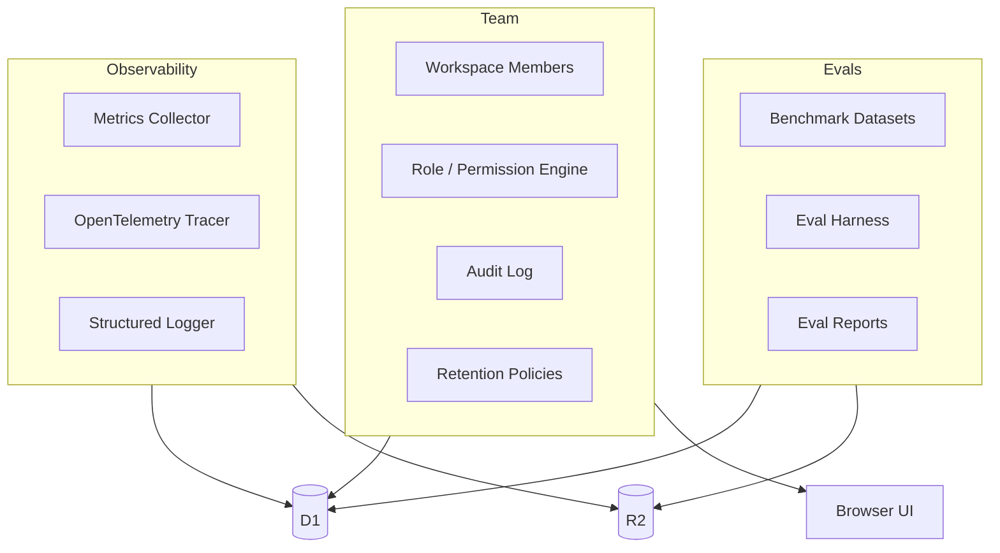

# Phase 12 — Observability, Evals & Team Beta

**Objective:** Add production observability (metrics, OpenTelemetry tracing, structured logging), an evaluation framework for benchmarking agent performance, and team features (workspace members, roles, permissions, audit logs, retention policies) to prepare for beta.

**Prerequisites:** Phase 09 (orchestration + reports), Phase 11 (premium UI).

---

## Current State

- No metrics collection. No OpenTelemetry. No structured logging.
- No evaluation framework. No benchmark datasets.
- No team features. Single-user only. No roles, no permissions, no audit log.
- No retention policies. No enterprise privacy mode.
- `observability` is enabled in `wrangler.jsonc` (`upload_source_maps: true`) but no custom metrics or traces.

---

## Target State

```text
- Metrics: run_count, success_rate, cost_usd, latency_p50/p95, approval_rejection_rate, etc.
- OpenTelemetry tracing with trace_id on every run
- Structured logging (JSON) with correlation IDs
- Evaluation framework: benchmark datasets, eval harness, comparison reports
- Team features: workspace members, roles (owner/member/observer), permissions
- Audit log: every approval, human terminal input, model selection, patch apply
- Retention policies: R2 lifecycle rules, D1 archival
- Enterprise privacy mode: enforced local-only, provider allowlist
```

---

## High-Level Design



---

## Low-Level Design

### 1. Metrics collector

**`packages/core/src/metrics.ts`:**

```ts
export type MetricName =
  | "run_count"
  | "run_success_count"
  | "run_failure_count"
  | "approval_count"
  | "approval_rejection_rate"
  | "agent_usage_by_kind"
  | "provider_usage_by_model"
  | "cost_usd_by_workspace"
  | "latency_p50_ms"
  | "latency_p95_ms"
  | "queue_wait_time_ms"
  | "queue_completion_rate"
  | "scheduled_job_success_rate"
  | "verifier_pass_rate"
  | "secret_redaction_count"
  | "policy_block_count"
  | "jump_in_count"
  | "human_intervention_count";

export type MetricPoint = {
  name: MetricName;
  value: number;
  labels: Record<string, string>;
  timestamp: string;
};

export class MetricsCollector {
  private points: MetricPoint[] = [];

  increment(name: MetricName, labels: Record<string, string> = {}): void {
    this.points.push({ name, value: 1, labels, timestamp: new Date().toISOString() });
  }

  gauge(name: MetricName, value: number, labels: Record<string, string> = {}): void {
    this.points.push({ name, value, labels, timestamp: new Date().toISOString() });
  }

  timing(name: MetricName, durationMs: number, labels: Record<string, string> = {}): void {
    this.points.push({ name, value: durationMs, labels, timestamp: new Date().toISOString() });
  }

  flush(): MetricPoint[] {
    const points = [...this.points];
    this.points = [];
    return points;
  }

  summarize(): Record<string, { count: number; sum: number; min: number; max: number; avg: number }> {
    const summary: Record<string, { count: number; sum: number; min: number; max: number; avg: number }> = {};
    for (const point of this.points) {
      const key = `${point.name}:${JSON.stringify(point.labels)}`;
      if (!summary[key]) {
        summary[key] = { count: 0, sum: 0, min: Infinity, max: 0, avg: 0 };
      }
      summary[key].count++;
      summary[key].sum += point.value;
      summary[key].min = Math.min(summary[key].min, point.value);
      summary[key].max = Math.max(summary[key].max, point.value);
    }
    for (const key of Object.keys(summary)) {
      summary[key].avg = summary[key].sum / summary[key].count;
    }
    return summary;
  }
}
```

### 2. OpenTelemetry tracing

**`packages/core/src/tracing.ts`:**

```ts
export type TraceContext = {
  traceId: string;
  sessionId: string;
  runId: string;
  machineId?: string;
  agentId?: string;
  workflowId?: string;
  queueItemId?: string;
  scheduleId?: string;
};

export type Span = {
  traceId: string;
  spanId: string;
  parentSpanId?: string;
  name: string;
  startTime: number;
  endTime?: number;
  attributes: Record<string, string | number | boolean>;
  events: Array<{ name: string; timestamp: number; attributes?: Record<string, unknown> }>;
  status: "ok" | "error";
};

export class Tracer {
  private spans: Span[] = [];
  private currentSpan: Span | null = null;

  startSpan(name: string, ctx: TraceContext, attributes: Record<string, string | number | boolean> = {}): Span {
    const span: Span = {
      traceId: ctx.traceId,
      spanId: crypto.randomUUID(),
      parentSpanId: this.currentSpan?.spanId,
      name,
      startTime: Date.now(),
      attributes: { ...attributes, sessionId: ctx.sessionId, runId: ctx.runId },
      events: [],
      status: "ok",
    };
    this.spans.push(span);
    this.currentSpan = span;
    return span;
  }

  endSpan(span: Span, status: "ok" | "error" = "ok"): void {
    span.endTime = Date.now();
    span.status = status;
    this.currentSpan = null;
  }

  addEvent(span: Span, name: string, attributes?: Record<string, unknown>): void {
    span.events.push({ name, timestamp: Date.now(), attributes });
  }

  getSpans(): Span[] {
    return [...this.spans];
  }

  flush(): Span[] {
    const spans = [...this.spans];
    this.spans = [];
    return spans;
  }
}
```

### 3. Structured logger

**`packages/core/src/logger.ts`:**

```ts
export type LogLevel = "debug" | "info" | "warn" | "error";

export type LogEntry = {
  timestamp: string;
  level: LogLevel;
  message: string;
  traceId?: string;
  sessionId?: string;
  runId?: string;
  [key: string]: unknown;
};

export class Logger {
  constructor(
    private readonly minLevel: LogLevel = "info",
    private readonly sink: (entry: LogEntry) => void = console.log
  ) {}

  debug(message: string, context: Record<string, unknown> = {}): void {
    this.log("debug", message, context);
  }

  info(message: string, context: Record<string, unknown> = {}): void {
    this.log("info", message, context);
  }

  warn(message: string, context: Record<string, unknown> = {}): void {
    this.log("warn", message, context);
  }

  error(message: string, context: Record<string, unknown> = {}): void {
    this.log("error", message, context);
  }

  private log(level: LogLevel, message: string, context: Record<string, unknown>): void {
    const levels: LogLevel[] = ["debug", "info", "warn", "error"];
    if (levels.indexOf(level) < levels.indexOf(this.minLevel)) return;

    const entry: LogEntry = {
      timestamp: new Date().toISOString(),
      level,
      message,
      ...context,
    };
    this.sink(entry);
  }
}

export function createJsonLogger(): Logger {
  return new Logger("info", (entry) => {
    console.log(JSON.stringify(entry));
  });
}
```

### 4. D1 schema additions for team features

**`infra/migrations/0002_team_and_observability.sql`:**

```sql
-- Workspace members
CREATE TABLE workspace_members (
  id TEXT PRIMARY KEY,
  workspace_id TEXT NOT NULL,
  user_id TEXT NOT NULL,
  role TEXT NOT NULL CHECK (role IN ('owner', 'member', 'observer')),
  invited_by TEXT,
  invited_at TEXT NOT NULL,
  joined_at TEXT,
  created_at TEXT NOT NULL,
  FOREIGN KEY (workspace_id) REFERENCES workspaces(id),
  UNIQUE(workspace_id, user_id)
);

-- Users
CREATE TABLE users (
  id TEXT PRIMARY KEY,
  email TEXT NOT NULL UNIQUE,
  display_name TEXT,
  avatar_url TEXT,
  created_at TEXT NOT NULL,
  updated_at TEXT NOT NULL
);

-- Audit log
CREATE TABLE audit_log (
  id TEXT PRIMARY KEY,
  workspace_id TEXT NOT NULL,
  actor_id TEXT,
  action TEXT NOT NULL,
  resource_type TEXT NOT NULL,
  resource_id TEXT,
  details_json TEXT,
  ip_address TEXT,
  user_agent TEXT,
  created_at TEXT NOT NULL,
  FOREIGN KEY (workspace_id) REFERENCES workspaces(id)
);

-- Metrics snapshots (periodic rollups)
CREATE TABLE metric_snapshots (
  id TEXT PRIMARY KEY,
  workspace_id TEXT NOT NULL,
  metric_name TEXT NOT NULL,
  metric_value REAL NOT NULL,
  labels_json TEXT,
  period_start TEXT NOT NULL,
  period_end TEXT NOT NULL,
  created_at TEXT NOT NULL
);

-- Eval runs
CREATE TABLE eval_runs (
  id TEXT PRIMARY KEY,
  workspace_id TEXT NOT NULL,
  dataset_id TEXT NOT NULL,
  agent_kind TEXT NOT NULL,
  model TEXT,
  status TEXT NOT NULL,
  score REAL,
  results_json TEXT,
  started_at TEXT NOT NULL,
  completed_at TEXT,
  created_at TEXT NOT NULL
);

-- Retention policies
CREATE TABLE retention_policies (
  id TEXT PRIMARY KEY,
  workspace_id TEXT NOT NULL,
  resource_type TEXT NOT NULL CHECK (resource_type IN ('terminal-logs', 'transcripts', 'events', 'artifacts', 'reports')),
  retention_days INTEGER NOT NULL,
  action TEXT NOT NULL CHECK (action IN ('delete', 'archive')),
  created_at TEXT NOT NULL,
  UNIQUE(workspace_id, resource_type)
);

CREATE INDEX idx_members_workspace ON workspace_members(workspace_id);
CREATE INDEX idx_members_user ON workspace_members(user_id);
CREATE INDEX idx_audit_workspace_created ON audit_log(workspace_id, created_at);
CREATE INDEX idx_audit_resource ON audit_log(resource_type, resource_id);
CREATE INDEX idx_metrics_workspace_period ON metric_snapshots(workspace_id, metric_name, period_start);
CREATE INDEX idx_evals_workspace ON eval_runs(workspace_id, dataset_id);
CREATE INDEX idx_retention_workspace ON retention_policies(workspace_id);
```

### 5. Role / permission engine

**`packages/policy/src/permissions.ts`:**

```ts
export type Role = "owner" | "member" | "observer";

export type Permission =
  | "session:create"
  | "session:read"
  | "session:control"
  | "terminal:jump-in"
  | "approval:decide"
  | "queue:manage"
  | "schedule:manage"
  | "policy:manage"
  | "machine:manage"
  | "member:invite"
  | "member:remove"
  | "audit:read"
  | "report:export";

const ROLE_PERMISSIONS: Record<Role, Permission[]> = {
  owner: [
    "session:create", "session:read", "session:control", "terminal:jump-in",
    "approval:decide", "queue:manage", "schedule:manage", "policy:manage",
    "machine:manage", "member:invite", "member:remove", "audit:read", "report:export",
  ],
  member: [
    "session:create", "session:read", "session:control", "terminal:jump-in",
    "approval:decide", "queue:manage", "report:export",
  ],
  observer: [
    "session:read", "audit:read",
  ],
};

export function hasPermission(role: Role, permission: Permission): boolean {
  return ROLE_PERMISSIONS[role].includes(permission);
}

export function requirePermission(role: Role, permission: Permission): void {
  if (!hasPermission(role, permission)) {
    throw new Response(`Forbidden: requires ${permission}`, { status: 403 });
  }
}
```

### 6. Audit log

**`packages/db/src/audit.ts`:**

```ts
export type AuditAction =
  | "approval.decided"
  | "terminal.jump_in"
  | "terminal.release"
  | "terminal.human_input"
  | "session.created"
  | "session.started"
  | "session.cancelled"
  | "queue.item_created"
  | "queue.item_cancelled"
  | "schedule.created"
  | "schedule.updated"
  | "policy.updated"
  | "machine.paired"
  | "machine.revoked"
  | "member.invited"
  | "member.removed"
  | "patch.applied"
  | "patch.exported";

export type AuditEntry = {
  id: string;
  workspaceId: string;
  actorId: string;
  action: AuditAction;
  resourceType: string;
  resourceId?: string;
  details?: Record<string, unknown>;
  ipAddress?: string;
  userAgent?: string;
  createdAt: string;
};

export async function writeAudit(
  db: D1Database,
  entry: Omit<AuditEntry, "id" | "createdAt">
): Promise<void> {
  const id = crypto.randomUUID();
  const createdAt = new Date().toISOString();
  await db.prepare(
    `INSERT INTO audit_log (id, workspace_id, actor_id, action, resource_type, resource_id, details_json, ip_address, user_agent, created_at)
     VALUES (?, ?, ?, ?, ?, ?, ?, ?, ?, ?)`
  ).bind(
    id, entry.workspaceId, entry.actorId, entry.action,
    entry.resourceType, entry.resourceId ?? null,
    entry.details ? JSON.stringify(entry.details) : null,
    entry.ipAddress ?? null, entry.userAgent ?? null, createdAt
  ).run();
}
```

### 7. Evaluation framework

**`evals/harness/runner.ts`:**

```ts
import type { HarnessAdapter } from "@openfusion/harness";

export type EvalDataset = {
  id: string;
  name: string;
  tasks: EvalTask[];
};

export type EvalTask = {
  id: string;
  prompt: string;
  category: "bugfix" | "feature" | "refactor" | "test-generation" | "dependency-update";
  expectedFilesChanged?: string[];
  expectedTestsPass?: boolean;
  maxCostUsd?: number;
  maxRuntimeMs?: number;
};

export type EvalResult = {
  taskId: string;
  agentKind: string;
  model?: string;
  status: "passed" | "failed" | "skipped";
  score: number;
  costUsd: number;
  latencyMs: number;
  filesChanged: string[];
  testsPassed: boolean;
  reason: string;
};

export async function runEval(
  dataset: EvalDataset,
  adapter: HarnessAdapter,
  model?: string
): Promise<EvalResult[]> {
  const results: EvalResult[] = [];

  for (const task of dataset.tasks) {
    const start = Date.now();
    try {
      const session = await adapter.createSession({
        runId: crypto.randomUUID(),
        sessionId: crypto.randomUUID(),
        workspaceId: "eval",
        cwd: process.cwd(),
        privacyMode: "local-only",
      });

      await session.start({ prompt: task.prompt, model }, { emit() {}, async flush() {} });
      await session.dispose();

      results.push({
        taskId: task.id,
        agentKind: adapter.kind,
        model,
        status: "passed",
        score: 1.0,
        costUsd: 0,
        latencyMs: Date.now() - start,
        filesChanged: [],
        testsPassed: true,
        reason: "Completed",
      });
    } catch (err) {
      results.push({
        taskId: task.id,
        agentKind: adapter.kind,
        model,
        status: "failed",
        score: 0,
        costUsd: 0,
        latencyMs: Date.now() - start,
        filesChanged: [],
        testsPassed: false,
        reason: String(err),
      });
    }
  }

  return results;
}
```

**`evals/datasets/bugfixes.json`:**

```json
{
  "id": "bugfix-50",
  "name": "50 Small Bug Fixes",
  "tasks": [
    { "id": "bf-001", "prompt": "Fix the off-by-one error in src/utils/range.ts", "category": "bugfix", "expectedTestsPass": true },
    { "id": "bf-002", "prompt": "Fix null pointer exception in src/parser/ast.ts line 42", "category": "bugfix", "expectedTestsPass": true }
  ]
}
```

### 8. Retention policy enforcer

**`apps/web/src/workers/retention.ts`:**

```ts
import { createOpenFusionRepositories } from "@openfusion/db";

export async function enforceRetention(env: Env): Promise<void> {
  const repos = createOpenFusionRepositories(env.OPENFUSION_DB);
  const policies = await repos.retentionPolicies.listAll();

  for (const policy of policies) {
    const cutoff = new Date(Date.now() - policy.retentionDays * 86400000).toISOString();

    switch (policy.resourceType) {
      case "terminal-logs":
        // List R2 objects older than cutoff and delete
        const objects = await env.OPENFUSION_ARTIFACTS.list({ prefix: `workspaces/${policy.workspaceId}/` });
        for (const obj of objects.objects) {
          if (obj.uploaded < new Date(cutoff)) {
            await env.OPENFUSION_ARTIFACTS.delete(obj.key);
          }
        }
        break;
      case "events":
        // Archive old events from D1 to R2, then delete from D1
        await env.OPENFUSION_DB.prepare(
          "DELETE FROM event_index WHERE created_at < ? AND workspace_id = ?"
        ).bind(cutoff, policy.workspaceId).run();
        break;
    }
  }
}
```

### 9. Observability API endpoints

```text
GET  /api/metrics?from=2026-06-01&to=2026-06-27   — metric summaries
GET  /api/audit?workspaceId=ws_01&limit=100        — audit log entries
GET  /api/evals                                     — eval run results
POST /api/evals/run                                 — trigger an eval run
GET  /api/members                                   — workspace members
POST /api/members/invite                            — invite a member
DELETE /api/members/:id                             — remove a member
GET  /api/retention                                 — retention policies
PATCH /api/retention/:id                            — update retention policy
```

---

## Design Patterns

| Pattern | Application |
|---|---|
| **Observer** | Metrics collector observes system events and records data points. |
| **Strategy** | Retention policy action (delete vs archive) is a strategy. Role permissions are a strategy. |
| **Repository** | Audit log, metrics, eval runs, and members all use D1 repositories. |
| **Decorator** | Logger decorates console output with structured JSON. Tracer decorates operations with spans. |
| **Command** | Audit actions are command objects (`AuditAction` union). Each action is a discrete, auditable event. |

## SOLID / DRY Compliance

- **SRP:** MetricsCollector collects metrics. Tracer creates spans. Logger writes logs. PermissionEngine checks roles. AuditLog writes entries. Each has one job.
- **OCP:** New metrics are added to the `MetricName` union. New audit actions are added to the `AuditAction` union. New permissions are added to `Permission`. No existing code is modified.
- **LSP:** Any `Role` works with `hasPermission()`. Any `LogLevel` works with `Logger`.
- **ISP:** `MetricsCollector` exposes `increment`, `gauge`, `timing` — consumers call only what they need.
- **DIP:** Logger depends on a `sink` function, not on `console.log` directly. Tracer depends on `TraceContext`, not on specific run types.
- **DRY:** Role-permission mapping is in one place. Audit action types are in one place. Metric names are in one place.

---

## Testing Strategy

| Level | What | Tool |
|---|---|---|
| Unit | Metrics collector (increment, gauge, timing, summarize) | vitest |
| Unit | Tracer (span start/end, parent linking) | vitest |
| Unit | Logger (level filtering, JSON output) | vitest |
| Unit | Permission engine (all roles, all permissions) | vitest |
| Unit | Audit log (write + read) | vitest + D1 stub |
| Unit | Retention policy enforcement | vitest + R2 mock |
| Integration | Eval runner with mock adapter | vitest |
| E2E | Full eval run on benchmark dataset | vitest (requires agent installed) |

---

## Implementation Steps

1. Create `packages/core/src/metrics.ts`
2. Create `packages/core/src/tracing.ts`
3. Create `packages/core/src/logger.ts`
4. Create migration `0002_team_and_observability.sql`
5. Apply migration: `wrangler d1 migrations apply openfusion-control --local`
6. Create `packages/policy/src/permissions.ts`
7. Create `packages/db/src/audit.ts`
8. Create `apps/web/src/workers/retention.ts`
9. Create `evals/` directory with datasets and harness
10. Add audit log writes to all API route handlers (approval, terminal, session, queue, schedule, policy, member)
11. Add permission checks to all API route handlers
12. Add metrics collection to run lifecycle, queue, schedule, verifier
13. Add tracing to run lifecycle (trace_id on every run)
14. Add structured logging to all workers
15. Add observability API endpoints (metrics, audit, evals, members, retention)
16. Add Cron Trigger for retention enforcement (daily)
17. Write unit tests for all modules
18. Run `pnpm typecheck && pnpm lint && pnpm test && pnpm build`

---

## Acceptance Criteria

```text
[ ] Metrics collector tracks run_count, success_rate, cost, latency, approvals
[ ] OpenTelemetry spans are created for every run with trace_id
[ ] Structured JSON logger writes to console with correlation IDs
[ ] D1 migration 0002 adds: users, workspace_members, audit_log, metric_snapshots, eval_runs, retention_policies
[ ] Role/permission engine enforces owner/member/observer permissions
[ ] All API routes check permissions before executing
[ ] Audit log records: approvals, terminal jump-in, human input, session changes, member changes
[ ] Audit log is queryable via /api/audit
[ ] Eval framework runs benchmark datasets against agents
[ ] Eval results are stored in D1 and viewable in UI
[ ] Retention policies delete/archive old R2 objects and D1 events
[ ] Retention enforcement runs daily via Cron Trigger
[ ] Workspace members can be invited and removed
[ ] Observer role cannot type in terminal or approve
[ ] Unit tests pass for metrics, tracer, logger, permissions, audit
[ ] pnpm build passes
```

---

## Risks & Mitigations

| Risk | Mitigation |
|---|---|
| Metrics collection adds latency | Buffer metrics; flush asynchronously; don't block on metrics write |
| Audit log grows unbounded | Retention policy for audit_log; archive to R2 after 90 days |
| Eval runs are expensive | Run evals on schedule (nightly); use local models where possible; cap cost per eval |
| Permission checks are forgotten | Add permission middleware to all route handlers; test coverage verifies checks |
| Retention deletes needed data | Soft delete first; 30-day grace period; admin can restore |
| Tracing overhead | Sample traces (10% of runs); use trace context only for debugging |