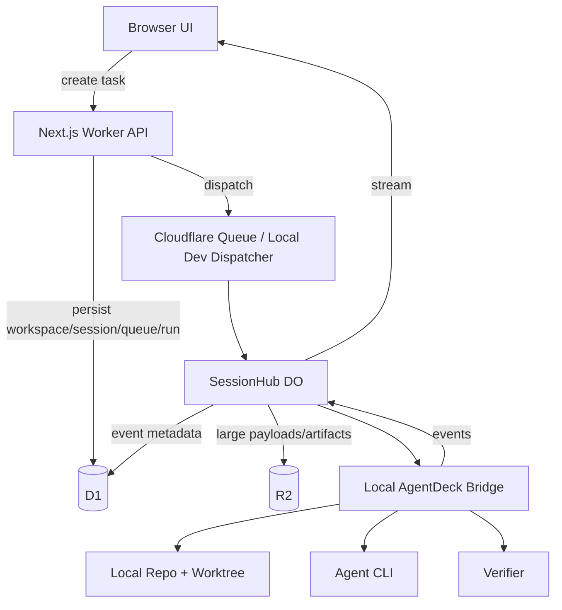

# Phase 13 — Real Local E2E Product Flow

**Objective:** Turn AgentDeck from a polished mock Mission Control shell into a usable local product where a user can create a real task, pair a local bridge, run an installed coding agent, watch terminal output, approve risky actions, run verification, and review a persisted report.

**Status:** Not implemented. This is the next required product milestone.

**Depends on:** Phase 02 control-plane APIs, Phase 03 SessionHub, Phase 04 bridge, Phase 05 terminal, Phase 07 policy/verifier, Phase 08 queue/workflows, Phase 09 reports, Phase 11 UI, Phase 12 audit/observability/team.

---

## Executive Summary

The current app is not useful enough for a real user because the visible experience is still driven mostly by deterministic mock data from `apps/web/src/lib/mock-agentdeck.ts`. The repository has many strong foundations: typed contracts, D1 repositories, API routes, bridge skeleton, event protocol, queue/workflow code, terminal UI, policy gates, verifiers, reports, and observability.

The missing product moment is the full loop:

```text
User creates task in browser
  -> task is persisted in D1
  -> local bridge receives dispatch
  -> real agent runs in a local worktree/terminal
  -> terminal output streams to browser
  -> risky command pauses for approval
  -> verifier runs tests/lint/typecheck/build
  -> report is persisted and visible in UI
```

Phase 13 should focus only on this loop. Do not add more dashboard screens until this works.

---

## Current Problem

### What the user sees today

- The app opens and looks complete.
- The "Ask agents to investigate..." bar only opens a command palette.
- The command palette only navigates between screens.
- Queue, sessions, reports, approvals, observability, team, and terminal data are mostly mock/demo state.
- A normal user cannot create a task from the UI and see it run.

### Why this is bad

The product promise is "mission control for AI coding agents." If users cannot start a real agent task, the app feels decorative. The architecture may be strong, but the product does not yet solve the user's immediate problem.

### The user problem AgentDeck must solve

```text
I use coding agents, but they run in separate terminals, are hard to supervise,
can execute risky commands, and produce outputs that are hard to compare or audit.
```

AgentDeck should solve that by giving the user one place to:

- create agent tasks,
- run agents locally,
- watch terminal progress,
- approve or reject risky actions,
- verify results,
- compare outputs,
- keep audit/report evidence.

---

## Product Definition Of Useful

AgentDeck becomes useful when this scenario works:

1. User opens the app.
2. User creates or selects a workspace.
3. User pairs the local bridge.
4. User types: "Fix failing auth refresh test and prove it with unit tests."
5. User chooses an agent or "auto route."
6. AgentDeck creates a real queue item/session/run in D1.
7. The bridge receives the job.
8. The bridge creates an isolated worktree.
9. The bridge starts a real installed agent CLI.
10. The terminal streams into the browser.
11. If the agent tries a risky command, the UI shows an approval request.
12. User approves or rejects.
13. Verifier runs deterministic commands.
14. A decision report appears with files, commands, test results, cost/latency, and recommendation.

If this path does not work, the app is not yet a product.

---

## Non-Goals For This Phase

Do not spend Phase 13 on:

- new visual screens,
- new provider adapters,
- more mock reports,
- more observability cards,
- team billing,
- public deployment polish,
- multi-workspace enterprise flows,
- SCIM/SAML,
- advanced eval dashboards.

Those matter later. The next step is one real local task path.

---

## Required UX Change

The top command bar must stop behaving like a navigation-only launcher.

Current behavior:

```text
Click "Ask agents..." -> command palette -> navigate to screen
```

Required behavior:

```text
Click "Ask agents..." -> New Task dialog
  - Task prompt
  - Agent selection: Auto, Claude Code, Codex, OpenCode, Qwen, Pi, Aider
  - Repository path
  - Privacy mode
  - Verification plan
  - Queue now / Schedule
```

After submit:

```text
Create session + queue item + run
Navigate to /sessions/[id]
Show live run state
```

The command palette can still exist, but it should be secondary. The primary command surface should create real work.

---

## Architecture Target



### Local development constraint

Plain `pnpm dev` currently warns that internal Durable Objects and Workflows are not fully available locally. Phase 13 must make local testing realistic.

Choose one of these approaches:

| Option | Description | Recommendation |
|---|---|---|
| A | Use OpenNext/Wrangler preview for the real Cloudflare-like runtime | Best for integration fidelity |
| B | Add a dev-only local dispatcher that bypasses Queue/Workflow and calls SessionHub/bridge path directly | Best for fast local product development |
| C | Keep only mock UI | Not acceptable |

Recommended: implement **B first**, then verify with **A**.

---

## Data Mode Strategy

The app needs a clear distinction between mock and live data.

### Add data mode

Introduce:

```text
AGENTDECK_DATA_MODE=mock | live
```

Behavior:

| Mode | Behavior |
|---|---|
| `mock` | Existing deterministic demo data; good for screenshots and design QA |
| `live` | All primary screens use API data and mutations; no fake queue/session/report state |

Default for development should become `live` after Phase 13 works. Mock mode should remain available for demo/testing.

### Replace silent mock fallback on product routes

Current query hooks fall back to mock data when API calls fail. That hides real wiring problems.

Required:

- In `live` mode, show real loading/error/empty states.
- In `mock` mode, use deterministic mock data intentionally.
- Never silently pretend live data exists when the API failed.

---

## Implementation Plan

### Milestone 13.1 — Live Workspace Onboarding

Goal: A fresh user can create a real local workspace and receive a signed session cookie.

Work:

- Add `/setup` route or first-run modal.
- Use existing `POST /api/workspaces`.
- Add visible empty state when no workspace/session exists.
- Add `.env.local` validation for `AGENTDECK_SESSION_SECRET`.
- Show clear setup error if D1 bindings are missing.

Files likely touched:

```text
apps/web/src/app/setup/page.tsx
apps/web/src/components/agentdeck/setup-screen.tsx
apps/web/src/lib/auth.ts
apps/web/src/lib/agentdeck-queries.ts
apps/web/src/lib/api/errors.ts
```

Acceptance:

- Opening app without session shows setup, not fake dashboard.
- Creating workspace sets `of_session`.
- `/api/workspaces` returns a real D1 workspace.
- Dashboard identifies current workspace from real session.

---

### Milestone 13.2 — Real Task Creation

Goal: User can create a real task from the UI.

Work:

- Replace top command bar primary action with `NewTaskDialog`.
- Submit to `POST /api/sessions` and `POST /api/queue`.
- Store task, priority, privacy mode, selectors, verification preferences.
- Navigate to the created session or queue item.
- Add optimistic UI only after real API success.

Suggested dialog fields:

```text
Task prompt: textarea
Agent: auto | claude-code | codex | opencode | qwen-code | pi | aider
Priority: low | normal | high | urgent
Repository path: local path string
Privacy mode: local-only | metadata-only | full-sync
Verification: typecheck, lint, test, build checkboxes
Max runtime minutes
Max cost USD
```

Files likely touched:

```text
apps/web/src/components/agentdeck/new-task-dialog.tsx
apps/web/src/components/agentdeck/app-shell.tsx
apps/web/src/lib/agentdeck-queries.ts
apps/web/src/lib/api/schemas.ts
apps/web/src/app/api/queue/route.ts
apps/web/src/app/api/sessions/route.ts
```

Acceptance:

- User can submit a task from the browser.
- The task appears in `/queue` from live API data.
- Refreshing the page keeps the task.
- Invalid input shows validation errors.
- No mock queue items appear in live mode.

---

### Milestone 13.3 — Live Queue And Session Screens

Goal: Queue and session screens display real D1 data.

Work:

- Replace `queueItems` mock usage in `/queue`.
- Replace active run mock usage in `/sessions/[id]`.
- Add empty states:
  - no queue items,
  - no sessions,
  - no runs,
  - no bridge connected.
- Add refetch/invalidation after task creation.
- Add status badges based on persisted status.

Files likely touched:

```text
apps/web/src/components/agentdeck/route-screens.tsx
apps/web/src/components/agentdeck/mission-control-screen.tsx
apps/web/src/components/agentdeck/app-shell.tsx
apps/web/src/lib/agentdeck-queries.ts
apps/web/src/lib/mock-agentdeck.ts
```

Acceptance:

- Queue screen is real in live mode.
- Session detail is real in live mode.
- Refresh does not lose data.
- Mock data is only visible in `AGENTDECK_DATA_MODE=mock`.

---

### Milestone 13.4 — Bridge Pairing UX

Goal: User can pair the local bridge without reading internal API docs.

Work:

- Add "Pair Bridge" button on Machines page.
- Call `POST /api/machines/pairing-code`.
- Show command:

```bash
pnpm --filter @agentdeck/bridge dev -- pair "<PAIRING_CODE>" --cloud-url http://localhost:3000 --display-name "My Mac"
```

- Poll `/api/machines` until the paired machine appears.
- Show detected agents and auth state.

Files likely touched:

```text
apps/web/src/app/settings/machines/page.tsx
apps/web/src/components/agentdeck/machine-pairing-panel.tsx
apps/web/src/lib/agentdeck-queries.ts
apps/bridge/src/auth/pairing.ts
apps/bridge/src/config.ts
```

Acceptance:

- User clicks Pair Bridge.
- UI shows pairing command.
- Running the command pairs the machine.
- Machines page updates with real machine.
- Agent inventory shows real detected adapters.

---

### Milestone 13.5 — Local Dispatcher For Development

Goal: A queued task can reach the local bridge during development.

Problem:

Cloudflare Queue/Workflow/Durable Object behavior is not fully available in plain `next dev`.

Work:

- Add dev-only dispatch endpoint or local dispatcher service.
- When `NODE_ENV=development` and `AGENTDECK_LOCAL_DISPATCH=1`, dispatch queue item directly.
- Preserve production architecture for Cloudflare deployment.
- Do not bypass policy, audit, verifier, or privacy rules.

Possible endpoint:

```text
POST /api/dev/dispatch-next
```

Alternative:

```text
POST /api/queue/[id]/dispatch
```

Files likely touched:

```text
apps/web/src/app/api/queue/[id]/dispatch/route.ts
apps/web/src/lib/api/dispatch.ts
apps/web/src/workers/run-workflow.ts
apps/bridge/src/stream/websocket-client.ts
```

Acceptance:

- Queue item can be manually dispatched in local dev.
- Bridge receives dispatch.
- Run status changes from `queued` to `running`.
- Audit log records dispatch.

---

### Milestone 13.6 — Real Terminal Streaming

Goal: Browser terminal shows real bridge/agent output.

Work:

- Ensure browser WebSocket connects to session.
- Ensure bridge WebSocket connects to same session.
- Bridge emits `terminal.open`, `terminal.stdout`, `terminal.stderr`, `terminal.closed`.
- SessionHub persists event metadata and fans out to browser.
- Terminal dock consumes live events.

Files likely touched:

```text
apps/web/src/app/api/sessions/[id]/ws/route.ts
apps/web/src/do/session-hub.ts
apps/web/src/lib/use-session-websocket.ts
apps/web/src/components/agentdeck/terminal-dock.tsx
apps/bridge/src/stream/websocket-client.ts
apps/bridge/src/pty/terminal-session.ts
```

Acceptance:

- User can see real terminal output from a local process.
- Refresh/reconnect replays recent events.
- Local-only privacy mode does not upload raw terminal logs.
- Full-sync mode can persist allowed payloads to R2.

---

### Milestone 13.7 — Approval Gate End-To-End

Goal: Risky commands pause and require human approval.

Work:

- Bridge classifies command via `@agentdeck/policy`.
- Risky command creates approval row.
- UI displays approval from live API data.
- User approves/rejects.
- Bridge resumes or cancels command.
- Audit row is written.

Files likely touched:

```text
apps/bridge/src/policy/approval-gate.ts
apps/web/src/app/api/approvals/[id]/approve/route.ts
apps/web/src/app/api/approvals/[id]/reject/route.ts
apps/web/src/components/agentdeck/app-shell.tsx
apps/web/src/lib/agentdeck-queries.ts
```

Acceptance:

- Dangerous command does not execute silently.
- Approval appears in browser.
- Approve once resumes command.
- Reject blocks command.
- Audit log records decision.

---

### Milestone 13.8 — Verification And Report

Goal: The run produces evidence, not just terminal output.

Work:

- Run verifier strategies after agent finishes.
- Persist verifier events.
- Upload patch/artifacts as configured by privacy mode.
- Generate decision report.
- Replace report mock data with live report data.

Files likely touched:

```text
packages/verifier/src/index.ts
packages/harness/src/report-generator.ts
apps/bridge/src/verifier/verifier-runner.ts
apps/bridge/src/stream/r2-writer.ts
apps/web/src/app/api/reports/route.ts
apps/web/src/components/agentdeck/route-screens.tsx
```

Acceptance:

- After run completes, verifier commands execute.
- Report is persisted in D1/R2.
- `/reports` lists real report.
- `/reports/[id]` opens real report.
- Report includes recommendation, evidence, artifacts, and command summary.

---

## Proposed First Pull Request

The first PR should be deliberately small:

```text
feat(tasks): create live queue items from command bar
```

Scope:

- Add `NewTaskDialog`.
- Add data mode flag.
- Wire dialog to `POST /api/sessions` + `POST /api/queue`.
- Replace `/queue` mock display with live query in live mode.
- Add setup/empty/error states.

Do not include bridge dispatch in the first PR. First prove that user-created tasks persist and render.

### First PR acceptance criteria

```text
[ ] User can create workspace/session cookie locally
[ ] User can open New Task dialog
[ ] User can submit a task
[ ] Task persists to D1
[ ] Queue page shows real task
[ ] Refresh keeps real task
[ ] Mock queue is hidden in live mode
[ ] Tests cover task creation mutation and queue rendering
[ ] pnpm typecheck, lint, test, build pass
```

---

## Product Acceptance Criteria For Full Phase 13

```text
[ ] App has a visible setup path for first-time local use
[ ] User can create a real task from the UI
[ ] Task persists to D1 and appears after refresh
[ ] User can pair local bridge from UI instructions
[ ] Bridge appears online in Machines page
[ ] Agent inventory uses real bridge probe results
[ ] User can dispatch a queued task to bridge
[ ] Bridge runs a real local process or agent adapter
[ ] Browser terminal displays real output
[ ] Risky command creates approval request
[ ] User approval/rejection controls bridge behavior
[ ] Verifier runs after task completion
[ ] Decision report is persisted and visible
[ ] Audit log records task, dispatch, approval, verifier, and report events
[ ] Observability metrics update from real runs
[ ] No mock data appears in live mode
```

---

## Test Plan

### Unit

- `NewTaskDialog` validation.
- data mode selection.
- query hook behavior: live mode errors do not fall back to mock.
- queue/session API schema validation.
- permission checks for task creation and dispatch.

### Integration

- create workspace -> create session -> create queue item.
- queue item appears in list.
- pair bridge with generated code.
- dispatch queue item in dev mode.
- append terminal events and replay them.

### E2E

Use Playwright:

```text
1. Open app
2. Create workspace
3. Create task
4. See task in queue
5. Pair bridge
6. Dispatch task
7. See terminal output
8. Approve risky command
9. See report
```

### Manual QA

Check desktop and mobile:

- setup screen,
- new task dialog,
- queue empty/loading/error states,
- machine pairing panel,
- terminal dock,
- approvals,
- reports,
- observability.

---

## Risks And Decisions

| Risk | Impact | Decision |
|---|---|---|
| Continuing to add mock UI | Product remains unusable | Stop new mock surfaces until real task flow works |
| Cloudflare local runtime friction | E2E hard to test locally | Add dev-only local dispatcher |
| Silent mock fallback hides API bugs | Developers think live mode works when it does not | Add explicit data mode |
| Bridge pairing is too technical | Users cannot complete setup | Build guided pairing UI |
| Running real agents is unpredictable | Flaky demos | First support a deterministic local command adapter, then agent CLIs |
| Privacy mode mistakes | User trust risk | Preserve policy/storage decisions in every dispatch path |

---

## Recommended Build Order

1. `AGENTDECK_DATA_MODE=live`
2. setup/onboarding screen
3. New Task dialog
4. live Queue screen
5. live Session screen
6. bridge pairing UI
7. local dev dispatcher
8. terminal streaming
9. approval loop
10. verifier/report loop
11. remove mock data from default mode

This order creates user value early and avoids building more decorative UI before the product works.

---

## Definition Of Done

Phase 13 is done only when a developer can run:

```bash
pnpm install
pnpm dev
pnpm --filter @agentdeck/bridge dev -- pair "<code>" --cloud-url http://localhost:3000
pnpm --filter @agentdeck/bridge dev -- start "<session-id>" --repo-path /path/to/repo
```

Then, from the browser:

```text
Create task -> dispatch -> watch terminal -> approve if needed -> see verifier -> open report
```

If that cannot be done, the app is still not useful enough for a real user.

