# OpenFusion Product Explainer

**Product idea:** OpenFusion is **mission control for AI coding agents**.

You give an agent a coding task. It runs in a real terminal you can watch and jump into. OpenFusion gives live feedback, approval gates, build queues for overnight work, scheduled jobs, diff review, tests, and final reports. A human stays in the loop the whole way.

OpenFusion is **not auto-merge** and **not a black box**. It is your command centre for **Claude Code, Codex CLI, OpenCode, Pi, Qwen Code, custom local agents, and future agent harnesses**.

> **One-line pitch:** OpenFusion is GitHub Actions + real terminal + AI coding agents + human approval.

> **Sharper positioning:** Cursor is where you code with AI. OpenFusion is where you manage AI agents doing coding work.

---

## 1. Why OpenFusion exists

AI coding agents are powerful, but they create a new problem:

- They run commands.
- They edit files.
- They install packages.
- They generate patches.
- They may make risky decisions.
- They often hide too much behind a chat interface.

Developers and teams need a **control plane** for this work.

OpenFusion solves that by giving every AI coding run:

- a visible terminal,
- a structured event timeline,
- a human approval layer,
- a build/test verification layer,
- a queue for long-running work,
- scheduled jobs for recurring maintenance,
- and a final human-readable report.

---

## 2. How the idea evolved

The original idea was multi-model synthesis:

```txt
Use multiple cheaper/open models
→ compare their results
→ synthesize the best answer
→ reduce cost compared to premium frontier models
```

That is useful, but the stronger product direction is:

```txt
Mission control for AI coding agents
→ run real agents in real terminals
→ show everything live
→ let humans jump in
→ queue overnight jobs
→ schedule recurring work
→ verify output with tests, builds, diffs, and reports
```

### Diagram: product evolution

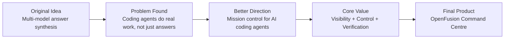
```mermaid
flowchart LR
    A[Original Idea<br/>Multi-model answer synthesis] --> B[Problem Found<br/>Coding agents do real work, not just answers]
    B --> C[Better Direction<br/>Mission control for AI coding agents]
    C --> D[Core Value<br/>Visibility + Control + Verification]
    D --> E[Final Product<br/>OpenFusion Command Centre]
```

---

## 3. What OpenFusion is and is not

| OpenFusion is | OpenFusion is not |
|---|---|
| Mission control for AI coding agents | A simple chatbot |
| A real terminal supervisor | A hidden autonomous black box |
| A human-in-the-loop agent platform | Blind auto-merge automation |
| A build queue for long-running AI work | Just another IDE extension |
| A scheduled job system for agent tasks | Only a model router |
| A verification and review layer | A replacement for engineering judgment |

---

## 4. Simple mental model

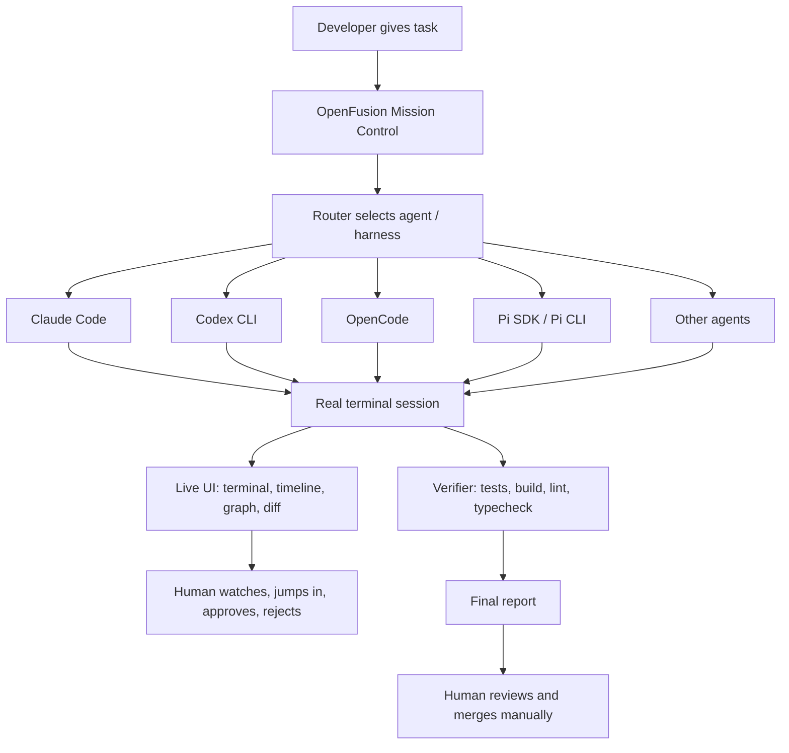
```mermaid
flowchart TD
    U[Developer gives task] --> OF[OpenFusion Mission Control]
    OF --> R[Router selects agent / harness]
    R --> A1[Claude Code]
    R --> A2[Codex CLI]
    R --> A3[OpenCode]
    R --> A4[Pi SDK / Pi CLI]
    R --> A5[Other agents]

    A1 --> T[Real terminal session]
    A2 --> T
    A3 --> T
    A4 --> T
    A5 --> T

    T --> UI[Live UI: terminal, timeline, graph, diff]
    UI --> H[Human watches, jumps in, approves, rejects]
    T --> V[Verifier: tests, build, lint, typecheck]
    V --> REP[Final report]
    REP --> HR[Human reviews and merges manually]
```

---

## 5. Product workflow in plain English

### Step 1: User creates a task

Example:

```txt
Fix the checkout bug where payment fails for Indian users.
Add tests.
Do not touch the payment provider integration unless needed.
```

OpenFusion converts this into structured task metadata:

```txt
Task type: bug fix
Repo: frontend-app
Risk level: medium
Required checks: tests + typecheck + lint
Human approval: required for dependency install, DB change, deploy, git push
Preferred agents: Claude Code, Codex CLI, Pi, OpenCode
Budget: cheap-first, premium fallback only if needed
```

### Step 2: OpenFusion chooses a path

```txt
Small bug       → one agent
Hard bug        → two agents in parallel
Large refactor  → agent + verifier + human review
Overnight work  → build queue
Recurring work  → scheduled job
Risky work      → approval-gated execution
```

### Step 3: Agent runs in a real terminal

The OpenFusion Local Bridge starts the selected agent in a controlled terminal session.

```txt
OpenFusion UI
  ↓
Cloudflare Session Hub
  ↓
OpenFusion Local Bridge
  ↓
Real PTY terminal
  ↓
claude / codex / opencode / pi / qwen / custom script
```

### Step 4: User watches and can jump in

The user can:

```txt
- pause the agent
- type directly into the terminal
- send steering instructions
- approve or reject risky commands
- ask another agent to review
- cancel the job
- queue follow-up work
```

### Step 5: OpenFusion verifies the result

OpenFusion runs:

```txt
- tests
- build
- lint
- typecheck
- security checks
- diff review
- optional judge/reviewer pass
```

### Step 6: Human reviews final report

OpenFusion gives a final review packet:

```txt
Files changed
Commands run
Tests passed/failed
Risky actions requested
Approvals given
Diff summary
Agent transcript
Final recommendation
```

The human decides whether to merge.

---

## 6. High-level architecture

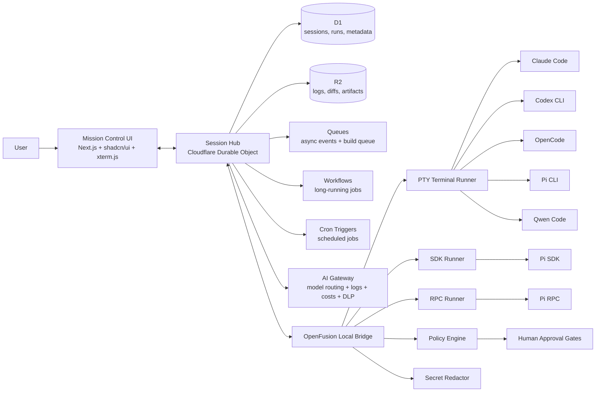
```mermaid
flowchart LR
    U[User] --> UI[Mission Control UI<br/>Next.js + shadcn/ui + xterm.js]

    UI <--> DO[Session Hub<br/>Cloudflare Durable Object]

    DO --> D1[(D1<br/>sessions, runs, metadata)]
    DO --> R2[(R2<br/>logs, diffs, artifacts)]
    DO --> Q[Queues<br/>async events + build queue]
    DO --> WF[Workflows<br/>long-running jobs]
    DO --> CRON[Cron Triggers<br/>scheduled jobs]
    DO --> AIG[AI Gateway<br/>model routing + logs + costs + DLP]

    DO <--> LB[OpenFusion Local Bridge]

    LB --> PTY[PTY Terminal Runner]
    LB --> SDK[SDK Runner]
    LB --> RPC[RPC Runner]
    LB --> POL[Policy Engine]
    LB --> RED[Secret Redactor]

    PTY --> CC[Claude Code]
    PTY --> CX[Codex CLI]
    PTY --> OC[OpenCode]
    PTY --> PI_CLI[Pi CLI]
    PTY --> QW[Qwen Code]

    SDK --> PI_SDK[Pi SDK]
    RPC --> PI_RPC[Pi RPC]

    POL --> APR[Human Approval Gates]
```

---

## 7. Layered architecture

OpenFusion should be separated into four major layers.

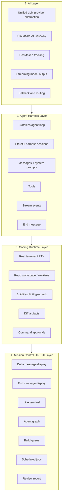
```mermaid
flowchart TB
    subgraph L1[1. AI Layer]
        A1[Unified LLM provider abstraction]
        A2[Cloudflare AI Gateway]
        A3[Cost/token tracking]
        A4[Streaming model output]
        A5[Fallback and routing]
    end

    subgraph L2[2. Agent Harness Layer]
        H1[Stateless agent loop]
        H2[Stateful harness sessions]
        H3[Messages + system prompts]
        H4[Tools]
        H5[Stream events]
        H6[End message]
    end

    subgraph L3[3. Coding Runtime Layer]
        C1[Real terminal / PTY]
        C2[Repo workspace / worktree]
        C3[Build/test/lint/typecheck]
        C4[Diff artifacts]
        C5[Command approvals]
    end

    subgraph L4[4. Mission Control UI / TUI Layer]
        U1[Delta message display]
        U2[End message display]
        U3[Live terminal]
        U4[Agent graph]
        U5[Build queue]
        U6[Scheduled jobs]
        U7[Review report]
    end

    L1 --> L2 --> L3 --> L4
```

---

## 8. AI Layer

The AI Layer unifies model providers and streams model events to consumers.

### Responsibilities

```txt
- Normalize provider APIs
- Route prompts to the right model
- Stream deltas back to the harness/UI
- Track tokens, latency, and cost
- Apply provider fallback
- Use Cloudflare AI Gateway where useful
- Support local and hosted providers
```

### Providers

```txt
OpenAI
Anthropic
Google
DeepSeek
Qwen
Kimi / Moonshot
MiniMax
OpenRouter
Ollama
vLLM
LM Studio
Cloudflare Workers AI
Cloudflare AI Gateway
```

### AI Layer diagram

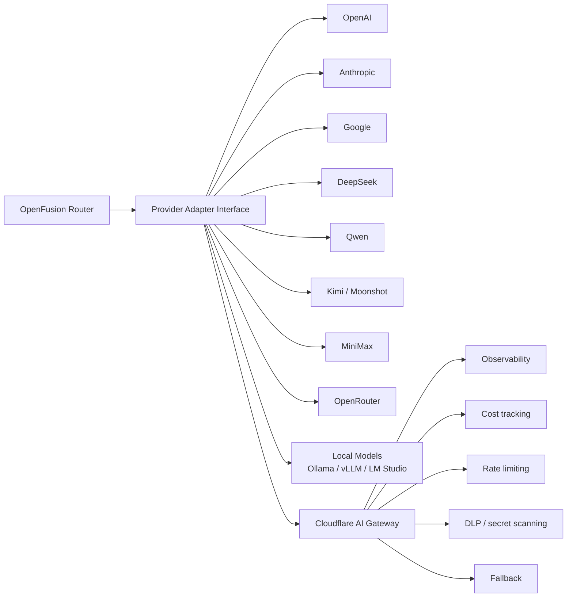
```mermaid
flowchart LR
    R[OpenFusion Router] --> P[Provider Adapter Interface]

    P --> OAI[OpenAI]
    P --> ANT[Anthropic]
    P --> GOO[Google]
    P --> DS[DeepSeek]
    P --> QW[Qwen]
    P --> KM[Kimi / Moonshot]
    P --> MM[MiniMax]
    P --> OR[OpenRouter]
    P --> LOC[Local Models<br/>Ollama / vLLM / LM Studio]

    P --> CFGW[Cloudflare AI Gateway]
    CFGW --> OBS[Observability]
    CFGW --> COST[Cost tracking]
    CFGW --> RL[Rate limiting]
    CFGW --> DLP[DLP / secret scanning]
    CFGW --> FB[Fallback]
```

---

## 9. Agent Harness Layer

The Agent Harness Layer is the “agent brain.” It coordinates messages, tools, system prompts, and state.

### Important idea

Separate the **agent loop** from the **harness**.

```txt
Agent loop = stateless reasoning step
Harness = stateful session owner
```

The harness owns:

```txt
- session ID
- message history
- system prompt
- selected model/provider
- available tools
- current working directory
- user steering messages
- follow-up queue
- stream events
- end message
```

### Harness diagram

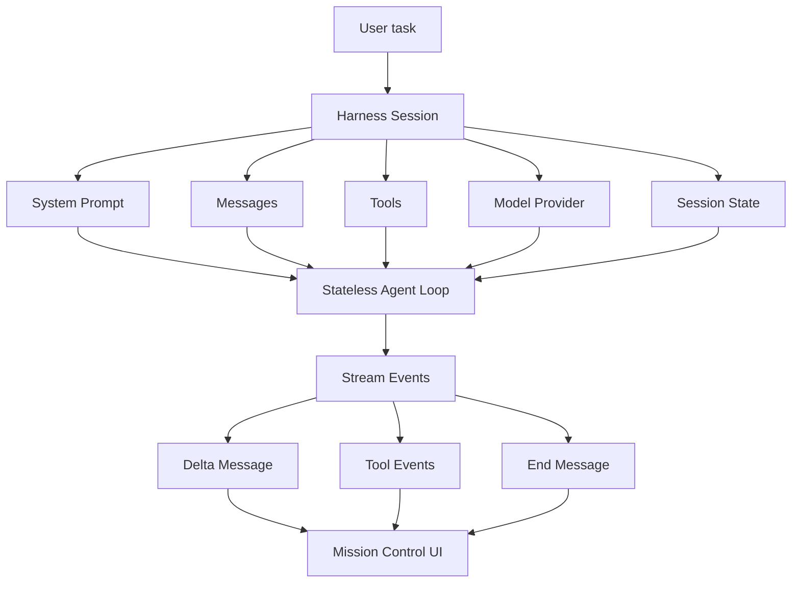
```mermaid
flowchart TD
    USER[User task] --> SESSION[Harness Session]

    SESSION --> SYS[System Prompt]
    SESSION --> MSG[Messages]
    SESSION --> TOOLS[Tools]
    SESSION --> PROVIDER[Model Provider]
    SESSION --> STATE[Session State]

    SYS --> LOOP[Stateless Agent Loop]
    MSG --> LOOP
    TOOLS --> LOOP
    PROVIDER --> LOOP
    STATE --> LOOP

    LOOP --> EVENTS[Stream Events]
    EVENTS --> DELTA[Delta Message]
    EVENTS --> TOOL[Tool Events]
    EVENTS --> END[End Message]

    DELTA --> UI[Mission Control UI]
    TOOL --> UI
    END --> UI
```

---

## 10. Coding Runtime Layer

The Coding Runtime Layer executes real repo work.

### Responsibilities

```txt
- create isolated workspace or git worktree
- run the selected agent in a PTY or SDK runner
- stream stdout/stderr
- intercept risky commands
- redact secrets
- run tests/build/lint/typecheck
- create diff artifacts
- save logs
- return final report
```

### Runtime diagram

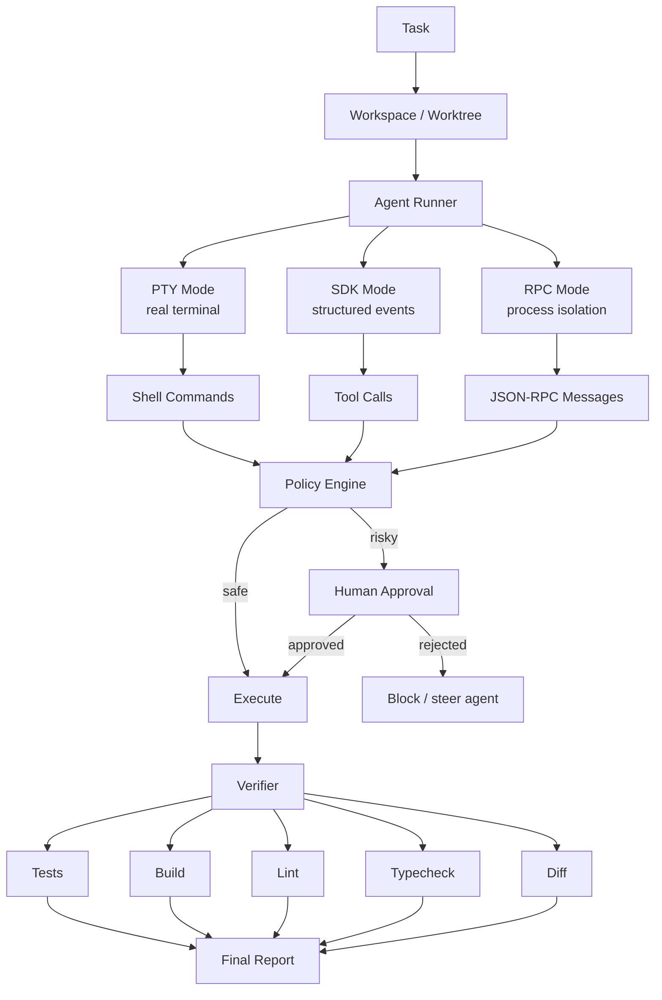
```mermaid
flowchart TB
    TASK[Task] --> WS[Workspace / Worktree]
    WS --> RUN[Agent Runner]

    RUN --> PTY[PTY Mode<br/>real terminal]
    RUN --> SDK[SDK Mode<br/>structured events]
    RUN --> RPC[RPC Mode<br/>process isolation]

    PTY --> COMMANDS[Shell Commands]
    SDK --> TOOLS[Tool Calls]
    RPC --> JSONRPC[JSON-RPC Messages]

    COMMANDS --> POLICY[Policy Engine]
    TOOLS --> POLICY
    JSONRPC --> POLICY

    POLICY -->|safe| EXEC[Execute]
    POLICY -->|risky| APPROVAL[Human Approval]
    APPROVAL -->|approved| EXEC
    APPROVAL -->|rejected| BLOCK[Block / steer agent]

    EXEC --> VERIFY[Verifier]
    VERIFY --> TESTS[Tests]
    VERIFY --> BUILD[Build]
    VERIFY --> LINT[Lint]
    VERIFY --> TYPE[Typecheck]
    VERIFY --> DIFF[Diff]

    TESTS --> REPORT[Final Report]
    BUILD --> REPORT
    LINT --> REPORT
    TYPE --> REPORT
    DIFF --> REPORT
```

---

## 11. Mission Control UI / TUI Layer

The UI is not a chatbot. It is an operations cockpit.

### UI goals

```txt
- Make agent work visible
- Make risk obvious
- Make user control immediate
- Make progress understandable
- Make final review trustworthy
```

### Mission Control layout diagram

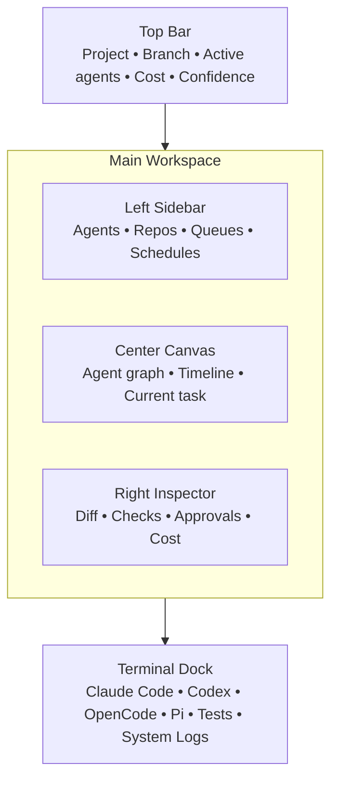
```mermaid
flowchart TB
    TOP[Top Bar<br/>Project • Branch • Active agents • Cost • Confidence]

    subgraph BODY[Main Workspace]
        LEFT[Left Sidebar<br/>Agents • Repos • Queues • Schedules]
        CENTER[Center Canvas<br/>Agent graph • Timeline • Current task]
        RIGHT[Right Inspector<br/>Diff • Checks • Approvals • Cost]
    end

    BOTTOM[Terminal Dock<br/>Claude Code • Codex • OpenCode • Pi • Tests • System Logs]

    TOP --> BODY
    BODY --> BOTTOM
```

### UI panels

```txt
1. Task Composer
   - task prompt
   - repo selector
   - agent selector
   - risk level
   - budget
   - schedule/queue option

2. Live Terminal Dock
   - one tab per agent
   - jump-in button
   - pause/resume
   - send instruction
   - command approval overlay

3. Agent Graph
   - router node
   - agent nodes
   - verifier node
   - judge node
   - final report node

4. Timeline
   - agent started
   - file read
   - command run
   - approval requested
   - test failed
   - patch updated
   - final report ready

5. Review Panel
   - diff viewer
   - file list
   - checks
   - risk summary
   - final recommendation
```

---

## 12. Request lifecycle

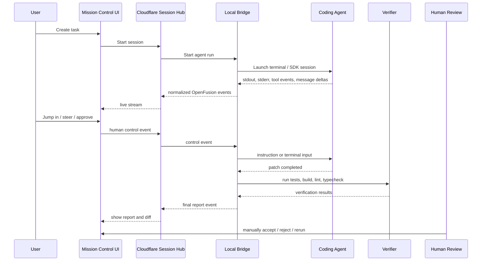
```mermaid
sequenceDiagram
    participant User
    participant UI as Mission Control UI
    participant Hub as Cloudflare Session Hub
    participant Bridge as Local Bridge
    participant Agent as Coding Agent
    participant Verifier as Verifier
    participant Human as Human Review

    User->>UI: Create task
    UI->>Hub: Start session
    Hub->>Bridge: Start agent run
    Bridge->>Agent: Launch terminal / SDK session
    Agent-->>Bridge: stdout, stderr, tool events, message deltas
    Bridge-->>Hub: normalized OpenFusion events
    Hub-->>UI: live stream

    User->>UI: Jump in / steer / approve
    UI->>Hub: human control event
    Hub->>Bridge: control event
    Bridge->>Agent: instruction or terminal input

    Agent-->>Bridge: patch completed
    Bridge->>Verifier: run tests, build, lint, typecheck
    Verifier-->>Bridge: verification results
    Bridge-->>Hub: final report event
    Hub-->>UI: show report and diff
    Human->>UI: manually accept / reject / rerun
```

---

## 13. Event streaming model

Everything becomes an event. This makes the product explainable, replayable, auditable, and interactive.

### Universal event examples

```json
{ "type": "agent.started", "runId": "run_123", "agent": "codex" }
{ "type": "terminal.stdout", "runId": "run_123", "data": "Running tests..." }
{ "type": "message.delta", "runId": "run_123", "delta": "I found the failing test." }
{ "type": "tool.started", "tool": "edit_file", "path": "src/auth.ts" }
{ "type": "approval.requested", "command": "npm install stripe@latest", "risk": "dependency_change" }
{ "type": "test.completed", "status": "passed", "total": 42 }
{ "type": "diff.created", "artifactId": "artifact_diff_123" }
{ "type": "run.completed", "status": "ready_for_review" }
```

### Event flow diagram

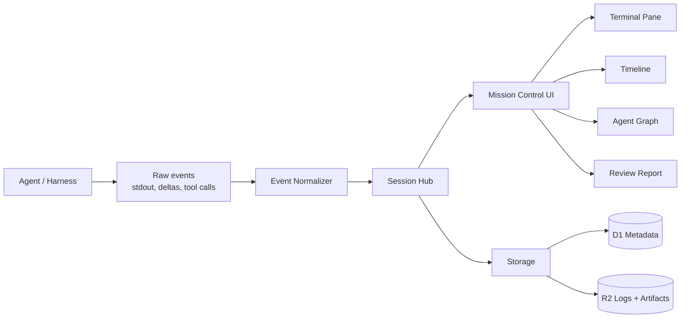
```mermaid
flowchart LR
    AGENT[Agent / Harness] --> RAW[Raw events<br/>stdout, deltas, tool calls]
    RAW --> NORM[Event Normalizer]
    NORM --> HUB[Session Hub]
    HUB --> UI[Mission Control UI]
    HUB --> STORE[Storage]

    STORE --> D1[(D1 Metadata)]
    STORE --> R2[(R2 Logs + Artifacts)]

    UI --> TERMINAL[Terminal Pane]
    UI --> TIMELINE[Timeline]
    UI --> GRAPH[Agent Graph]
    UI --> REVIEW[Review Report]
```

---

## 14. Human-in-the-loop control

OpenFusion is designed around human supervision.

### Human actions

```txt
- Approve command
- Reject command
- Modify instruction
- Jump into terminal
- Pause run
- Resume run
- Cancel run
- Ask another agent to review
- Queue follow-up
- Schedule recurring job
```

### State machine

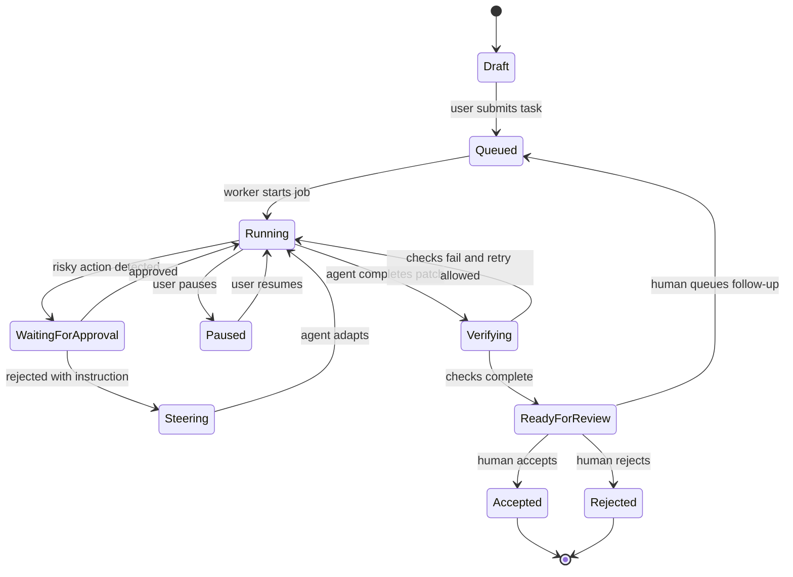
```mermaid
stateDiagram-v2
    [*] --> Draft
    Draft --> Queued: user submits task
    Queued --> Running: worker starts job
    Running --> WaitingForApproval: risky action detected
    WaitingForApproval --> Running: approved
    WaitingForApproval --> Steering: rejected with instruction
    Steering --> Running: agent adapts
    Running --> Paused: user pauses
    Paused --> Running: user resumes
    Running --> Verifying: agent completes patch
    Verifying --> Running: checks fail and retry allowed
    Verifying --> ReadyForReview: checks complete
    ReadyForReview --> Accepted: human accepts
    ReadyForReview --> Rejected: human rejects
    ReadyForReview --> Queued: human queues follow-up
    Accepted --> [*]
    Rejected --> [*]
```

---

## 15. Build queue and overnight work

OpenFusion should support long-running jobs that can run while the user is away.

### Example

```txt
Task:
Upgrade the dashboard to the latest Next.js version.
Fix breaking changes.
Run tests and create a migration report.

Queue mode:
Overnight

Rules:
Do not deploy.
Do not merge.
Ask approval for dependency changes above major version bumps.
```

### Build queue diagram

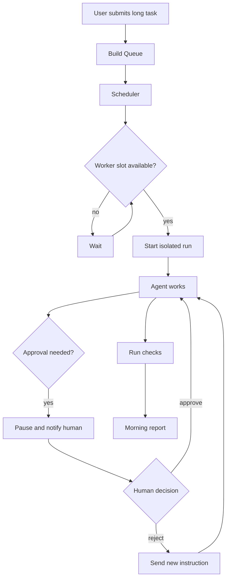
```mermaid
flowchart TD
    TASK[User submits long task] --> QUEUE[Build Queue]
    QUEUE --> SCHED[Scheduler]
    SCHED --> SLOT{Worker slot available?}
    SLOT -->|no| WAIT[Wait]
    WAIT --> SLOT
    SLOT -->|yes| RUN[Start isolated run]

    RUN --> AGENT[Agent works]
    AGENT --> APPROVAL{Approval needed?}
    APPROVAL -->|yes| PAUSE[Pause and notify human]
    PAUSE --> DECISION{Human decision}
    DECISION -->|approve| AGENT
    DECISION -->|reject| STEER[Send new instruction]
    STEER --> AGENT

    AGENT --> VERIFY[Run checks]
    VERIFY --> REPORT[Morning report]
```

---

## 16. Scheduled jobs

Scheduled jobs are recurring agent tasks.

### Examples

```txt
Every Monday 8 AM:
Check outdated dependencies, create a safe update plan, and run tests.

Every night 1 AM:
Run flaky test investigation on failed CI logs.

Every Friday 5 PM:
Generate changelog draft from merged PRs.
```

### Scheduled job diagram

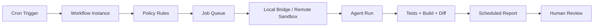
```mermaid
flowchart LR
    CRON[Cron Trigger] --> WF[Workflow Instance]
    WF --> POLICY[Policy Rules]
    POLICY --> QUEUE[Job Queue]
    QUEUE --> BRIDGE[Local Bridge / Remote Sandbox]
    BRIDGE --> AGENT[Agent Run]
    AGENT --> VERIFY[Tests + Build + Diff]
    VERIFY --> REPORT[Scheduled Report]
    REPORT --> HUMAN[Human Review]
```

---

## 17. Pi integration

Pi is valuable because it can act as a customizable harness inside OpenFusion.

OpenFusion should use Pi in three ways:

```txt
1. Pi SDK mode
   Best for deep integration, structured events, custom tools, and programmatic workflows.

2. Pi RPC / JSON stream mode
   Best for process isolation and language-agnostic integration.

3. Pi PTY mode
   Best when the user wants a real terminal they can watch and jump into.
```

### Pi integration diagram

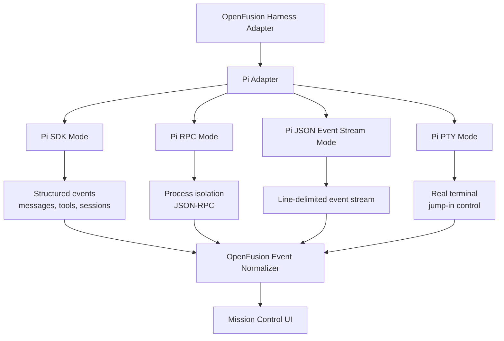
```mermaid
flowchart TB
    OF[OpenFusion Harness Adapter] --> PIAD[Pi Adapter]

    PIAD --> SDK[Pi SDK Mode]
    PIAD --> RPC[Pi RPC Mode]
    PIAD --> JSON[Pi JSON Event Stream Mode]
    PIAD --> PTY[Pi PTY Mode]

    SDK --> STRUCT[Structured events<br/>messages, tools, sessions]
    RPC --> ISO[Process isolation<br/>JSON-RPC]
    JSON --> EVENTS[Line-delimited event stream]
    PTY --> TERM[Real terminal<br/>jump-in control]

    STRUCT --> NORM[OpenFusion Event Normalizer]
    ISO --> NORM
    EVENTS --> NORM
    TERM --> NORM

    NORM --> UI[Mission Control UI]
```

### Pi as part of the AI Layer

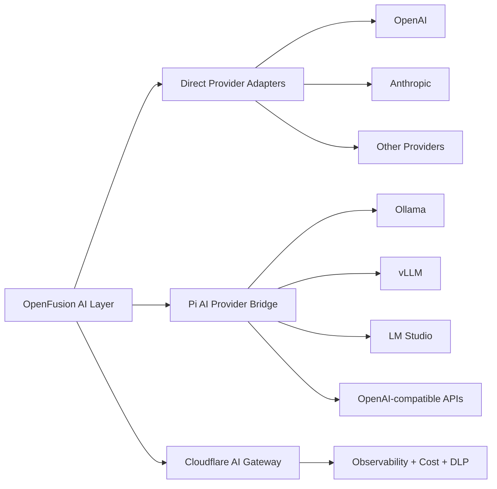
```mermaid
flowchart LR
    OFAI[OpenFusion AI Layer] --> DIRECT[Direct Provider Adapters]
    OFAI --> PIAI[Pi AI Provider Bridge]
    OFAI --> AIGW[Cloudflare AI Gateway]

    DIRECT --> OPENAI[OpenAI]
    DIRECT --> ANTH[Anthropic]
    DIRECT --> OTHER[Other Providers]

    PIAI --> OLLAMA[Ollama]
    PIAI --> VLLM[vLLM]
    PIAI --> LM[LM Studio]
    PIAI --> COMPAT[OpenAI-compatible APIs]

    AIGW --> OBS[Observability + Cost + DLP]
```

### Pi boundary rule

Pi should be a **first-class harness inside OpenFusion**, not the whole product.

```txt
OpenFusion = mission control plane
Pi = customizable agent harness inside the plane
```

OpenFusion still owns:

```txt
- UI
- queue
- schedules
- approvals
- security policy
- local bridge
- storage
- multi-agent orchestration
- final review report
```

---

## 18. Agent adapter model

Every agent should implement the same adapter interface.

```ts
type AgentAdapter = {
  id: string
  displayName: string
  kind: "pty" | "sdk" | "rpc" | "api"

  probe(): Promise<ProbeResult>
  startSession(input: StartSessionInput): Promise<SessionHandle>
  sendMessage(sessionId: string, message: string): Promise<void>
  sendTerminalInput?(sessionId: string, data: string): Promise<void>
  steer?(sessionId: string, message: string): Promise<void>
  followUp?(sessionId: string, message: string): Promise<void>
  abort(sessionId: string): Promise<void>
}
```

### Adapter diagram

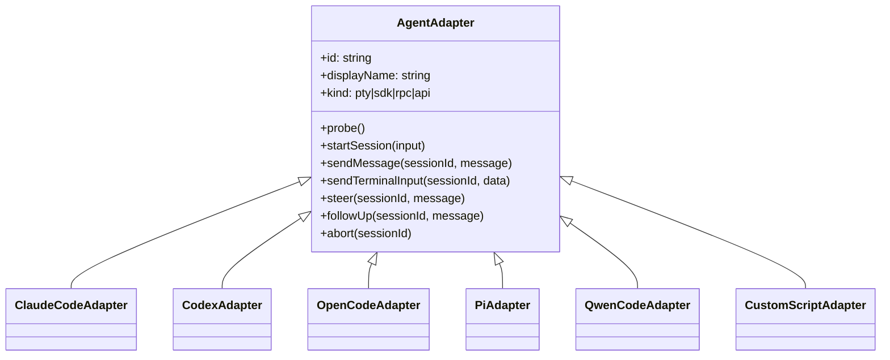
```mermaid
classDiagram
    class AgentAdapter {
      +id: string
      +displayName: string
      +kind: pty|sdk|rpc|api
      +probe()
      +startSession(input)
      +sendMessage(sessionId, message)
      +sendTerminalInput(sessionId, data)
      +steer(sessionId, message)
      +followUp(sessionId, message)
      +abort(sessionId)
    }

    AgentAdapter <|-- ClaudeCodeAdapter
    AgentAdapter <|-- CodexAdapter
    AgentAdapter <|-- OpenCodeAdapter
    AgentAdapter <|-- PiAdapter
    AgentAdapter <|-- QwenCodeAdapter
    AgentAdapter <|-- CustomScriptAdapter
```

---

## 19. Example: bug fix run

### User prompt

```txt
Fix the login bug. Users cannot sign in with Google.
Add regression tests.
Do not modify unrelated auth providers.
```

### What happens

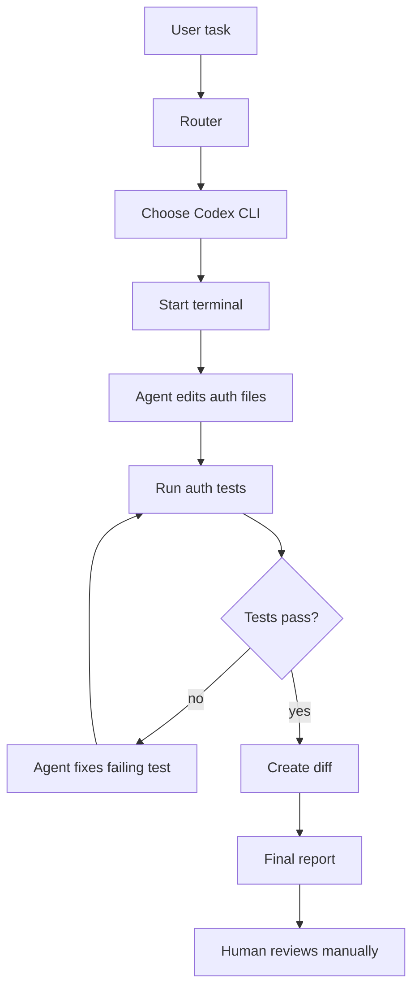
```mermaid
flowchart TD
    U[User task] --> R[Router]
    R --> C[Choose Codex CLI]
    C --> T[Start terminal]
    T --> E[Agent edits auth files]
    E --> TEST[Run auth tests]
    TEST --> FAIL{Tests pass?}
    FAIL -->|no| FIX[Agent fixes failing test]
    FIX --> TEST
    FAIL -->|yes| DIFF[Create diff]
    DIFF --> REPORT[Final report]
    REPORT --> HUMAN[Human reviews manually]
```

### User sees

```txt
Codex is editing src/auth/google.ts
Codex is running pnpm test auth
1 test failed
Codex is applying fix
All tests passed
Review diff?
```

### Final report

```txt
Task: Fix Google login bug
Agent: Codex CLI
Files changed:
- src/auth/google.ts
- src/auth/google.test.ts

Checks:
- Unit tests: passed
- Typecheck: passed
- Lint: passed

Risk:
- No dependency changes
- No database migrations
- No deploy commands

Status:
Ready for human review
```

---

## 20. Example: overnight migration job

### User prompt

```txt
Upgrade the dashboard to the latest supported Next.js version.
Fix breaking changes.
Run the build.
Prepare a migration report.
Do not deploy or merge.
```

### Flow

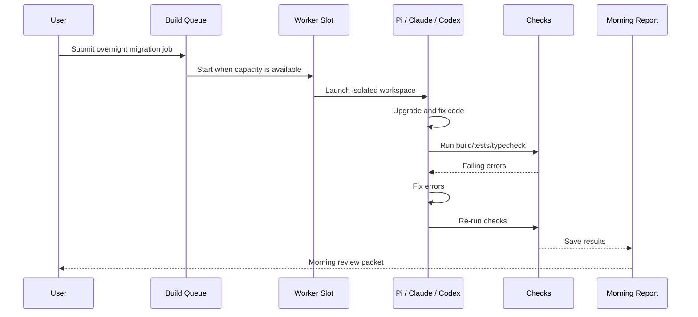
```mermaid
sequenceDiagram
    participant User
    participant Queue as Build Queue
    participant Worker as Worker Slot
    participant Agent as Pi / Claude / Codex
    participant Checks as Checks
    participant Report as Morning Report

    User->>Queue: Submit overnight migration job
    Queue->>Worker: Start when capacity is available
    Worker->>Agent: Launch isolated workspace
    Agent->>Agent: Upgrade and fix code
    Agent->>Checks: Run build/tests/typecheck
    Checks-->>Agent: Failing errors
    Agent->>Agent: Fix errors
    Agent->>Checks: Re-run checks
    Checks-->>Report: Save results
    Report-->>User: Morning review packet
```

### Morning report

```txt
Job: Next.js upgrade
Status: Partial success

Completed:
- package upgrade
- router fixes
- 12 type errors fixed
- build passes

Needs human:
- one dependency conflict
- one risky config change

Artifacts:
- diff
- migration notes
- terminal transcript
- test report
```

---

## 21. Example: scheduled dependency review

### Schedule

```txt
Every Monday at 8 AM:
Check outdated dependencies, create a safe update plan, and run tests.
```

### Flow

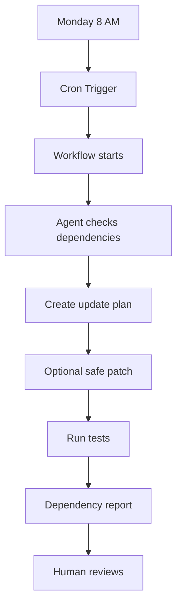
```mermaid
flowchart TD
    MON[Monday 8 AM] --> CRON[Cron Trigger]
    CRON --> WF[Workflow starts]
    WF --> AGENT[Agent checks dependencies]
    AGENT --> PLAN[Create update plan]
    PLAN --> PATCH[Optional safe patch]
    PATCH --> TEST[Run tests]
    TEST --> REPORT[Dependency report]
    REPORT --> USER[Human reviews]
```

### Report

```txt
Dependency review complete.

Safe patch prepared:
- patch updates minor versions only
- tests passed

Needs approval:
- React major version update
- database client major version update

No merge performed.
```

---

## 22. Example: multi-agent comparison

### User prompt

```txt
Refactor the billing module.
Use two agents and compare results.
Do not merge automatically.
```

### Flow

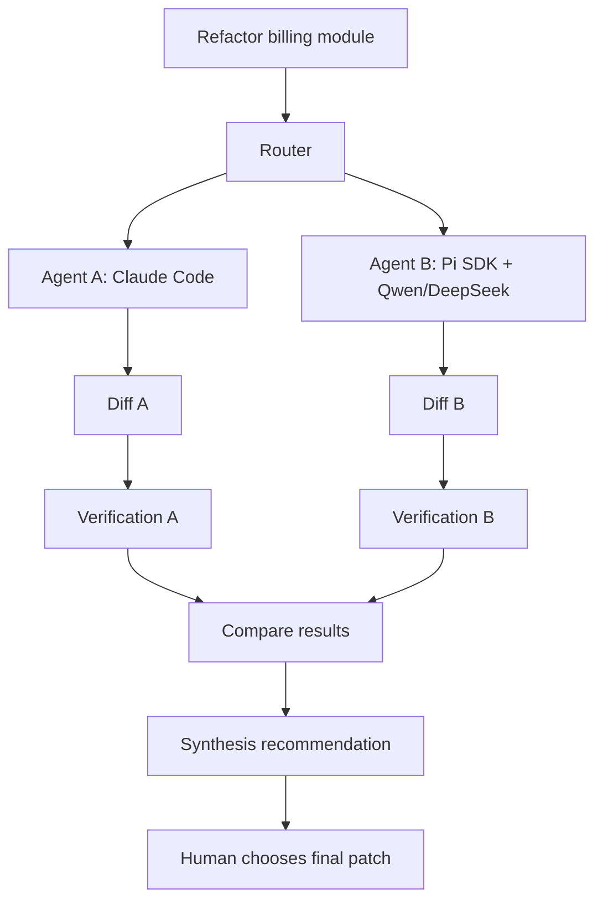
```mermaid
flowchart TD
    TASK[Refactor billing module] --> ROUTER[Router]
    ROUTER --> A[Agent A: Claude Code]
    ROUTER --> B[Agent B: Pi SDK + Qwen/DeepSeek]

    A --> DA[Diff A]
    B --> DB[Diff B]

    DA --> VA[Verification A]
    DB --> VB[Verification B]

    VA --> JUDGE[Compare results]
    VB --> JUDGE

    JUDGE --> SYN[Synthesis recommendation]
    SYN --> HUMAN[Human chooses final patch]
```

### Final recommendation

```txt
Claude Code:
- cleaner patch
- passed all tests
- touched 8 files

Pi:
- smaller patch
- missed one edge case
- touched 3 files

Recommendation:
Use Claude patch, but copy Pi's simpler validation helper.
```

---

## 23. Security model

OpenFusion must be secure by design.

### Security gates

```txt
Require approval for:
- git push
- deployment commands
- database migrations
- package publishing
- dependency installs
- deleting files
- chmod/chown
- curl | bash
- reading .env files
- credential access
```

### Security diagram

```mermaid
flowchart TD
    CMD[Agent proposes command] --> CLASSIFY[Risk classifier]
    CLASSIFY --> SAFE{Safe?}
    SAFE -->|yes| EXEC[Execute]
    SAFE -->|no| APPROVAL[Ask human approval]
    APPROVAL --> ALLOW{Human allows?}
    ALLOW -->|yes| EXEC
    ALLOW -->|no| BLOCK[Block command]
    BLOCK --> STEER[Send correction to agent]
    EXEC --> LOG[Audit log]
    STEER --> LOG
```

---

## 24. Storage model

Use D1 for structured metadata and R2 for large artifacts.

```mermaid
flowchart LR
    EVENTS[Run Events] --> SPLIT[Storage Split]
    SPLIT --> D1[(D1<br/>small relational metadata)]
    SPLIT --> R2[(R2<br/>large logs and artifacts)]

    D1 --> META[Sessions<br/>Runs<br/>Approvals<br/>Scores<br/>Schedules]
    R2 --> ART[Terminal transcripts<br/>Diffs<br/>Test logs<br/>Build output<br/>Reports]
```

### D1 examples

```txt
sessions
runs
run_steps
agent_installations
approvals
scheduled_jobs
queue_jobs
model_calls
judgments
artifacts
```

### R2 examples

```txt
sessions/{sessionId}/terminal/{runId}.jsonl
sessions/{sessionId}/transcripts/{runId}.jsonl
artifacts/{runId}/patch.diff
artifacts/{runId}/test-output.txt
reports/{runId}/final-report.md
```

---

## 25. Final product summary

OpenFusion is the command centre where developers supervise AI coding agents doing real work.

It combines:

```txt
AI model routing
+ agent harnesses
+ real terminals
+ live event streams
+ human approval
+ build queues
+ scheduled jobs
+ verification
+ final review reports
```

### Final summary diagram

```mermaid
flowchart LR
    TASK[Task] --> AGENTS[AI Coding Agents]
    AGENTS --> TERMINAL[Real Terminal]
    TERMINAL --> EVENTS[Live Events]
    EVENTS --> CONTROL[Human Control]
    CONTROL --> VERIFY[Verification]
    VERIFY --> REPORT[Review Report]
    REPORT --> HUMAN[Human Merge Decision]
```

---

## 26. Best tagline options

```txt
OpenFusion: Mission control for AI coding agents.
```

```txt
Watch, steer, verify, and review every AI coding run.
```

```txt
AI agents do the work. Humans stay in command.
```

```txt
The command centre for Claude Code, Codex, OpenCode, Pi, and more.
```

```txt
No black boxes. No blind auto-merge. Just supervised AI coding work.
```

---

## 27. Source-backed references

These are useful references for validating the product architecture and agent integrations:

1. **Claude Code** — Anthropic describes Claude Code as an agent that reads codebases, edits files, and runs commands across terminal, IDE, desktop, and browser.  
   https://claude.com/product/claude-code

2. **Claude Code CLI reference** — official command-line reference.  
   https://code.claude.com/docs/en/cli-reference

3. **OpenAI Codex CLI** — OpenAI's GitHub repository describes Codex CLI as a coding agent that runs locally on your computer / in your terminal.  
   https://github.com/openai/codex

4. **OpenCode** — official site describes OpenCode as an open-source AI coding agent for terminal, IDE, or desktop, with multi-session and multi-provider support.  
   https://opencode.ai/

5. **Pi SDK** — Pi SDK documentation says the SDK provides programmatic access to Pi's agent capabilities for embedding in apps, building custom UIs, automated workflows, custom tools, and programmatic tests.  
   https://github.com/earendil-works/pi/blob/main/packages/coding-agent/docs/sdk.md

6. **Pi project** — Pi is an agent harness project with coding agent CLI, agent runtime, unified multi-provider LLM API, and TUI packages.  
   https://github.com/earendil-works/pi

7. **Cloudflare Durable Objects WebSockets** — Durable Objects can act as WebSocket servers and coordinate long-lived real-time sessions.  
   https://developers.cloudflare.com/durable-objects/best-practices/websockets/

8. **Cloudflare AI Gateway for coding agents** — Cloudflare documents routing coding-agent traffic through AI Gateway for observability, caching, rate limiting, cost tracking, and DLP.  
   https://developers.cloudflare.com/ai-gateway/integrations/coding-agents/

9. **Cloudflare AI Gateway + Pi** — Cloudflare documents Pi as a coding agent with built-in AI Gateway support.  
   https://developers.cloudflare.com/ai-gateway/integrations/coding-agents/pi/

10. **Cloudflare Workflows** — Workflows support durable multi-step applications that retry, persist state, and run for minutes, hours, days, or weeks.  
    https://www.cloudflare.com/en-in/developer-platform/products/workflows/

11. **Cloudflare Cron Triggers** — Cron Triggers run Workers on a schedule, useful for recurring jobs.  
    https://developers.cloudflare.com/workers/configuration/cron-triggers/

12. **Next.js on Cloudflare Workers** — Cloudflare documents deploying Next.js apps to Workers with the OpenNext adapter.  
    https://developers.cloudflare.com/workers/framework-guides/web-apps/nextjs/
